# QUDT


**metamodel version:** 1.7.0

**version:** None


qudt


## Class Diagram


## ERD Diagram

```mermaid
erDiagram
AbstractQuantityKind {
    stringList guidance  
    string id  
}
AngleUnit {
    stringList omUnit  
    stringList unitFor  
    stringList guidance  
    string id  
}
BaseDimensionMagnitude {
    stringList guidance  
    string id  
}
BinaryPrefix {
    stringList guidance  
    string id  
}
BitEncodingType {
    stringList guidance  
    string id  
}
BooleanEncodingType {
    stringList guidance  
    string id  
}
ByteEncodingType {
    stringList guidance  
    string id  
}
CardinalityType {
    stringList guidance  
    string id  
}
CharEncodingType {
    stringList guidance  
    string id  
}
Citation {
    stringList guidance  
    string id  
}
Class {

}
Concept {
    stringList guidance  
    string id  
}
ConstantValue {
    stringList guidance  
    string id  
}
ContextualUnit {
    stringList omUnit  
    stringList unitFor  
    stringList guidance  
    string id  
}
CountingUnit {
    stringList omUnit  
    stringList unitFor  
    stringList guidance  
    string id  
}
CurrencyUnit {
    stringList omUnit  
    stringList unitFor  
    stringList guidance  
    string id  
}
DataEncoding {

}
DataItem {
    stringList guidance  
    string id  
}
Datatype {
    stringList guidance  
    string id  
}
DecimalPrefix {
    stringList guidance  
    string id  
}
DerivedUnit {
    stringList omUnit  
    stringList unitFor  
    stringList guidance  
    string id  
}
DimensionlessUnit {
    stringList omUnit  
    stringList unitFor  
    stringList guidance  
    string id  
}
Discipline {
    stringList guidance  
    string id  
}
Encoding {
    stringList guidance  
    string id  
}
EndianType {
    stringList guidance  
    string id  
}
EnumeratedQuantity {
    stringList guidance  
    string id  
}
EnumeratedValue {
    stringList guidance  
    string id  
}
Enumeration {
    stringList guidance  
    string id  
}
EnumerationScale {
    stringList guidance  
    string id  
}
Figure {
    stringList guidance  
    string id  
}
FloatingPointEncodingType {
    stringList guidance  
    string id  
}
IntegerEncodingType {
    stringList guidance  
    string id  
}
IntervalScale {
    stringList guidance  
    string id  
}
LogarithmicUnit {
    stringList omUnit  
    stringList unitFor  
    stringList guidance  
    string id  
}
MathsFunctionType {
    stringList guidance  
    string id  
}
NominalScale {
    stringList guidance  
    string id  
}
NumericUnion {
    stringList guidance  
    string id  
}
OrderedType {
    stringList guidance  
    string id  
}
OrdinalScale {
    stringList guidance  
    string id  
}
Organization {
    stringList guidance  
    string id  
}
PhysicalConstant {
    stringList guidance  
    string id  
}
PlaneAngleUnit {
    stringList omUnit  
    stringList unitFor  
    stringList guidance  
    string id  
}
Prefix {
    stringList guidance  
    string id  
}
Quantifiable {

}
Quantity {
    stringList guidance  
    string id  
}
QuantityKind {
    stringList guidance  
    string id  
}
QuantityKindDimensionVector {
    stringList guidance  
    string id  
}
QuantityKindDimensionVectorCGS {
    stringList guidance  
    string id  
}
QuantityKindDimensionVectorCGS-EMU {
    stringList guidance  
    string id  
}
QuantityKindDimensionVectorCGS-ESU {
    stringList guidance  
    string id  
}
QuantityKindDimensionVectorCGS-GAUSS {
    stringList guidance  
    string id  
}
QuantityKindDimensionVectorCGS-LH {
    stringList guidance  
    string id  
}
QuantityKindDimensionVectorISO {
    stringList guidance  
    string id  
}
QuantityKindDimensionVectorImperial {
    stringList guidance  
    string id  
}
QuantityKindDimensionVectorSI {
    stringList guidance  
    string id  
}
QuantityType {
    stringList guidance  
    string id  
}
QuantityValue {
    stringList guidance  
    string id  
}
RatioScale {
    stringList guidance  
    string id  
}
Rule {
    stringList guidance  
    string id  
}
RuleType {
    stringList guidance  
    string id  
}
ScalarDatatype {
    stringList guidance  
    string id  
}
Scale {
    stringList guidance  
    string id  
}
ScaleType {
    stringList guidance  
    string id  
}
SolidAngleUnit {
    stringList omUnit  
    stringList unitFor  
    stringList guidance  
    string id  
}
Symbol {
    stringList guidance  
    string id  
}
SystemOfQuantityKinds {
    stringList guidance  
    string id  
}
SystemOfUnits {
    stringList guidance  
    string id  
}
TransformType {
    stringList guidance  
    string id  
}
UCUMcs {

}
UCUMcs-term {

}
Unit {
    stringList omUnit  
    stringList unitFor  
    stringList guidance  
    string id  
}
UserQuantityKind {
    stringList guidance  
    string id  
}

AngleUnit ||--}o SystemOfUnits : "isUnitOfSystem"
AngleUnit ||--}o Unit : "hasReciprocalUnit"
ContextualUnit ||--}o SystemOfUnits : "isUnitOfSystem"
ContextualUnit ||--}o Unit : "hasReciprocalUnit"
CountingUnit ||--}o SystemOfUnits : "isUnitOfSystem"
CountingUnit ||--}o Unit : "hasReciprocalUnit"
CurrencyUnit ||--}o SystemOfUnits : "isUnitOfSystem"
CurrencyUnit ||--}o Unit : "hasReciprocalUnit"
DerivedUnit ||--}o SystemOfUnits : "isUnitOfSystem"
DerivedUnit ||--}o Unit : "hasReciprocalUnit"
DimensionlessUnit ||--}o SystemOfUnits : "isUnitOfSystem"
DimensionlessUnit ||--}o Unit : "hasReciprocalUnit"
LogarithmicUnit ||--}o SystemOfUnits : "isUnitOfSystem"
LogarithmicUnit ||--}o Unit : "hasReciprocalUnit"
PlaneAngleUnit ||--}o SystemOfUnits : "isUnitOfSystem"
PlaneAngleUnit ||--}o Unit : "hasReciprocalUnit"
QuantityKind ||--}o SystemOfQuantityKinds : "belongsToSystemOfQuantities"
SolidAngleUnit ||--}o SystemOfUnits : "isUnitOfSystem"
SolidAngleUnit ||--}o Unit : "hasReciprocalUnit"
Unit ||--}o SystemOfUnits : "isUnitOfSystem"
Unit ||--}o Unit : "hasReciprocalUnit"

```


## Base Classes


These classes have no direct relationships but serve as base classes for other classes:

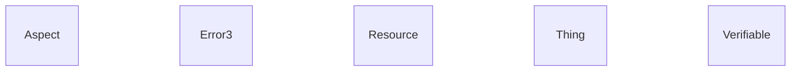


## Standalone Classes


These classes are completely isolated with no relationships and are not used as base classes:

```mermaid
erDiagram
AspectClass {

}
CatalogEntry {

}
Comment {

}
DateTimeStringEncodingType {

}
Error1 {

}
Error2 {

}
GDay {

}
GMonth {

}
GMonthDay {

}
GYear {

}
GYearMonth {

}
LatexString {

}
List {

}
NISTSP811Comment {

}
Ontology {

}
SignednessType {

}
Statement {

}
StringEncodingType {

}
SymmetricRelation {

}
ValueUnion {

}



```


## Classes


### AbstractQuantityKind


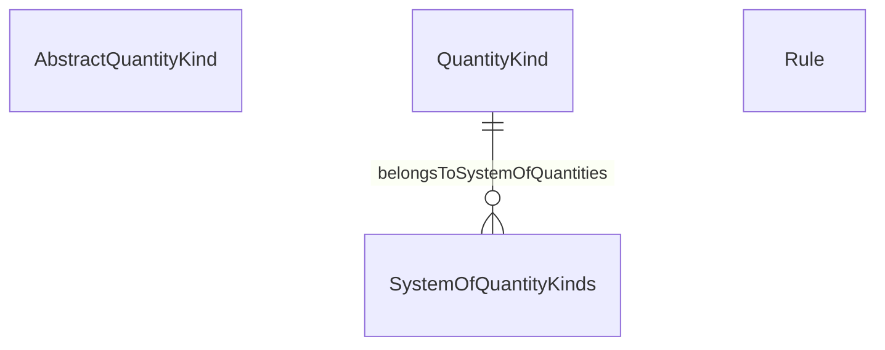


#### Attributes

| Name | Cardinality: | Type | Description |
| --- | --- | --- | --- |
| id | <sub>0..1</sub> | None |  |
| guidance | <sub>0..\*</sub> | string |  |

#### Parents

 * [Concept](#Concept)

#### Children

 * [UserQuantityKind](#UserQuantityKind)

#### Used as mixin by

 * [QuantityKind](#QuantityKind)

#### Referenced by:


### AngleUnit


```mermaid
erDiagram
AngleUnit {

}
Class {

}
Prefix {

}
QuantityKind {

}
QuantityKindDimensionVector {

}
Rule {

}
SystemOfUnits {

}
UCUMcs {

}
Unit {

}

AngleUnit ||--}o SystemOfUnits : "isUnitOfSystem"
AngleUnit ||--}o Unit : "hasReciprocalUnit"
QuantityKind ||--}o SystemOfQuantityKinds : "belongsToSystemOfQuantities"
Unit ||--}o SystemOfUnits : "isUnitOfSystem"
Unit ||--}o Unit : "hasReciprocalUnit"

```


#### Attributes

| Name | Cardinality: | Type | Description |
| --- | --- | --- | --- |
| hasReciprocalUnit | <sub>0..\*</sub> | [Unit](#Unit) |  |
| isUnitOfSystem | <sub>0..\*</sub> | [SystemOfUnits](#SystemOfUnits) |  |
| omUnit | <sub>0..\*</sub> | None |  |
| unitFor | <sub>0..\*</sub> | None |  |
| *id* | <sub>0..1</sub> | None |  |
| *guidance* | <sub>0..\*</sub> | string |  |

#### Parents

 * [DimensionlessUnit](#DimensionlessUnit)

#### Children

 * [PlaneAngleUnit](#PlaneAngleUnit)
 * [SolidAngleUnit](#SolidAngleUnit)


### Aspect


An aspect is an abstract type class that defines properties that can be reused.


#### Local class diagram

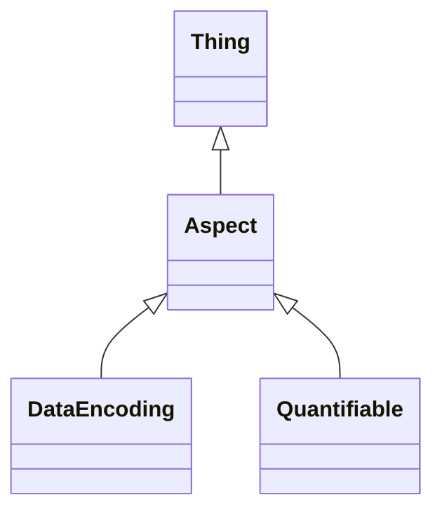

This class has no attributes


#### Parents

 * [Thing](#Thing) - The root class for all QUDT concepts

#### Children

 * [DataEncoding](#DataEncoding)
 * [Quantifiable](#Quantifiable)

#### Used as mixin by

 * [Verifiable](#Verifiable)


### AspectClass


#### Local class diagram

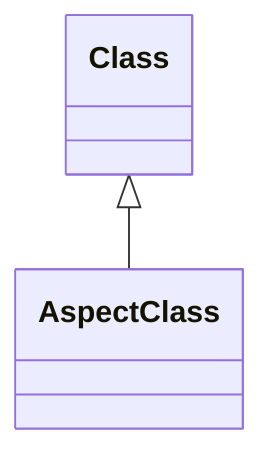

This class has no attributes


#### Parents

 * [Class](#Class)


### BaseDimensionMagnitude


<p class=\"lm-para\">A <em>Dimension</em> expresses a magnitude for a base quantiy kind such as mass, length and time.</p>
<p class=\"lm-para\">DEPRECATED - each exponent is expressed as a property. Keep until a validaiton of this has been done.</p>

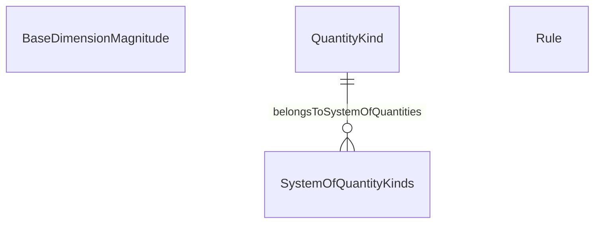


#### Attributes

| Name | Cardinality: | Type | Description |
| --- | --- | --- | --- |
| id | <sub>0..1</sub> | None |  |
| guidance | <sub>0..\*</sub> | string |  |

#### Parents

 * [Concept](#Concept)

#### Referenced by:


### BinaryPrefix


A <em>Binary Prefix</em> is a prefix for multiples of units in data processing, data transmission, and digital information, notably the bit and the byte, to indicate multiplication by a power of 2.

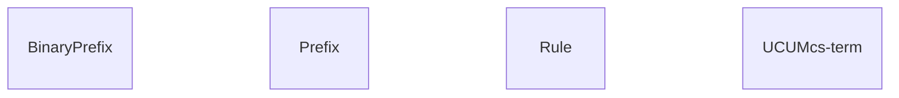


#### Attributes

| Name | Cardinality: | Type | Description |
| --- | --- | --- | --- |
| *id* | <sub>0..1</sub> | None |  |
| *guidance* | <sub>0..\*</sub> | string |  |

#### Parents

 * [Prefix](#Prefix)


### BitEncodingType


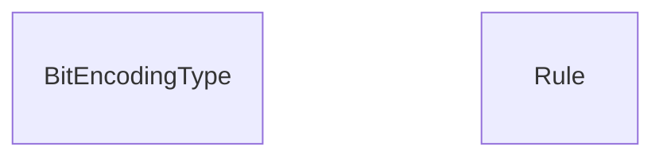


#### Attributes

| Name | Cardinality: | Type | Description |
| --- | --- | --- | --- |
| id | <sub>0..1</sub> | None |  |
| guidance | <sub>0..\*</sub> | string |  |

#### Parents

 * [Encoding](#Encoding)


### BooleanEncodingType


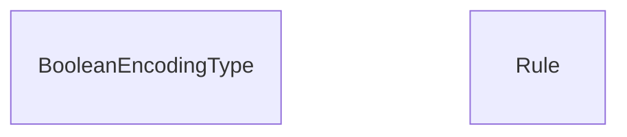


#### Attributes

| Name | Cardinality: | Type | Description |
| --- | --- | --- | --- |
| id | <sub>0..1</sub> | None |  |
| guidance | <sub>0..\*</sub> | string |  |

#### Parents

 * [Encoding](#Encoding)


### ByteEncodingType


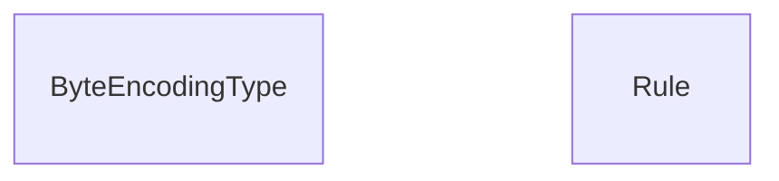


#### Attributes

| Name | Cardinality: | Type | Description |
| --- | --- | --- | --- |
| id | <sub>0..1</sub> | None |  |
| guidance | <sub>0..\*</sub> | string |  |

#### Parents

 * [Encoding](#Encoding)


### CardinalityType


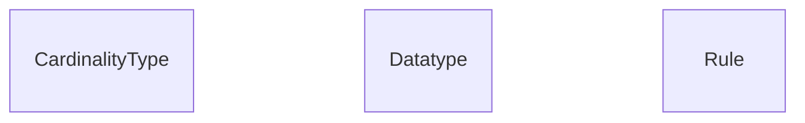


#### Attributes

| Name | Cardinality: | Type | Description |
| --- | --- | --- | --- |
| *id* | <sub>0..1</sub> | None |  |
| *guidance* | <sub>0..\*</sub> | string |  |

#### Parents

 * [EnumeratedValue](#EnumeratedValue)

#### Referenced by:

 *  **[Datatype](#Datatype)** : *[Datatype_cardinality](#Datatype_cardinality)*  <sub>0..\*</sub> 


### CatalogEntry


This class has no attributes


### CharEncodingType


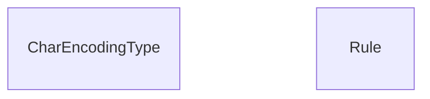


#### Attributes

| Name | Cardinality: | Type | Description |
| --- | --- | --- | --- |
| id | <sub>0..1</sub> | None |  |
| guidance | <sub>0..\*</sub> | string |  |

#### Parents

 * [Encoding](#Encoding)


### Citation


Provides a simple way of making citations.

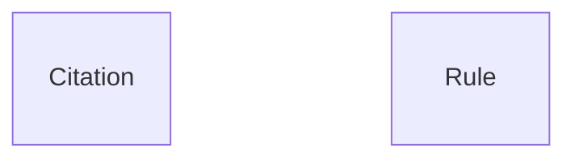


#### Attributes

| Name | Cardinality: | Type | Description |
| --- | --- | --- | --- |
| id | <sub>0..1</sub> | None |  |
| guidance | <sub>0..\*</sub> | string |  |

#### Parents

 * [Concept](#Concept)

#### Referenced by:


### Class


```mermaid
erDiagram
Class {

}
Unit {

}

Unit ||--}o SystemOfUnits : "isUnitOfSystem"
Unit ||--}o Unit : "hasReciprocalUnit"

```


This class has no attributes


#### Children

 * [AspectClass](#AspectClass)

#### Referenced by:

 *  **[Unit](#Unit)** : *[Unit_hasFactorUnit](#Unit_hasFactorUnit)*  <sub>0..\*</sub> 


### Comment


#### Local class diagram

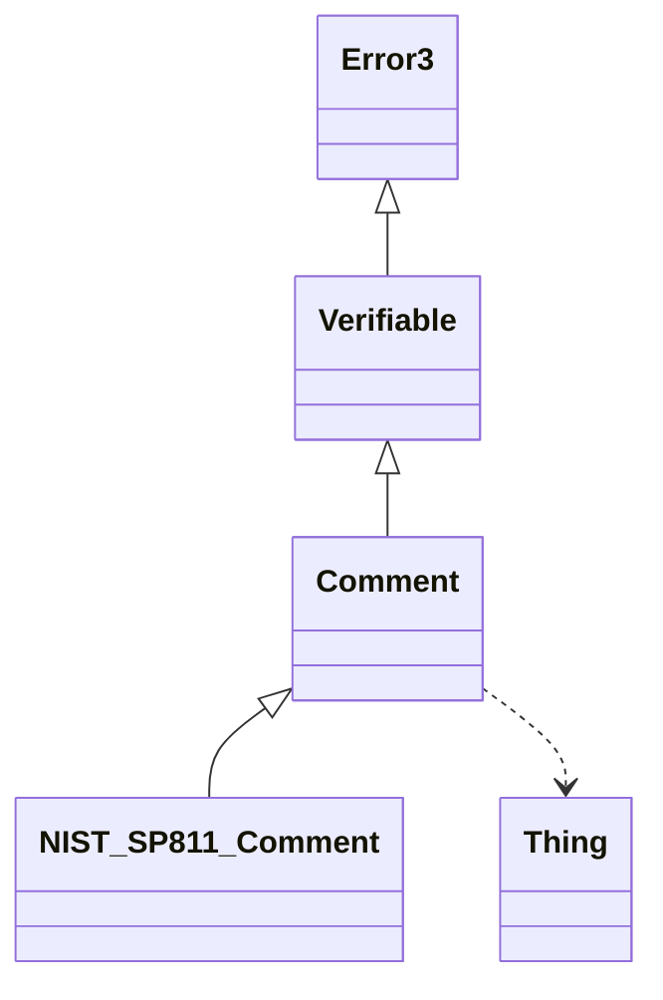

This class has no attributes


#### Parents

 * [Verifiable](#Verifiable)

#### Children

 * [NISTSP811Comment](#NISTSP811Comment)

#### Uses

 *  mixin: [Thing](#Thing) - The root class for all QUDT concepts

#### Referenced by:


### Concept


The root class for all QUDT concepts.

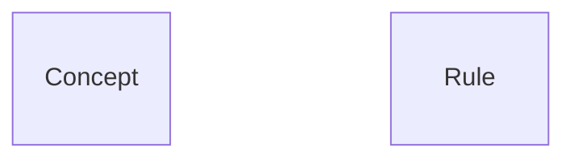


#### Attributes

| Name | Cardinality: | Type | Description |
| --- | --- | --- | --- |
| **id** | <sub>0..1</sub> | None |  |
| **guidance** | <sub>0..\*</sub> | string |  |

#### Parents

 * [Thing](#Thing) - The root class for all QUDT concepts

#### Children

 * [AbstractQuantityKind](#AbstractQuantityKind)
 * [BaseDimensionMagnitude](#BaseDimensionMagnitude)
 * [Citation](#Citation)
 * [DataItem](#DataItem)
 * [Datatype](#Datatype)
 * [Discipline](#Discipline)
 * [Encoding](#Encoding)
 * [EnumeratedQuantity](#EnumeratedQuantity)
 * [Enumeration](#Enumeration)
 * [Figure](#Figure)
 * [MathsFunctionType](#MathsFunctionType)
 * [Organization](#Organization)
 * [QuantityKindDimensionVector](#QuantityKindDimensionVector)
 * [Scale](#Scale)
 * [Symbol](#Symbol)
 * [SystemOfQuantityKinds](#SystemOfQuantityKinds)

#### Used as mixin by

 * [EnumeratedValue](#EnumeratedValue)
 * [NumericUnion](#NumericUnion)
 * [Prefix](#Prefix)
 * [Quantity](#Quantity)
 * [QuantityValue](#QuantityValue)
 * [Rule](#Rule)
 * [SystemOfUnits](#SystemOfUnits)
 * [Unit](#Unit)

#### Referenced by:


### ConstantValue


Used to specify the values of a constant.

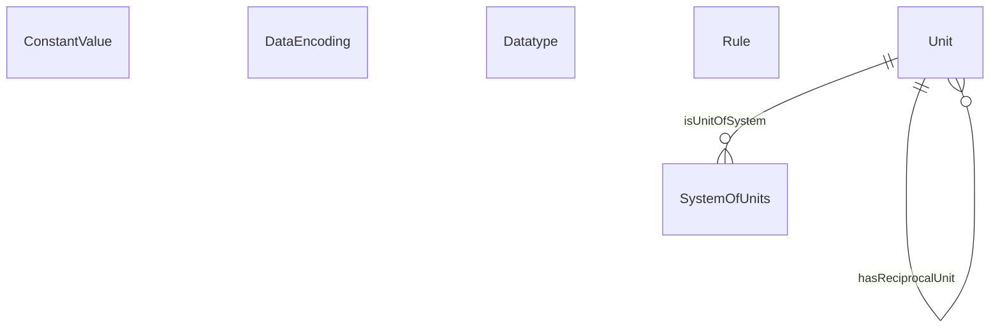


#### Attributes

| Name | Cardinality: | Type | Description |
| --- | --- | --- | --- |
| *id* | <sub>0..1</sub> | None |  |
| *guidance* | <sub>0..\*</sub> | string |  |

#### Parents

 * [QuantityValue](#QuantityValue)

#### Referenced by:


### ContextualUnit


```mermaid
erDiagram
Class {

}
ContextualUnit {

}
Prefix {

}
QuantityKind {

}
QuantityKindDimensionVector {

}
Rule {

}
SystemOfUnits {

}
UCUMcs {

}
Unit {

}

ContextualUnit ||--}o SystemOfUnits : "isUnitOfSystem"
ContextualUnit ||--}o Unit : "hasReciprocalUnit"
QuantityKind ||--}o SystemOfQuantityKinds : "belongsToSystemOfQuantities"
Unit ||--}o SystemOfUnits : "isUnitOfSystem"
Unit ||--}o Unit : "hasReciprocalUnit"

```


#### Attributes

| Name | Cardinality: | Type | Description |
| --- | --- | --- | --- |
| hasReciprocalUnit | <sub>0..\*</sub> | [Unit](#Unit) |  |
| isUnitOfSystem | <sub>0..\*</sub> | [SystemOfUnits](#SystemOfUnits) |  |
| omUnit | <sub>0..\*</sub> | None |  |
| unitFor | <sub>0..\*</sub> | None |  |
| *id* | <sub>0..1</sub> | None |  |
| *guidance* | <sub>0..\*</sub> | string |  |

#### Parents

 * [Unit](#Unit)

#### Referenced by:


### CountingUnit


Used for all units that express counts. Examples are Atomic Number, Number, Number per Year, Percent and Sample per Second.

```mermaid
erDiagram
Class {

}
CountingUnit {

}
Prefix {

}
QuantityKind {

}
QuantityKindDimensionVector {

}
Rule {

}
SystemOfUnits {

}
UCUMcs {

}
Unit {

}

CountingUnit ||--}o SystemOfUnits : "isUnitOfSystem"
CountingUnit ||--}o Unit : "hasReciprocalUnit"
QuantityKind ||--}o SystemOfQuantityKinds : "belongsToSystemOfQuantities"
Unit ||--}o SystemOfUnits : "isUnitOfSystem"
Unit ||--}o Unit : "hasReciprocalUnit"

```


#### Attributes

| Name | Cardinality: | Type | Description |
| --- | --- | --- | --- |
| hasReciprocalUnit | <sub>0..\*</sub> | [Unit](#Unit) |  |
| isUnitOfSystem | <sub>0..\*</sub> | [SystemOfUnits](#SystemOfUnits) |  |
| omUnit | <sub>0..\*</sub> | None |  |
| unitFor | <sub>0..\*</sub> | None |  |
| *id* | <sub>0..1</sub> | None |  |
| *guidance* | <sub>0..\*</sub> | string |  |

#### Parents

 * [DimensionlessUnit](#DimensionlessUnit)


### CurrencyUnit


Currency Units have their own subclass of unit because: (a) they have additonal properites such as 'country' and (b) their URIs do not conform to the same rules as other units.

Used for all units that express currency.

```mermaid
erDiagram
Class {

}
CurrencyUnit {

}
Prefix {

}
QuantityKind {

}
QuantityKindDimensionVector {

}
Rule {

}
SystemOfUnits {

}
UCUMcs {

}
Unit {

}

CurrencyUnit ||--}o SystemOfUnits : "isUnitOfSystem"
CurrencyUnit ||--}o Unit : "hasReciprocalUnit"
QuantityKind ||--}o SystemOfQuantityKinds : "belongsToSystemOfQuantities"
Unit ||--}o SystemOfUnits : "isUnitOfSystem"
Unit ||--}o Unit : "hasReciprocalUnit"

```


#### Attributes

| Name | Cardinality: | Type | Description |
| --- | --- | --- | --- |
| hasReciprocalUnit | <sub>0..\*</sub> | [Unit](#Unit) |  |
| isUnitOfSystem | <sub>0..\*</sub> | [SystemOfUnits](#SystemOfUnits) |  |
| omUnit | <sub>0..\*</sub> | None |  |
| unitFor | <sub>0..\*</sub> | None |  |
| *id* | <sub>0..1</sub> | None |  |
| *guidance* | <sub>0..\*</sub> | string |  |

#### Parents

 * [DimensionlessUnit](#DimensionlessUnit)

#### Referenced by:


### DataEncoding


<p><em>Data Encoding</em> expresses the properties that specify how data is represented at the bit and byte level. These properties are applicable to describing raw data.</p>

```mermaid
erDiagram
DataEncoding {

}
Encoding {

}
EndianType {

}
Quantifiable {

}


```


This class has no attributes


#### Parents

 * [Aspect](#Aspect)

#### Referenced by:

 *  **[Quantifiable](#Quantifiable)** : *[Quantifiable_dataEncoding](#Quantifiable_dataEncoding)*  <sub>0..\*</sub> 


### DataItem


```mermaid
erDiagram
DataItem {

}
Rule {

}


```


#### Attributes

| Name | Cardinality: | Type | Description |
| --- | --- | --- | --- |
| id | <sub>0..1</sub> | None |  |
| guidance | <sub>0..\*</sub> | string |  |

#### Parents

 * [Concept](#Concept)

#### Referenced by:


### Datatype


```mermaid
erDiagram
CardinalityType {

}
Datatype {

}
OrderedType {

}
Quantifiable {

}
Rule {

}
ScalarDatatype {

}


```


#### Attributes

| Name | Cardinality: | Type | Description |
| --- | --- | --- | --- |
| id | <sub>0..1</sub> | None |  |
| guidance | <sub>0..\*</sub> | string |  |

#### Parents

 * [Concept](#Concept)

#### Children

 * [ScalarDatatype](#ScalarDatatype)

#### Referenced by:

 *  **[Datatype](#Datatype)** : *[Datatype_basis](#Datatype_basis)*  <sub>0..\*</sub> 
 *  **[Quantifiable](#Quantifiable)** : *[Quantifiable_datatype](#Quantifiable_datatype)*  <sub>0..\*</sub> 
 *  **[ScalarDatatype](#ScalarDatatype)** : *[ScalarDatatype_rdfsDatatype](#ScalarDatatype_rdfsDatatype)*  <sub>0..\*</sub> 


### DateTimeStringEncodingType


#### Local class diagram

```mermaid
classDiagram
StringEncodingType <|-- DateTimeStringEncodingType

```

This class has no attributes


#### Parents

 * [StringEncodingType](#StringEncodingType)

#### Referenced by:


### DecimalPrefix


A <em>Decimal Prefix</em> is a prefix for multiples of units that are powers of 10.

```mermaid
erDiagram
DecimalPrefix {

}
Prefix {

}
Rule {

}
UCUMcs-term {

}


```


#### Attributes

| Name | Cardinality: | Type | Description |
| --- | --- | --- | --- |
| *id* | <sub>0..1</sub> | None |  |
| *guidance* | <sub>0..\*</sub> | string |  |

#### Parents

 * [Prefix](#Prefix)


### DerivedUnit


A DerivedUnit is a type specification for units that are derived from other units.

```mermaid
erDiagram
Class {

}
DerivedUnit {

}
Prefix {

}
QuantityKind {

}
QuantityKindDimensionVector {

}
Rule {

}
SystemOfUnits {

}
UCUMcs {

}
Unit {

}

DerivedUnit ||--}o SystemOfUnits : "isUnitOfSystem"
DerivedUnit ||--}o Unit : "hasReciprocalUnit"
QuantityKind ||--}o SystemOfQuantityKinds : "belongsToSystemOfQuantities"
Unit ||--}o SystemOfUnits : "isUnitOfSystem"
Unit ||--}o Unit : "hasReciprocalUnit"

```


#### Attributes

| Name | Cardinality: | Type | Description |
| --- | --- | --- | --- |
| hasReciprocalUnit | <sub>0..\*</sub> | [Unit](#Unit) |  |
| isUnitOfSystem | <sub>0..\*</sub> | [SystemOfUnits](#SystemOfUnits) |  |
| omUnit | <sub>0..\*</sub> | None |  |
| unitFor | <sub>0..\*</sub> | None |  |
| *id* | <sub>0..1</sub> | None |  |
| *guidance* | <sub>0..\*</sub> | string |  |

#### Parents

 * [Unit](#Unit)


### DimensionlessUnit


A Dimensionless Unit is a quantity for which all the exponents of the factors corresponding to the base quantities in its quantity dimension are zero.

```mermaid
erDiagram
Class {

}
DimensionlessUnit {

}
Prefix {

}
QuantityKind {

}
QuantityKindDimensionVector {

}
Rule {

}
SystemOfUnits {

}
UCUMcs {

}
Unit {

}

DimensionlessUnit ||--}o SystemOfUnits : "isUnitOfSystem"
DimensionlessUnit ||--}o Unit : "hasReciprocalUnit"
QuantityKind ||--}o SystemOfQuantityKinds : "belongsToSystemOfQuantities"
Unit ||--}o SystemOfUnits : "isUnitOfSystem"
Unit ||--}o Unit : "hasReciprocalUnit"

```


#### Attributes

| Name | Cardinality: | Type | Description |
| --- | --- | --- | --- |
| hasReciprocalUnit | <sub>0..\*</sub> | [Unit](#Unit) |  |
| isUnitOfSystem | <sub>0..\*</sub> | [SystemOfUnits](#SystemOfUnits) |  |
| omUnit | <sub>0..\*</sub> | None |  |
| unitFor | <sub>0..\*</sub> | None |  |
| *id* | <sub>0..1</sub> | None |  |
| *guidance* | <sub>0..\*</sub> | string |  |

#### Parents

 * [Unit](#Unit)

#### Children

 * [AngleUnit](#AngleUnit)
 * [CountingUnit](#CountingUnit)
 * [CurrencyUnit](#CurrencyUnit)
 * [LogarithmicUnit](#LogarithmicUnit)


### Discipline


```mermaid
erDiagram
Discipline {

}
Rule {

}


```


#### Attributes

| Name | Cardinality: | Type | Description |
| --- | --- | --- | --- |
| id | <sub>0..1</sub> | None |  |
| guidance | <sub>0..\*</sub> | string |  |

#### Parents

 * [Concept](#Concept)


### Encoding


```mermaid
erDiagram
DataEncoding {

}
Encoding {

}
Rule {

}


```


#### Attributes

| Name | Cardinality: | Type | Description |
| --- | --- | --- | --- |
| id | <sub>0..1</sub> | None |  |
| guidance | <sub>0..\*</sub> | string |  |

#### Parents

 * [Concept](#Concept)

#### Children

 * [BitEncodingType](#BitEncodingType)
 * [BooleanEncodingType](#BooleanEncodingType)
 * [ByteEncodingType](#ByteEncodingType)
 * [CharEncodingType](#CharEncodingType)
 * [FloatingPointEncodingType](#FloatingPointEncodingType)
 * [IntegerEncodingType](#IntegerEncodingType)

#### Referenced by:

 *  **[DataEncoding](#DataEncoding)** : *[DataEncoding_encoding](#DataEncoding_encoding)*  <sub>0..\*</sub> 


### EndianType


```mermaid
erDiagram
DataEncoding {

}
EndianType {

}
Rule {

}


```


#### Attributes

| Name | Cardinality: | Type | Description |
| --- | --- | --- | --- |
| *id* | <sub>0..1</sub> | None |  |
| *guidance* | <sub>0..\*</sub> | string |  |

#### Parents

 * [EnumeratedValue](#EnumeratedValue)

#### Referenced by:

 *  **[DataEncoding](#DataEncoding)** : *[DataEncoding_bitOrder](#DataEncoding_bitOrder)*  <sub>0..\*</sub> 
 *  **[DataEncoding](#DataEncoding)** : *[DataEncoding_byteOrder](#DataEncoding_byteOrder)*  <sub>0..\*</sub> 


### EnumeratedQuantity


```mermaid
erDiagram
EnumeratedQuantity {

}
EnumeratedValue {

}
Enumeration {

}
Rule {

}


```


#### Attributes

| Name | Cardinality: | Type | Description |
| --- | --- | --- | --- |
| id | <sub>0..1</sub> | None |  |
| guidance | <sub>0..\*</sub> | string |  |

#### Parents

 * [Concept](#Concept)

#### Referenced by:


### EnumeratedValue


```mermaid
erDiagram
EnumeratedQuantity {

}
EnumeratedValue {

}
Enumeration {

}
Rule {

}


```


#### Attributes

| Name | Cardinality: | Type | Description |
| --- | --- | --- | --- |
| *id* | <sub>0..1</sub> | None |  |
| *guidance* | <sub>0..\*</sub> | string |  |

#### Parents

 * [Verifiable](#Verifiable)

#### Children

 * [CardinalityType](#CardinalityType)
 * [EndianType](#EndianType)
 * [OrderedType](#OrderedType)
 * [QuantityType](#QuantityType)
 * [RuleType](#RuleType)
 * [ScaleType](#ScaleType)
 * [TransformType](#TransformType)

#### Uses

 *  mixin: [Concept](#Concept)

#### Referenced by:

 *  **[EnumeratedQuantity](#EnumeratedQuantity)** : *[EnumeratedQuantity_enumeratedValue](#EnumeratedQuantity_enumeratedValue)*  <sub>0..\*</sub> 
 *  **[Enumeration](#Enumeration)** : *[Enumeration_default](#Enumeration_default)*  <sub>0..\*</sub> 
 *  **[Enumeration](#Enumeration)** : *[Enumeration_element](#Enumeration_element)*  <sub>1..\*</sub> 


### Enumeration


<p>An enumeration is a set of literals from which a single value is selected. Each literal can have a tag as an integer within a standard encoding appropriate to the range of integer values. Consistency of enumeration types will allow them, and the enumerated values, to be referred to unambiguously either through symbolic name or encoding. Enumerated values are also controlled vocabularies and as such need to be standardized. Without this consistency enumeration literals can be stated differently and result in  data conflicts and misinterpretations.</p>

<p>The tags are a set of positive whole numbers, not necessarily contiguous and having no numerical significance, each corresponding to the associated literal identifier. An order attribute can also be given on the enumeration elements. An enumeration can itself be a member of an enumeration. This allows enumerations to be enumerated in a selection. Enumerations are also subclasses of <em>Scalar Datatype</em>. This allows them to be used as the reference of a datatype specification.</p>

```mermaid
erDiagram
EnumeratedQuantity {

}
EnumeratedValue {

}
Enumeration {

}
Rule {

}
SystemOfQuantityKinds {

}


```


#### Attributes

| Name | Cardinality: | Type | Description |
| --- | --- | --- | --- |
| id | <sub>0..1</sub> | None |  |
| guidance | <sub>0..\*</sub> | string |  |

#### Parents

 * [Concept](#Concept)

#### Used as mixin by

 * [EnumerationScale](#EnumerationScale)

#### Referenced by:

 *  **[EnumeratedQuantity](#EnumeratedQuantity)** : *[EnumeratedQuantity_enumeration](#EnumeratedQuantity_enumeration)*  <sub>0..\*</sub> 
 *  **[SystemOfQuantityKinds](#SystemOfQuantityKinds)** : *[SystemOfQuantityKinds_baseDimensionEnumeration](#SystemOfQuantityKinds_baseDimensionEnumeration)*  <sub>0..\*</sub> 


### EnumerationScale


```mermaid
erDiagram
EnumeratedValue {

}
EnumerationScale {

}
MathsFunctionType {

}
Rule {

}
ScaleType {

}
TransformType {

}


```


#### Attributes

| Name | Cardinality: | Type | Description |
| --- | --- | --- | --- |
| id | <sub>0..1</sub> | None |  |
| guidance | <sub>0..\*</sub> | string |  |

#### Parents

 * [Scale](#Scale)

#### Uses

 *  mixin: [Enumeration](#Enumeration)


### Error1


This class has no attributes


#### Used as mixin by

 * [PhysicalConstant](#PhysicalConstant)


### Error2


This class has no attributes


#### Used as mixin by

 * [Verifiable](#Verifiable)


### Error3


#### Local class diagram

```mermaid
classDiagram
Error3 <|-- Verifiable

```

This class has no attributes


#### Children

 * [Verifiable](#Verifiable)


### Figure


```mermaid
erDiagram
Figure {

}
Rule {

}


```


#### Attributes

| Name | Cardinality: | Type | Description |
| --- | --- | --- | --- |
| id | <sub>0..1</sub> | None |  |
| guidance | <sub>0..\*</sub> | string |  |

#### Parents

 * [Concept](#Concept)

#### Referenced by:


### FloatingPointEncodingType


```mermaid
erDiagram
FloatingPointEncodingType {

}
Rule {

}


```


#### Attributes

| Name | Cardinality: | Type | Description |
| --- | --- | --- | --- |
| id | <sub>0..1</sub> | None |  |
| guidance | <sub>0..\*</sub> | string |  |

#### Parents

 * [Encoding](#Encoding)


### IntegerEncodingType


```mermaid
erDiagram
IntegerEncodingType {

}
Rule {

}


```


#### Attributes

| Name | Cardinality: | Type | Description |
| --- | --- | --- | --- |
| id | <sub>0..1</sub> | None |  |
| guidance | <sub>0..\*</sub> | string |  |

#### Parents

 * [Encoding](#Encoding)


### IntervalScale


<p>The interval type allows for the degree of difference between items, but not the ratio between them. Examples include temperature with the Celsius scale, which has two defined points (the freezing and boiling point of water at specific conditions) and then separated into 100 intervals, date when measured from an arbitrary epoch (such as AD), percentage such as a percentage return on a stock,[16] location in Cartesian coordinates, and direction measured in degrees from true or magnetic north. Ratios are not meaningful since 20 °C cannot be said to be \"twice as hot\" as 10 °C, nor can multiplication/division be carried out between any two dates directly. However, ratios of differences can be expressed; for example, one difference can be twice another. Interval type variables are sometimes also called \"scaled variables\", but the formal mathematical term is an affine space (in this case an affine line).</p>
<p>Characteristics: median, percentile &amp; Monotonic increasing (order (&lt;) &amp; totally ordered set</p>

median, percentile & Monotonic increasing (order (<)) & totally ordered set

```mermaid
erDiagram
IntervalScale {

}
MathsFunctionType {

}
Rule {

}
ScaleType {

}
TransformType {

}


```


#### Attributes

| Name | Cardinality: | Type | Description |
| --- | --- | --- | --- |
| id | <sub>0..1</sub> | None |  |
| guidance | <sub>0..\*</sub> | string |  |

#### Parents

 * [Scale](#Scale)


### LatexString


A type of string in which some characters may be wrapped with '$' and '$ characters for LaTeX rendering.


This class has no attributes


### List


This class has no attributes


### LogarithmicUnit


Logarithmic units are abstract mathematical units that can be used to express any quantities (physical or mathematical) that are defined on a logarithmic scale, that is, as being proportional to the value of a logarithm function. Examples of logarithmic units include common units of information and entropy, such as the bit, and the byte, as well as units of relative signal strength magnitude such as the decibel.

```mermaid
erDiagram
Class {

}
LogarithmicUnit {

}
Prefix {

}
QuantityKind {

}
QuantityKindDimensionVector {

}
Rule {

}
SystemOfUnits {

}
UCUMcs {

}
Unit {

}

LogarithmicUnit ||--}o SystemOfUnits : "isUnitOfSystem"
LogarithmicUnit ||--}o Unit : "hasReciprocalUnit"
QuantityKind ||--}o SystemOfQuantityKinds : "belongsToSystemOfQuantities"
Unit ||--}o SystemOfUnits : "isUnitOfSystem"
Unit ||--}o Unit : "hasReciprocalUnit"

```


#### Attributes

| Name | Cardinality: | Type | Description |
| --- | --- | --- | --- |
| hasReciprocalUnit | <sub>0..\*</sub> | [Unit](#Unit) |  |
| isUnitOfSystem | <sub>0..\*</sub> | [SystemOfUnits](#SystemOfUnits) |  |
| omUnit | <sub>0..\*</sub> | None |  |
| unitFor | <sub>0..\*</sub> | None |  |
| *id* | <sub>0..1</sub> | None |  |
| *guidance* | <sub>0..\*</sub> | string |  |

#### Parents

 * [DimensionlessUnit](#DimensionlessUnit)


### MathsFunctionType


```mermaid
erDiagram
MathsFunctionType {

}
Rule {

}
Scale {

}
ScaleType {

}


```


#### Attributes

| Name | Cardinality: | Type | Description |
| --- | --- | --- | --- |
| id | <sub>0..1</sub> | None |  |
| guidance | <sub>0..\*</sub> | string |  |

#### Parents

 * [Concept](#Concept)

#### Referenced by:

 *  **[ScaleType](#ScaleType)** : *[ScaleType_permissibleMaths](#ScaleType_permissibleMaths)*  <sub>0..\*</sub> 
 *  **[Scale](#Scale)** : *[Scale_permissibleMaths](#Scale_permissibleMaths)*  <sub>0..\*</sub> 


### NIST_SP811_Comment


#### Local class diagram

```mermaid
classDiagram
Comment <|-- NIST_SP811_Comment
Error3 <|-- Verifiable
Verifiable <|-- Comment

```

This class has no attributes


#### Parents

 * [Comment](#Comment)


### NominalScale


A nominal scale differentiates between items or subjects based only on their names or (meta-)categories and other qualitative classifications they belong to; thus dichotomous data involves the construction of classifications as well as the classification of items. Discovery of an exception to a classification can be viewed as progress. Numbers may be used to represent the variables but the numbers do not have numerical value or relationship: For example, a Globally unique identifier. Examples of these classifications include gender, nationality, ethnicity, language, genre, style, biological species, and form. In a university one could also use hall of affiliation as an example.

```mermaid
erDiagram
MathsFunctionType {

}
NominalScale {

}
Rule {

}
ScaleType {

}
TransformType {

}


```


#### Attributes

| Name | Cardinality: | Type | Description |
| --- | --- | --- | --- |
| id | <sub>0..1</sub> | None |  |
| guidance | <sub>0..\*</sub> | string |  |

#### Parents

 * [Scale](#Scale)


### NumericUnion


```mermaid
erDiagram
NumericUnion {

}
Rule {

}


```


#### Attributes

| Name | Cardinality: | Type | Description |
| --- | --- | --- | --- |
| *id* | <sub>0..1</sub> | None |  |
| *guidance* | <sub>0..\*</sub> | string |  |

#### Uses

 *  mixin: [Concept](#Concept)

#### Referenced by:


### Ontology


This class has no attributes


#### Referenced by:


### OrderedType


```mermaid
erDiagram
Datatype {

}
OrderedType {

}
Rule {

}


```


#### Attributes

| Name | Cardinality: | Type | Description |
| --- | --- | --- | --- |
| *id* | <sub>0..1</sub> | None |  |
| *guidance* | <sub>0..\*</sub> | string |  |

#### Parents

 * [EnumeratedValue](#EnumeratedValue)

#### Referenced by:

 *  **[Datatype](#Datatype)** : *[Datatype_orderedType](#Datatype_orderedType)*  <sub>0..\*</sub> 


### OrdinalScale


The ordinal type allows for rank order (1st, 2nd, 3rd, etc.) by which data can be sorted, but still does not allow for relative degree of difference between them. Examples include, on one hand, dichotomous data with dichotomous (or dichotomized) values such as 'sick' vs. 'healthy' when measuring health, 'guilty' vs. 'innocent' when making judgments in courts, 'wrong/false' vs. 'right/true' when measuring truth value, and, on the other hand, non-dichotomous data consisting of a spectrum of values, such as 'completely agree', 'mostly agree', 'mostly disagree', 'completely disagree' when measuring opinion.

```mermaid
erDiagram
MathsFunctionType {

}
OrdinalScale {

}
Rule {

}
ScaleType {

}
TransformType {

}


```


#### Attributes

| Name | Cardinality: | Type | Description |
| --- | --- | --- | --- |
| id | <sub>0..1</sub> | None |  |
| guidance | <sub>0..\*</sub> | string |  |

#### Parents

 * [Scale](#Scale)

#### Referenced by:


### Organization


```mermaid
erDiagram
Organization {

}
Rule {

}


```


#### Attributes

| Name | Cardinality: | Type | Description |
| --- | --- | --- | --- |
| id | <sub>0..1</sub> | None |  |
| guidance | <sub>0..\*</sub> | string |  |

#### Parents

 * [Concept](#Concept)

#### Referenced by:


### PhysicalConstant


A physical constant is a physical quantity that is generally believed to be both universal in nature and constant in time. It can be contrasted with a mathematical constant, which is a fixed numerical value but does not directly involve any physical measurement. There are many physical constants in science, some of the most widely recognized being the speed of light in vacuum c, Newton's gravitational constant G, Planck's constant h, the electric permittivity of free space ε0, and the elementary charge e. Physical constants can take many dimensional forms, or may be dimensionless depending on the system of quantities and units used.

```mermaid
erDiagram
DataEncoding {

}
Datatype {

}
PhysicalConstant {

}
QuantityKind {

}
QuantityKindDimensionVector {

}
QuantityValue {

}
Rule {

}
SystemOfUnits {

}
Unit {

}

QuantityKind ||--}o SystemOfQuantityKinds : "belongsToSystemOfQuantities"
Unit ||--}o SystemOfUnits : "isUnitOfSystem"
Unit ||--}o Unit : "hasReciprocalUnit"

```


#### Attributes

| Name | Cardinality: | Type | Description |
| --- | --- | --- | --- |
| *id* | <sub>0..1</sub> | None |  |
| *guidance* | <sub>0..\*</sub> | string |  |

#### Parents

 * [Quantity](#Quantity)

#### Uses

 *  mixin: [Error1](#Error1)

#### Referenced by:

 *  **[PhysicalConstant](#PhysicalConstant)** : *[PhysicalConstant_exactMatch](#PhysicalConstant_exactMatch)*  <sub>0..\*</sub> 
 *  **[SystemOfUnits](#SystemOfUnits)** : *[SystemOfUnits_applicablePhysicalConstant](#SystemOfUnits_applicablePhysicalConstant)*  <sub>0..\*</sub> 


### PlaneAngleUnit


```mermaid
erDiagram
Class {

}
PlaneAngleUnit {

}
Prefix {

}
QuantityKind {

}
QuantityKindDimensionVector {

}
Rule {

}
SystemOfUnits {

}
UCUMcs {

}
Unit {

}

PlaneAngleUnit ||--}o SystemOfUnits : "isUnitOfSystem"
PlaneAngleUnit ||--}o Unit : "hasReciprocalUnit"
QuantityKind ||--}o SystemOfQuantityKinds : "belongsToSystemOfQuantities"
Unit ||--}o SystemOfUnits : "isUnitOfSystem"
Unit ||--}o Unit : "hasReciprocalUnit"

```


#### Attributes

| Name | Cardinality: | Type | Description |
| --- | --- | --- | --- |
| hasReciprocalUnit | <sub>0..\*</sub> | [Unit](#Unit) |  |
| isUnitOfSystem | <sub>0..\*</sub> | [SystemOfUnits](#SystemOfUnits) |  |
| omUnit | <sub>0..\*</sub> | None |  |
| unitFor | <sub>0..\*</sub> | None |  |
| *id* | <sub>0..1</sub> | None |  |
| *guidance* | <sub>0..\*</sub> | string |  |

#### Parents

 * [AngleUnit](#AngleUnit)


### Prefix


```mermaid
erDiagram
Prefix {

}
Rule {

}
SystemOfUnits {

}
UCUMcs-term {

}
Unit {

}

Unit ||--}o SystemOfUnits : "isUnitOfSystem"
Unit ||--}o Unit : "hasReciprocalUnit"

```


#### Attributes

| Name | Cardinality: | Type | Description |
| --- | --- | --- | --- |
| *id* | <sub>0..1</sub> | None |  |
| *guidance* | <sub>0..\*</sub> | string |  |

#### Parents

 * [Verifiable](#Verifiable)

#### Children

 * [BinaryPrefix](#BinaryPrefix)
 * [DecimalPrefix](#DecimalPrefix)

#### Uses

 *  mixin: [Concept](#Concept)

#### Referenced by:

 *  **[Prefix](#Prefix)** : *[Prefix_exactMatch](#Prefix_exactMatch)*  <sub>0..\*</sub> 
 *  **[SystemOfUnits](#SystemOfUnits)** : *[SystemOfUnits_prefix](#SystemOfUnits_prefix)*  <sub>0..\*</sub> 
 *  **[Unit](#Unit)** : *[Unit_prefix](#Unit_prefix)*  <sub>0..\*</sub> 


### Quantifiable


<p><em>Quantifiable</em> ascribes to some thing the capability of being measured, observed, or counted.</p>

```mermaid
erDiagram
DataEncoding {

}
Datatype {

}
Quantifiable {

}
Unit {

}

Unit ||--}o SystemOfUnits : "isUnitOfSystem"
Unit ||--}o Unit : "hasReciprocalUnit"

```


This class has no attributes


#### Parents

 * [Aspect](#Aspect)

#### Children

 * [Quantity](#Quantity)
 * [QuantityValue](#QuantityValue)

#### Referenced by:


### Quantity


<p class=\"lm-para\">A <b>quantity</b> is the measurement of an observable property of a particular object, event, or physical system. 
  A quantity is always associated with the context of measurement (i.e. the thing measured, the measured value, the accuracy of measurement, etc.) whereas the 
  underlying <b>quantity kind</b> is independent of any particular measurement. Thus, length is a quantity kind while the height of a rocket is a specific 
  quantity of length; its magnitude that may be expressed in meters, feet, inches, etc. Examples of physical quantities include physical constants, such as 
  the speed of light in a vacuum, Planck's constant, the electric permittivity of free space, and the fine structure constant. </p>
<p class=\"lm-para\">In other words, quantities are quantifiable aspects of the world, such as the duration of a movie, the distance between two points, 
velocity of a car, the pressure of the atmosphere, and a person's weight; and units are used to describe their numerical measure.</p> 
<p class=\"lm-para\">Many <b>quantity kinds</b> are related to each other by various physical laws, and as a result, the associated units of some quantity 
kinds can be expressed as products (or ratios) of powers of other quantity kinds (e.g., momentum is mass times velocity and velocity is defined as distance 
divided by time). In this way, some quantities can be calculated from other measured quantities using their associations to the quantity kinds in these 
expressions. These quantity kind relationships are also discussed in dimensional analysis. Those that cannot be so expressed can be regarded 
as \"fundamental\" in this sense.</p>
<p class=\"lm-para\">A quantity is distinguished from a \"quantity kind\" in that the former carries a value and the latter is a type specifier.</p>

```mermaid
erDiagram
DataEncoding {

}
Datatype {

}
Quantity {

}
QuantityKind {

}
QuantityValue {

}
Rule {

}
Unit {

}

QuantityKind ||--}o SystemOfQuantityKinds : "belongsToSystemOfQuantities"
Unit ||--}o SystemOfUnits : "isUnitOfSystem"
Unit ||--}o Unit : "hasReciprocalUnit"

```


#### Attributes

| Name | Cardinality: | Type | Description |
| --- | --- | --- | --- |
| *id* | <sub>0..1</sub> | None |  |
| *guidance* | <sub>0..\*</sub> | string |  |

#### Parents

 * [Quantifiable](#Quantifiable)

#### Children

 * [PhysicalConstant](#PhysicalConstant)

#### Uses

 *  mixin: [Concept](#Concept)

#### Referenced by:


### QuantityKind


A <b>Quantity Kind</b> is any observable property that can be  measured and quantified numerically. Familiar examples include physical properties such as length, mass, time, force, energy, power, electric charge, etc. Less familiar examples include currency, interest rate, price to earning ratio, and information capacity.

```mermaid
erDiagram
AbstractQuantityKind {

}
BaseDimensionMagnitude {

}
Quantity {

}
QuantityKind {

}
QuantityKindDimensionVector {

}
QuantityKindDimensionVectorSI {

}
QuantityType {

}
Rule {

}
SystemOfQuantityKinds {

}
Unit {

}
UserQuantityKind {

}

QuantityKind ||--}o SystemOfQuantityKinds : "belongsToSystemOfQuantities"
Unit ||--}o SystemOfUnits : "isUnitOfSystem"
Unit ||--}o Unit : "hasReciprocalUnit"

```


#### Attributes

| Name | Cardinality: | Type | Description |
| --- | --- | --- | --- |
| **belongsToSystemOfQuantities** | <sub>0..\*</sub> | [SystemOfQuantityKinds](#SystemOfQuantityKinds) |  |
| *id* | <sub>0..1</sub> | None |  |
| *guidance* | <sub>0..\*</sub> | string |  |

#### Parents

 * [Verifiable](#Verifiable)

#### Uses

 *  mixin: [AbstractQuantityKind](#AbstractQuantityKind)

#### Referenced by:

 *  **[AbstractQuantityKind](#AbstractQuantityKind)** : *[AbstractQuantityKind_broader](#AbstractQuantityKind_broader)*  <sub>0..1</sub> 
 *  **[BaseDimensionMagnitude](#BaseDimensionMagnitude)** : *[BaseDimensionMagnitude_hasBaseQuantityKind](#BaseDimensionMagnitude_hasBaseQuantityKind)*  <sub>1..\*</sub> 
 *  **[QuantityKindDimensionVector](#QuantityKindDimensionVector)** : *[QuantityKindDimensionVector_hasReferenceQuantityKind](#QuantityKindDimensionVector_hasReferenceQuantityKind)*  <sub>0..\*</sub> 
 *  **[QuantityKind](#QuantityKind)** : *[QuantityKind_exactMatch](#QuantityKind_exactMatch)*  <sub>0..\*</sub> 
 *  **[QuantityType](#QuantityType)** : *[QuantityType_value](#QuantityType_value)*  <sub>0..\*</sub> 
 *  **[Quantity](#Quantity)** : *[Quantity_hasQuantityKind](#Quantity_hasQuantityKind)*  <sub>0..\*</sub> 
 *  **[SystemOfQuantityKinds](#SystemOfQuantityKinds)** : *[SystemOfQuantityKinds_hasBaseQuantityKind](#SystemOfQuantityKinds_hasBaseQuantityKind)*  <sub>0..\*</sub> 
 *  **[SystemOfQuantityKinds](#SystemOfQuantityKinds)** : *[SystemOfQuantityKinds_hasQuantityKind](#SystemOfQuantityKinds_hasQuantityKind)*  <sub>0..\*</sub> 
 *  **[SystemOfQuantityKinds](#SystemOfQuantityKinds)** : *[SystemOfQuantityKinds_systemDerivedQuantityKind](#SystemOfQuantityKinds_systemDerivedQuantityKind)*  <sub>0..\*</sub> 
 *  **[Unit](#Unit)** : *[Unit_hasQuantityKind](#Unit_hasQuantityKind)*  <sub>0..\*</sub> 
 *  **[UserQuantityKind](#UserQuantityKind)** : *[UserQuantityKind_hasQuantityKind](#UserQuantityKind_hasQuantityKind)*  <sub>1..\*</sub> 


### QuantityKindDimensionVector


<p class=\"lm-para\">A  <em>Quantity Kind Dimension Vector</em> describes the dimensionality of a quantity kind in the context of a system of units. In the SI system of units, the dimensions of a quantity kind are expressed as a product of the basic physical dimensions mass ($M$), length ($L$), time ($T$) current ($I$), amount of substance ($N$), luminous intensity ($J$) and absolute temperature ($\\theta$) as $dim \\, Q = L^{\\alpha} \\, M^{\\beta} \\, T^{\\gamma} \\, I ^{\\delta} \\, \\theta ^{\\epsilon} \\, N^{\\eta} \\, J ^{\\nu}$.</p>

<p class=\"lm-para\">The rational powers of the dimensional exponents, $\\alpha, \\, \\beta, \\, \\gamma, \\, \\delta, \\, \\epsilon, \\, \\eta, \\, \\nu$, are positive, negative, or zero.</p>

<p class=\"lm-para\">For example, the dimension of the physical quantity kind $\\it{speed}$ is $\\boxed{length/time}$, $L/T$ or $LT^{-1}$, and the dimension of the physical quantity kind force is $\\boxed{mass \\times acceleration}$ or $\\boxed{mass \\times (length/time)/time}$, $ML/T^2$ or $MLT^{-2}$ respectively.</p>

```mermaid
erDiagram
PhysicalConstant {

}
QuantityKind {

}
QuantityKindDimensionVector {

}
Rule {

}
Unit {

}

QuantityKind ||--}o SystemOfQuantityKinds : "belongsToSystemOfQuantities"
Unit ||--}o SystemOfUnits : "isUnitOfSystem"
Unit ||--}o Unit : "hasReciprocalUnit"

```


#### Attributes

| Name | Cardinality: | Type | Description |
| --- | --- | --- | --- |
| id | <sub>0..1</sub> | None |  |
| guidance | <sub>0..\*</sub> | string |  |

#### Parents

 * [Concept](#Concept)

#### Children

 * [QuantityKindDimensionVectorCGS](#QuantityKindDimensionVectorCGS)
 * [QuantityKindDimensionVectorISO](#QuantityKindDimensionVectorISO)
 * [QuantityKindDimensionVectorImperial](#QuantityKindDimensionVectorImperial)
 * [QuantityKindDimensionVectorSI](#QuantityKindDimensionVectorSI)

#### Referenced by:

 *  **[PhysicalConstant](#PhysicalConstant)** : *[PhysicalConstant_hasDimensionVector](#PhysicalConstant_hasDimensionVector)*  <sub>0..\*</sub> 
 *  **[QuantityKind](#QuantityKind)** : *[QuantityKind_hasDimensionVector](#QuantityKind_hasDimensionVector)*  <sub>0..\*</sub> 
 *  **[QuantityKind](#QuantityKind)** : *[QuantityKind_qkdvDenominator](#QuantityKind_qkdvDenominator)*  <sub>0..\*</sub> 
 *  **[QuantityKind](#QuantityKind)** : *[QuantityKind_qkdvNumerator](#QuantityKind_qkdvNumerator)*  <sub>0..\*</sub> 
 *  **[Unit](#Unit)** : *[Unit_hasDimensionVector](#Unit_hasDimensionVector)*  <sub>0..\*</sub> 
 *  **[Unit](#Unit)** : *[Unit_qkdvDenominator](#Unit_qkdvDenominator)*  <sub>0..\*</sub> 
 *  **[Unit](#Unit)** : *[Unit_qkdvNumerator](#Unit_qkdvNumerator)*  <sub>0..\*</sub> 


### QuantityKindDimensionVector_CGS


A <em>CGS Dimension Vector</em> is used to specify the dimensions for a C.G.S. quantity kind.

```mermaid
erDiagram
QuantityKind {

}
QuantityKindDimensionVectorCGS {

}
Rule {

}

QuantityKind ||--}o SystemOfQuantityKinds : "belongsToSystemOfQuantities"

```


#### Attributes

| Name | Cardinality: | Type | Description |
| --- | --- | --- | --- |
| id | <sub>0..1</sub> | None |  |
| guidance | <sub>0..\*</sub> | string |  |

#### Parents

 * [QuantityKindDimensionVector](#QuantityKindDimensionVector)

#### Children

 * [QuantityKindDimensionVectorCGS-EMU](#QuantityKindDimensionVectorCGS-EMU)
 * [QuantityKindDimensionVectorCGS-ESU](#QuantityKindDimensionVectorCGS-ESU)
 * [QuantityKindDimensionVectorCGS-GAUSS](#QuantityKindDimensionVectorCGS-GAUSS)
 * [QuantityKindDimensionVectorCGS-LH](#QuantityKindDimensionVectorCGS-LH)


### QuantityKindDimensionVector_CGS-EMU


A <em>CGS EMU Dimension Vector</em> is used to specify the dimensions for EMU C.G.S. quantity kind.

```mermaid
erDiagram
QuantityKind {

}
QuantityKindDimensionVectorCGS-EMU {

}
Rule {

}

QuantityKind ||--}o SystemOfQuantityKinds : "belongsToSystemOfQuantities"

```


#### Attributes

| Name | Cardinality: | Type | Description |
| --- | --- | --- | --- |
| id | <sub>0..1</sub> | None |  |
| guidance | <sub>0..\*</sub> | string |  |

#### Parents

 * [QuantityKindDimensionVectorCGS](#QuantityKindDimensionVectorCGS)


### QuantityKindDimensionVector_CGS-ESU


A <em>CGS ESU Dimension Vector</em> is used to specify the dimensions for ESU C.G.S. quantity kind.

```mermaid
erDiagram
QuantityKind {

}
QuantityKindDimensionVectorCGS-ESU {

}
Rule {

}

QuantityKind ||--}o SystemOfQuantityKinds : "belongsToSystemOfQuantities"

```


#### Attributes

| Name | Cardinality: | Type | Description |
| --- | --- | --- | --- |
| id | <sub>0..1</sub> | None |  |
| guidance | <sub>0..\*</sub> | string |  |

#### Parents

 * [QuantityKindDimensionVectorCGS](#QuantityKindDimensionVectorCGS)


### QuantityKindDimensionVector_CGS-GAUSS


A <em>CGS GAUSS Dimension Vector</em> is used to specify the dimensions for Gaussioan C.G.S. quantity kind.

```mermaid
erDiagram
QuantityKind {

}
QuantityKindDimensionVectorCGS-GAUSS {

}
Rule {

}

QuantityKind ||--}o SystemOfQuantityKinds : "belongsToSystemOfQuantities"

```


#### Attributes

| Name | Cardinality: | Type | Description |
| --- | --- | --- | --- |
| id | <sub>0..1</sub> | None |  |
| guidance | <sub>0..\*</sub> | string |  |

#### Parents

 * [QuantityKindDimensionVectorCGS](#QuantityKindDimensionVectorCGS)


### QuantityKindDimensionVector_CGS-LH


A <em>CGS LH Dimension Vector</em> is used to specify the dimensions for Lorentz-Heaviside C.G.S. quantity kind.

```mermaid
erDiagram
QuantityKind {

}
QuantityKindDimensionVectorCGS-LH {

}
Rule {

}

QuantityKind ||--}o SystemOfQuantityKinds : "belongsToSystemOfQuantities"

```


#### Attributes

| Name | Cardinality: | Type | Description |
| --- | --- | --- | --- |
| id | <sub>0..1</sub> | None |  |
| guidance | <sub>0..\*</sub> | string |  |

#### Parents

 * [QuantityKindDimensionVectorCGS](#QuantityKindDimensionVectorCGS)


### QuantityKindDimensionVector_ISO


```mermaid
erDiagram
QuantityKind {

}
QuantityKindDimensionVectorISO {

}
Rule {

}

QuantityKind ||--}o SystemOfQuantityKinds : "belongsToSystemOfQuantities"

```


#### Attributes

| Name | Cardinality: | Type | Description |
| --- | --- | --- | --- |
| id | <sub>0..1</sub> | None |  |
| guidance | <sub>0..\*</sub> | string |  |

#### Parents

 * [QuantityKindDimensionVector](#QuantityKindDimensionVector)


### QuantityKindDimensionVector_Imperial


```mermaid
erDiagram
QuantityKind {

}
QuantityKindDimensionVectorImperial {

}
Rule {

}

QuantityKind ||--}o SystemOfQuantityKinds : "belongsToSystemOfQuantities"

```


#### Attributes

| Name | Cardinality: | Type | Description |
| --- | --- | --- | --- |
| id | <sub>0..1</sub> | None |  |
| guidance | <sub>0..\*</sub> | string |  |

#### Parents

 * [QuantityKindDimensionVector](#QuantityKindDimensionVector)


### QuantityKindDimensionVector_SI


```mermaid
erDiagram
QuantityKind {

}
QuantityKindDimensionVectorSI {

}
Rule {

}

QuantityKind ||--}o SystemOfQuantityKinds : "belongsToSystemOfQuantities"

```


#### Attributes

| Name | Cardinality: | Type | Description |
| --- | --- | --- | --- |
| id | <sub>0..1</sub> | None |  |
| guidance | <sub>0..\*</sub> | string |  |

#### Parents

 * [QuantityKindDimensionVector](#QuantityKindDimensionVector)

#### Referenced by:

 *  **[QuantityKind](#QuantityKind)** : *[QuantityKind_dimensionVectorForSI](#QuantityKind_dimensionVectorForSI)*  <sub>0..\*</sub> 


### QuantityType


```mermaid
erDiagram
QuantityKind {

}
QuantityType {

}
Rule {

}

QuantityKind ||--}o SystemOfQuantityKinds : "belongsToSystemOfQuantities"

```


#### Attributes

| Name | Cardinality: | Type | Description |
| --- | --- | --- | --- |
| *id* | <sub>0..1</sub> | None |  |
| *guidance* | <sub>0..\*</sub> | string |  |

#### Parents

 * [EnumeratedValue](#EnumeratedValue)

#### Referenced by:


### QuantityValue


A <i>Quantity Value</i> expresses the magnitude and kind of a quantity and is given by the product of a numerical value <code>n</code> and a unit of measure <code>U</code>. The number multiplying the unit is referred to as the numerical value of the quantity expressed in that unit. Refer to <a href=\"http://physics.nist.gov/Pubs/SP811/sec07.html\">NIST SP 811 section 7</a> for more on quantity values.

```mermaid
erDiagram
DataEncoding {

}
Datatype {

}
Quantity {

}
QuantityValue {

}
Rule {

}
Unit {

}

Unit ||--}o SystemOfUnits : "isUnitOfSystem"
Unit ||--}o Unit : "hasReciprocalUnit"

```


#### Attributes

| Name | Cardinality: | Type | Description |
| --- | --- | --- | --- |
| *id* | <sub>0..1</sub> | None |  |
| *guidance* | <sub>0..\*</sub> | string |  |

#### Parents

 * [Quantifiable](#Quantifiable)

#### Children

 * [ConstantValue](#ConstantValue)

#### Uses

 *  mixin: [Concept](#Concept)

#### Referenced by:

 *  **[Quantity](#Quantity)** : *[Quantity_quantityValue](#Quantity_quantityValue)*  <sub>0..\*</sub> 


### RatioScale


The ratio type takes its name from the fact that measurement is the estimation of the ratio between a magnitude of a continuous quantity and a unit magnitude of the same kind (Michell, 1997, 1999). A ratio scale possesses a meaningful (unique and non-arbitrary) zero value. Most measurement in the physical sciences and engineering is done on ratio scales. Examples include mass, length, duration, plane angle, energy and electric charge. In contrast to interval scales, ratios are now meaningful because having a non-arbitrary zero point makes it meaningful to say, for example, that one object has \"twice the length\" of another (= is \"twice as long\"). Very informally, many ratio scales can be described as specifying \"how much\" of something (i.e. an amount or magnitude) or \"how many\" (a count). The Kelvin temperature scale is a ratio scale because it has a unique, non-arbitrary zero point called absolute zero.

```mermaid
erDiagram
MathsFunctionType {

}
RatioScale {

}
Rule {

}
ScaleType {

}
TransformType {

}


```


#### Attributes

| Name | Cardinality: | Type | Description |
| --- | --- | --- | --- |
| id | <sub>0..1</sub> | None |  |
| guidance | <sub>0..\*</sub> | string |  |

#### Parents

 * [Scale](#Scale)


### Resource


#### Local class diagram

```mermaid
classDiagram
Resource <|-- UCUMcs
Resource <|-- UCUMcs_term
Resource <|-- valueUnion

```

This class has no attributes


#### Children

 * [UCUMcs](#UCUMcs)
 * [UCUMcs-term](#UCUMcs-term)
 * [ValueUnion](#ValueUnion)


### Rule


```mermaid
erDiagram
Concept {

}
Rule {

}
RuleType {

}


```


#### Attributes

| Name | Cardinality: | Type | Description |
| --- | --- | --- | --- |
| *id* | <sub>0..1</sub> | None |  |
| *guidance* | <sub>0..\*</sub> | string |  |

#### Parents

 * [Verifiable](#Verifiable)

#### Uses

 *  mixin: [Concept](#Concept)

#### Referenced by:

 *  **[Concept](#Concept)** : *[Concept_hasRule](#Concept_hasRule)*  <sub>0..\*</sub> 


### RuleType


```mermaid
erDiagram
Rule {

}
RuleType {

}


```


#### Attributes

| Name | Cardinality: | Type | Description |
| --- | --- | --- | --- |
| *id* | <sub>0..1</sub> | None |  |
| *guidance* | <sub>0..\*</sub> | string |  |

#### Parents

 * [EnumeratedValue](#EnumeratedValue)

#### Referenced by:

 *  **[Rule](#Rule)** : *[Rule_ruleType](#Rule_ruleType)*  <sub>0..\*</sub> 


### ScalarDatatype


```mermaid
erDiagram
CardinalityType {

}
Datatype {

}
OrderedType {

}
Rule {

}
ScalarDatatype {

}


```


#### Attributes

| Name | Cardinality: | Type | Description |
| --- | --- | --- | --- |
| id | <sub>0..1</sub> | None |  |
| guidance | <sub>0..\*</sub> | string |  |

#### Parents

 * [Datatype](#Datatype)

#### Referenced by:


### Scale


Scales (also called \"scales of measurement\" or \"levels of measurement\")  are expressions that typically refer to the theory of scale types.

```mermaid
erDiagram
MathsFunctionType {

}
Rule {

}
Scale {

}
ScaleType {

}
TransformType {

}


```


#### Attributes

| Name | Cardinality: | Type | Description |
| --- | --- | --- | --- |
| id | <sub>0..1</sub> | None |  |
| guidance | <sub>0..\*</sub> | string |  |

#### Parents

 * [Concept](#Concept)

#### Children

 * [EnumerationScale](#EnumerationScale)
 * [IntervalScale](#IntervalScale)
 * [NominalScale](#NominalScale)
 * [OrdinalScale](#OrdinalScale)
 * [RatioScale](#RatioScale)

#### Referenced by:


### ScaleType


```mermaid
erDiagram
MathsFunctionType {

}
Rule {

}
Scale {

}
ScaleType {

}
TransformType {

}


```


#### Attributes

| Name | Cardinality: | Type | Description |
| --- | --- | --- | --- |
| *id* | <sub>0..1</sub> | None |  |
| *guidance* | <sub>0..\*</sub> | string |  |

#### Parents

 * [EnumeratedValue](#EnumeratedValue)

#### Referenced by:

 *  **[Scale](#Scale)** : *[Scale_scaleType](#Scale_scaleType)*  <sub>0..\*</sub> 


### SignednessType


This class has no attributes


### SolidAngleUnit


```mermaid
erDiagram
Class {

}
Prefix {

}
QuantityKind {

}
QuantityKindDimensionVector {

}
Rule {

}
SolidAngleUnit {

}
SystemOfUnits {

}
UCUMcs {

}
Unit {

}

QuantityKind ||--}o SystemOfQuantityKinds : "belongsToSystemOfQuantities"
SolidAngleUnit ||--}o SystemOfUnits : "isUnitOfSystem"
SolidAngleUnit ||--}o Unit : "hasReciprocalUnit"
Unit ||--}o SystemOfUnits : "isUnitOfSystem"
Unit ||--}o Unit : "hasReciprocalUnit"

```


#### Attributes

| Name | Cardinality: | Type | Description |
| --- | --- | --- | --- |
| hasReciprocalUnit | <sub>0..\*</sub> | [Unit](#Unit) |  |
| isUnitOfSystem | <sub>0..\*</sub> | [SystemOfUnits](#SystemOfUnits) |  |
| omUnit | <sub>0..\*</sub> | None |  |
| unitFor | <sub>0..\*</sub> | None |  |
| *id* | <sub>0..1</sub> | None |  |
| *guidance* | <sub>0..\*</sub> | string |  |

#### Parents

 * [AngleUnit](#AngleUnit)


### Statement


This class has no attributes


### StringEncodingType


#### Local class diagram

```mermaid
classDiagram
StringEncodingType <|-- DateTimeStringEncodingType

```

This class has no attributes


#### Children

 * [DateTimeStringEncodingType](#DateTimeStringEncodingType)


### Symbol


```mermaid
erDiagram
Rule {

}
Symbol {

}


```


#### Attributes

| Name | Cardinality: | Type | Description |
| --- | --- | --- | --- |
| id | <sub>0..1</sub> | None |  |
| guidance | <sub>0..\*</sub> | string |  |

#### Parents

 * [Concept](#Concept)


### SymmetricRelation


This class has no attributes


### SystemOfQuantityKinds


A system of quantity kinds is a set of one or more quantity kinds together with a set of zero or more algebraic equations that define relationships between quantity kinds in the set. In the physical sciences, the equations relating quantity kinds are typically physical laws and definitional relations, and constants of proportionality. Examples include Newton’s First Law of Motion, Coulomb’s Law, and the definition of velocity as the instantaneous change in position.  In almost all cases, the system identifies a subset of base quantity kinds. The base set is chosen so that all other quantity kinds of interest can be derived from the base quantity kinds and the algebraic equations. If the unit system is explicitly associated with a quantity kind system, then the unit system must define at least one unit for each quantity kind.  From a scientific point of view, the division of quantities into base quantities and derived quantities is a matter of convention.

```mermaid
erDiagram
Enumeration {

}
QuantityKind {

}
Rule {

}
SystemOfQuantityKinds {

}
SystemOfUnits {

}

QuantityKind ||--}o SystemOfQuantityKinds : "belongsToSystemOfQuantities"

```


#### Attributes

| Name | Cardinality: | Type | Description |
| --- | --- | --- | --- |
| id | <sub>0..1</sub> | None |  |
| guidance | <sub>0..\*</sub> | string |  |

#### Parents

 * [Concept](#Concept)

#### Referenced by:

 *  **[QuantityKind](#QuantityKind)** : *[belongsToSystemOfQuantities](#belongsToSystemOfQuantities)*  <sub>0..\*</sub> 


### SystemOfUnits


A system of units is a set of units which are chosen as the reference scales for some set of quantity kinds together with the definitions of each unit. Units may be defined by experimental observation or by proportion to another unit not included in the system. If the unit system is explicitly associated with a quantity kind system, then the unit system must define at least one unit for each quantity kind.

```mermaid
erDiagram
PhysicalConstant {

}
Prefix {

}
Rule {

}
SystemOfQuantityKinds {

}
SystemOfUnits {

}
Unit {

}

Unit ||--}o SystemOfUnits : "isUnitOfSystem"
Unit ||--}o Unit : "hasReciprocalUnit"

```


#### Attributes

| Name | Cardinality: | Type | Description |
| --- | --- | --- | --- |
| *id* | <sub>0..1</sub> | None |  |
| *guidance* | <sub>0..\*</sub> | string |  |

#### Parents

 * [Verifiable](#Verifiable)

#### Uses

 *  mixin: [Concept](#Concept)

#### Referenced by:

 *  **[PhysicalConstant](#PhysicalConstant)** : *[PhysicalConstant_applicableSystem](#PhysicalConstant_applicableSystem)*  <sub>0..\*</sub> 
 *  **[SystemOfQuantityKinds](#SystemOfQuantityKinds)** : *[SystemOfQuantityKinds_hasUnitSystem](#SystemOfQuantityKinds_hasUnitSystem)*  <sub>0..\*</sub> 
 *  **[Unit](#Unit)** : *[Unit_applicableSystem](#Unit_applicableSystem)*  <sub>0..\*</sub> 
 *  **[Unit](#Unit)** : *[Unit_definedUnitOfSystem](#Unit_definedUnitOfSystem)*  <sub>0..\*</sub> 
 *  **[Unit](#Unit)** : *[Unit_derivedCoherentUnitOfSystem](#Unit_derivedCoherentUnitOfSystem)*  <sub>0..\*</sub> 
 *  **[Unit](#Unit)** : *[Unit_derivedUnitOfSystem](#Unit_derivedUnitOfSystem)*  <sub>0..\*</sub> 
 *  **[Unit](#Unit)** : *[isUnitOfSystem](#isUnitOfSystem)*  <sub>0..\*</sub> 


### Thing

The root class for all QUDT concepts


#### Local class diagram

```mermaid
classDiagram
Thing <|-- Aspect
Thing <|-- Concept

```

This class has no attributes


#### Children

 * [Aspect](#Aspect)
 * [Concept](#Concept)

#### Used as mixin by

 * [Comment](#Comment)


### TransformType


```mermaid
erDiagram
Rule {

}
Scale {

}
ScaleType {

}
TransformType {

}


```


#### Attributes

| Name | Cardinality: | Type | Description |
| --- | --- | --- | --- |
| *id* | <sub>0..1</sub> | None |  |
| *guidance* | <sub>0..\*</sub> | string |  |

#### Parents

 * [EnumeratedValue](#EnumeratedValue)

#### Referenced by:

 *  **[ScaleType](#ScaleType)** : *[ScaleType_permissibleTransformation](#ScaleType_permissibleTransformation)*  <sub>0..\*</sub> 
 *  **[Scale](#Scale)** : *[Scale_permissibleTransformation](#Scale_permissibleTransformation)*  <sub>0..\*</sub> 


### UCUMcs


Lexical pattern for the case-sensitive version of UCUM code

```mermaid
erDiagram
UCUMcs {

}
Unit {

}

Unit ||--}o SystemOfUnits : "isUnitOfSystem"
Unit ||--}o Unit : "hasReciprocalUnit"

```


This class has no attributes


#### Parents

 * [Resource](#Resource)

#### Referenced by:

 *  **[Unit](#Unit)** : *[Unit_ucumCode](#Unit_ucumCode)*  <sub>0..\*</sub> 


### UCUMcs-term


Lexical pattern for the terminal symbols in the case-sensitive version of UCUM code

```mermaid
erDiagram
Prefix {

}
UCUMcs-term {

}


```


This class has no attributes


#### Parents

 * [Resource](#Resource)

#### Referenced by:

 *  **[Prefix](#Prefix)** : *[Prefix_ucumCode](#Prefix_ucumCode)*  <sub>0..\*</sub> 


### Unit


```mermaid
erDiagram
Class {

}
ContextualUnit {

}
PhysicalConstant {

}
Prefix {

}
Quantifiable {

}
QuantityKind {

}
QuantityKindDimensionVector {

}
QuantityValue {

}
Rule {

}
SystemOfUnits {

}
UCUMcs {

}
Unit {

}

ContextualUnit ||--}o SystemOfUnits : "isUnitOfSystem"
ContextualUnit ||--}o Unit : "hasReciprocalUnit"
QuantityKind ||--}o SystemOfQuantityKinds : "belongsToSystemOfQuantities"
Unit ||--}o SystemOfUnits : "isUnitOfSystem"
Unit ||--}o Unit : "hasReciprocalUnit"

```


#### Attributes

| Name | Cardinality: | Type | Description |
| --- | --- | --- | --- |
| *id* | <sub>0..1</sub> | None |  |
| *guidance* | <sub>0..\*</sub> | string |  |
| **hasReciprocalUnit** | <sub>0..\*</sub> | [Unit](#Unit) |  |
| **isUnitOfSystem** | <sub>0..\*</sub> | [SystemOfUnits](#SystemOfUnits) |  |
| **omUnit** | <sub>0..\*</sub> | None |  |
| **unitFor** | <sub>0..\*</sub> | None |  |

#### Parents

 * [Verifiable](#Verifiable)

#### Children

 * [ContextualUnit](#ContextualUnit)
 * [DerivedUnit](#DerivedUnit)
 * [DimensionlessUnit](#DimensionlessUnit)

#### Uses

 *  mixin: [Concept](#Concept)

#### Referenced by:

 *  **[ContextualUnit](#ContextualUnit)** : *[ContextualUnit_broader](#ContextualUnit_broader)*  <sub>0..1</sub> 
 *  **[PhysicalConstant](#PhysicalConstant)** : *[PhysicalConstant_applicableUnit](#PhysicalConstant_applicableUnit)*  <sub>0..\*</sub> 
 *  **[Quantifiable](#Quantifiable)** : *[Quantifiable_hasUnit](#Quantifiable_hasUnit)*  <sub>0..\*</sub> 
 *  **[QuantityKind](#QuantityKind)** : *[QuantityKind_applicableCGSUnit](#QuantityKind_applicableCGSUnit)*  <sub>0..\*</sub> 
 *  **[QuantityKind](#QuantityKind)** : *[QuantityKind_applicableISOUnit](#QuantityKind_applicableISOUnit)*  <sub>0..\*</sub> 
 *  **[QuantityKind](#QuantityKind)** : *[QuantityKind_applicableImperialUnit](#QuantityKind_applicableImperialUnit)*  <sub>0..\*</sub> 
 *  **[QuantityKind](#QuantityKind)** : *[QuantityKind_applicableSIUnit](#QuantityKind_applicableSIUnit)*  <sub>0..\*</sub> 
 *  **[QuantityKind](#QuantityKind)** : *[QuantityKind_applicableUSCustomaryUnit](#QuantityKind_applicableUSCustomaryUnit)*  <sub>0..\*</sub> 
 *  **[QuantityKind](#QuantityKind)** : *[QuantityKind_applicableUnit](#QuantityKind_applicableUnit)*  <sub>0..\*</sub> 
 *  **[QuantityValue](#QuantityValue)** : *[QuantityValue_hasUnit](#QuantityValue_hasUnit)*  <sub>0..\*</sub> 
 *  **[SystemOfUnits](#SystemOfUnits)** : *[SystemOfUnits_hasAllowedUnit](#SystemOfUnits_hasAllowedUnit)*  <sub>0..\*</sub> 
 *  **[SystemOfUnits](#SystemOfUnits)** : *[SystemOfUnits_hasBaseUnit](#SystemOfUnits_hasBaseUnit)*  <sub>0..\*</sub> 
 *  **[SystemOfUnits](#SystemOfUnits)** : *[SystemOfUnits_hasCoherentUnit](#SystemOfUnits_hasCoherentUnit)*  <sub>0..\*</sub> 
 *  **[SystemOfUnits](#SystemOfUnits)** : *[SystemOfUnits_hasDefinedUnit](#SystemOfUnits_hasDefinedUnit)*  <sub>0..\*</sub> 
 *  **[SystemOfUnits](#SystemOfUnits)** : *[SystemOfUnits_hasDerivedCoherentUnit](#SystemOfUnits_hasDerivedCoherentUnit)*  <sub>0..\*</sub> 
 *  **[SystemOfUnits](#SystemOfUnits)** : *[SystemOfUnits_hasDerivedUnit](#SystemOfUnits_hasDerivedUnit)*  <sub>0..\*</sub> 
 *  **[SystemOfUnits](#SystemOfUnits)** : *[SystemOfUnits_hasUnit](#SystemOfUnits_hasUnit)*  <sub>0..\*</sub> 
 *  **[Unit](#Unit)** : *[Unit_exactMatch](#Unit_exactMatch)*  <sub>0..\*</sub> 
 *  **[Unit](#Unit)** : *[Unit_scalingOf](#Unit_scalingOf)*  <sub>0..\*</sub> 
 *  **[Unit](#Unit)** : *[hasReciprocalUnit](#hasReciprocalUnit)*  <sub>0..\*</sub> 


### UserQuantityKind


```mermaid
erDiagram
QuantityKind {

}
Rule {

}
UserQuantityKind {

}

QuantityKind ||--}o SystemOfQuantityKinds : "belongsToSystemOfQuantities"

```


#### Attributes

| Name | Cardinality: | Type | Description |
| --- | --- | --- | --- |
| id | <sub>0..1</sub> | None |  |
| guidance | <sub>0..\*</sub> | string |  |

#### Parents

 * [AbstractQuantityKind](#AbstractQuantityKind)

#### Referenced by:


### Verifiable


An aspect class that holds properties that provide external knowledge and specifications of a given resource.


#### Local class diagram

```mermaid
classDiagram
Error3 <|-- Verifiable
Verifiable <|-- Comment
Verifiable <|-- EnumeratedValue
Verifiable <|-- Prefix
Verifiable <|-- QuantityKind
Verifiable <|-- Rule
Verifiable <|-- SystemOfUnits
Verifiable <|-- Unit
Verifiable ..> Aspect
Verifiable ..> Error2

```

This class has no attributes


#### Parents

 * [Error3](#Error3)

#### Children

 * [Comment](#Comment)
 * [EnumeratedValue](#EnumeratedValue)
 * [Prefix](#Prefix)
 * [QuantityKind](#QuantityKind)
 * [Rule](#Rule)
 * [SystemOfUnits](#SystemOfUnits)
 * [Unit](#Unit)

#### Uses

 *  mixin: [Aspect](#Aspect)
 *  mixin: [Error2](#Error2)

#### Referenced by:


### gDay


This class has no attributes


### gMonth


This class has no attributes


### gMonthDay


This class has no attributes


### gYear


This class has no attributes


### gYearMonth


This class has no attributes


### valueUnion


#### Local class diagram

```mermaid
classDiagram
Resource <|-- valueUnion

```

This class has no attributes


#### Parents

 * [Resource](#Resource)

