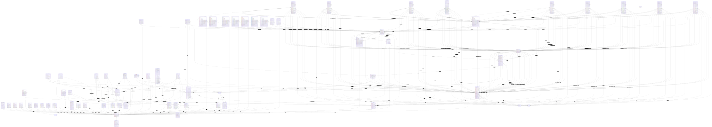
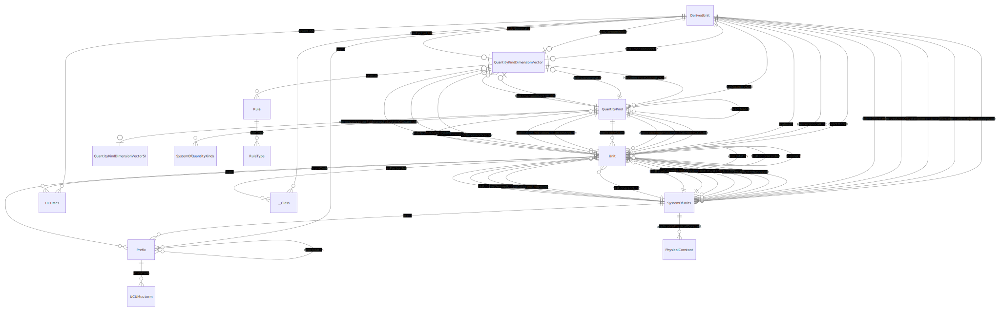
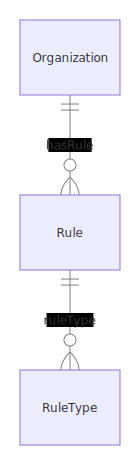
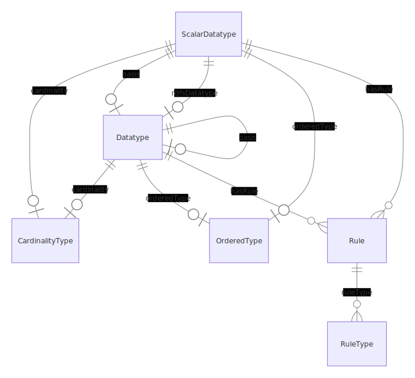

# QUDT


**metamodel version:** 1.7.0

**version:** None


qudt


## Class Diagram


## ERD Diagram



## Base Classes


These classes have no direct relationships but serve as base classes for other classes:

| Class | Description |
| --- | --- |
| [Aspect](#Aspect) |  |
| [Resource](#Resource) |  |
| [Thing](#Thing) | The root class for all QUDT concepts |
| [Verifiable](#Verifiable) |  |

## Standalone Classes


These classes are completely isolated with no relationships and are not used as base classes:

| Class | Description |
| --- | --- |
| [AspectClass](#AspectClass) |  |
| [CatalogEntry](#CatalogEntry) |  |
| [Comment](#Comment) |  |
| [DateTimeStringEncodingType](#DateTimeStringEncodingType) |  |
| [LatexString](#LatexString) |  |
| [List](#List) |  |
| [NISTSP811Comment](#NISTSP811Comment) |  |
| [Ontology](#Ontology) |  |
| [SignednessType](#SignednessType) |  |
| [Statement](#Statement) |  |
| [StringEncodingType](#StringEncodingType) |  |
| [SymmetricRelation](#SymmetricRelation) |  |
| [GDay](#GDay) |  |
| [GMonth](#GMonth) |  |
| [GMonthDay](#GMonthDay) |  |
| [GYear](#GYear) |  |
| [GYearMonth](#GYearMonth) |  |
| [ValueUnion](#ValueUnion) |  |

## Classes


### AbstractQuantityKind


#### YAML Definition

<details>
<summary>Click to expand</summary>

```yaml
AbstractQuantityKind:
  is_a: Concept
  slots:
  - guidance
  - Concept_id
  - Concept_hasRule
  - Concept_isReplacedBy
  - Concept_description
  - Concept_abbreviation
  - Concept_deprecated
  - Concept_plainTextDescription
  - AbstractQuantityKind_broader
  - AbstractQuantityKind_altSymbol
  - AbstractQuantityKind_latexSymbol
  - AbstractQuantityKind_symbol
  slot_usage:
    broader:
      range: QuantityKind
    altSymbol:
      required: false
    latexSymbol:
      required: false
    symbol:
      multivalued: false

```
</details>


#### Attributes

| Name | Cardinality: | Type | Description |
| --- | --- | --- | --- |
| id | <sub>0..1</sub> | None |  |
| description | <sub>0..1</sub> | None |  |
| abbreviation | <sub>0..1</sub> | None |  |
| deprecated | <sub>0..1</sub> | None |  |
| guidance | <sub>0..\*</sub> | string |  |
| hasRule | <sub>0..\*</sub> | [Rule](#Rule) |  |
| isReplacedBy | <sub>0..1</sub> | None |  |
| plainTextDescription | <sub>0..1</sub> | None |  |
| **altSymbol** | <sub>0..\*</sub> | None |  |
| **latexSymbol** | <sub>0..\*</sub> | None |  |
| **symbol** | <sub>0..1</sub> | None |  |

#### Parents

 * [Concept](#Concept)

#### Children

 * [UserQuantityKind](#UserQuantityKind)

#### Used as mixin by

 * [QuantityKind](#QuantityKind)


### AngleUnit


#### YAML Definition

<details>
<summary>Click to expand</summary>

```yaml
AngleUnit:
  is_a: DimensionlessUnit
  slots:
  - Verifiable_wikidataMatch
  - Verifiable_dbpediaMatch
  - Verifiable_isoNormativeReference
  - Verifiable_normativeReference
  - hasReciprocalUnit
  - isUnitOfSystem
  - omUnit
  - unitFor
  - Unit_applicableSystem
  - Unit_definedUnitOfSystem
  - Unit_derivedCoherentUnitOfSystem
  - Unit_derivedUnitOfSystem
  - Unit_exactMatch
  - Unit_hasDimensionVector
  - Unit_hasFactorUnit
  - Unit_hasQuantityKind
  - Unit_iec61360Code
  - Unit_prefix
  - Unit_qkdvDenominator
  - Unit_qkdvNumerator
  - Unit_scalingOf
  - Unit_ucumCode
  - Unit_udunitsCode
  - Unit_uneceCommonCode
  - Unit_altSymbol
  - Unit_latexDefinition
  - Unit_latexSymbol
  - Unit_siUnitsExpression
  - Unit_symbol
  - Unit_conversionMultiplier
  - Unit_conversionMultiplierSN
  - Unit_conversionOffset
  - Unit_conversionOffsetSN
  - Unit_factorUnitScalar
  - Unit_mathMLdefinition
  - guidance
  - Concept_id
  - Concept_hasRule
  - Concept_isReplacedBy
  - Concept_description
  - Concept_abbreviation
  - Concept_deprecated
  - Concept_plainTextDescription

```
</details>


#### Attributes

| Name | Cardinality: | Type | Description |
| --- | --- | --- | --- |
| altSymbol | <sub>0..\*</sub> | None |  |
| applicableSystem | <sub>0..\*</sub> | [SystemOfUnits](#SystemOfUnits) |  |
| conversionMultiplier | <sub>0..1</sub> | None |  |
| conversionMultiplierSN | <sub>0..1</sub> | None |  |
| conversionOffset | <sub>0..1</sub> | None |  |
| conversionOffsetSN | <sub>0..1</sub> | None |  |
| dbpediaMatch | <sub>0..\*</sub> | uri |  |
| definedUnitOfSystem | <sub>0..\*</sub> | [SystemOfUnits](#SystemOfUnits) |  |
| derivedCoherentUnitOfSystem | <sub>0..\*</sub> | [SystemOfUnits](#SystemOfUnits) |  |
| derivedUnitOfSystem | <sub>0..\*</sub> | [SystemOfUnits](#SystemOfUnits) |  |
| exactMatch | <sub>0..\*</sub> | [Unit](#Unit) |  |
| factorUnitScalar | <sub>0..1</sub> | None |  |
| hasDimensionVector | <sub>0..1</sub> | [QuantityKindDimensionVector](#QuantityKindDimensionVector) |  |
| hasFactorUnit | <sub>0..\*</sub> | [Class](#Class) |  |
| hasQuantityKind | <sub>0..\*</sub> | [QuantityKind](#QuantityKind) |  |
| hasReciprocalUnit | <sub>0..\*</sub> | [Unit](#Unit) |  |
| iec61360Code | <sub>0..\*</sub> | string |  |
| isUnitOfSystem | <sub>0..\*</sub> | [SystemOfUnits](#SystemOfUnits) |  |
| isoNormativeReference | <sub>0..\*</sub> | None |  |
| latexDefinition | <sub>0..\*</sub> | None |  |
| latexSymbol | <sub>0..\*</sub> | None |  |
| mathMLdefinition | <sub>0..1</sub> | None |  |
| normativeReference | <sub>0..\*</sub> | None |  |
| omUnit | <sub>0..\*</sub> | None |  |
| prefix | <sub>0..\*</sub> | [Prefix](#Prefix) |  |
| qkdvDenominator | <sub>0..1</sub> | [QuantityKindDimensionVector](#QuantityKindDimensionVector) |  |
| qkdvNumerator | <sub>0..1</sub> | [QuantityKindDimensionVector](#QuantityKindDimensionVector) |  |
| scalingOf | <sub>0..\*</sub> | [Unit](#Unit) |  |
| siUnitsExpression | <sub>0..\*</sub> | None |  |
| symbol | <sub>0..\*</sub> | None |  |
| ucumCode | <sub>0..\*</sub> | [UCUMcs](#UCUMcs) |  |
| udunitsCode | <sub>0..\*</sub> | string |  |
| uneceCommonCode | <sub>0..\*</sub> | string |  |
| unitFor | <sub>0..\*</sub> | None |  |
| wikidataMatch | <sub>0..\*</sub> | uri |  |
| *id* | <sub>0..1</sub> | None |  |
| *guidance* | <sub>0..\*</sub> | string |  |

#### Parents

 * [DimensionlessUnit](#DimensionlessUnit)

#### Children

 * [PlaneAngleUnit](#PlaneAngleUnit)
 * [SolidAngleUnit](#SolidAngleUnit)


### Aspect


An aspect is an abstract type class that defines properties that can be reused.


#### YAML Definition

<details>
<summary>Click to expand</summary>

```yaml
Aspect:
  is_a: Thing

```
</details>


#### Local class diagram


This class has no attributes


#### Parents

 * [Thing](#Thing) - The root class for all QUDT concepts

#### Children

 * [DataEncoding](#DataEncoding)
 * [Quantifiable](#Quantifiable)
 * [Verifiable](#Verifiable)


### AspectClass


#### YAML Definition

<details>
<summary>Click to expand</summary>

```yaml
AspectClass:
  is_a: Class

```
</details>


#### Local class diagram


This class has no attributes


#### Parents

 * [Class](#Class)


### BaseDimensionMagnitude


<p class=\"lm-para\">A <em>Dimension</em> expresses a magnitude for a base quantiy kind such as mass, length and time.</p>
<p class=\"lm-para\">DEPRECATED - each exponent is expressed as a property. Keep until a validaiton of this has been done.</p>


#### YAML Definition

<details>
<summary>Click to expand</summary>

```yaml
BaseDimensionMagnitude:
  is_a: Concept
  slots:
  - guidance
  - Concept_id
  - Concept_hasRule
  - Concept_isReplacedBy
  - Concept_description
  - Concept_abbreviation
  - Concept_deprecated
  - Concept_plainTextDescription
  - BaseDimensionMagnitude_hasBaseQuantityKind
  - BaseDimensionMagnitude_vectorMagnitude
  slot_usage:
    hasBaseQuantityKind:
      range: QuantityKind
      required: true
      multivalued: false
    vectorMagnitude:
      range: float
      required: true
      multivalued: false

```
</details>


#### Attributes

| Name | Cardinality: | Type | Description |
| --- | --- | --- | --- |
| id | <sub>0..1</sub> | None |  |
| description | <sub>0..1</sub> | None |  |
| abbreviation | <sub>0..1</sub> | None |  |
| deprecated | <sub>0..1</sub> | None |  |
| guidance | <sub>0..\*</sub> | string |  |
| hasRule | <sub>0..\*</sub> | [Rule](#Rule) |  |
| isReplacedBy | <sub>0..1</sub> | None |  |
| plainTextDescription | <sub>0..1</sub> | None |  |
| **hasBaseQuantityKind** | <sub>1..1</sub> | [QuantityKind](#QuantityKind) |  |
| **vectorMagnitude** | <sub>1..1</sub> | float |  |

#### Parents

 * [Concept](#Concept)


### BinaryPrefix


A <em>Binary Prefix</em> is a prefix for multiples of units in data processing, data transmission, and digital information, notably the bit and the byte, to indicate multiplication by a power of 2.


#### YAML Definition

<details>
<summary>Click to expand</summary>

```yaml
BinaryPrefix:
  is_a: Prefix
  slots:
  - Verifiable_wikidataMatch
  - Verifiable_dbpediaMatch
  - Verifiable_isoNormativeReference
  - Verifiable_normativeReference
  - Prefix_exactMatch
  - Prefix_ucumCode
  - Prefix_altSymbol
  - Prefix_latexSymbol
  - Prefix_symbol
  - Prefix_prefixMultiplier
  - guidance
  - Concept_id
  - Concept_hasRule
  - Concept_isReplacedBy
  - Concept_description
  - Concept_abbreviation
  - Concept_deprecated
  - Concept_plainTextDescription

```
</details>


#### Attributes

| Name | Cardinality: | Type | Description |
| --- | --- | --- | --- |
| altSymbol | <sub>0..\*</sub> | None |  |
| dbpediaMatch | <sub>0..\*</sub> | uri |  |
| exactMatch | <sub>0..\*</sub> | [Prefix](#Prefix) |  |
| isoNormativeReference | <sub>0..\*</sub> | None |  |
| latexSymbol | <sub>0..\*</sub> | None |  |
| normativeReference | <sub>0..\*</sub> | None |  |
| prefixMultiplier | <sub>0..1</sub> | None |  |
| symbol | <sub>0..\*</sub> | None |  |
| ucumCode | <sub>0..\*</sub> | [UCUMcs-term](#UCUMcs-term) |  |
| wikidataMatch | <sub>0..\*</sub> | uri |  |
| *id* | <sub>0..1</sub> | None |  |
| *guidance* | <sub>0..\*</sub> | string |  |

#### Parents

 * [Prefix](#Prefix)


### BitEncodingType


#### YAML Definition

<details>
<summary>Click to expand</summary>

```yaml
BitEncodingType:
  is_a: Encoding
  slots:
  - guidance
  - Concept_id
  - Concept_hasRule
  - Concept_isReplacedBy
  - Concept_description
  - Concept_abbreviation
  - Concept_deprecated
  - Concept_plainTextDescription
  - Encoding_bits
  - Encoding_bytes

```
</details>


#### Attributes

| Name | Cardinality: | Type | Description |
| --- | --- | --- | --- |
| id | <sub>0..1</sub> | None |  |
| description | <sub>0..1</sub> | None |  |
| abbreviation | <sub>0..1</sub> | None |  |
| bits | <sub>0..1</sub> | None |  |
| bytes | <sub>0..1</sub> | None |  |
| deprecated | <sub>0..1</sub> | None |  |
| guidance | <sub>0..\*</sub> | string |  |
| hasRule | <sub>0..\*</sub> | [Rule](#Rule) |  |
| isReplacedBy | <sub>0..1</sub> | None |  |
| plainTextDescription | <sub>0..1</sub> | None |  |

#### Parents

 * [Encoding](#Encoding)


### BooleanEncodingType


#### YAML Definition

<details>
<summary>Click to expand</summary>

```yaml
BooleanEncodingType:
  is_a: Encoding
  slots:
  - guidance
  - Concept_id
  - Concept_hasRule
  - Concept_isReplacedBy
  - Concept_description
  - Concept_abbreviation
  - Concept_deprecated
  - Concept_plainTextDescription
  - Encoding_bits
  - Encoding_bytes

```
</details>


#### Attributes

| Name | Cardinality: | Type | Description |
| --- | --- | --- | --- |
| id | <sub>0..1</sub> | None |  |
| description | <sub>0..1</sub> | None |  |
| abbreviation | <sub>0..1</sub> | None |  |
| bits | <sub>0..1</sub> | None |  |
| bytes | <sub>0..1</sub> | None |  |
| deprecated | <sub>0..1</sub> | None |  |
| guidance | <sub>0..\*</sub> | string |  |
| hasRule | <sub>0..\*</sub> | [Rule](#Rule) |  |
| isReplacedBy | <sub>0..1</sub> | None |  |
| plainTextDescription | <sub>0..1</sub> | None |  |

#### Parents

 * [Encoding](#Encoding)


### ByteEncodingType


#### YAML Definition

<details>
<summary>Click to expand</summary>

```yaml
ByteEncodingType:
  is_a: Encoding
  slots:
  - guidance
  - Concept_id
  - Concept_hasRule
  - Concept_isReplacedBy
  - Concept_description
  - Concept_abbreviation
  - Concept_deprecated
  - Concept_plainTextDescription
  - Encoding_bits
  - Encoding_bytes

```
</details>


#### Attributes

| Name | Cardinality: | Type | Description |
| --- | --- | --- | --- |
| id | <sub>0..1</sub> | None |  |
| description | <sub>0..1</sub> | None |  |
| abbreviation | <sub>0..1</sub> | None |  |
| bits | <sub>0..1</sub> | None |  |
| bytes | <sub>0..1</sub> | None |  |
| deprecated | <sub>0..1</sub> | None |  |
| guidance | <sub>0..\*</sub> | string |  |
| hasRule | <sub>0..\*</sub> | [Rule](#Rule) |  |
| isReplacedBy | <sub>0..1</sub> | None |  |
| plainTextDescription | <sub>0..1</sub> | None |  |

#### Parents

 * [Encoding](#Encoding)


### CardinalityType


#### YAML Definition

<details>
<summary>Click to expand</summary>

```yaml
CardinalityType:
  is_a: EnumeratedValue
  slots:
  - Verifiable_wikidataMatch
  - Verifiable_dbpediaMatch
  - Verifiable_isoNormativeReference
  - Verifiable_normativeReference
  - EnumeratedValue_altSymbol
  - EnumeratedValue_description
  - EnumeratedValue_abbreviation
  - EnumeratedValue_symbol
  - guidance
  - Concept_id
  - Concept_hasRule
  - Concept_isReplacedBy
  - Concept_deprecated
  - Concept_plainTextDescription
  - CardinalityType_literal
  slot_usage:
    literal:
      multivalued: false

```
</details>


#### Attributes

| Name | Cardinality: | Type | Description |
| --- | --- | --- | --- |
| description | <sub>0..1</sub> | None |  |
| abbreviation | <sub>0..1</sub> | None |  |
| altSymbol | <sub>0..\*</sub> | None |  |
| dbpediaMatch | <sub>0..\*</sub> | uri |  |
| isoNormativeReference | <sub>0..\*</sub> | None |  |
| normativeReference | <sub>0..\*</sub> | None |  |
| symbol | <sub>0..1</sub> | None |  |
| wikidataMatch | <sub>0..\*</sub> | uri |  |
| **literal** | <sub>0..1</sub> | None |  |
| *id* | <sub>0..1</sub> | None |  |
| *guidance* | <sub>0..\*</sub> | string |  |

#### Parents

 * [EnumeratedValue](#EnumeratedValue)

#### Referenced by:

 *  **[Datatype](#Datatype)** : cardinality  <sub>0..\*</sub> 


### CatalogEntry


#### YAML Definition

<details>
<summary>Click to expand</summary>

```yaml
CatalogEntry: {}

```
</details>


This class has no attributes


### CharEncodingType


#### YAML Definition

<details>
<summary>Click to expand</summary>

```yaml
CharEncodingType:
  is_a: Encoding
  slots:
  - guidance
  - Concept_id
  - Concept_hasRule
  - Concept_isReplacedBy
  - Concept_description
  - Concept_abbreviation
  - Concept_deprecated
  - Concept_plainTextDescription
  - Encoding_bits
  - Encoding_bytes

```
</details>


#### Attributes

| Name | Cardinality: | Type | Description |
| --- | --- | --- | --- |
| id | <sub>0..1</sub> | None |  |
| description | <sub>0..1</sub> | None |  |
| abbreviation | <sub>0..1</sub> | None |  |
| bits | <sub>0..1</sub> | None |  |
| bytes | <sub>0..1</sub> | None |  |
| deprecated | <sub>0..1</sub> | None |  |
| guidance | <sub>0..\*</sub> | string |  |
| hasRule | <sub>0..\*</sub> | [Rule](#Rule) |  |
| isReplacedBy | <sub>0..1</sub> | None |  |
| plainTextDescription | <sub>0..1</sub> | None |  |

#### Parents

 * [Encoding](#Encoding)


### Citation


Provides a simple way of making citations.


#### YAML Definition

<details>
<summary>Click to expand</summary>

```yaml
Citation:
  is_a: Concept
  slots:
  - guidance
  - Concept_id
  - Concept_hasRule
  - Concept_isReplacedBy
  - Concept_abbreviation
  - Concept_deprecated
  - Concept_plainTextDescription
  - Citation_description
  - Citation_url
  slot_usage:
    description:
      required: true
      multivalued: false
    url:
      multivalued: false

```
</details>


#### Attributes

| Name | Cardinality: | Type | Description |
| --- | --- | --- | --- |
| id | <sub>0..1</sub> | None |  |
| abbreviation | <sub>0..1</sub> | None |  |
| deprecated | <sub>0..1</sub> | None |  |
| guidance | <sub>0..\*</sub> | string |  |
| hasRule | <sub>0..\*</sub> | [Rule](#Rule) |  |
| isReplacedBy | <sub>0..1</sub> | None |  |
| plainTextDescription | <sub>0..1</sub> | None |  |
| **description** | <sub>1..1</sub> | None |  |
| **url** | <sub>0..1</sub> | None |  |

#### Parents

 * [Concept](#Concept)


### Class


#### YAML Definition

<details>
<summary>Click to expand</summary>

```yaml
Class: {}

```
</details>


This class has no attributes


#### Children

 * [AspectClass](#AspectClass)

#### Referenced by:

 *  **[Unit](#Unit)** : hasFactorUnit  <sub>0..\*</sub> 


### Comment


#### YAML Definition

<details>
<summary>Click to expand</summary>

```yaml
Comment:
  is_a: Verifiable
  mixins:
  - Thing
  slots:
  - Verifiable_wikidataMatch
  - Verifiable_dbpediaMatch
  - Verifiable_isoNormativeReference
  - Verifiable_normativeReference
  - Comment_rationale
  - Comment_description
  slot_usage:
    rationale:
      required: false
    description:
      multivalued: false

```
</details>


#### Local class diagram



#### Attributes

| Name | Cardinality: | Type | Description |
| --- | --- | --- | --- |
| dbpediaMatch | <sub>0..\*</sub> | uri |  |
| isoNormativeReference | <sub>0..\*</sub> | None |  |
| normativeReference | <sub>0..\*</sub> | None |  |
| wikidataMatch | <sub>0..\*</sub> | uri |  |
| **description** | <sub>0..1</sub> | None |  |
| **rationale** | <sub>0..\*</sub> | string |  |

#### Parents

 * [Verifiable](#Verifiable)

#### Children

 * [NISTSP811Comment](#NISTSP811Comment)

#### Uses

 *  mixin: [Thing](#Thing) - The root class for all QUDT concepts


### Concept


The root class for all QUDT concepts.


#### YAML Definition

<details>
<summary>Click to expand</summary>

```yaml
Concept:
  is_a: Thing
  slots:
  - guidance
  - Concept_id
  - Concept_hasRule
  - Concept_isReplacedBy
  - Concept_description
  - Concept_abbreviation
  - Concept_deprecated
  - Concept_plainTextDescription
  slot_usage:
    hasRule:
      range: Rule
    isReplacedBy:
      multivalued: false
    description:
      multivalued: false
    abbreviation:
      multivalued: false
    deprecated:
      multivalued: false
    id:
      multivalued: false
    plainTextDescription:
      multivalued: false

```
</details>


#### Attributes

| Name | Cardinality: | Type | Description |
| --- | --- | --- | --- |
| **id** | <sub>0..1</sub> | None |  |
| **description** | <sub>0..1</sub> | None |  |
| **abbreviation** | <sub>0..1</sub> | None |  |
| **deprecated** | <sub>0..1</sub> | None |  |
| **guidance** | <sub>0..\*</sub> | string |  |
| **hasRule** | <sub>0..\*</sub> | [Rule](#Rule) |  |
| **isReplacedBy** | <sub>0..1</sub> | None |  |
| **plainTextDescription** | <sub>0..1</sub> | None |  |

#### Parents

 * [Thing](#Thing) - The root class for all QUDT concepts

#### Children

 * [AbstractQuantityKind](#AbstractQuantityKind)
 * [BaseDimensionMagnitude](#BaseDimensionMagnitude)
 * [Citation](#Citation)
 * [DataItem](#DataItem)
 * [Datatype](#Datatype)
 * [Discipline](#Discipline)
 * [Encoding](#Encoding)
 * [EnumeratedQuantity](#EnumeratedQuantity)
 * [Enumeration](#Enumeration)
 * [Figure](#Figure)
 * [MathsFunctionType](#MathsFunctionType)
 * [Organization](#Organization)
 * [QuantityKindDimensionVector](#QuantityKindDimensionVector)
 * [Scale](#Scale)
 * [Symbol](#Symbol)
 * [SystemOfQuantityKinds](#SystemOfQuantityKinds)

#### Used as mixin by

 * [EnumeratedValue](#EnumeratedValue)
 * [NumericUnion](#NumericUnion)
 * [Prefix](#Prefix)
 * [Quantity](#Quantity)
 * [QuantityValue](#QuantityValue)
 * [Rule](#Rule)
 * [SystemOfUnits](#SystemOfUnits)
 * [Unit](#Unit)

#### Referenced by:


### ConstantValue


Used to specify the values of a constant.


#### YAML Definition

<details>
<summary>Click to expand</summary>

```yaml
ConstantValue:
  is_a: QuantityValue
  slots:
  - Quantifiable_dataEncoding
  - Quantifiable_datatype
  - Quantifiable_relativeStandardUncertainty
  - Quantifiable_standardUncertainty
  - Quantifiable_standardUncertaintySN
  - Quantifiable_value
  - Quantifiable_valueSN
  - QuantityValue_hasUnit
  - guidance
  - Concept_id
  - Concept_hasRule
  - Concept_isReplacedBy
  - Concept_description
  - Concept_abbreviation
  - Concept_deprecated
  - Concept_plainTextDescription
  - ConstantValue_exactConstant
  slot_usage:
    exactConstant:
      required: false

```
</details>


#### Attributes

| Name | Cardinality: | Type | Description |
| --- | --- | --- | --- |
| dataEncoding | <sub>0..1</sub> | [DataEncoding](#DataEncoding) |  |
| datatype | <sub>0..1</sub> | [Datatype](#Datatype) |  |
| hasUnit | <sub>0..1</sub> | [Unit](#Unit) |  |
| relativeStandardUncertainty | <sub>0..1</sub> | double |  |
| standardUncertainty | <sub>0..1</sub> | decimal |  |
| standardUncertaintySN | <sub>0..\*</sub> | double |  |
| value | <sub>0..1</sub> | None |  |
| valueSN | <sub>0..1</sub> | None |  |
| **exactConstant** | <sub>0..\*</sub> | None |  |
| *id* | <sub>0..1</sub> | None |  |
| *guidance* | <sub>0..\*</sub> | string |  |

#### Parents

 * [QuantityValue](#QuantityValue)


### ContextualUnit


#### YAML Definition

<details>
<summary>Click to expand</summary>

```yaml
ContextualUnit:
  is_a: Unit
  slots:
  - Verifiable_wikidataMatch
  - Verifiable_dbpediaMatch
  - Verifiable_isoNormativeReference
  - Verifiable_normativeReference
  - hasReciprocalUnit
  - isUnitOfSystem
  - omUnit
  - unitFor
  - Unit_applicableSystem
  - Unit_definedUnitOfSystem
  - Unit_derivedCoherentUnitOfSystem
  - Unit_derivedUnitOfSystem
  - Unit_exactMatch
  - Unit_hasDimensionVector
  - Unit_hasFactorUnit
  - Unit_hasQuantityKind
  - Unit_iec61360Code
  - Unit_prefix
  - Unit_qkdvDenominator
  - Unit_qkdvNumerator
  - Unit_scalingOf
  - Unit_ucumCode
  - Unit_udunitsCode
  - Unit_uneceCommonCode
  - Unit_altSymbol
  - Unit_latexDefinition
  - Unit_latexSymbol
  - Unit_siUnitsExpression
  - Unit_symbol
  - Unit_conversionMultiplier
  - Unit_conversionMultiplierSN
  - Unit_conversionOffset
  - Unit_conversionOffsetSN
  - Unit_factorUnitScalar
  - Unit_mathMLdefinition
  - guidance
  - Concept_id
  - Concept_hasRule
  - Concept_isReplacedBy
  - Concept_description
  - Concept_abbreviation
  - Concept_deprecated
  - Concept_plainTextDescription
  - ContextualUnit_broader
  slot_usage:
    broader:
      range: Unit

```
</details>


#### Attributes

| Name | Cardinality: | Type | Description |
| --- | --- | --- | --- |
| altSymbol | <sub>0..\*</sub> | None |  |
| applicableSystem | <sub>0..\*</sub> | [SystemOfUnits](#SystemOfUnits) |  |
| conversionMultiplier | <sub>0..1</sub> | None |  |
| conversionMultiplierSN | <sub>0..1</sub> | None |  |
| conversionOffset | <sub>0..1</sub> | None |  |
| conversionOffsetSN | <sub>0..1</sub> | None |  |
| dbpediaMatch | <sub>0..\*</sub> | uri |  |
| definedUnitOfSystem | <sub>0..\*</sub> | [SystemOfUnits](#SystemOfUnits) |  |
| derivedCoherentUnitOfSystem | <sub>0..\*</sub> | [SystemOfUnits](#SystemOfUnits) |  |
| derivedUnitOfSystem | <sub>0..\*</sub> | [SystemOfUnits](#SystemOfUnits) |  |
| exactMatch | <sub>0..\*</sub> | [Unit](#Unit) |  |
| factorUnitScalar | <sub>0..1</sub> | None |  |
| hasDimensionVector | <sub>0..1</sub> | [QuantityKindDimensionVector](#QuantityKindDimensionVector) |  |
| hasFactorUnit | <sub>0..\*</sub> | [Class](#Class) |  |
| hasQuantityKind | <sub>0..\*</sub> | [QuantityKind](#QuantityKind) |  |
| hasReciprocalUnit | <sub>0..\*</sub> | [Unit](#Unit) |  |
| iec61360Code | <sub>0..\*</sub> | string |  |
| isUnitOfSystem | <sub>0..\*</sub> | [SystemOfUnits](#SystemOfUnits) |  |
| isoNormativeReference | <sub>0..\*</sub> | None |  |
| latexDefinition | <sub>0..\*</sub> | None |  |
| latexSymbol | <sub>0..\*</sub> | None |  |
| mathMLdefinition | <sub>0..1</sub> | None |  |
| normativeReference | <sub>0..\*</sub> | None |  |
| omUnit | <sub>0..\*</sub> | None |  |
| prefix | <sub>0..\*</sub> | [Prefix](#Prefix) |  |
| qkdvDenominator | <sub>0..1</sub> | [QuantityKindDimensionVector](#QuantityKindDimensionVector) |  |
| qkdvNumerator | <sub>0..1</sub> | [QuantityKindDimensionVector](#QuantityKindDimensionVector) |  |
| scalingOf | <sub>0..\*</sub> | [Unit](#Unit) |  |
| siUnitsExpression | <sub>0..\*</sub> | None |  |
| symbol | <sub>0..\*</sub> | None |  |
| ucumCode | <sub>0..\*</sub> | [UCUMcs](#UCUMcs) |  |
| udunitsCode | <sub>0..\*</sub> | string |  |
| uneceCommonCode | <sub>0..\*</sub> | string |  |
| unitFor | <sub>0..\*</sub> | None |  |
| wikidataMatch | <sub>0..\*</sub> | uri |  |
| *id* | <sub>0..1</sub> | None |  |
| *guidance* | <sub>0..\*</sub> | string |  |

#### Parents

 * [Unit](#Unit)


### CountingUnit


Used for all units that express counts. Examples are Atomic Number, Number, Number per Year, Percent and Sample per Second.


#### YAML Definition

<details>
<summary>Click to expand</summary>

```yaml
CountingUnit:
  is_a: DimensionlessUnit
  slots:
  - Verifiable_wikidataMatch
  - Verifiable_dbpediaMatch
  - Verifiable_isoNormativeReference
  - Verifiable_normativeReference
  - hasReciprocalUnit
  - isUnitOfSystem
  - omUnit
  - unitFor
  - Unit_applicableSystem
  - Unit_definedUnitOfSystem
  - Unit_derivedCoherentUnitOfSystem
  - Unit_derivedUnitOfSystem
  - Unit_exactMatch
  - Unit_hasDimensionVector
  - Unit_hasFactorUnit
  - Unit_hasQuantityKind
  - Unit_iec61360Code
  - Unit_prefix
  - Unit_qkdvDenominator
  - Unit_qkdvNumerator
  - Unit_scalingOf
  - Unit_ucumCode
  - Unit_udunitsCode
  - Unit_uneceCommonCode
  - Unit_altSymbol
  - Unit_latexDefinition
  - Unit_latexSymbol
  - Unit_siUnitsExpression
  - Unit_symbol
  - Unit_conversionMultiplier
  - Unit_conversionMultiplierSN
  - Unit_conversionOffset
  - Unit_conversionOffsetSN
  - Unit_factorUnitScalar
  - Unit_mathMLdefinition
  - guidance
  - Concept_id
  - Concept_hasRule
  - Concept_isReplacedBy
  - Concept_description
  - Concept_abbreviation
  - Concept_deprecated
  - Concept_plainTextDescription

```
</details>


#### Attributes

| Name | Cardinality: | Type | Description |
| --- | --- | --- | --- |
| altSymbol | <sub>0..\*</sub> | None |  |
| applicableSystem | <sub>0..\*</sub> | [SystemOfUnits](#SystemOfUnits) |  |
| conversionMultiplier | <sub>0..1</sub> | None |  |
| conversionMultiplierSN | <sub>0..1</sub> | None |  |
| conversionOffset | <sub>0..1</sub> | None |  |
| conversionOffsetSN | <sub>0..1</sub> | None |  |
| dbpediaMatch | <sub>0..\*</sub> | uri |  |
| definedUnitOfSystem | <sub>0..\*</sub> | [SystemOfUnits](#SystemOfUnits) |  |
| derivedCoherentUnitOfSystem | <sub>0..\*</sub> | [SystemOfUnits](#SystemOfUnits) |  |
| derivedUnitOfSystem | <sub>0..\*</sub> | [SystemOfUnits](#SystemOfUnits) |  |
| exactMatch | <sub>0..\*</sub> | [Unit](#Unit) |  |
| factorUnitScalar | <sub>0..1</sub> | None |  |
| hasDimensionVector | <sub>0..1</sub> | [QuantityKindDimensionVector](#QuantityKindDimensionVector) |  |
| hasFactorUnit | <sub>0..\*</sub> | [Class](#Class) |  |
| hasQuantityKind | <sub>0..\*</sub> | [QuantityKind](#QuantityKind) |  |
| hasReciprocalUnit | <sub>0..\*</sub> | [Unit](#Unit) |  |
| iec61360Code | <sub>0..\*</sub> | string |  |
| isUnitOfSystem | <sub>0..\*</sub> | [SystemOfUnits](#SystemOfUnits) |  |
| isoNormativeReference | <sub>0..\*</sub> | None |  |
| latexDefinition | <sub>0..\*</sub> | None |  |
| latexSymbol | <sub>0..\*</sub> | None |  |
| mathMLdefinition | <sub>0..1</sub> | None |  |
| normativeReference | <sub>0..\*</sub> | None |  |
| omUnit | <sub>0..\*</sub> | None |  |
| prefix | <sub>0..\*</sub> | [Prefix](#Prefix) |  |
| qkdvDenominator | <sub>0..1</sub> | [QuantityKindDimensionVector](#QuantityKindDimensionVector) |  |
| qkdvNumerator | <sub>0..1</sub> | [QuantityKindDimensionVector](#QuantityKindDimensionVector) |  |
| scalingOf | <sub>0..\*</sub> | [Unit](#Unit) |  |
| siUnitsExpression | <sub>0..\*</sub> | None |  |
| symbol | <sub>0..\*</sub> | None |  |
| ucumCode | <sub>0..\*</sub> | [UCUMcs](#UCUMcs) |  |
| udunitsCode | <sub>0..\*</sub> | string |  |
| uneceCommonCode | <sub>0..\*</sub> | string |  |
| unitFor | <sub>0..\*</sub> | None |  |
| wikidataMatch | <sub>0..\*</sub> | uri |  |
| *id* | <sub>0..1</sub> | None |  |
| *guidance* | <sub>0..\*</sub> | string |  |

#### Parents

 * [DimensionlessUnit](#DimensionlessUnit)


### CurrencyUnit


Currency Units have their own subclass of unit because: (a) they have additonal properites such as 'country' and (b) their URIs do not conform to the same rules as other units.

Used for all units that express currency.


#### YAML Definition

<details>
<summary>Click to expand</summary>

```yaml
CurrencyUnit:
  is_a: DimensionlessUnit
  slots:
  - Verifiable_wikidataMatch
  - Verifiable_dbpediaMatch
  - Verifiable_isoNormativeReference
  - Verifiable_normativeReference
  - hasReciprocalUnit
  - isUnitOfSystem
  - omUnit
  - unitFor
  - Unit_applicableSystem
  - Unit_definedUnitOfSystem
  - Unit_derivedCoherentUnitOfSystem
  - Unit_derivedUnitOfSystem
  - Unit_exactMatch
  - Unit_hasDimensionVector
  - Unit_hasFactorUnit
  - Unit_hasQuantityKind
  - Unit_iec61360Code
  - Unit_prefix
  - Unit_qkdvDenominator
  - Unit_qkdvNumerator
  - Unit_scalingOf
  - Unit_ucumCode
  - Unit_udunitsCode
  - Unit_uneceCommonCode
  - Unit_altSymbol
  - Unit_latexDefinition
  - Unit_latexSymbol
  - Unit_siUnitsExpression
  - Unit_symbol
  - Unit_conversionMultiplier
  - Unit_conversionMultiplierSN
  - Unit_conversionOffset
  - Unit_conversionOffsetSN
  - Unit_factorUnitScalar
  - Unit_mathMLdefinition
  - guidance
  - Concept_id
  - Concept_hasRule
  - Concept_isReplacedBy
  - Concept_description
  - Concept_abbreviation
  - Concept_deprecated
  - Concept_plainTextDescription
  - CurrencyUnit_currencyCode
  - CurrencyUnit_currencyExponent
  slot_usage:
    currencyCode:
      multivalued: false
    currencyExponent:
      multivalued: false

```
</details>


#### Attributes

| Name | Cardinality: | Type | Description |
| --- | --- | --- | --- |
| altSymbol | <sub>0..\*</sub> | None |  |
| applicableSystem | <sub>0..\*</sub> | [SystemOfUnits](#SystemOfUnits) |  |
| conversionMultiplier | <sub>0..1</sub> | None |  |
| conversionMultiplierSN | <sub>0..1</sub> | None |  |
| conversionOffset | <sub>0..1</sub> | None |  |
| conversionOffsetSN | <sub>0..1</sub> | None |  |
| dbpediaMatch | <sub>0..\*</sub> | uri |  |
| definedUnitOfSystem | <sub>0..\*</sub> | [SystemOfUnits](#SystemOfUnits) |  |
| derivedCoherentUnitOfSystem | <sub>0..\*</sub> | [SystemOfUnits](#SystemOfUnits) |  |
| derivedUnitOfSystem | <sub>0..\*</sub> | [SystemOfUnits](#SystemOfUnits) |  |
| exactMatch | <sub>0..\*</sub> | [Unit](#Unit) |  |
| factorUnitScalar | <sub>0..1</sub> | None |  |
| hasDimensionVector | <sub>0..1</sub> | [QuantityKindDimensionVector](#QuantityKindDimensionVector) |  |
| hasFactorUnit | <sub>0..\*</sub> | [Class](#Class) |  |
| hasQuantityKind | <sub>0..\*</sub> | [QuantityKind](#QuantityKind) |  |
| hasReciprocalUnit | <sub>0..\*</sub> | [Unit](#Unit) |  |
| iec61360Code | <sub>0..\*</sub> | string |  |
| isUnitOfSystem | <sub>0..\*</sub> | [SystemOfUnits](#SystemOfUnits) |  |
| isoNormativeReference | <sub>0..\*</sub> | None |  |
| latexDefinition | <sub>0..\*</sub> | None |  |
| latexSymbol | <sub>0..\*</sub> | None |  |
| mathMLdefinition | <sub>0..1</sub> | None |  |
| normativeReference | <sub>0..\*</sub> | None |  |
| omUnit | <sub>0..\*</sub> | None |  |
| prefix | <sub>0..\*</sub> | [Prefix](#Prefix) |  |
| qkdvDenominator | <sub>0..1</sub> | [QuantityKindDimensionVector](#QuantityKindDimensionVector) |  |
| qkdvNumerator | <sub>0..1</sub> | [QuantityKindDimensionVector](#QuantityKindDimensionVector) |  |
| scalingOf | <sub>0..\*</sub> | [Unit](#Unit) |  |
| siUnitsExpression | <sub>0..\*</sub> | None |  |
| symbol | <sub>0..\*</sub> | None |  |
| ucumCode | <sub>0..\*</sub> | [UCUMcs](#UCUMcs) |  |
| udunitsCode | <sub>0..\*</sub> | string |  |
| uneceCommonCode | <sub>0..\*</sub> | string |  |
| unitFor | <sub>0..\*</sub> | None |  |
| wikidataMatch | <sub>0..\*</sub> | uri |  |
| **currencyCode** | <sub>0..1</sub> | None |  |
| **currencyExponent** | <sub>0..1</sub> | None |  |
| *id* | <sub>0..1</sub> | None |  |
| *guidance* | <sub>0..\*</sub> | string |  |

#### Parents

 * [DimensionlessUnit](#DimensionlessUnit)


### DataEncoding


<p><em>Data Encoding</em> expresses the properties that specify how data is represented at the bit and byte level. These properties are applicable to describing raw data.</p>


#### YAML Definition

<details>
<summary>Click to expand</summary>

```yaml
DataEncoding:
  is_a: Aspect
  slots:
  - DataEncoding_bitOrder
  - DataEncoding_encoding
  - DataEncoding_byteOrder
  slot_usage:
    bitOrder:
      range: EndianType
      multivalued: false
    encoding:
      range: Encoding
      multivalued: false
    byteOrder:
      multivalued: false

```
</details>


#### Attributes

| Name | Cardinality: | Type | Description |
| --- | --- | --- | --- |
| **bitOrder** | <sub>0..1</sub> | [EndianType](#EndianType) |  |
| **byteOrder** | <sub>0..1</sub> | [EndianType](#EndianType) |  |
| **encoding** | <sub>0..1</sub> | [Encoding](#Encoding) |  |

#### Parents

 * [Aspect](#Aspect)

#### Referenced by:

 *  **[Quantifiable](#Quantifiable)** : dataEncoding  <sub>0..\*</sub> 


### DataItem


#### YAML Definition

<details>
<summary>Click to expand</summary>

```yaml
DataItem:
  is_a: Concept
  slots:
  - guidance
  - Concept_id
  - Concept_hasRule
  - Concept_isReplacedBy
  - Concept_description
  - Concept_abbreviation
  - Concept_deprecated
  - Concept_plainTextDescription
  - DataItem_value
  slot_usage:
    value:
      range: string
      multivalued: false

```
</details>


#### Attributes

| Name | Cardinality: | Type | Description |
| --- | --- | --- | --- |
| id | <sub>0..1</sub> | None |  |
| description | <sub>0..1</sub> | None |  |
| abbreviation | <sub>0..1</sub> | None |  |
| deprecated | <sub>0..1</sub> | None |  |
| guidance | <sub>0..\*</sub> | string |  |
| hasRule | <sub>0..\*</sub> | [Rule](#Rule) |  |
| isReplacedBy | <sub>0..1</sub> | None |  |
| plainTextDescription | <sub>0..1</sub> | None |  |
| **value** | <sub>0..1</sub> | string |  |

#### Parents

 * [Concept](#Concept)


### Datatype


#### YAML Definition

<details>
<summary>Click to expand</summary>

```yaml
Datatype:
  is_a: Concept
  slots:
  - guidance
  - Concept_hasRule
  - Concept_isReplacedBy
  - Concept_description
  - Concept_abbreviation
  - Concept_deprecated
  - Concept_plainTextDescription
  - Datatype_basis
  - Datatype_cardinality
  - Datatype_orderedType
  - Datatype_ansiSQLName
  - Datatype_cName
  - Datatype_oracleSQLName
  - Datatype_protocolBuffersName
  - Datatype_pythonName
  - Datatype_vbName
  - Datatype_bounded
  - Datatype_id
  - Datatype_javaName
  - Datatype_jsName
  - Datatype_matlabName
  - Datatype_microsoftSQLServerName
  - Datatype_mySQLName
  - Datatype_odbcName
  - Datatype_oleDBName
  slot_usage:
    basis:
      range: Datatype
      multivalued: false
    cardinality:
      range: CardinalityType
      multivalued: false
    orderedType:
      range: OrderedType
      multivalued: false
    ansiSQLName:
      multivalued: false
    cName:
      multivalued: false
    oracleSQLName:
      multivalued: false
    protocolBuffersName:
      multivalued: false
    pythonName:
      multivalued: false
    vbName:
      multivalued: false
    bounded:
      multivalued: false
    id:
      multivalued: false
    javaName:
      multivalued: false
    jsName:
      multivalued: false
    matlabName:
      multivalued: false
    microsoftSQLServerName:
      multivalued: false
    mySQLName:
      multivalued: false
    odbcName:
      multivalued: false
    oleDBName:
      multivalued: false

```
</details>


#### Attributes

| Name | Cardinality: | Type | Description |
| --- | --- | --- | --- |
| description | <sub>0..1</sub> | None |  |
| abbreviation | <sub>0..1</sub> | None |  |
| deprecated | <sub>0..1</sub> | None |  |
| guidance | <sub>0..\*</sub> | string |  |
| hasRule | <sub>0..\*</sub> | [Rule](#Rule) |  |
| isReplacedBy | <sub>0..1</sub> | None |  |
| plainTextDescription | <sub>0..1</sub> | None |  |
| **id** | <sub>0..1</sub> | None |  |
| **ansiSQLName** | <sub>0..1</sub> | string |  |
| **basis** | <sub>0..1</sub> | [Datatype](#Datatype) |  |
| **bounded** | <sub>0..1</sub> | None |  |
| **cName** | <sub>0..1</sub> | string |  |
| **cardinality** | <sub>0..1</sub> | [CardinalityType](#CardinalityType) |  |
| **javaName** | <sub>0..1</sub> | None |  |
| **jsName** | <sub>0..1</sub> | None |  |
| **matlabName** | <sub>0..1</sub> | None |  |
| **microsoftSQLServerName** | <sub>0..1</sub> | None |  |
| **mySQLName** | <sub>0..1</sub> | None |  |
| **odbcName** | <sub>0..1</sub> | None |  |
| **oleDBName** | <sub>0..1</sub> | None |  |
| **oracleSQLName** | <sub>0..1</sub> | string |  |
| **orderedType** | <sub>0..1</sub> | [OrderedType](#OrderedType) |  |
| **protocolBuffersName** | <sub>0..1</sub> | string |  |
| **pythonName** | <sub>0..1</sub> | string |  |
| **vbName** | <sub>0..1</sub> | string |  |

#### Parents

 * [Concept](#Concept)

#### Children

 * [ScalarDatatype](#ScalarDatatype)

#### Referenced by:

 *  **[Datatype](#Datatype)** : basis  <sub>0..\*</sub> 
 *  **[Quantifiable](#Quantifiable)** : datatype  <sub>0..\*</sub> 
 *  **[ScalarDatatype](#ScalarDatatype)** : rdfsDatatype  <sub>0..\*</sub> 


### DateTimeStringEncodingType


#### YAML Definition

<details>
<summary>Click to expand</summary>

```yaml
DateTimeStringEncodingType:
  is_a: StringEncodingType
  slots:
  - DateTimeStringEncodingType_allowedPattern
  slot_usage:
    allowedPattern:
      required: true

```
</details>


#### Local class diagram


#### Attributes

| Name | Cardinality: | Type | Description |
| --- | --- | --- | --- |
| **allowedPattern** | <sub>1..\*</sub> | None |  |

#### Parents

 * [StringEncodingType](#StringEncodingType)


### DecimalPrefix


A <em>Decimal Prefix</em> is a prefix for multiples of units that are powers of 10.


#### YAML Definition

<details>
<summary>Click to expand</summary>

```yaml
DecimalPrefix:
  is_a: Prefix
  slots:
  - Verifiable_wikidataMatch
  - Verifiable_dbpediaMatch
  - Verifiable_isoNormativeReference
  - Verifiable_normativeReference
  - Prefix_exactMatch
  - Prefix_ucumCode
  - Prefix_altSymbol
  - Prefix_latexSymbol
  - Prefix_symbol
  - Prefix_prefixMultiplier
  - guidance
  - Concept_id
  - Concept_hasRule
  - Concept_isReplacedBy
  - Concept_description
  - Concept_abbreviation
  - Concept_deprecated
  - Concept_plainTextDescription

```
</details>


#### Attributes

| Name | Cardinality: | Type | Description |
| --- | --- | --- | --- |
| altSymbol | <sub>0..\*</sub> | None |  |
| dbpediaMatch | <sub>0..\*</sub> | uri |  |
| exactMatch | <sub>0..\*</sub> | [Prefix](#Prefix) |  |
| isoNormativeReference | <sub>0..\*</sub> | None |  |
| latexSymbol | <sub>0..\*</sub> | None |  |
| normativeReference | <sub>0..\*</sub> | None |  |
| prefixMultiplier | <sub>0..1</sub> | None |  |
| symbol | <sub>0..\*</sub> | None |  |
| ucumCode | <sub>0..\*</sub> | [UCUMcs-term](#UCUMcs-term) |  |
| wikidataMatch | <sub>0..\*</sub> | uri |  |
| *id* | <sub>0..1</sub> | None |  |
| *guidance* | <sub>0..\*</sub> | string |  |

#### Parents

 * [Prefix](#Prefix)


### DerivedUnit


A DerivedUnit is a type specification for units that are derived from other units.


#### YAML Definition

<details>
<summary>Click to expand</summary>

```yaml
DerivedUnit:
  is_a: Unit
  slots:
  - Verifiable_wikidataMatch
  - Verifiable_dbpediaMatch
  - Verifiable_isoNormativeReference
  - Verifiable_normativeReference
  - hasReciprocalUnit
  - isUnitOfSystem
  - omUnit
  - unitFor
  - Unit_applicableSystem
  - Unit_definedUnitOfSystem
  - Unit_derivedCoherentUnitOfSystem
  - Unit_derivedUnitOfSystem
  - Unit_exactMatch
  - Unit_hasDimensionVector
  - Unit_hasFactorUnit
  - Unit_hasQuantityKind
  - Unit_iec61360Code
  - Unit_prefix
  - Unit_qkdvDenominator
  - Unit_qkdvNumerator
  - Unit_scalingOf
  - Unit_ucumCode
  - Unit_udunitsCode
  - Unit_uneceCommonCode
  - Unit_altSymbol
  - Unit_latexDefinition
  - Unit_latexSymbol
  - Unit_siUnitsExpression
  - Unit_symbol
  - Unit_conversionMultiplier
  - Unit_conversionMultiplierSN
  - Unit_conversionOffset
  - Unit_conversionOffsetSN
  - Unit_factorUnitScalar
  - Unit_mathMLdefinition
  - guidance
  - Concept_id
  - Concept_hasRule
  - Concept_isReplacedBy
  - Concept_description
  - Concept_abbreviation
  - Concept_deprecated
  - Concept_plainTextDescription

```
</details>



#### Attributes

| Name | Cardinality: | Type | Description |
| --- | --- | --- | --- |
| altSymbol | <sub>0..\*</sub> | None |  |
| applicableSystem | <sub>0..\*</sub> | [SystemOfUnits](#SystemOfUnits) |  |
| conversionMultiplier | <sub>0..1</sub> | None |  |
| conversionMultiplierSN | <sub>0..1</sub> | None |  |
| conversionOffset | <sub>0..1</sub> | None |  |
| conversionOffsetSN | <sub>0..1</sub> | None |  |
| dbpediaMatch | <sub>0..\*</sub> | uri |  |
| definedUnitOfSystem | <sub>0..\*</sub> | [SystemOfUnits](#SystemOfUnits) |  |
| derivedCoherentUnitOfSystem | <sub>0..\*</sub> | [SystemOfUnits](#SystemOfUnits) |  |
| derivedUnitOfSystem | <sub>0..\*</sub> | [SystemOfUnits](#SystemOfUnits) |  |
| exactMatch | <sub>0..\*</sub> | [Unit](#Unit) |  |
| factorUnitScalar | <sub>0..1</sub> | None |  |
| hasDimensionVector | <sub>0..1</sub> | [QuantityKindDimensionVector](#QuantityKindDimensionVector) |  |
| hasFactorUnit | <sub>0..\*</sub> | [Class](#Class) |  |
| hasQuantityKind | <sub>0..\*</sub> | [QuantityKind](#QuantityKind) |  |
| hasReciprocalUnit | <sub>0..\*</sub> | [Unit](#Unit) |  |
| iec61360Code | <sub>0..\*</sub> | string |  |
| isUnitOfSystem | <sub>0..\*</sub> | [SystemOfUnits](#SystemOfUnits) |  |
| isoNormativeReference | <sub>0..\*</sub> | None |  |
| latexDefinition | <sub>0..\*</sub> | None |  |
| latexSymbol | <sub>0..\*</sub> | None |  |
| mathMLdefinition | <sub>0..1</sub> | None |  |
| normativeReference | <sub>0..\*</sub> | None |  |
| omUnit | <sub>0..\*</sub> | None |  |
| prefix | <sub>0..\*</sub> | [Prefix](#Prefix) |  |
| qkdvDenominator | <sub>0..1</sub> | [QuantityKindDimensionVector](#QuantityKindDimensionVector) |  |
| qkdvNumerator | <sub>0..1</sub> | [QuantityKindDimensionVector](#QuantityKindDimensionVector) |  |
| scalingOf | <sub>0..\*</sub> | [Unit](#Unit) |  |
| siUnitsExpression | <sub>0..\*</sub> | None |  |
| symbol | <sub>0..\*</sub> | None |  |
| ucumCode | <sub>0..\*</sub> | [UCUMcs](#UCUMcs) |  |
| udunitsCode | <sub>0..\*</sub> | string |  |
| uneceCommonCode | <sub>0..\*</sub> | string |  |
| unitFor | <sub>0..\*</sub> | None |  |
| wikidataMatch | <sub>0..\*</sub> | uri |  |
| *id* | <sub>0..1</sub> | None |  |
| *guidance* | <sub>0..\*</sub> | string |  |

#### Parents

 * [Unit](#Unit)


### DimensionlessUnit


A Dimensionless Unit is a quantity for which all the exponents of the factors corresponding to the base quantities in its quantity dimension are zero.


#### YAML Definition

<details>
<summary>Click to expand</summary>

```yaml
DimensionlessUnit:
  is_a: Unit
  slots:
  - Verifiable_wikidataMatch
  - Verifiable_dbpediaMatch
  - Verifiable_isoNormativeReference
  - Verifiable_normativeReference
  - hasReciprocalUnit
  - isUnitOfSystem
  - omUnit
  - unitFor
  - Unit_applicableSystem
  - Unit_definedUnitOfSystem
  - Unit_derivedCoherentUnitOfSystem
  - Unit_derivedUnitOfSystem
  - Unit_exactMatch
  - Unit_hasDimensionVector
  - Unit_hasFactorUnit
  - Unit_hasQuantityKind
  - Unit_iec61360Code
  - Unit_prefix
  - Unit_qkdvDenominator
  - Unit_qkdvNumerator
  - Unit_scalingOf
  - Unit_ucumCode
  - Unit_udunitsCode
  - Unit_uneceCommonCode
  - Unit_altSymbol
  - Unit_latexDefinition
  - Unit_latexSymbol
  - Unit_siUnitsExpression
  - Unit_symbol
  - Unit_conversionMultiplier
  - Unit_conversionMultiplierSN
  - Unit_conversionOffset
  - Unit_conversionOffsetSN
  - Unit_factorUnitScalar
  - Unit_mathMLdefinition
  - guidance
  - Concept_id
  - Concept_hasRule
  - Concept_isReplacedBy
  - Concept_description
  - Concept_abbreviation
  - Concept_deprecated
  - Concept_plainTextDescription

```
</details>


#### Attributes

| Name | Cardinality: | Type | Description |
| --- | --- | --- | --- |
| altSymbol | <sub>0..\*</sub> | None |  |
| applicableSystem | <sub>0..\*</sub> | [SystemOfUnits](#SystemOfUnits) |  |
| conversionMultiplier | <sub>0..1</sub> | None |  |
| conversionMultiplierSN | <sub>0..1</sub> | None |  |
| conversionOffset | <sub>0..1</sub> | None |  |
| conversionOffsetSN | <sub>0..1</sub> | None |  |
| dbpediaMatch | <sub>0..\*</sub> | uri |  |
| definedUnitOfSystem | <sub>0..\*</sub> | [SystemOfUnits](#SystemOfUnits) |  |
| derivedCoherentUnitOfSystem | <sub>0..\*</sub> | [SystemOfUnits](#SystemOfUnits) |  |
| derivedUnitOfSystem | <sub>0..\*</sub> | [SystemOfUnits](#SystemOfUnits) |  |
| exactMatch | <sub>0..\*</sub> | [Unit](#Unit) |  |
| factorUnitScalar | <sub>0..1</sub> | None |  |
| hasDimensionVector | <sub>0..1</sub> | [QuantityKindDimensionVector](#QuantityKindDimensionVector) |  |
| hasFactorUnit | <sub>0..\*</sub> | [Class](#Class) |  |
| hasQuantityKind | <sub>0..\*</sub> | [QuantityKind](#QuantityKind) |  |
| hasReciprocalUnit | <sub>0..\*</sub> | [Unit](#Unit) |  |
| iec61360Code | <sub>0..\*</sub> | string |  |
| isUnitOfSystem | <sub>0..\*</sub> | [SystemOfUnits](#SystemOfUnits) |  |
| isoNormativeReference | <sub>0..\*</sub> | None |  |
| latexDefinition | <sub>0..\*</sub> | None |  |
| latexSymbol | <sub>0..\*</sub> | None |  |
| mathMLdefinition | <sub>0..1</sub> | None |  |
| normativeReference | <sub>0..\*</sub> | None |  |
| omUnit | <sub>0..\*</sub> | None |  |
| prefix | <sub>0..\*</sub> | [Prefix](#Prefix) |  |
| qkdvDenominator | <sub>0..1</sub> | [QuantityKindDimensionVector](#QuantityKindDimensionVector) |  |
| qkdvNumerator | <sub>0..1</sub> | [QuantityKindDimensionVector](#QuantityKindDimensionVector) |  |
| scalingOf | <sub>0..\*</sub> | [Unit](#Unit) |  |
| siUnitsExpression | <sub>0..\*</sub> | None |  |
| symbol | <sub>0..\*</sub> | None |  |
| ucumCode | <sub>0..\*</sub> | [UCUMcs](#UCUMcs) |  |
| udunitsCode | <sub>0..\*</sub> | string |  |
| uneceCommonCode | <sub>0..\*</sub> | string |  |
| unitFor | <sub>0..\*</sub> | None |  |
| wikidataMatch | <sub>0..\*</sub> | uri |  |
| *id* | <sub>0..1</sub> | None |  |
| *guidance* | <sub>0..\*</sub> | string |  |

#### Parents

 * [Unit](#Unit)

#### Children

 * [AngleUnit](#AngleUnit)
 * [CountingUnit](#CountingUnit)
 * [CurrencyUnit](#CurrencyUnit)
 * [LogarithmicUnit](#LogarithmicUnit)


### Discipline


#### YAML Definition

<details>
<summary>Click to expand</summary>

```yaml
Discipline:
  is_a: Concept
  slots:
  - guidance
  - Concept_id
  - Concept_hasRule
  - Concept_isReplacedBy
  - Concept_description
  - Concept_abbreviation
  - Concept_deprecated
  - Concept_plainTextDescription

```
</details>


#### Attributes

| Name | Cardinality: | Type | Description |
| --- | --- | --- | --- |
| id | <sub>0..1</sub> | None |  |
| description | <sub>0..1</sub> | None |  |
| abbreviation | <sub>0..1</sub> | None |  |
| deprecated | <sub>0..1</sub> | None |  |
| guidance | <sub>0..\*</sub> | string |  |
| hasRule | <sub>0..\*</sub> | [Rule](#Rule) |  |
| isReplacedBy | <sub>0..1</sub> | None |  |
| plainTextDescription | <sub>0..1</sub> | None |  |

#### Parents

 * [Concept](#Concept)


### Encoding


#### YAML Definition

<details>
<summary>Click to expand</summary>

```yaml
Encoding:
  is_a: Concept
  slots:
  - guidance
  - Concept_id
  - Concept_hasRule
  - Concept_isReplacedBy
  - Concept_description
  - Concept_abbreviation
  - Concept_deprecated
  - Concept_plainTextDescription
  - Encoding_bits
  - Encoding_bytes
  slot_usage:
    bits:
      multivalued: false
    bytes:
      multivalued: false

```
</details>


#### Attributes

| Name | Cardinality: | Type | Description |
| --- | --- | --- | --- |
| id | <sub>0..1</sub> | None |  |
| description | <sub>0..1</sub> | None |  |
| abbreviation | <sub>0..1</sub> | None |  |
| deprecated | <sub>0..1</sub> | None |  |
| guidance | <sub>0..\*</sub> | string |  |
| hasRule | <sub>0..\*</sub> | [Rule](#Rule) |  |
| isReplacedBy | <sub>0..1</sub> | None |  |
| plainTextDescription | <sub>0..1</sub> | None |  |
| **bits** | <sub>0..1</sub> | None |  |
| **bytes** | <sub>0..1</sub> | None |  |

#### Parents

 * [Concept](#Concept)

#### Children

 * [BitEncodingType](#BitEncodingType)
 * [BooleanEncodingType](#BooleanEncodingType)
 * [ByteEncodingType](#ByteEncodingType)
 * [CharEncodingType](#CharEncodingType)
 * [FloatingPointEncodingType](#FloatingPointEncodingType)
 * [IntegerEncodingType](#IntegerEncodingType)

#### Referenced by:

 *  **[DataEncoding](#DataEncoding)** : encoding  <sub>0..\*</sub> 


### EndianType


#### YAML Definition

<details>
<summary>Click to expand</summary>

```yaml
EndianType:
  is_a: EnumeratedValue
  slots:
  - Verifiable_wikidataMatch
  - Verifiable_dbpediaMatch
  - Verifiable_isoNormativeReference
  - Verifiable_normativeReference
  - EnumeratedValue_altSymbol
  - EnumeratedValue_description
  - EnumeratedValue_abbreviation
  - EnumeratedValue_symbol
  - guidance
  - Concept_id
  - Concept_hasRule
  - Concept_isReplacedBy
  - Concept_deprecated
  - Concept_plainTextDescription

```
</details>


#### Attributes

| Name | Cardinality: | Type | Description |
| --- | --- | --- | --- |
| description | <sub>0..1</sub> | None |  |
| abbreviation | <sub>0..1</sub> | None |  |
| altSymbol | <sub>0..\*</sub> | None |  |
| dbpediaMatch | <sub>0..\*</sub> | uri |  |
| isoNormativeReference | <sub>0..\*</sub> | None |  |
| normativeReference | <sub>0..\*</sub> | None |  |
| symbol | <sub>0..1</sub> | None |  |
| wikidataMatch | <sub>0..\*</sub> | uri |  |
| *id* | <sub>0..1</sub> | None |  |
| *guidance* | <sub>0..\*</sub> | string |  |

#### Parents

 * [EnumeratedValue](#EnumeratedValue)

#### Referenced by:

 *  **[DataEncoding](#DataEncoding)** : bitOrder  <sub>0..\*</sub> 
 *  **[DataEncoding](#DataEncoding)** : byteOrder  <sub>0..\*</sub> 


### EnumeratedQuantity


#### YAML Definition

<details>
<summary>Click to expand</summary>

```yaml
EnumeratedQuantity:
  is_a: Concept
  slots:
  - guidance
  - Concept_id
  - Concept_hasRule
  - Concept_isReplacedBy
  - Concept_description
  - Concept_abbreviation
  - Concept_deprecated
  - Concept_plainTextDescription
  - EnumeratedQuantity_enumeratedValue
  - EnumeratedQuantity_enumeration
  slot_usage:
    enumeratedValue:
      range: EnumeratedValue
    enumeration:
      range: Enumeration

```
</details>


#### Attributes

| Name | Cardinality: | Type | Description |
| --- | --- | --- | --- |
| id | <sub>0..1</sub> | None |  |
| description | <sub>0..1</sub> | None |  |
| abbreviation | <sub>0..1</sub> | None |  |
| deprecated | <sub>0..1</sub> | None |  |
| guidance | <sub>0..\*</sub> | string |  |
| hasRule | <sub>0..\*</sub> | [Rule](#Rule) |  |
| isReplacedBy | <sub>0..1</sub> | None |  |
| plainTextDescription | <sub>0..1</sub> | None |  |
| **enumeratedValue** | <sub>0..\*</sub> | [EnumeratedValue](#EnumeratedValue) |  |
| **enumeration** | <sub>0..\*</sub> | [Enumeration](#Enumeration) |  |

#### Parents

 * [Concept](#Concept)


### EnumeratedValue


#### YAML Definition

<details>
<summary>Click to expand</summary>

```yaml
EnumeratedValue:
  is_a: Verifiable
  mixins:
  - Concept
  slots:
  - Verifiable_wikidataMatch
  - Verifiable_dbpediaMatch
  - Verifiable_isoNormativeReference
  - Verifiable_normativeReference
  - EnumeratedValue_altSymbol
  - EnumeratedValue_description
  - EnumeratedValue_abbreviation
  - EnumeratedValue_symbol
  - guidance
  - Concept_id
  - Concept_hasRule
  - Concept_isReplacedBy
  - Concept_deprecated
  - Concept_plainTextDescription
  slot_usage:
    altSymbol:
      required: false
    description:
      multivalued: false
    abbreviation:
      multivalued: false
    symbol:
      multivalued: false

```
</details>


#### Attributes

| Name | Cardinality: | Type | Description |
| --- | --- | --- | --- |
| dbpediaMatch | <sub>0..\*</sub> | uri |  |
| isoNormativeReference | <sub>0..\*</sub> | None |  |
| normativeReference | <sub>0..\*</sub> | None |  |
| wikidataMatch | <sub>0..\*</sub> | uri |  |
| *id* | <sub>0..1</sub> | None |  |
| *guidance* | <sub>0..\*</sub> | string |  |
| **description** | <sub>0..1</sub> | None |  |
| **abbreviation** | <sub>0..1</sub> | None |  |
| **altSymbol** | <sub>0..\*</sub> | None |  |
| **symbol** | <sub>0..1</sub> | None |  |

#### Parents

 * [Verifiable](#Verifiable)

#### Children

 * [CardinalityType](#CardinalityType)
 * [EndianType](#EndianType)
 * [OrderedType](#OrderedType)
 * [QuantityType](#QuantityType)
 * [RuleType](#RuleType)
 * [ScaleType](#ScaleType)
 * [TransformType](#TransformType)

#### Uses

 *  mixin: [Concept](#Concept)

#### Referenced by:

 *  **[EnumeratedQuantity](#EnumeratedQuantity)** : enumeratedValue  <sub>0..\*</sub> 
 *  **[Enumeration](#Enumeration)** : default  <sub>0..\*</sub> 
 *  **[Enumeration](#Enumeration)** : element  <sub>1..\*</sub> 


### Enumeration


<p>An enumeration is a set of literals from which a single value is selected. Each literal can have a tag as an integer within a standard encoding appropriate to the range of integer values. Consistency of enumeration types will allow them, and the enumerated values, to be referred to unambiguously either through symbolic name or encoding. Enumerated values are also controlled vocabularies and as such need to be standardized. Without this consistency enumeration literals can be stated differently and result in  data conflicts and misinterpretations.</p>

<p>The tags are a set of positive whole numbers, not necessarily contiguous and having no numerical significance, each corresponding to the associated literal identifier. An order attribute can also be given on the enumeration elements. An enumeration can itself be a member of an enumeration. This allows enumerations to be enumerated in a selection. Enumerations are also subclasses of <em>Scalar Datatype</em>. This allows them to be used as the reference of a datatype specification.</p>


#### YAML Definition

<details>
<summary>Click to expand</summary>

```yaml
Enumeration:
  is_a: Concept
  slots:
  - guidance
  - Concept_id
  - Concept_hasRule
  - Concept_isReplacedBy
  - Concept_description
  - Concept_deprecated
  - Concept_plainTextDescription
  - Enumeration_default
  - Enumeration_element
  - Enumeration_abbreviation
  slot_usage:
    default:
      range: EnumeratedValue
      multivalued: false
    element:
      range: EnumeratedValue
      required: true
    abbreviation:
      multivalued: false

```
</details>


#### Attributes

| Name | Cardinality: | Type | Description |
| --- | --- | --- | --- |
| id | <sub>0..1</sub> | None |  |
| description | <sub>0..1</sub> | None |  |
| deprecated | <sub>0..1</sub> | None |  |
| guidance | <sub>0..\*</sub> | string |  |
| hasRule | <sub>0..\*</sub> | [Rule](#Rule) |  |
| isReplacedBy | <sub>0..1</sub> | None |  |
| plainTextDescription | <sub>0..1</sub> | None |  |
| **abbreviation** | <sub>0..1</sub> | None |  |
| **default** | <sub>0..1</sub> | [EnumeratedValue](#EnumeratedValue) |  |
| **element** | <sub>1..\*</sub> | [EnumeratedValue](#EnumeratedValue) |  |

#### Parents

 * [Concept](#Concept)

#### Used as mixin by

 * [EnumerationScale](#EnumerationScale)

#### Referenced by:

 *  **[EnumeratedQuantity](#EnumeratedQuantity)** : enumeration  <sub>0..\*</sub> 
 *  **[SystemOfQuantityKinds](#SystemOfQuantityKinds)** : baseDimensionEnumeration  <sub>0..\*</sub> 


### EnumerationScale


#### YAML Definition

<details>
<summary>Click to expand</summary>

```yaml
EnumerationScale:
  is_a: Scale
  mixins:
  - Enumeration
  slots:
  - guidance
  - Concept_id
  - Concept_hasRule
  - Concept_isReplacedBy
  - Concept_description
  - Concept_abbreviation
  - Concept_deprecated
  - Concept_plainTextDescription
  - Scale_permissibleMaths
  - Scale_permissibleTransformation
  - Scale_scaleType
  - Scale_dataStructure
  - Enumeration_default
  - Enumeration_element

```
</details>


#### Attributes

| Name | Cardinality: | Type | Description |
| --- | --- | --- | --- |
| id | <sub>0..1</sub> | None |  |
| description | <sub>0..1</sub> | None |  |
| dataStructure | <sub>0..1</sub> | None |  |
| deprecated | <sub>0..1</sub> | None |  |
| guidance | <sub>0..\*</sub> | string |  |
| hasRule | <sub>0..\*</sub> | [Rule](#Rule) |  |
| isReplacedBy | <sub>0..1</sub> | None |  |
| permissibleMaths | <sub>0..\*</sub> | [MathsFunctionType](#MathsFunctionType) |  |
| permissibleTransformation | <sub>0..\*</sub> | [TransformType](#TransformType) |  |
| plainTextDescription | <sub>0..1</sub> | None |  |
| scaleType | <sub>0..1</sub> | [ScaleType](#ScaleType) |  |
| *abbreviation* | <sub>0..1</sub> | None |  |

#### Parents

 * [Scale](#Scale)

#### Uses

 *  mixin: [Enumeration](#Enumeration)


### Figure


#### YAML Definition

<details>
<summary>Click to expand</summary>

```yaml
Figure:
  is_a: Concept
  slots:
  - guidance
  - Concept_id
  - Concept_hasRule
  - Concept_isReplacedBy
  - Concept_description
  - Concept_abbreviation
  - Concept_deprecated
  - Concept_plainTextDescription
  - Figure_imageLocation
  - Figure_figureCaption
  - Figure_figureLabel
  - Figure_height
  - Figure_image
  - Figure_landscape
  - Figure_width
  slot_usage:
    imageLocation:
      required: true
      multivalued: false
    figureCaption:
      multivalued: false
    figureLabel:
      multivalued: false
    height:
      multivalued: false
    image:
      multivalued: false
    landscape:
      multivalued: false
    width:
      multivalued: false

```
</details>


#### Attributes

| Name | Cardinality: | Type | Description |
| --- | --- | --- | --- |
| id | <sub>0..1</sub> | None |  |
| description | <sub>0..1</sub> | None |  |
| abbreviation | <sub>0..1</sub> | None |  |
| deprecated | <sub>0..1</sub> | None |  |
| guidance | <sub>0..\*</sub> | string |  |
| hasRule | <sub>0..\*</sub> | [Rule](#Rule) |  |
| isReplacedBy | <sub>0..1</sub> | None |  |
| plainTextDescription | <sub>0..1</sub> | None |  |
| **figureCaption** | <sub>0..1</sub> | None |  |
| **figureLabel** | <sub>0..1</sub> | None |  |
| **height** | <sub>0..1</sub> | None |  |
| **image** | <sub>0..1</sub> | None |  |
| **imageLocation** | <sub>1..1</sub> | None |  |
| **landscape** | <sub>0..1</sub> | None |  |
| **width** | <sub>0..1</sub> | None |  |

#### Parents

 * [Concept](#Concept)

#### Referenced by:


### FloatingPointEncodingType


#### YAML Definition

<details>
<summary>Click to expand</summary>

```yaml
FloatingPointEncodingType:
  is_a: Encoding
  slots:
  - guidance
  - Concept_id
  - Concept_hasRule
  - Concept_isReplacedBy
  - Concept_description
  - Concept_abbreviation
  - Concept_deprecated
  - Concept_plainTextDescription
  - Encoding_bits
  - Encoding_bytes

```
</details>


#### Attributes

| Name | Cardinality: | Type | Description |
| --- | --- | --- | --- |
| id | <sub>0..1</sub> | None |  |
| description | <sub>0..1</sub> | None |  |
| abbreviation | <sub>0..1</sub> | None |  |
| bits | <sub>0..1</sub> | None |  |
| bytes | <sub>0..1</sub> | None |  |
| deprecated | <sub>0..1</sub> | None |  |
| guidance | <sub>0..\*</sub> | string |  |
| hasRule | <sub>0..\*</sub> | [Rule](#Rule) |  |
| isReplacedBy | <sub>0..1</sub> | None |  |
| plainTextDescription | <sub>0..1</sub> | None |  |

#### Parents

 * [Encoding](#Encoding)


### IntegerEncodingType


#### YAML Definition

<details>
<summary>Click to expand</summary>

```yaml
IntegerEncodingType:
  is_a: Encoding
  slots:
  - guidance
  - Concept_id
  - Concept_hasRule
  - Concept_isReplacedBy
  - Concept_description
  - Concept_abbreviation
  - Concept_deprecated
  - Concept_plainTextDescription
  - Encoding_bits
  - Encoding_bytes

```
</details>


#### Attributes

| Name | Cardinality: | Type | Description |
| --- | --- | --- | --- |
| id | <sub>0..1</sub> | None |  |
| description | <sub>0..1</sub> | None |  |
| abbreviation | <sub>0..1</sub> | None |  |
| bits | <sub>0..1</sub> | None |  |
| bytes | <sub>0..1</sub> | None |  |
| deprecated | <sub>0..1</sub> | None |  |
| guidance | <sub>0..\*</sub> | string |  |
| hasRule | <sub>0..\*</sub> | [Rule](#Rule) |  |
| isReplacedBy | <sub>0..1</sub> | None |  |
| plainTextDescription | <sub>0..1</sub> | None |  |

#### Parents

 * [Encoding](#Encoding)


### IntervalScale


<p>The interval type allows for the degree of difference between items, but not the ratio between them. Examples include temperature with the Celsius scale, which has two defined points (the freezing and boiling point of water at specific conditions) and then separated into 100 intervals, date when measured from an arbitrary epoch (such as AD), percentage such as a percentage return on a stock,[16] location in Cartesian coordinates, and direction measured in degrees from true or magnetic north. Ratios are not meaningful since 20 C cannot be said to be \"twice as hot\" as 10 C, nor can multiplication/division be carried out between any two dates directly. However, ratios of differences can be expressed; for example, one difference can be twice another. Interval type variables are sometimes also called \"scaled variables\", but the formal mathematical term is an affine space (in this case an affine line).</p>
<p>Characteristics: median, percentile &amp; Monotonic increasing (order (&lt;) &amp; totally ordered set</p>

median, percentile & Monotonic increasing (order (<)) & totally ordered set


#### YAML Definition

<details>
<summary>Click to expand</summary>

```yaml
IntervalScale:
  is_a: Scale
  slots:
  - guidance
  - Concept_id
  - Concept_hasRule
  - Concept_isReplacedBy
  - Concept_description
  - Concept_abbreviation
  - Concept_deprecated
  - Concept_plainTextDescription
  - Scale_permissibleMaths
  - Scale_permissibleTransformation
  - Scale_scaleType
  - Scale_dataStructure

```
</details>


#### Attributes

| Name | Cardinality: | Type | Description |
| --- | --- | --- | --- |
| id | <sub>0..1</sub> | None |  |
| description | <sub>0..1</sub> | None |  |
| abbreviation | <sub>0..1</sub> | None |  |
| dataStructure | <sub>0..1</sub> | None |  |
| deprecated | <sub>0..1</sub> | None |  |
| guidance | <sub>0..\*</sub> | string |  |
| hasRule | <sub>0..\*</sub> | [Rule](#Rule) |  |
| isReplacedBy | <sub>0..1</sub> | None |  |
| permissibleMaths | <sub>0..\*</sub> | [MathsFunctionType](#MathsFunctionType) |  |
| permissibleTransformation | <sub>0..\*</sub> | [TransformType](#TransformType) |  |
| plainTextDescription | <sub>0..1</sub> | None |  |
| scaleType | <sub>0..1</sub> | [ScaleType](#ScaleType) |  |

#### Parents

 * [Scale](#Scale)


### LatexString


A type of string in which some characters may be wrapped with '$' and '$ characters for LaTeX rendering.


#### YAML Definition

<details>
<summary>Click to expand</summary>

```yaml
LatexString: {}

```
</details>


This class has no attributes


### List


#### YAML Definition

<details>
<summary>Click to expand</summary>

```yaml
List: {}

```
</details>


This class has no attributes


### LogarithmicUnit


Logarithmic units are abstract mathematical units that can be used to express any quantities (physical or mathematical) that are defined on a logarithmic scale, that is, as being proportional to the value of a logarithm function. Examples of logarithmic units include common units of information and entropy, such as the bit, and the byte, as well as units of relative signal strength magnitude such as the decibel.


#### YAML Definition

<details>
<summary>Click to expand</summary>

```yaml
LogarithmicUnit:
  is_a: DimensionlessUnit
  slots:
  - Verifiable_wikidataMatch
  - Verifiable_dbpediaMatch
  - Verifiable_isoNormativeReference
  - Verifiable_normativeReference
  - hasReciprocalUnit
  - isUnitOfSystem
  - omUnit
  - unitFor
  - Unit_applicableSystem
  - Unit_definedUnitOfSystem
  - Unit_derivedCoherentUnitOfSystem
  - Unit_derivedUnitOfSystem
  - Unit_exactMatch
  - Unit_hasDimensionVector
  - Unit_hasFactorUnit
  - Unit_hasQuantityKind
  - Unit_iec61360Code
  - Unit_prefix
  - Unit_qkdvDenominator
  - Unit_qkdvNumerator
  - Unit_scalingOf
  - Unit_ucumCode
  - Unit_udunitsCode
  - Unit_uneceCommonCode
  - Unit_altSymbol
  - Unit_latexDefinition
  - Unit_latexSymbol
  - Unit_siUnitsExpression
  - Unit_symbol
  - Unit_conversionMultiplier
  - Unit_conversionMultiplierSN
  - Unit_conversionOffset
  - Unit_conversionOffsetSN
  - Unit_factorUnitScalar
  - Unit_mathMLdefinition
  - guidance
  - Concept_id
  - Concept_hasRule
  - Concept_isReplacedBy
  - Concept_description
  - Concept_abbreviation
  - Concept_deprecated
  - Concept_plainTextDescription

```
</details>


#### Attributes

| Name | Cardinality: | Type | Description |
| --- | --- | --- | --- |
| altSymbol | <sub>0..\*</sub> | None |  |
| applicableSystem | <sub>0..\*</sub> | [SystemOfUnits](#SystemOfUnits) |  |
| conversionMultiplier | <sub>0..1</sub> | None |  |
| conversionMultiplierSN | <sub>0..1</sub> | None |  |
| conversionOffset | <sub>0..1</sub> | None |  |
| conversionOffsetSN | <sub>0..1</sub> | None |  |
| dbpediaMatch | <sub>0..\*</sub> | uri |  |
| definedUnitOfSystem | <sub>0..\*</sub> | [SystemOfUnits](#SystemOfUnits) |  |
| derivedCoherentUnitOfSystem | <sub>0..\*</sub> | [SystemOfUnits](#SystemOfUnits) |  |
| derivedUnitOfSystem | <sub>0..\*</sub> | [SystemOfUnits](#SystemOfUnits) |  |
| exactMatch | <sub>0..\*</sub> | [Unit](#Unit) |  |
| factorUnitScalar | <sub>0..1</sub> | None |  |
| hasDimensionVector | <sub>0..1</sub> | [QuantityKindDimensionVector](#QuantityKindDimensionVector) |  |
| hasFactorUnit | <sub>0..\*</sub> | [Class](#Class) |  |
| hasQuantityKind | <sub>0..\*</sub> | [QuantityKind](#QuantityKind) |  |
| hasReciprocalUnit | <sub>0..\*</sub> | [Unit](#Unit) |  |
| iec61360Code | <sub>0..\*</sub> | string |  |
| isUnitOfSystem | <sub>0..\*</sub> | [SystemOfUnits](#SystemOfUnits) |  |
| isoNormativeReference | <sub>0..\*</sub> | None |  |
| latexDefinition | <sub>0..\*</sub> | None |  |
| latexSymbol | <sub>0..\*</sub> | None |  |
| mathMLdefinition | <sub>0..1</sub> | None |  |
| normativeReference | <sub>0..\*</sub> | None |  |
| omUnit | <sub>0..\*</sub> | None |  |
| prefix | <sub>0..\*</sub> | [Prefix](#Prefix) |  |
| qkdvDenominator | <sub>0..1</sub> | [QuantityKindDimensionVector](#QuantityKindDimensionVector) |  |
| qkdvNumerator | <sub>0..1</sub> | [QuantityKindDimensionVector](#QuantityKindDimensionVector) |  |
| scalingOf | <sub>0..\*</sub> | [Unit](#Unit) |  |
| siUnitsExpression | <sub>0..\*</sub> | None |  |
| symbol | <sub>0..\*</sub> | None |  |
| ucumCode | <sub>0..\*</sub> | [UCUMcs](#UCUMcs) |  |
| udunitsCode | <sub>0..\*</sub> | string |  |
| uneceCommonCode | <sub>0..\*</sub> | string |  |
| unitFor | <sub>0..\*</sub> | None |  |
| wikidataMatch | <sub>0..\*</sub> | uri |  |
| *id* | <sub>0..1</sub> | None |  |
| *guidance* | <sub>0..\*</sub> | string |  |

#### Parents

 * [DimensionlessUnit](#DimensionlessUnit)


### MathsFunctionType


#### YAML Definition

<details>
<summary>Click to expand</summary>

```yaml
MathsFunctionType:
  is_a: Concept
  slots:
  - guidance
  - Concept_id
  - Concept_hasRule
  - Concept_isReplacedBy
  - Concept_description
  - Concept_abbreviation
  - Concept_deprecated
  - Concept_plainTextDescription

```
</details>


#### Attributes

| Name | Cardinality: | Type | Description |
| --- | --- | --- | --- |
| id | <sub>0..1</sub> | None |  |
| description | <sub>0..1</sub> | None |  |
| abbreviation | <sub>0..1</sub> | None |  |
| deprecated | <sub>0..1</sub> | None |  |
| guidance | <sub>0..\*</sub> | string |  |
| hasRule | <sub>0..\*</sub> | [Rule](#Rule) |  |
| isReplacedBy | <sub>0..1</sub> | None |  |
| plainTextDescription | <sub>0..1</sub> | None |  |

#### Parents

 * [Concept](#Concept)

#### Referenced by:

 *  **[ScaleType](#ScaleType)** : permissibleMaths  <sub>0..\*</sub> 
 *  **[Scale](#Scale)** : permissibleMaths  <sub>0..\*</sub> 


### NISTSP811Comment


#### YAML Definition

<details>
<summary>Click to expand</summary>

```yaml
NIST_SP811_Comment:
  is_a: Comment
  slots:
  - Verifiable_wikidataMatch
  - Verifiable_dbpediaMatch
  - Verifiable_isoNormativeReference
  - Verifiable_normativeReference
  - Comment_rationale
  - Comment_description

```
</details>


#### Local class diagram


#### Attributes

| Name | Cardinality: | Type | Description |
| --- | --- | --- | --- |
| description | <sub>0..1</sub> | None |  |
| dbpediaMatch | <sub>0..\*</sub> | uri |  |
| isoNormativeReference | <sub>0..\*</sub> | None |  |
| normativeReference | <sub>0..\*</sub> | None |  |
| rationale | <sub>0..\*</sub> | string |  |
| wikidataMatch | <sub>0..\*</sub> | uri |  |

#### Parents

 * [Comment](#Comment)


### NominalScale


A nominal scale differentiates between items or subjects based only on their names or (meta-)categories and other qualitative classifications they belong to; thus dichotomous data involves the construction of classifications as well as the classification of items. Discovery of an exception to a classification can be viewed as progress. Numbers may be used to represent the variables but the numbers do not have numerical value or relationship: For example, a Globally unique identifier. Examples of these classifications include gender, nationality, ethnicity, language, genre, style, biological species, and form. In a university one could also use hall of affiliation as an example.


#### YAML Definition

<details>
<summary>Click to expand</summary>

```yaml
NominalScale:
  is_a: Scale
  slots:
  - guidance
  - Concept_id
  - Concept_hasRule
  - Concept_isReplacedBy
  - Concept_description
  - Concept_abbreviation
  - Concept_deprecated
  - Concept_plainTextDescription
  - Scale_permissibleMaths
  - Scale_permissibleTransformation
  - Scale_scaleType
  - Scale_dataStructure

```
</details>


#### Attributes

| Name | Cardinality: | Type | Description |
| --- | --- | --- | --- |
| id | <sub>0..1</sub> | None |  |
| description | <sub>0..1</sub> | None |  |
| abbreviation | <sub>0..1</sub> | None |  |
| dataStructure | <sub>0..1</sub> | None |  |
| deprecated | <sub>0..1</sub> | None |  |
| guidance | <sub>0..\*</sub> | string |  |
| hasRule | <sub>0..\*</sub> | [Rule](#Rule) |  |
| isReplacedBy | <sub>0..1</sub> | None |  |
| permissibleMaths | <sub>0..\*</sub> | [MathsFunctionType](#MathsFunctionType) |  |
| permissibleTransformation | <sub>0..\*</sub> | [TransformType](#TransformType) |  |
| plainTextDescription | <sub>0..1</sub> | None |  |
| scaleType | <sub>0..1</sub> | [ScaleType](#ScaleType) |  |

#### Parents

 * [Scale](#Scale)


### NumericUnion


#### YAML Definition

<details>
<summary>Click to expand</summary>

```yaml
NumericUnion:
  mixins:
  - Concept
  slots:
  - guidance
  - Concept_id
  - Concept_hasRule
  - Concept_isReplacedBy
  - Concept_description
  - Concept_abbreviation
  - Concept_deprecated
  - Concept_plainTextDescription

```
</details>


#### Attributes

| Name | Cardinality: | Type | Description |
| --- | --- | --- | --- |
| *id* | <sub>0..1</sub> | None |  |
| *guidance* | <sub>0..\*</sub> | string |  |

#### Uses

 *  mixin: [Concept](#Concept)

#### Referenced by:


### Ontology


#### YAML Definition

<details>
<summary>Click to expand</summary>

```yaml
Ontology: {}

```
</details>


This class has no attributes


#### Referenced by:


### OrderedType


#### YAML Definition

<details>
<summary>Click to expand</summary>

```yaml
OrderedType:
  is_a: EnumeratedValue
  slots:
  - Verifiable_wikidataMatch
  - Verifiable_dbpediaMatch
  - Verifiable_isoNormativeReference
  - Verifiable_normativeReference
  - EnumeratedValue_altSymbol
  - EnumeratedValue_description
  - EnumeratedValue_abbreviation
  - EnumeratedValue_symbol
  - guidance
  - Concept_id
  - Concept_hasRule
  - Concept_isReplacedBy
  - Concept_deprecated
  - Concept_plainTextDescription
  - OrderedType_literal
  slot_usage:
    literal:
      multivalued: false

```
</details>


#### Attributes

| Name | Cardinality: | Type | Description |
| --- | --- | --- | --- |
| description | <sub>0..1</sub> | None |  |
| abbreviation | <sub>0..1</sub> | None |  |
| altSymbol | <sub>0..\*</sub> | None |  |
| dbpediaMatch | <sub>0..\*</sub> | uri |  |
| isoNormativeReference | <sub>0..\*</sub> | None |  |
| normativeReference | <sub>0..\*</sub> | None |  |
| symbol | <sub>0..1</sub> | None |  |
| wikidataMatch | <sub>0..\*</sub> | uri |  |
| **literal** | <sub>0..1</sub> | None |  |
| *id* | <sub>0..1</sub> | None |  |
| *guidance* | <sub>0..\*</sub> | string |  |

#### Parents

 * [EnumeratedValue](#EnumeratedValue)

#### Referenced by:

 *  **[Datatype](#Datatype)** : orderedType  <sub>0..\*</sub> 


### OrdinalScale


The ordinal type allows for rank order (1st, 2nd, 3rd, etc.) by which data can be sorted, but still does not allow for relative degree of difference between them. Examples include, on one hand, dichotomous data with dichotomous (or dichotomized) values such as 'sick' vs. 'healthy' when measuring health, 'guilty' vs. 'innocent' when making judgments in courts, 'wrong/false' vs. 'right/true' when measuring truth value, and, on the other hand, non-dichotomous data consisting of a spectrum of values, such as 'completely agree', 'mostly agree', 'mostly disagree', 'completely disagree' when measuring opinion.


#### YAML Definition

<details>
<summary>Click to expand</summary>

```yaml
OrdinalScale:
  is_a: Scale
  slots:
  - guidance
  - Concept_id
  - Concept_hasRule
  - Concept_isReplacedBy
  - Concept_description
  - Concept_abbreviation
  - Concept_deprecated
  - Concept_plainTextDescription
  - Scale_permissibleMaths
  - Scale_permissibleTransformation
  - Scale_scaleType
  - Scale_dataStructure
  - OrdinalScale_order
  slot_usage:
    order:
      required: true
      multivalued: false

```
</details>


#### Attributes

| Name | Cardinality: | Type | Description |
| --- | --- | --- | --- |
| id | <sub>0..1</sub> | None |  |
| description | <sub>0..1</sub> | None |  |
| abbreviation | <sub>0..1</sub> | None |  |
| dataStructure | <sub>0..1</sub> | None |  |
| deprecated | <sub>0..1</sub> | None |  |
| guidance | <sub>0..\*</sub> | string |  |
| hasRule | <sub>0..\*</sub> | [Rule](#Rule) |  |
| isReplacedBy | <sub>0..1</sub> | None |  |
| permissibleMaths | <sub>0..\*</sub> | [MathsFunctionType](#MathsFunctionType) |  |
| permissibleTransformation | <sub>0..\*</sub> | [TransformType](#TransformType) |  |
| plainTextDescription | <sub>0..1</sub> | None |  |
| scaleType | <sub>0..1</sub> | [ScaleType](#ScaleType) |  |
| **order** | <sub>1..1</sub> | None |  |

#### Parents

 * [Scale](#Scale)


### Organization


#### YAML Definition

<details>
<summary>Click to expand</summary>

```yaml
Organization:
  is_a: Concept
  slots:
  - guidance
  - Concept_id
  - Concept_hasRule
  - Concept_isReplacedBy
  - Concept_description
  - Concept_abbreviation
  - Concept_deprecated
  - Concept_plainTextDescription
  - Organization_url
  slot_usage:
    url:
      required: false

```
</details>



#### Attributes

| Name | Cardinality: | Type | Description |
| --- | --- | --- | --- |
| id | <sub>0..1</sub> | None |  |
| description | <sub>0..1</sub> | None |  |
| abbreviation | <sub>0..1</sub> | None |  |
| deprecated | <sub>0..1</sub> | None |  |
| guidance | <sub>0..\*</sub> | string |  |
| hasRule | <sub>0..\*</sub> | [Rule](#Rule) |  |
| isReplacedBy | <sub>0..1</sub> | None |  |
| plainTextDescription | <sub>0..1</sub> | None |  |
| **url** | <sub>0..\*</sub> | None |  |

#### Parents

 * [Concept](#Concept)


### PhysicalConstant


A physical constant is a physical quantity that is generally believed to be both universal in nature and constant in time. It can be contrasted with a mathematical constant, which is a fixed numerical value but does not directly involve any physical measurement. There are many physical constants in science, some of the most widely recognized being the speed of light in vacuum c, Newton's gravitational constant G, Planck's constant h, the electric permittivity of free space 0, and the elementary charge e. Physical constants can take many dimensional forms, or may be dimensionless depending on the system of quantities and units used.


#### YAML Definition

<details>
<summary>Click to expand</summary>

```yaml
PhysicalConstant:
  is_a: Quantity
  slots:
  - Quantifiable_dataEncoding
  - Quantifiable_datatype
  - Quantifiable_hasUnit
  - Quantifiable_relativeStandardUncertainty
  - Quantifiable_standardUncertainty
  - Quantifiable_standardUncertaintySN
  - Quantifiable_value
  - Quantifiable_valueSN
  - Quantity_hasQuantityKind
  - Quantity_quantityValue
  - Quantity_isDeltaQuantity
  - guidance
  - Concept_id
  - Concept_hasRule
  - Concept_isReplacedBy
  - Concept_description
  - Concept_abbreviation
  - Concept_deprecated
  - Concept_plainTextDescription
  - PhysicalConstant_applicableSystem
  - PhysicalConstant_applicableUnit
  - PhysicalConstant_dbpediaMatch
  - PhysicalConstant_exactMatch
  - PhysicalConstant_hasDimensionVector
  - PhysicalConstant_ucumCode
  - PhysicalConstant_exactConstant
  - PhysicalConstant_altSymbol
  - PhysicalConstant_isoNormativeReference
  - PhysicalConstant_latexSymbol
  - PhysicalConstant_normativeReference
  - PhysicalConstant_symbol
  - PhysicalConstant_latexDefinition
  - PhysicalConstant_mathMLdefinition
  slot_usage:
    applicableSystem:
      range: SystemOfUnits
    applicableUnit:
      range: Unit
    dbpediaMatch:
      range: uri
    exactMatch:
      range: PhysicalConstant
    hasDimensionVector:
      range: QuantityKindDimensionVector
    ucumCode:
      required: false
    exactConstant:
      range: boolean
    altSymbol:
      required: false
    isoNormativeReference:
      required: false
    latexSymbol:
      required: false
    normativeReference:
      required: false
    symbol:
      required: false
    latexDefinition:
      multivalued: false
    mathMLdefinition:
      multivalued: false

```
</details>


#### Attributes

| Name | Cardinality: | Type | Description |
| --- | --- | --- | --- |
| dataEncoding | <sub>0..1</sub> | [DataEncoding](#DataEncoding) |  |
| datatype | <sub>0..1</sub> | [Datatype](#Datatype) |  |
| hasQuantityKind | <sub>0..\*</sub> | [QuantityKind](#QuantityKind) |  |
| hasUnit | <sub>0..1</sub> | [Unit](#Unit) |  |
| isDeltaQuantity | <sub>0..\*</sub> | boolean |  |
| quantityValue | <sub>0..\*</sub> | [QuantityValue](#QuantityValue) |  |
| relativeStandardUncertainty | <sub>0..1</sub> | double |  |
| standardUncertainty | <sub>0..1</sub> | decimal |  |
| standardUncertaintySN | <sub>0..\*</sub> | double |  |
| value | <sub>0..1</sub> | None |  |
| valueSN | <sub>0..1</sub> | None |  |
| **altSymbol** | <sub>0..\*</sub> | None |  |
| **applicableSystem** | <sub>0..\*</sub> | [SystemOfUnits](#SystemOfUnits) |  |
| **applicableUnit** | <sub>0..\*</sub> | [Unit](#Unit) |  |
| **dbpediaMatch** | <sub>0..\*</sub> | uri |  |
| **exactConstant** | <sub>0..\*</sub> | boolean |  |
| **exactMatch** | <sub>0..\*</sub> | [PhysicalConstant](#PhysicalConstant) |  |
| **hasDimensionVector** | <sub>0..\*</sub> | [QuantityKindDimensionVector](#QuantityKindDimensionVector) |  |
| **isoNormativeReference** | <sub>0..\*</sub> | None |  |
| **latexDefinition** | <sub>0..1</sub> | None |  |
| **latexSymbol** | <sub>0..\*</sub> | None |  |
| **mathMLdefinition** | <sub>0..1</sub> | None |  |
| **normativeReference** | <sub>0..\*</sub> | None |  |
| **symbol** | <sub>0..\*</sub> | None |  |
| **ucumCode** | <sub>0..\*</sub> | None |  |
| *id* | <sub>0..1</sub> | None |  |
| *guidance* | <sub>0..\*</sub> | string |  |

#### Parents

 * [Quantity](#Quantity)

#### Referenced by:

 *  **[PhysicalConstant](#PhysicalConstant)** : exactMatch  <sub>0..\*</sub> 
 *  **[SystemOfUnits](#SystemOfUnits)** : applicablePhysicalConstant  <sub>0..\*</sub> 


### PlaneAngleUnit


#### YAML Definition

<details>
<summary>Click to expand</summary>

```yaml
PlaneAngleUnit:
  is_a: AngleUnit
  slots:
  - Verifiable_wikidataMatch
  - Verifiable_dbpediaMatch
  - Verifiable_isoNormativeReference
  - Verifiable_normativeReference
  - hasReciprocalUnit
  - isUnitOfSystem
  - omUnit
  - unitFor
  - Unit_applicableSystem
  - Unit_definedUnitOfSystem
  - Unit_derivedCoherentUnitOfSystem
  - Unit_derivedUnitOfSystem
  - Unit_exactMatch
  - Unit_hasDimensionVector
  - Unit_hasFactorUnit
  - Unit_hasQuantityKind
  - Unit_iec61360Code
  - Unit_prefix
  - Unit_qkdvDenominator
  - Unit_qkdvNumerator
  - Unit_scalingOf
  - Unit_ucumCode
  - Unit_udunitsCode
  - Unit_uneceCommonCode
  - Unit_altSymbol
  - Unit_latexDefinition
  - Unit_latexSymbol
  - Unit_siUnitsExpression
  - Unit_symbol
  - Unit_conversionMultiplier
  - Unit_conversionMultiplierSN
  - Unit_conversionOffset
  - Unit_conversionOffsetSN
  - Unit_factorUnitScalar
  - Unit_mathMLdefinition
  - guidance
  - Concept_id
  - Concept_hasRule
  - Concept_isReplacedBy
  - Concept_description
  - Concept_abbreviation
  - Concept_deprecated
  - Concept_plainTextDescription

```
</details>


#### Attributes

| Name | Cardinality: | Type | Description |
| --- | --- | --- | --- |
| altSymbol | <sub>0..\*</sub> | None |  |
| applicableSystem | <sub>0..\*</sub> | [SystemOfUnits](#SystemOfUnits) |  |
| conversionMultiplier | <sub>0..1</sub> | None |  |
| conversionMultiplierSN | <sub>0..1</sub> | None |  |
| conversionOffset | <sub>0..1</sub> | None |  |
| conversionOffsetSN | <sub>0..1</sub> | None |  |
| dbpediaMatch | <sub>0..\*</sub> | uri |  |
| definedUnitOfSystem | <sub>0..\*</sub> | [SystemOfUnits](#SystemOfUnits) |  |
| derivedCoherentUnitOfSystem | <sub>0..\*</sub> | [SystemOfUnits](#SystemOfUnits) |  |
| derivedUnitOfSystem | <sub>0..\*</sub> | [SystemOfUnits](#SystemOfUnits) |  |
| exactMatch | <sub>0..\*</sub> | [Unit](#Unit) |  |
| factorUnitScalar | <sub>0..1</sub> | None |  |
| hasDimensionVector | <sub>0..1</sub> | [QuantityKindDimensionVector](#QuantityKindDimensionVector) |  |
| hasFactorUnit | <sub>0..\*</sub> | [Class](#Class) |  |
| hasQuantityKind | <sub>0..\*</sub> | [QuantityKind](#QuantityKind) |  |
| hasReciprocalUnit | <sub>0..\*</sub> | [Unit](#Unit) |  |
| iec61360Code | <sub>0..\*</sub> | string |  |
| isUnitOfSystem | <sub>0..\*</sub> | [SystemOfUnits](#SystemOfUnits) |  |
| isoNormativeReference | <sub>0..\*</sub> | None |  |
| latexDefinition | <sub>0..\*</sub> | None |  |
| latexSymbol | <sub>0..\*</sub> | None |  |
| mathMLdefinition | <sub>0..1</sub> | None |  |
| normativeReference | <sub>0..\*</sub> | None |  |
| omUnit | <sub>0..\*</sub> | None |  |
| prefix | <sub>0..\*</sub> | [Prefix](#Prefix) |  |
| qkdvDenominator | <sub>0..1</sub> | [QuantityKindDimensionVector](#QuantityKindDimensionVector) |  |
| qkdvNumerator | <sub>0..1</sub> | [QuantityKindDimensionVector](#QuantityKindDimensionVector) |  |
| scalingOf | <sub>0..\*</sub> | [Unit](#Unit) |  |
| siUnitsExpression | <sub>0..\*</sub> | None |  |
| symbol | <sub>0..\*</sub> | None |  |
| ucumCode | <sub>0..\*</sub> | [UCUMcs](#UCUMcs) |  |
| udunitsCode | <sub>0..\*</sub> | string |  |
| uneceCommonCode | <sub>0..\*</sub> | string |  |
| unitFor | <sub>0..\*</sub> | None |  |
| wikidataMatch | <sub>0..\*</sub> | uri |  |
| *id* | <sub>0..1</sub> | None |  |
| *guidance* | <sub>0..\*</sub> | string |  |

#### Parents

 * [AngleUnit](#AngleUnit)


### Prefix


#### YAML Definition

<details>
<summary>Click to expand</summary>

```yaml
Prefix:
  is_a: Verifiable
  mixins:
  - Concept
  slots:
  - Verifiable_wikidataMatch
  - Verifiable_dbpediaMatch
  - Verifiable_isoNormativeReference
  - Verifiable_normativeReference
  - Prefix_exactMatch
  - Prefix_ucumCode
  - Prefix_altSymbol
  - Prefix_latexSymbol
  - Prefix_symbol
  - Prefix_prefixMultiplier
  - guidance
  - Concept_id
  - Concept_hasRule
  - Concept_isReplacedBy
  - Concept_description
  - Concept_abbreviation
  - Concept_deprecated
  - Concept_plainTextDescription
  slot_usage:
    exactMatch:
      range: Prefix
    ucumCode:
      range: UCUMcs-term
    altSymbol:
      required: false
    latexSymbol:
      required: false
    symbol:
      required: false
    prefixMultiplier:
      multivalued: false

```
</details>


#### Attributes

| Name | Cardinality: | Type | Description |
| --- | --- | --- | --- |
| dbpediaMatch | <sub>0..\*</sub> | uri |  |
| isoNormativeReference | <sub>0..\*</sub> | None |  |
| normativeReference | <sub>0..\*</sub> | None |  |
| wikidataMatch | <sub>0..\*</sub> | uri |  |
| *id* | <sub>0..1</sub> | None |  |
| *guidance* | <sub>0..\*</sub> | string |  |
| **altSymbol** | <sub>0..\*</sub> | None |  |
| **exactMatch** | <sub>0..\*</sub> | [Prefix](#Prefix) |  |
| **latexSymbol** | <sub>0..\*</sub> | None |  |
| **prefixMultiplier** | <sub>0..1</sub> | None |  |
| **symbol** | <sub>0..\*</sub> | None |  |
| **ucumCode** | <sub>0..\*</sub> | [UCUMcs-term](#UCUMcs-term) |  |

#### Parents

 * [Verifiable](#Verifiable)

#### Children

 * [BinaryPrefix](#BinaryPrefix)
 * [DecimalPrefix](#DecimalPrefix)

#### Uses

 *  mixin: [Concept](#Concept)

#### Referenced by:

 *  **[Prefix](#Prefix)** : exactMatch  <sub>0..\*</sub> 
 *  **[SystemOfUnits](#SystemOfUnits)** : prefix  <sub>0..\*</sub> 
 *  **[Unit](#Unit)** : prefix  <sub>0..\*</sub> 


### Quantifiable


<p><em>Quantifiable</em> ascribes to some thing the capability of being measured, observed, or counted.</p>


#### YAML Definition

<details>
<summary>Click to expand</summary>

```yaml
Quantifiable:
  is_a: Aspect
  slots:
  - Quantifiable_dataEncoding
  - Quantifiable_datatype
  - Quantifiable_hasUnit
  - Quantifiable_relativeStandardUncertainty
  - Quantifiable_standardUncertainty
  - Quantifiable_standardUncertaintySN
  - Quantifiable_value
  - Quantifiable_valueSN
  slot_usage:
    dataEncoding:
      range: DataEncoding
      multivalued: false
    datatype:
      range: Datatype
      multivalued: false
    hasUnit:
      range: Unit
      multivalued: false
    relativeStandardUncertainty:
      range: double
      multivalued: false
    standardUncertainty:
      range: decimal
      multivalued: false
    standardUncertaintySN:
      range: double
    value:
      multivalued: false
    valueSN:
      multivalued: false

```
</details>


#### Attributes

| Name | Cardinality: | Type | Description |
| --- | --- | --- | --- |
| **dataEncoding** | <sub>0..1</sub> | [DataEncoding](#DataEncoding) |  |
| **datatype** | <sub>0..1</sub> | [Datatype](#Datatype) |  |
| **hasUnit** | <sub>0..1</sub> | [Unit](#Unit) |  |
| **relativeStandardUncertainty** | <sub>0..1</sub> | double |  |
| **standardUncertainty** | <sub>0..1</sub> | decimal |  |
| **standardUncertaintySN** | <sub>0..\*</sub> | double |  |
| **value** | <sub>0..1</sub> | None |  |
| **valueSN** | <sub>0..1</sub> | None |  |

#### Parents

 * [Aspect](#Aspect)

#### Children

 * [Quantity](#Quantity)
 * [QuantityValue](#QuantityValue)


### Quantity


<p class=\"lm-para\">A <b>quantity</b> is the measurement of an observable property of a particular object, event, or physical system. 
  A quantity is always associated with the context of measurement (i.e. the thing measured, the measured value, the accuracy of measurement, etc.) whereas the 
  underlying <b>quantity kind</b> is independent of any particular measurement. Thus, length is a quantity kind while the height of a rocket is a specific 
  quantity of length; its magnitude that may be expressed in meters, feet, inches, etc. Examples of physical quantities include physical constants, such as 
  the speed of light in a vacuum, Planck's constant, the electric permittivity of free space, and the fine structure constant. </p>
<p class=\"lm-para\">In other words, quantities are quantifiable aspects of the world, such as the duration of a movie, the distance between two points, 
velocity of a car, the pressure of the atmosphere, and a person's weight; and units are used to describe their numerical measure.</p> 
<p class=\"lm-para\">Many <b>quantity kinds</b> are related to each other by various physical laws, and as a result, the associated units of some quantity 
kinds can be expressed as products (or ratios) of powers of other quantity kinds (e.g., momentum is mass times velocity and velocity is defined as distance 
divided by time). In this way, some quantities can be calculated from other measured quantities using their associations to the quantity kinds in these 
expressions. These quantity kind relationships are also discussed in dimensional analysis. Those that cannot be so expressed can be regarded 
as \"fundamental\" in this sense.</p>
<p class=\"lm-para\">A quantity is distinguished from a \"quantity kind\" in that the former carries a value and the latter is a type specifier.</p>


#### YAML Definition

<details>
<summary>Click to expand</summary>

```yaml
Quantity:
  is_a: Quantifiable
  mixins:
  - Concept
  slots:
  - Quantifiable_dataEncoding
  - Quantifiable_datatype
  - Quantifiable_hasUnit
  - Quantifiable_relativeStandardUncertainty
  - Quantifiable_standardUncertainty
  - Quantifiable_standardUncertaintySN
  - Quantifiable_value
  - Quantifiable_valueSN
  - Quantity_hasQuantityKind
  - Quantity_quantityValue
  - Quantity_isDeltaQuantity
  - guidance
  - Concept_id
  - Concept_hasRule
  - Concept_isReplacedBy
  - Concept_description
  - Concept_abbreviation
  - Concept_deprecated
  - Concept_plainTextDescription
  slot_usage:
    hasQuantityKind:
      range: QuantityKind
      required: false
    quantityValue:
      range: QuantityValue
    isDeltaQuantity:
      range: boolean

```
</details>


#### Attributes

| Name | Cardinality: | Type | Description |
| --- | --- | --- | --- |
| dataEncoding | <sub>0..1</sub> | [DataEncoding](#DataEncoding) |  |
| datatype | <sub>0..1</sub> | [Datatype](#Datatype) |  |
| hasUnit | <sub>0..1</sub> | [Unit](#Unit) |  |
| relativeStandardUncertainty | <sub>0..1</sub> | double |  |
| standardUncertainty | <sub>0..1</sub> | decimal |  |
| standardUncertaintySN | <sub>0..\*</sub> | double |  |
| value | <sub>0..1</sub> | None |  |
| valueSN | <sub>0..1</sub> | None |  |
| *id* | <sub>0..1</sub> | None |  |
| *guidance* | <sub>0..\*</sub> | string |  |
| **hasQuantityKind** | <sub>0..\*</sub> | [QuantityKind](#QuantityKind) |  |
| **isDeltaQuantity** | <sub>0..\*</sub> | boolean |  |
| **quantityValue** | <sub>0..\*</sub> | [QuantityValue](#QuantityValue) |  |

#### Parents

 * [Quantifiable](#Quantifiable)

#### Children

 * [PhysicalConstant](#PhysicalConstant)

#### Uses

 *  mixin: [Concept](#Concept)

#### Referenced by:


### QuantityKind


A <b>Quantity Kind</b> is any observable property that can be  measured and quantified numerically. Familiar examples include physical properties such as length, mass, time, force, energy, power, electric charge, etc. Less familiar examples include currency, interest rate, price to earning ratio, and information capacity.


#### YAML Definition

<details>
<summary>Click to expand</summary>

```yaml
QuantityKind:
  is_a: Verifiable
  mixins:
  - AbstractQuantityKind
  slots:
  - Verifiable_wikidataMatch
  - Verifiable_dbpediaMatch
  - Verifiable_isoNormativeReference
  - Verifiable_normativeReference
  - belongsToSystemOfQuantities
  - QuantityKind_dimensionVectorForSI
  - QuantityKind_exactMatch
  - QuantityKind_hasDimensionVector
  - QuantityKind_iec61360Code
  - QuantityKind_applicableCGSUnit
  - QuantityKind_applicableISOUnit
  - QuantityKind_applicableImperialUnit
  - QuantityKind_applicableSIUnit
  - QuantityKind_applicableUSCustomaryUnit
  - QuantityKind_applicableUnit
  - QuantityKind_qkdvDenominator
  - QuantityKind_qkdvNumerator
  - QuantityKind_latexDefinition
  - QuantityKind_mathMLdefinition
  - guidance
  - Concept_id
  - Concept_hasRule
  - Concept_isReplacedBy
  - Concept_description
  - Concept_abbreviation
  - Concept_deprecated
  - Concept_plainTextDescription
  - AbstractQuantityKind_broader
  - AbstractQuantityKind_altSymbol
  - AbstractQuantityKind_latexSymbol
  - AbstractQuantityKind_symbol
  slot_usage:
    dimensionVectorForSI:
      range: QuantityKindDimensionVector_SI
      multivalued: false
    exactMatch:
      range: QuantityKind
    hasDimensionVector:
      range: QuantityKindDimensionVector
    iec61360Code:
      range: string
    applicableCGSUnit:
      required: false
    applicableISOUnit:
      required: false
    applicableImperialUnit:
      required: false
    applicableSIUnit:
      required: false
    applicableUSCustomaryUnit:
      required: false
    applicableUnit:
      required: false
    qkdvDenominator:
      multivalued: false
    qkdvNumerator:
      multivalued: false
    latexDefinition:
      multivalued: false
    mathMLdefinition:
      multivalued: false

```
</details>


#### Attributes

| Name | Cardinality: | Type | Description |
| --- | --- | --- | --- |
| dbpediaMatch | <sub>0..\*</sub> | uri |  |
| isoNormativeReference | <sub>0..\*</sub> | None |  |
| normativeReference | <sub>0..\*</sub> | None |  |
| wikidataMatch | <sub>0..\*</sub> | uri |  |
| **applicableCGSUnit** | <sub>0..\*</sub> | [Unit](#Unit) |  |
| **applicableISOUnit** | <sub>0..\*</sub> | [Unit](#Unit) |  |
| **applicableImperialUnit** | <sub>0..\*</sub> | [Unit](#Unit) |  |
| **applicableSIUnit** | <sub>0..\*</sub> | [Unit](#Unit) |  |
| **applicableUSCustomaryUnit** | <sub>0..\*</sub> | [Unit](#Unit) |  |
| **applicableUnit** | <sub>0..\*</sub> | [Unit](#Unit) |  |
| **belongsToSystemOfQuantities** | <sub>0..\*</sub> | [SystemOfQuantityKinds](#SystemOfQuantityKinds) |  |
| **dimensionVectorForSI** | <sub>0..1</sub> | [QuantityKindDimensionVectorSI](#QuantityKindDimensionVectorSI) |  |
| **exactMatch** | <sub>0..\*</sub> | [QuantityKind](#QuantityKind) |  |
| **hasDimensionVector** | <sub>0..\*</sub> | [QuantityKindDimensionVector](#QuantityKindDimensionVector) |  |
| **iec61360Code** | <sub>0..\*</sub> | string |  |
| **latexDefinition** | <sub>0..1</sub> | None |  |
| **mathMLdefinition** | <sub>0..1</sub> | None |  |
| **qkdvDenominator** | <sub>0..1</sub> | [QuantityKindDimensionVector](#QuantityKindDimensionVector) |  |
| **qkdvNumerator** | <sub>0..1</sub> | [QuantityKindDimensionVector](#QuantityKindDimensionVector) |  |
| *id* | <sub>0..1</sub> | None |  |
| *guidance* | <sub>0..\*</sub> | string |  |

#### Parents

 * [Verifiable](#Verifiable)

#### Uses

 *  mixin: [AbstractQuantityKind](#AbstractQuantityKind)

#### Referenced by:

 *  **[AbstractQuantityKind](#AbstractQuantityKind)** : broader  <sub>0..1</sub> 
 *  **[BaseDimensionMagnitude](#BaseDimensionMagnitude)** : hasBaseQuantityKind  <sub>1..\*</sub> 
 *  **[QuantityKindDimensionVector](#QuantityKindDimensionVector)** : hasReferenceQuantityKind  <sub>0..\*</sub> 
 *  **[QuantityKind](#QuantityKind)** : exactMatch  <sub>0..\*</sub> 
 *  **[QuantityType](#QuantityType)** : value  <sub>0..\*</sub> 
 *  **[Quantity](#Quantity)** : hasQuantityKind  <sub>0..\*</sub> 
 *  **[SystemOfQuantityKinds](#SystemOfQuantityKinds)** : hasBaseQuantityKind  <sub>0..\*</sub> 
 *  **[SystemOfQuantityKinds](#SystemOfQuantityKinds)** : hasQuantityKind  <sub>0..\*</sub> 
 *  **[SystemOfQuantityKinds](#SystemOfQuantityKinds)** : systemDerivedQuantityKind  <sub>0..\*</sub> 
 *  **[Unit](#Unit)** : hasQuantityKind  <sub>0..\*</sub> 
 *  **[UserQuantityKind](#UserQuantityKind)** : hasQuantityKind  <sub>1..\*</sub> 


### QuantityKindDimensionVector


<p class=\"lm-para\">A  <em>Quantity Kind Dimension Vector</em> describes the dimensionality of a quantity kind in the context of a system of units. In the SI system of units, the dimensions of a quantity kind are expressed as a product of the basic physical dimensions mass ($M$), length ($L$), time ($T$) current ($I$), amount of substance ($N$), luminous intensity ($J$) and absolute temperature ($\\theta$) as $dim \\, Q = L^{\\alpha} \\, M^{\\beta} \\, T^{\\gamma} \\, I ^{\\delta} \\, \\theta ^{\\epsilon} \\, N^{\\eta} \\, J ^{\\nu}$.</p>

<p class=\"lm-para\">The rational powers of the dimensional exponents, $\\alpha, \\, \\beta, \\, \\gamma, \\, \\delta, \\, \\epsilon, \\, \\eta, \\, \\nu$, are positive, negative, or zero.</p>

<p class=\"lm-para\">For example, the dimension of the physical quantity kind $\\it{speed}$ is $\\boxed{length/time}$, $L/T$ or $LT^{-1}$, and the dimension of the physical quantity kind force is $\\boxed{mass \\times acceleration}$ or $\\boxed{mass \\times (length/time)/time}$, $ML/T^2$ or $MLT^{-2}$ respectively.</p>


#### YAML Definition

<details>
<summary>Click to expand</summary>

```yaml
QuantityKindDimensionVector:
  is_a: Concept
  slots:
  - guidance
  - Concept_id
  - Concept_hasRule
  - Concept_isReplacedBy
  - Concept_description
  - Concept_abbreviation
  - Concept_deprecated
  - Concept_plainTextDescription
  - QuantityKindDimensionVector_hasReferenceQuantityKind
  - QuantityKindDimensionVector_latexSymbol
  - QuantityKindDimensionVector_dimensionExponentForAmountOfSubstance
  - QuantityKindDimensionVector_dimensionExponentForElectricCurrent
  - QuantityKindDimensionVector_dimensionExponentForLength
  - QuantityKindDimensionVector_dimensionExponentForLuminousIntensity
  - QuantityKindDimensionVector_dimensionExponentForMass
  - QuantityKindDimensionVector_dimensionExponentForThermodynamicTemperature
  - QuantityKindDimensionVector_dimensionExponentForTime
  - QuantityKindDimensionVector_dimensionlessExponent
  - QuantityKindDimensionVector_latexDefinition
  slot_usage:
    hasReferenceQuantityKind:
      range: QuantityKind
    latexSymbol:
      required: false
    dimensionExponentForAmountOfSubstance:
      required: true
      multivalued: false
    dimensionExponentForElectricCurrent:
      required: true
      multivalued: false
    dimensionExponentForLength:
      required: true
      multivalued: false
    dimensionExponentForLuminousIntensity:
      required: true
      multivalued: false
    dimensionExponentForMass:
      required: true
      multivalued: false
    dimensionExponentForThermodynamicTemperature:
      required: true
      multivalued: false
    dimensionExponentForTime:
      required: true
      multivalued: false
    dimensionlessExponent:
      required: true
      multivalued: false
    latexDefinition:
      multivalued: false

```
</details>


#### Attributes

| Name | Cardinality: | Type | Description |
| --- | --- | --- | --- |
| id | <sub>0..1</sub> | None |  |
| description | <sub>0..1</sub> | None |  |
| abbreviation | <sub>0..1</sub> | None |  |
| deprecated | <sub>0..1</sub> | None |  |
| guidance | <sub>0..\*</sub> | string |  |
| hasRule | <sub>0..\*</sub> | [Rule](#Rule) |  |
| isReplacedBy | <sub>0..1</sub> | None |  |
| plainTextDescription | <sub>0..1</sub> | None |  |
| **dimensionExponentForAmountOfSubstance** | <sub>1..1</sub> | None |  |
| **dimensionExponentForElectricCurrent** | <sub>1..1</sub> | None |  |
| **dimensionExponentForLength** | <sub>1..1</sub> | None |  |
| **dimensionExponentForLuminousIntensity** | <sub>1..1</sub> | None |  |
| **dimensionExponentForMass** | <sub>1..1</sub> | None |  |
| **dimensionExponentForThermodynamicTemperature** | <sub>1..1</sub> | None |  |
| **dimensionExponentForTime** | <sub>1..1</sub> | None |  |
| **dimensionlessExponent** | <sub>1..1</sub> | None |  |
| **hasReferenceQuantityKind** | <sub>0..\*</sub> | [QuantityKind](#QuantityKind) |  |
| **latexDefinition** | <sub>0..1</sub> | None |  |
| **latexSymbol** | <sub>0..\*</sub> | None |  |

#### Parents

 * [Concept](#Concept)

#### Children

 * [QuantityKindDimensionVectorCGS](#QuantityKindDimensionVectorCGS)
 * [QuantityKindDimensionVectorISO](#QuantityKindDimensionVectorISO)
 * [QuantityKindDimensionVectorImperial](#QuantityKindDimensionVectorImperial)
 * [QuantityKindDimensionVectorSI](#QuantityKindDimensionVectorSI)

#### Referenced by:

 *  **[PhysicalConstant](#PhysicalConstant)** : hasDimensionVector  <sub>0..\*</sub> 
 *  **[QuantityKind](#QuantityKind)** : hasDimensionVector  <sub>0..\*</sub> 
 *  **[QuantityKind](#QuantityKind)** : qkdvDenominator  <sub>0..\*</sub> 
 *  **[QuantityKind](#QuantityKind)** : qkdvNumerator  <sub>0..\*</sub> 
 *  **[Unit](#Unit)** : hasDimensionVector  <sub>0..\*</sub> 
 *  **[Unit](#Unit)** : qkdvDenominator  <sub>0..\*</sub> 
 *  **[Unit](#Unit)** : qkdvNumerator  <sub>0..\*</sub> 


### QuantityKindDimensionVectorCGS


A <em>CGS Dimension Vector</em> is used to specify the dimensions for a C.G.S. quantity kind.


#### YAML Definition

<details>
<summary>Click to expand</summary>

```yaml
QuantityKindDimensionVector_CGS:
  is_a: QuantityKindDimensionVector
  slots:
  - guidance
  - Concept_id
  - Concept_hasRule
  - Concept_isReplacedBy
  - Concept_description
  - Concept_abbreviation
  - Concept_deprecated
  - Concept_plainTextDescription
  - QuantityKindDimensionVector_hasReferenceQuantityKind
  - QuantityKindDimensionVector_latexSymbol
  - QuantityKindDimensionVector_dimensionExponentForAmountOfSubstance
  - QuantityKindDimensionVector_dimensionExponentForElectricCurrent
  - QuantityKindDimensionVector_dimensionExponentForLength
  - QuantityKindDimensionVector_dimensionExponentForLuminousIntensity
  - QuantityKindDimensionVector_dimensionExponentForMass
  - QuantityKindDimensionVector_dimensionExponentForThermodynamicTemperature
  - QuantityKindDimensionVector_dimensionExponentForTime
  - QuantityKindDimensionVector_dimensionlessExponent
  - QuantityKindDimensionVector_latexDefinition

```
</details>


#### Attributes

| Name | Cardinality: | Type | Description |
| --- | --- | --- | --- |
| id | <sub>0..1</sub> | None |  |
| description | <sub>0..1</sub> | None |  |
| abbreviation | <sub>0..1</sub> | None |  |
| deprecated | <sub>0..1</sub> | None |  |
| dimensionExponentForAmountOfSubstance | <sub>1..1</sub> | None |  |
| dimensionExponentForElectricCurrent | <sub>1..1</sub> | None |  |
| dimensionExponentForLength | <sub>1..1</sub> | None |  |
| dimensionExponentForLuminousIntensity | <sub>1..1</sub> | None |  |
| dimensionExponentForMass | <sub>1..1</sub> | None |  |
| dimensionExponentForThermodynamicTemperature | <sub>1..1</sub> | None |  |
| dimensionExponentForTime | <sub>1..1</sub> | None |  |
| dimensionlessExponent | <sub>1..1</sub> | None |  |
| guidance | <sub>0..\*</sub> | string |  |
| hasReferenceQuantityKind | <sub>0..\*</sub> | [QuantityKind](#QuantityKind) |  |
| hasRule | <sub>0..\*</sub> | [Rule](#Rule) |  |
| isReplacedBy | <sub>0..1</sub> | None |  |
| latexDefinition | <sub>0..1</sub> | None |  |
| latexSymbol | <sub>0..\*</sub> | None |  |
| plainTextDescription | <sub>0..1</sub> | None |  |

#### Parents

 * [QuantityKindDimensionVector](#QuantityKindDimensionVector)

#### Children

 * [QuantityKindDimensionVectorCGS-EMU](#QuantityKindDimensionVectorCGS-EMU)
 * [QuantityKindDimensionVectorCGS-ESU](#QuantityKindDimensionVectorCGS-ESU)
 * [QuantityKindDimensionVectorCGS-GAUSS](#QuantityKindDimensionVectorCGS-GAUSS)
 * [QuantityKindDimensionVectorCGS-LH](#QuantityKindDimensionVectorCGS-LH)


### QuantityKindDimensionVectorCGS-EMU


A <em>CGS EMU Dimension Vector</em> is used to specify the dimensions for EMU C.G.S. quantity kind.


#### YAML Definition

<details>
<summary>Click to expand</summary>

```yaml
QuantityKindDimensionVector_CGS-EMU:
  is_a: QuantityKindDimensionVector_CGS
  slots:
  - guidance
  - Concept_id
  - Concept_hasRule
  - Concept_isReplacedBy
  - Concept_description
  - Concept_abbreviation
  - Concept_deprecated
  - Concept_plainTextDescription
  - QuantityKindDimensionVector_hasReferenceQuantityKind
  - QuantityKindDimensionVector_latexSymbol
  - QuantityKindDimensionVector_dimensionExponentForAmountOfSubstance
  - QuantityKindDimensionVector_dimensionExponentForElectricCurrent
  - QuantityKindDimensionVector_dimensionExponentForLength
  - QuantityKindDimensionVector_dimensionExponentForLuminousIntensity
  - QuantityKindDimensionVector_dimensionExponentForMass
  - QuantityKindDimensionVector_dimensionExponentForThermodynamicTemperature
  - QuantityKindDimensionVector_dimensionExponentForTime
  - QuantityKindDimensionVector_dimensionlessExponent
  - QuantityKindDimensionVector_latexDefinition

```
</details>


#### Attributes

| Name | Cardinality: | Type | Description |
| --- | --- | --- | --- |
| id | <sub>0..1</sub> | None |  |
| description | <sub>0..1</sub> | None |  |
| abbreviation | <sub>0..1</sub> | None |  |
| deprecated | <sub>0..1</sub> | None |  |
| dimensionExponentForAmountOfSubstance | <sub>1..1</sub> | None |  |
| dimensionExponentForElectricCurrent | <sub>1..1</sub> | None |  |
| dimensionExponentForLength | <sub>1..1</sub> | None |  |
| dimensionExponentForLuminousIntensity | <sub>1..1</sub> | None |  |
| dimensionExponentForMass | <sub>1..1</sub> | None |  |
| dimensionExponentForThermodynamicTemperature | <sub>1..1</sub> | None |  |
| dimensionExponentForTime | <sub>1..1</sub> | None |  |
| dimensionlessExponent | <sub>1..1</sub> | None |  |
| guidance | <sub>0..\*</sub> | string |  |
| hasReferenceQuantityKind | <sub>0..\*</sub> | [QuantityKind](#QuantityKind) |  |
| hasRule | <sub>0..\*</sub> | [Rule](#Rule) |  |
| isReplacedBy | <sub>0..1</sub> | None |  |
| latexDefinition | <sub>0..1</sub> | None |  |
| latexSymbol | <sub>0..\*</sub> | None |  |
| plainTextDescription | <sub>0..1</sub> | None |  |

#### Parents

 * [QuantityKindDimensionVectorCGS](#QuantityKindDimensionVectorCGS)


### QuantityKindDimensionVectorCGS-ESU


A <em>CGS ESU Dimension Vector</em> is used to specify the dimensions for ESU C.G.S. quantity kind.


#### YAML Definition

<details>
<summary>Click to expand</summary>

```yaml
QuantityKindDimensionVector_CGS-ESU:
  is_a: QuantityKindDimensionVector_CGS
  slots:
  - guidance
  - Concept_id
  - Concept_hasRule
  - Concept_isReplacedBy
  - Concept_description
  - Concept_abbreviation
  - Concept_deprecated
  - Concept_plainTextDescription
  - QuantityKindDimensionVector_hasReferenceQuantityKind
  - QuantityKindDimensionVector_latexSymbol
  - QuantityKindDimensionVector_dimensionExponentForAmountOfSubstance
  - QuantityKindDimensionVector_dimensionExponentForElectricCurrent
  - QuantityKindDimensionVector_dimensionExponentForLength
  - QuantityKindDimensionVector_dimensionExponentForLuminousIntensity
  - QuantityKindDimensionVector_dimensionExponentForMass
  - QuantityKindDimensionVector_dimensionExponentForThermodynamicTemperature
  - QuantityKindDimensionVector_dimensionExponentForTime
  - QuantityKindDimensionVector_dimensionlessExponent
  - QuantityKindDimensionVector_latexDefinition

```
</details>


#### Attributes

| Name | Cardinality: | Type | Description |
| --- | --- | --- | --- |
| id | <sub>0..1</sub> | None |  |
| description | <sub>0..1</sub> | None |  |
| abbreviation | <sub>0..1</sub> | None |  |
| deprecated | <sub>0..1</sub> | None |  |
| dimensionExponentForAmountOfSubstance | <sub>1..1</sub> | None |  |
| dimensionExponentForElectricCurrent | <sub>1..1</sub> | None |  |
| dimensionExponentForLength | <sub>1..1</sub> | None |  |
| dimensionExponentForLuminousIntensity | <sub>1..1</sub> | None |  |
| dimensionExponentForMass | <sub>1..1</sub> | None |  |
| dimensionExponentForThermodynamicTemperature | <sub>1..1</sub> | None |  |
| dimensionExponentForTime | <sub>1..1</sub> | None |  |
| dimensionlessExponent | <sub>1..1</sub> | None |  |
| guidance | <sub>0..\*</sub> | string |  |
| hasReferenceQuantityKind | <sub>0..\*</sub> | [QuantityKind](#QuantityKind) |  |
| hasRule | <sub>0..\*</sub> | [Rule](#Rule) |  |
| isReplacedBy | <sub>0..1</sub> | None |  |
| latexDefinition | <sub>0..1</sub> | None |  |
| latexSymbol | <sub>0..\*</sub> | None |  |
| plainTextDescription | <sub>0..1</sub> | None |  |

#### Parents

 * [QuantityKindDimensionVectorCGS](#QuantityKindDimensionVectorCGS)


### QuantityKindDimensionVectorCGS-GAUSS


A <em>CGS GAUSS Dimension Vector</em> is used to specify the dimensions for Gaussioan C.G.S. quantity kind.


#### YAML Definition

<details>
<summary>Click to expand</summary>

```yaml
QuantityKindDimensionVector_CGS-GAUSS:
  is_a: QuantityKindDimensionVector_CGS
  slots:
  - guidance
  - Concept_id
  - Concept_hasRule
  - Concept_isReplacedBy
  - Concept_description
  - Concept_abbreviation
  - Concept_deprecated
  - Concept_plainTextDescription
  - QuantityKindDimensionVector_hasReferenceQuantityKind
  - QuantityKindDimensionVector_latexSymbol
  - QuantityKindDimensionVector_dimensionExponentForAmountOfSubstance
  - QuantityKindDimensionVector_dimensionExponentForElectricCurrent
  - QuantityKindDimensionVector_dimensionExponentForLength
  - QuantityKindDimensionVector_dimensionExponentForLuminousIntensity
  - QuantityKindDimensionVector_dimensionExponentForMass
  - QuantityKindDimensionVector_dimensionExponentForThermodynamicTemperature
  - QuantityKindDimensionVector_dimensionExponentForTime
  - QuantityKindDimensionVector_dimensionlessExponent
  - QuantityKindDimensionVector_latexDefinition

```
</details>


#### Attributes

| Name | Cardinality: | Type | Description |
| --- | --- | --- | --- |
| id | <sub>0..1</sub> | None |  |
| description | <sub>0..1</sub> | None |  |
| abbreviation | <sub>0..1</sub> | None |  |
| deprecated | <sub>0..1</sub> | None |  |
| dimensionExponentForAmountOfSubstance | <sub>1..1</sub> | None |  |
| dimensionExponentForElectricCurrent | <sub>1..1</sub> | None |  |
| dimensionExponentForLength | <sub>1..1</sub> | None |  |
| dimensionExponentForLuminousIntensity | <sub>1..1</sub> | None |  |
| dimensionExponentForMass | <sub>1..1</sub> | None |  |
| dimensionExponentForThermodynamicTemperature | <sub>1..1</sub> | None |  |
| dimensionExponentForTime | <sub>1..1</sub> | None |  |
| dimensionlessExponent | <sub>1..1</sub> | None |  |
| guidance | <sub>0..\*</sub> | string |  |
| hasReferenceQuantityKind | <sub>0..\*</sub> | [QuantityKind](#QuantityKind) |  |
| hasRule | <sub>0..\*</sub> | [Rule](#Rule) |  |
| isReplacedBy | <sub>0..1</sub> | None |  |
| latexDefinition | <sub>0..1</sub> | None |  |
| latexSymbol | <sub>0..\*</sub> | None |  |
| plainTextDescription | <sub>0..1</sub> | None |  |

#### Parents

 * [QuantityKindDimensionVectorCGS](#QuantityKindDimensionVectorCGS)


### QuantityKindDimensionVectorCGS-LH


A <em>CGS LH Dimension Vector</em> is used to specify the dimensions for Lorentz-Heaviside C.G.S. quantity kind.


#### YAML Definition

<details>
<summary>Click to expand</summary>

```yaml
QuantityKindDimensionVector_CGS-LH:
  is_a: QuantityKindDimensionVector_CGS
  slots:
  - guidance
  - Concept_id
  - Concept_hasRule
  - Concept_isReplacedBy
  - Concept_description
  - Concept_abbreviation
  - Concept_deprecated
  - Concept_plainTextDescription
  - QuantityKindDimensionVector_hasReferenceQuantityKind
  - QuantityKindDimensionVector_latexSymbol
  - QuantityKindDimensionVector_dimensionExponentForAmountOfSubstance
  - QuantityKindDimensionVector_dimensionExponentForElectricCurrent
  - QuantityKindDimensionVector_dimensionExponentForLength
  - QuantityKindDimensionVector_dimensionExponentForLuminousIntensity
  - QuantityKindDimensionVector_dimensionExponentForMass
  - QuantityKindDimensionVector_dimensionExponentForThermodynamicTemperature
  - QuantityKindDimensionVector_dimensionExponentForTime
  - QuantityKindDimensionVector_dimensionlessExponent
  - QuantityKindDimensionVector_latexDefinition

```
</details>


#### Attributes

| Name | Cardinality: | Type | Description |
| --- | --- | --- | --- |
| id | <sub>0..1</sub> | None |  |
| description | <sub>0..1</sub> | None |  |
| abbreviation | <sub>0..1</sub> | None |  |
| deprecated | <sub>0..1</sub> | None |  |
| dimensionExponentForAmountOfSubstance | <sub>1..1</sub> | None |  |
| dimensionExponentForElectricCurrent | <sub>1..1</sub> | None |  |
| dimensionExponentForLength | <sub>1..1</sub> | None |  |
| dimensionExponentForLuminousIntensity | <sub>1..1</sub> | None |  |
| dimensionExponentForMass | <sub>1..1</sub> | None |  |
| dimensionExponentForThermodynamicTemperature | <sub>1..1</sub> | None |  |
| dimensionExponentForTime | <sub>1..1</sub> | None |  |
| dimensionlessExponent | <sub>1..1</sub> | None |  |
| guidance | <sub>0..\*</sub> | string |  |
| hasReferenceQuantityKind | <sub>0..\*</sub> | [QuantityKind](#QuantityKind) |  |
| hasRule | <sub>0..\*</sub> | [Rule](#Rule) |  |
| isReplacedBy | <sub>0..1</sub> | None |  |
| latexDefinition | <sub>0..1</sub> | None |  |
| latexSymbol | <sub>0..\*</sub> | None |  |
| plainTextDescription | <sub>0..1</sub> | None |  |

#### Parents

 * [QuantityKindDimensionVectorCGS](#QuantityKindDimensionVectorCGS)


### QuantityKindDimensionVectorISO


#### YAML Definition

<details>
<summary>Click to expand</summary>

```yaml
QuantityKindDimensionVector_ISO:
  is_a: QuantityKindDimensionVector
  slots:
  - guidance
  - Concept_id
  - Concept_hasRule
  - Concept_isReplacedBy
  - Concept_description
  - Concept_abbreviation
  - Concept_deprecated
  - Concept_plainTextDescription
  - QuantityKindDimensionVector_hasReferenceQuantityKind
  - QuantityKindDimensionVector_latexSymbol
  - QuantityKindDimensionVector_dimensionExponentForAmountOfSubstance
  - QuantityKindDimensionVector_dimensionExponentForElectricCurrent
  - QuantityKindDimensionVector_dimensionExponentForLength
  - QuantityKindDimensionVector_dimensionExponentForLuminousIntensity
  - QuantityKindDimensionVector_dimensionExponentForMass
  - QuantityKindDimensionVector_dimensionExponentForThermodynamicTemperature
  - QuantityKindDimensionVector_dimensionExponentForTime
  - QuantityKindDimensionVector_dimensionlessExponent
  - QuantityKindDimensionVector_latexDefinition

```
</details>


#### Attributes

| Name | Cardinality: | Type | Description |
| --- | --- | --- | --- |
| id | <sub>0..1</sub> | None |  |
| description | <sub>0..1</sub> | None |  |
| abbreviation | <sub>0..1</sub> | None |  |
| deprecated | <sub>0..1</sub> | None |  |
| dimensionExponentForAmountOfSubstance | <sub>1..1</sub> | None |  |
| dimensionExponentForElectricCurrent | <sub>1..1</sub> | None |  |
| dimensionExponentForLength | <sub>1..1</sub> | None |  |
| dimensionExponentForLuminousIntensity | <sub>1..1</sub> | None |  |
| dimensionExponentForMass | <sub>1..1</sub> | None |  |
| dimensionExponentForThermodynamicTemperature | <sub>1..1</sub> | None |  |
| dimensionExponentForTime | <sub>1..1</sub> | None |  |
| dimensionlessExponent | <sub>1..1</sub> | None |  |
| guidance | <sub>0..\*</sub> | string |  |
| hasReferenceQuantityKind | <sub>0..\*</sub> | [QuantityKind](#QuantityKind) |  |
| hasRule | <sub>0..\*</sub> | [Rule](#Rule) |  |
| isReplacedBy | <sub>0..1</sub> | None |  |
| latexDefinition | <sub>0..1</sub> | None |  |
| latexSymbol | <sub>0..\*</sub> | None |  |
| plainTextDescription | <sub>0..1</sub> | None |  |

#### Parents

 * [QuantityKindDimensionVector](#QuantityKindDimensionVector)


### QuantityKindDimensionVectorImperial


#### YAML Definition

<details>
<summary>Click to expand</summary>

```yaml
QuantityKindDimensionVector_Imperial:
  is_a: QuantityKindDimensionVector
  slots:
  - guidance
  - Concept_id
  - Concept_hasRule
  - Concept_isReplacedBy
  - Concept_description
  - Concept_abbreviation
  - Concept_deprecated
  - Concept_plainTextDescription
  - QuantityKindDimensionVector_hasReferenceQuantityKind
  - QuantityKindDimensionVector_latexSymbol
  - QuantityKindDimensionVector_dimensionExponentForAmountOfSubstance
  - QuantityKindDimensionVector_dimensionExponentForElectricCurrent
  - QuantityKindDimensionVector_dimensionExponentForLength
  - QuantityKindDimensionVector_dimensionExponentForLuminousIntensity
  - QuantityKindDimensionVector_dimensionExponentForMass
  - QuantityKindDimensionVector_dimensionExponentForThermodynamicTemperature
  - QuantityKindDimensionVector_dimensionExponentForTime
  - QuantityKindDimensionVector_dimensionlessExponent
  - QuantityKindDimensionVector_latexDefinition

```
</details>


#### Attributes

| Name | Cardinality: | Type | Description |
| --- | --- | --- | --- |
| id | <sub>0..1</sub> | None |  |
| description | <sub>0..1</sub> | None |  |
| abbreviation | <sub>0..1</sub> | None |  |
| deprecated | <sub>0..1</sub> | None |  |
| dimensionExponentForAmountOfSubstance | <sub>1..1</sub> | None |  |
| dimensionExponentForElectricCurrent | <sub>1..1</sub> | None |  |
| dimensionExponentForLength | <sub>1..1</sub> | None |  |
| dimensionExponentForLuminousIntensity | <sub>1..1</sub> | None |  |
| dimensionExponentForMass | <sub>1..1</sub> | None |  |
| dimensionExponentForThermodynamicTemperature | <sub>1..1</sub> | None |  |
| dimensionExponentForTime | <sub>1..1</sub> | None |  |
| dimensionlessExponent | <sub>1..1</sub> | None |  |
| guidance | <sub>0..\*</sub> | string |  |
| hasReferenceQuantityKind | <sub>0..\*</sub> | [QuantityKind](#QuantityKind) |  |
| hasRule | <sub>0..\*</sub> | [Rule](#Rule) |  |
| isReplacedBy | <sub>0..1</sub> | None |  |
| latexDefinition | <sub>0..1</sub> | None |  |
| latexSymbol | <sub>0..\*</sub> | None |  |
| plainTextDescription | <sub>0..1</sub> | None |  |

#### Parents

 * [QuantityKindDimensionVector](#QuantityKindDimensionVector)


### QuantityKindDimensionVectorSI


#### YAML Definition

<details>
<summary>Click to expand</summary>

```yaml
QuantityKindDimensionVector_SI:
  is_a: QuantityKindDimensionVector
  slots:
  - guidance
  - Concept_id
  - Concept_hasRule
  - Concept_isReplacedBy
  - Concept_description
  - Concept_abbreviation
  - Concept_deprecated
  - Concept_plainTextDescription
  - QuantityKindDimensionVector_hasReferenceQuantityKind
  - QuantityKindDimensionVector_latexSymbol
  - QuantityKindDimensionVector_dimensionExponentForAmountOfSubstance
  - QuantityKindDimensionVector_dimensionExponentForElectricCurrent
  - QuantityKindDimensionVector_dimensionExponentForLength
  - QuantityKindDimensionVector_dimensionExponentForLuminousIntensity
  - QuantityKindDimensionVector_dimensionExponentForMass
  - QuantityKindDimensionVector_dimensionExponentForThermodynamicTemperature
  - QuantityKindDimensionVector_dimensionExponentForTime
  - QuantityKindDimensionVector_dimensionlessExponent
  - QuantityKindDimensionVector_latexDefinition

```
</details>


#### Attributes

| Name | Cardinality: | Type | Description |
| --- | --- | --- | --- |
| id | <sub>0..1</sub> | None |  |
| description | <sub>0..1</sub> | None |  |
| abbreviation | <sub>0..1</sub> | None |  |
| deprecated | <sub>0..1</sub> | None |  |
| dimensionExponentForAmountOfSubstance | <sub>1..1</sub> | None |  |
| dimensionExponentForElectricCurrent | <sub>1..1</sub> | None |  |
| dimensionExponentForLength | <sub>1..1</sub> | None |  |
| dimensionExponentForLuminousIntensity | <sub>1..1</sub> | None |  |
| dimensionExponentForMass | <sub>1..1</sub> | None |  |
| dimensionExponentForThermodynamicTemperature | <sub>1..1</sub> | None |  |
| dimensionExponentForTime | <sub>1..1</sub> | None |  |
| dimensionlessExponent | <sub>1..1</sub> | None |  |
| guidance | <sub>0..\*</sub> | string |  |
| hasReferenceQuantityKind | <sub>0..\*</sub> | [QuantityKind](#QuantityKind) |  |
| hasRule | <sub>0..\*</sub> | [Rule](#Rule) |  |
| isReplacedBy | <sub>0..1</sub> | None |  |
| latexDefinition | <sub>0..1</sub> | None |  |
| latexSymbol | <sub>0..\*</sub> | None |  |
| plainTextDescription | <sub>0..1</sub> | None |  |

#### Parents

 * [QuantityKindDimensionVector](#QuantityKindDimensionVector)

#### Referenced by:

 *  **[QuantityKind](#QuantityKind)** : dimensionVectorForSI  <sub>0..\*</sub> 


### QuantityType


#### YAML Definition

<details>
<summary>Click to expand</summary>

```yaml
QuantityType:
  is_a: EnumeratedValue
  slots:
  - Verifiable_wikidataMatch
  - Verifiable_dbpediaMatch
  - Verifiable_isoNormativeReference
  - Verifiable_normativeReference
  - EnumeratedValue_altSymbol
  - EnumeratedValue_description
  - EnumeratedValue_abbreviation
  - EnumeratedValue_symbol
  - guidance
  - Concept_id
  - Concept_hasRule
  - Concept_isReplacedBy
  - Concept_deprecated
  - Concept_plainTextDescription
  - QuantityType_value
  slot_usage:
    value:
      range: QuantityKind

```
</details>


#### Attributes

| Name | Cardinality: | Type | Description |
| --- | --- | --- | --- |
| description | <sub>0..1</sub> | None |  |
| abbreviation | <sub>0..1</sub> | None |  |
| altSymbol | <sub>0..\*</sub> | None |  |
| dbpediaMatch | <sub>0..\*</sub> | uri |  |
| isoNormativeReference | <sub>0..\*</sub> | None |  |
| normativeReference | <sub>0..\*</sub> | None |  |
| symbol | <sub>0..1</sub> | None |  |
| wikidataMatch | <sub>0..\*</sub> | uri |  |
| **value** | <sub>0..\*</sub> | [QuantityKind](#QuantityKind) |  |
| *id* | <sub>0..1</sub> | None |  |
| *guidance* | <sub>0..\*</sub> | string |  |

#### Parents

 * [EnumeratedValue](#EnumeratedValue)


### QuantityValue


A <i>Quantity Value</i> expresses the magnitude and kind of a quantity and is given by the product of a numerical value <code>n</code> and a unit of measure <code>U</code>. The number multiplying the unit is referred to as the numerical value of the quantity expressed in that unit. Refer to <a href=\"http://physics.nist.gov/Pubs/SP811/sec07.html\">NIST SP 811 section 7</a> for more on quantity values.


#### YAML Definition

<details>
<summary>Click to expand</summary>

```yaml
QuantityValue:
  is_a: Quantifiable
  mixins:
  - Concept
  slots:
  - Quantifiable_dataEncoding
  - Quantifiable_datatype
  - Quantifiable_relativeStandardUncertainty
  - Quantifiable_standardUncertainty
  - Quantifiable_standardUncertaintySN
  - Quantifiable_value
  - Quantifiable_valueSN
  - QuantityValue_hasUnit
  - guidance
  - Concept_id
  - Concept_hasRule
  - Concept_isReplacedBy
  - Concept_description
  - Concept_abbreviation
  - Concept_deprecated
  - Concept_plainTextDescription
  slot_usage:
    hasUnit:
      multivalued: false

```
</details>


#### Attributes

| Name | Cardinality: | Type | Description |
| --- | --- | --- | --- |
| dataEncoding | <sub>0..1</sub> | [DataEncoding](#DataEncoding) |  |
| datatype | <sub>0..1</sub> | [Datatype](#Datatype) |  |
| relativeStandardUncertainty | <sub>0..1</sub> | double |  |
| standardUncertainty | <sub>0..1</sub> | decimal |  |
| standardUncertaintySN | <sub>0..\*</sub> | double |  |
| value | <sub>0..1</sub> | None |  |
| valueSN | <sub>0..1</sub> | None |  |
| *id* | <sub>0..1</sub> | None |  |
| *guidance* | <sub>0..\*</sub> | string |  |
| **hasUnit** | <sub>0..1</sub> | [Unit](#Unit) |  |

#### Parents

 * [Quantifiable](#Quantifiable)

#### Children

 * [ConstantValue](#ConstantValue)

#### Uses

 *  mixin: [Concept](#Concept)

#### Referenced by:

 *  **[Quantity](#Quantity)** : quantityValue  <sub>0..\*</sub> 


### RatioScale


The ratio type takes its name from the fact that measurement is the estimation of the ratio between a magnitude of a continuous quantity and a unit magnitude of the same kind (Michell, 1997, 1999). A ratio scale possesses a meaningful (unique and non-arbitrary) zero value. Most measurement in the physical sciences and engineering is done on ratio scales. Examples include mass, length, duration, plane angle, energy and electric charge. In contrast to interval scales, ratios are now meaningful because having a non-arbitrary zero point makes it meaningful to say, for example, that one object has \"twice the length\" of another (= is \"twice as long\"). Very informally, many ratio scales can be described as specifying \"how much\" of something (i.e. an amount or magnitude) or \"how many\" (a count). The Kelvin temperature scale is a ratio scale because it has a unique, non-arbitrary zero point called absolute zero.


#### YAML Definition

<details>
<summary>Click to expand</summary>

```yaml
RatioScale:
  is_a: Scale
  slots:
  - guidance
  - Concept_id
  - Concept_hasRule
  - Concept_isReplacedBy
  - Concept_description
  - Concept_abbreviation
  - Concept_deprecated
  - Concept_plainTextDescription
  - Scale_permissibleMaths
  - Scale_permissibleTransformation
  - Scale_scaleType
  - Scale_dataStructure

```
</details>


#### Attributes

| Name | Cardinality: | Type | Description |
| --- | --- | --- | --- |
| id | <sub>0..1</sub> | None |  |
| description | <sub>0..1</sub> | None |  |
| abbreviation | <sub>0..1</sub> | None |  |
| dataStructure | <sub>0..1</sub> | None |  |
| deprecated | <sub>0..1</sub> | None |  |
| guidance | <sub>0..\*</sub> | string |  |
| hasRule | <sub>0..\*</sub> | [Rule](#Rule) |  |
| isReplacedBy | <sub>0..1</sub> | None |  |
| permissibleMaths | <sub>0..\*</sub> | [MathsFunctionType](#MathsFunctionType) |  |
| permissibleTransformation | <sub>0..\*</sub> | [TransformType](#TransformType) |  |
| plainTextDescription | <sub>0..1</sub> | None |  |
| scaleType | <sub>0..1</sub> | [ScaleType](#ScaleType) |  |

#### Parents

 * [Scale](#Scale)


### Resource


#### YAML Definition

<details>
<summary>Click to expand</summary>

```yaml
Resource: {}

```
</details>


#### Local class diagram


This class has no attributes


#### Children

 * [UCUMcs](#UCUMcs)
 * [UCUMcs-term](#UCUMcs-term)
 * [ValueUnion](#ValueUnion)


### Rule


#### YAML Definition

<details>
<summary>Click to expand</summary>

```yaml
Rule:
  is_a: Verifiable
  mixins:
  - Concept
  slots:
  - Verifiable_wikidataMatch
  - Verifiable_dbpediaMatch
  - Verifiable_isoNormativeReference
  - Verifiable_normativeReference
  - Rule_ruleType
  - Rule_rationale
  - guidance
  - Concept_id
  - Concept_hasRule
  - Concept_isReplacedBy
  - Concept_description
  - Concept_abbreviation
  - Concept_deprecated
  - Concept_plainTextDescription
  slot_usage:
    ruleType:
      range: RuleType
    rationale:
      required: false

```
</details>


#### Attributes

| Name | Cardinality: | Type | Description |
| --- | --- | --- | --- |
| dbpediaMatch | <sub>0..\*</sub> | uri |  |
| isoNormativeReference | <sub>0..\*</sub> | None |  |
| normativeReference | <sub>0..\*</sub> | None |  |
| wikidataMatch | <sub>0..\*</sub> | uri |  |
| *id* | <sub>0..1</sub> | None |  |
| *guidance* | <sub>0..\*</sub> | string |  |
| **rationale** | <sub>0..\*</sub> | string |  |
| **ruleType** | <sub>0..\*</sub> | [RuleType](#RuleType) |  |

#### Parents

 * [Verifiable](#Verifiable)

#### Uses

 *  mixin: [Concept](#Concept)

#### Referenced by:

 *  **[Concept](#Concept)** : hasRule  <sub>0..\*</sub> 


### RuleType


#### YAML Definition

<details>
<summary>Click to expand</summary>

```yaml
RuleType:
  is_a: EnumeratedValue
  slots:
  - Verifiable_wikidataMatch
  - Verifiable_dbpediaMatch
  - Verifiable_isoNormativeReference
  - Verifiable_normativeReference
  - EnumeratedValue_altSymbol
  - EnumeratedValue_description
  - EnumeratedValue_abbreviation
  - EnumeratedValue_symbol
  - guidance
  - Concept_id
  - Concept_hasRule
  - Concept_isReplacedBy
  - Concept_deprecated
  - Concept_plainTextDescription

```
</details>


#### Attributes

| Name | Cardinality: | Type | Description |
| --- | --- | --- | --- |
| description | <sub>0..1</sub> | None |  |
| abbreviation | <sub>0..1</sub> | None |  |
| altSymbol | <sub>0..\*</sub> | None |  |
| dbpediaMatch | <sub>0..\*</sub> | uri |  |
| isoNormativeReference | <sub>0..\*</sub> | None |  |
| normativeReference | <sub>0..\*</sub> | None |  |
| symbol | <sub>0..1</sub> | None |  |
| wikidataMatch | <sub>0..\*</sub> | uri |  |
| *id* | <sub>0..1</sub> | None |  |
| *guidance* | <sub>0..\*</sub> | string |  |

#### Parents

 * [EnumeratedValue](#EnumeratedValue)

#### Referenced by:

 *  **[Rule](#Rule)** : ruleType  <sub>0..\*</sub> 


### ScalarDatatype


#### YAML Definition

<details>
<summary>Click to expand</summary>

```yaml
ScalarDatatype:
  is_a: Datatype
  slots:
  - guidance
  - Concept_hasRule
  - Concept_isReplacedBy
  - Concept_description
  - Concept_abbreviation
  - Concept_deprecated
  - Concept_plainTextDescription
  - Datatype_basis
  - Datatype_cardinality
  - Datatype_orderedType
  - Datatype_ansiSQLName
  - Datatype_cName
  - Datatype_oracleSQLName
  - Datatype_protocolBuffersName
  - Datatype_pythonName
  - Datatype_vbName
  - Datatype_bounded
  - Datatype_id
  - Datatype_javaName
  - Datatype_jsName
  - Datatype_matlabName
  - Datatype_microsoftSQLServerName
  - Datatype_mySQLName
  - Datatype_odbcName
  - Datatype_oleDBName
  - ScalarDatatype_rdfsDatatype
  - ScalarDatatype_bits
  - ScalarDatatype_bytes
  - ScalarDatatype_length
  - ScalarDatatype_maxExclusive
  - ScalarDatatype_maxInclusive
  - ScalarDatatype_minExclusive
  - ScalarDatatype_minInclusive
  slot_usage:
    rdfsDatatype:
      range: Datatype
      multivalued: false
    bits:
      multivalued: false
    bytes:
      multivalued: false
    length:
      multivalued: false
    maxExclusive:
      multivalued: false
    maxInclusive:
      multivalued: false
    minExclusive:
      multivalued: false
    minInclusive:
      multivalued: false

```
</details>



#### Attributes

| Name | Cardinality: | Type | Description |
| --- | --- | --- | --- |
| id | <sub>0..1</sub> | None |  |
| description | <sub>0..1</sub> | None |  |
| abbreviation | <sub>0..1</sub> | None |  |
| ansiSQLName | <sub>0..1</sub> | string |  |
| basis | <sub>0..1</sub> | [Datatype](#Datatype) |  |
| bounded | <sub>0..1</sub> | None |  |
| cName | <sub>0..1</sub> | string |  |
| cardinality | <sub>0..1</sub> | [CardinalityType](#CardinalityType) |  |
| deprecated | <sub>0..1</sub> | None |  |
| guidance | <sub>0..\*</sub> | string |  |
| hasRule | <sub>0..\*</sub> | [Rule](#Rule) |  |
| isReplacedBy | <sub>0..1</sub> | None |  |
| javaName | <sub>0..1</sub> | None |  |
| jsName | <sub>0..1</sub> | None |  |
| matlabName | <sub>0..1</sub> | None |  |
| microsoftSQLServerName | <sub>0..1</sub> | None |  |
| mySQLName | <sub>0..1</sub> | None |  |
| odbcName | <sub>0..1</sub> | None |  |
| oleDBName | <sub>0..1</sub> | None |  |
| oracleSQLName | <sub>0..1</sub> | string |  |
| orderedType | <sub>0..1</sub> | [OrderedType](#OrderedType) |  |
| plainTextDescription | <sub>0..1</sub> | None |  |
| protocolBuffersName | <sub>0..1</sub> | string |  |
| pythonName | <sub>0..1</sub> | string |  |
| vbName | <sub>0..1</sub> | string |  |
| **bits** | <sub>0..1</sub> | None |  |
| **bytes** | <sub>0..1</sub> | None |  |
| **length** | <sub>0..1</sub> | None |  |
| **maxExclusive** | <sub>0..1</sub> | None |  |
| **maxInclusive** | <sub>0..1</sub> | None |  |
| **minExclusive** | <sub>0..1</sub> | None |  |
| **minInclusive** | <sub>0..1</sub> | None |  |
| **rdfsDatatype** | <sub>0..1</sub> | [Datatype](#Datatype) |  |

#### Parents

 * [Datatype](#Datatype)


### Scale


Scales (also called \"scales of measurement\" or \"levels of measurement\")  are expressions that typically refer to the theory of scale types.


#### YAML Definition

<details>
<summary>Click to expand</summary>

```yaml
Scale:
  is_a: Concept
  slots:
  - guidance
  - Concept_id
  - Concept_hasRule
  - Concept_isReplacedBy
  - Concept_description
  - Concept_abbreviation
  - Concept_deprecated
  - Concept_plainTextDescription
  - Scale_permissibleMaths
  - Scale_permissibleTransformation
  - Scale_scaleType
  - Scale_dataStructure
  slot_usage:
    permissibleMaths:
      range: MathsFunctionType
    permissibleTransformation:
      range: TransformType
    scaleType:
      range: ScaleType
      multivalued: false
    dataStructure:
      multivalued: false

```
</details>


#### Attributes

| Name | Cardinality: | Type | Description |
| --- | --- | --- | --- |
| id | <sub>0..1</sub> | None |  |
| description | <sub>0..1</sub> | None |  |
| abbreviation | <sub>0..1</sub> | None |  |
| deprecated | <sub>0..1</sub> | None |  |
| guidance | <sub>0..\*</sub> | string |  |
| hasRule | <sub>0..\*</sub> | [Rule](#Rule) |  |
| isReplacedBy | <sub>0..1</sub> | None |  |
| plainTextDescription | <sub>0..1</sub> | None |  |
| **dataStructure** | <sub>0..1</sub> | None |  |
| **permissibleMaths** | <sub>0..\*</sub> | [MathsFunctionType](#MathsFunctionType) |  |
| **permissibleTransformation** | <sub>0..\*</sub> | [TransformType](#TransformType) |  |
| **scaleType** | <sub>0..1</sub> | [ScaleType](#ScaleType) |  |

#### Parents

 * [Concept](#Concept)

#### Children

 * [EnumerationScale](#EnumerationScale)
 * [IntervalScale](#IntervalScale)
 * [NominalScale](#NominalScale)
 * [OrdinalScale](#OrdinalScale)
 * [RatioScale](#RatioScale)


### ScaleType


#### YAML Definition

<details>
<summary>Click to expand</summary>

```yaml
ScaleType:
  is_a: EnumeratedValue
  slots:
  - Verifiable_wikidataMatch
  - Verifiable_dbpediaMatch
  - Verifiable_isoNormativeReference
  - Verifiable_normativeReference
  - EnumeratedValue_altSymbol
  - EnumeratedValue_description
  - EnumeratedValue_abbreviation
  - EnumeratedValue_symbol
  - guidance
  - Concept_id
  - Concept_hasRule
  - Concept_isReplacedBy
  - Concept_deprecated
  - Concept_plainTextDescription
  - ScaleType_permissibleMaths
  - ScaleType_permissibleTransformation
  - ScaleType_dataStructure
  slot_usage:
    permissibleMaths:
      range: MathsFunctionType
    permissibleTransformation:
      range: TransformType
    dataStructure:
      multivalued: false

```
</details>


#### Attributes

| Name | Cardinality: | Type | Description |
| --- | --- | --- | --- |
| description | <sub>0..1</sub> | None |  |
| abbreviation | <sub>0..1</sub> | None |  |
| altSymbol | <sub>0..\*</sub> | None |  |
| dbpediaMatch | <sub>0..\*</sub> | uri |  |
| isoNormativeReference | <sub>0..\*</sub> | None |  |
| normativeReference | <sub>0..\*</sub> | None |  |
| symbol | <sub>0..1</sub> | None |  |
| wikidataMatch | <sub>0..\*</sub> | uri |  |
| **dataStructure** | <sub>0..1</sub> | None |  |
| **permissibleMaths** | <sub>0..\*</sub> | [MathsFunctionType](#MathsFunctionType) |  |
| **permissibleTransformation** | <sub>0..\*</sub> | [TransformType](#TransformType) |  |
| *id* | <sub>0..1</sub> | None |  |
| *guidance* | <sub>0..\*</sub> | string |  |

#### Parents

 * [EnumeratedValue](#EnumeratedValue)

#### Referenced by:

 *  **[Scale](#Scale)** : scaleType  <sub>0..\*</sub> 


### SignednessType


#### YAML Definition

<details>
<summary>Click to expand</summary>

```yaml
SignednessType: {}

```
</details>


This class has no attributes


### SolidAngleUnit


#### YAML Definition

<details>
<summary>Click to expand</summary>

```yaml
SolidAngleUnit:
  is_a: AngleUnit
  slots:
  - Verifiable_wikidataMatch
  - Verifiable_dbpediaMatch
  - Verifiable_isoNormativeReference
  - Verifiable_normativeReference
  - hasReciprocalUnit
  - isUnitOfSystem
  - omUnit
  - unitFor
  - Unit_applicableSystem
  - Unit_definedUnitOfSystem
  - Unit_derivedCoherentUnitOfSystem
  - Unit_derivedUnitOfSystem
  - Unit_exactMatch
  - Unit_hasDimensionVector
  - Unit_hasFactorUnit
  - Unit_hasQuantityKind
  - Unit_iec61360Code
  - Unit_prefix
  - Unit_qkdvDenominator
  - Unit_qkdvNumerator
  - Unit_scalingOf
  - Unit_ucumCode
  - Unit_udunitsCode
  - Unit_uneceCommonCode
  - Unit_altSymbol
  - Unit_latexDefinition
  - Unit_latexSymbol
  - Unit_siUnitsExpression
  - Unit_symbol
  - Unit_conversionMultiplier
  - Unit_conversionMultiplierSN
  - Unit_conversionOffset
  - Unit_conversionOffsetSN
  - Unit_factorUnitScalar
  - Unit_mathMLdefinition
  - guidance
  - Concept_id
  - Concept_hasRule
  - Concept_isReplacedBy
  - Concept_description
  - Concept_abbreviation
  - Concept_deprecated
  - Concept_plainTextDescription

```
</details>


#### Attributes

| Name | Cardinality: | Type | Description |
| --- | --- | --- | --- |
| altSymbol | <sub>0..\*</sub> | None |  |
| applicableSystem | <sub>0..\*</sub> | [SystemOfUnits](#SystemOfUnits) |  |
| conversionMultiplier | <sub>0..1</sub> | None |  |
| conversionMultiplierSN | <sub>0..1</sub> | None |  |
| conversionOffset | <sub>0..1</sub> | None |  |
| conversionOffsetSN | <sub>0..1</sub> | None |  |
| dbpediaMatch | <sub>0..\*</sub> | uri |  |
| definedUnitOfSystem | <sub>0..\*</sub> | [SystemOfUnits](#SystemOfUnits) |  |
| derivedCoherentUnitOfSystem | <sub>0..\*</sub> | [SystemOfUnits](#SystemOfUnits) |  |
| derivedUnitOfSystem | <sub>0..\*</sub> | [SystemOfUnits](#SystemOfUnits) |  |
| exactMatch | <sub>0..\*</sub> | [Unit](#Unit) |  |
| factorUnitScalar | <sub>0..1</sub> | None |  |
| hasDimensionVector | <sub>0..1</sub> | [QuantityKindDimensionVector](#QuantityKindDimensionVector) |  |
| hasFactorUnit | <sub>0..\*</sub> | [Class](#Class) |  |
| hasQuantityKind | <sub>0..\*</sub> | [QuantityKind](#QuantityKind) |  |
| hasReciprocalUnit | <sub>0..\*</sub> | [Unit](#Unit) |  |
| iec61360Code | <sub>0..\*</sub> | string |  |
| isUnitOfSystem | <sub>0..\*</sub> | [SystemOfUnits](#SystemOfUnits) |  |
| isoNormativeReference | <sub>0..\*</sub> | None |  |
| latexDefinition | <sub>0..\*</sub> | None |  |
| latexSymbol | <sub>0..\*</sub> | None |  |
| mathMLdefinition | <sub>0..1</sub> | None |  |
| normativeReference | <sub>0..\*</sub> | None |  |
| omUnit | <sub>0..\*</sub> | None |  |
| prefix | <sub>0..\*</sub> | [Prefix](#Prefix) |  |
| qkdvDenominator | <sub>0..1</sub> | [QuantityKindDimensionVector](#QuantityKindDimensionVector) |  |
| qkdvNumerator | <sub>0..1</sub> | [QuantityKindDimensionVector](#QuantityKindDimensionVector) |  |
| scalingOf | <sub>0..\*</sub> | [Unit](#Unit) |  |
| siUnitsExpression | <sub>0..\*</sub> | None |  |
| symbol | <sub>0..\*</sub> | None |  |
| ucumCode | <sub>0..\*</sub> | [UCUMcs](#UCUMcs) |  |
| udunitsCode | <sub>0..\*</sub> | string |  |
| uneceCommonCode | <sub>0..\*</sub> | string |  |
| unitFor | <sub>0..\*</sub> | None |  |
| wikidataMatch | <sub>0..\*</sub> | uri |  |
| *id* | <sub>0..1</sub> | None |  |
| *guidance* | <sub>0..\*</sub> | string |  |

#### Parents

 * [AngleUnit](#AngleUnit)


### Statement


#### YAML Definition

<details>
<summary>Click to expand</summary>

```yaml
Statement: {}

```
</details>


This class has no attributes


### StringEncodingType


#### YAML Definition

<details>
<summary>Click to expand</summary>

```yaml
StringEncodingType: {}

```
</details>


#### Local class diagram


This class has no attributes


#### Children

 * [DateTimeStringEncodingType](#DateTimeStringEncodingType)


### Symbol


#### YAML Definition

<details>
<summary>Click to expand</summary>

```yaml
Symbol:
  is_a: Concept
  slots:
  - guidance
  - Concept_id
  - Concept_hasRule
  - Concept_isReplacedBy
  - Concept_description
  - Concept_abbreviation
  - Concept_deprecated
  - Concept_plainTextDescription

```
</details>


#### Attributes

| Name | Cardinality: | Type | Description |
| --- | --- | --- | --- |
| id | <sub>0..1</sub> | None |  |
| description | <sub>0..1</sub> | None |  |
| abbreviation | <sub>0..1</sub> | None |  |
| deprecated | <sub>0..1</sub> | None |  |
| guidance | <sub>0..\*</sub> | string |  |
| hasRule | <sub>0..\*</sub> | [Rule](#Rule) |  |
| isReplacedBy | <sub>0..1</sub> | None |  |
| plainTextDescription | <sub>0..1</sub> | None |  |

#### Parents

 * [Concept](#Concept)


### SymmetricRelation


#### YAML Definition

<details>
<summary>Click to expand</summary>

```yaml
SymmetricRelation: {}

```
</details>


This class has no attributes


### SystemOfQuantityKinds


A system of quantity kinds is a set of one or more quantity kinds together with a set of zero or more algebraic equations that define relationships between quantity kinds in the set. In the physical sciences, the equations relating quantity kinds are typically physical laws and definitional relations, and constants of proportionality. Examples include Newtons First Law of Motion, Coulombs Law, and the definition of velocity as the instantaneous change in position.  In almost all cases, the system identifies a subset of base quantity kinds. The base set is chosen so that all other quantity kinds of interest can be derived from the base quantity kinds and the algebraic equations. If the unit system is explicitly associated with a quantity kind system, then the unit system must define at least one unit for each quantity kind.  From a scientific point of view, the division of quantities into base quantities and derived quantities is a matter of convention.


#### YAML Definition

<details>
<summary>Click to expand</summary>

```yaml
SystemOfQuantityKinds:
  is_a: Concept
  slots:
  - guidance
  - Concept_id
  - Concept_hasRule
  - Concept_isReplacedBy
  - Concept_description
  - Concept_abbreviation
  - Concept_deprecated
  - Concept_plainTextDescription
  - SystemOfQuantityKinds_baseDimensionEnumeration
  - SystemOfQuantityKinds_hasBaseQuantityKind
  - SystemOfQuantityKinds_hasQuantityKind
  - SystemOfQuantityKinds_hasUnitSystem
  - SystemOfQuantityKinds_systemDerivedQuantityKind
  slot_usage:
    baseDimensionEnumeration:
      range: Enumeration
      multivalued: false
    hasBaseQuantityKind:
      range: QuantityKind
    hasQuantityKind:
      range: QuantityKind
      required: false
    hasUnitSystem:
      range: SystemOfUnits
    systemDerivedQuantityKind:
      range: QuantityKind

```
</details>


#### Attributes

| Name | Cardinality: | Type | Description |
| --- | --- | --- | --- |
| id | <sub>0..1</sub> | None |  |
| description | <sub>0..1</sub> | None |  |
| abbreviation | <sub>0..1</sub> | None |  |
| deprecated | <sub>0..1</sub> | None |  |
| guidance | <sub>0..\*</sub> | string |  |
| hasRule | <sub>0..\*</sub> | [Rule](#Rule) |  |
| isReplacedBy | <sub>0..1</sub> | None |  |
| plainTextDescription | <sub>0..1</sub> | None |  |
| **baseDimensionEnumeration** | <sub>0..1</sub> | [Enumeration](#Enumeration) |  |
| **hasBaseQuantityKind** | <sub>0..\*</sub> | [QuantityKind](#QuantityKind) |  |
| **hasQuantityKind** | <sub>0..\*</sub> | [QuantityKind](#QuantityKind) |  |
| **hasUnitSystem** | <sub>0..\*</sub> | [SystemOfUnits](#SystemOfUnits) |  |
| **systemDerivedQuantityKind** | <sub>0..\*</sub> | [QuantityKind](#QuantityKind) |  |

#### Parents

 * [Concept](#Concept)

#### Referenced by:

 *  **[QuantityKind](#QuantityKind)** : belongsToSystemOfQuantities  <sub>0..\*</sub> 


### SystemOfUnits


A system of units is a set of units which are chosen as the reference scales for some set of quantity kinds together with the definitions of each unit. Units may be defined by experimental observation or by proportion to another unit not included in the system. If the unit system is explicitly associated with a quantity kind system, then the unit system must define at least one unit for each quantity kind.


#### YAML Definition

<details>
<summary>Click to expand</summary>

```yaml
SystemOfUnits:
  is_a: Verifiable
  mixins:
  - Concept
  slots:
  - Verifiable_wikidataMatch
  - Verifiable_dbpediaMatch
  - Verifiable_isoNormativeReference
  - Verifiable_normativeReference
  - SystemOfUnits_applicablePhysicalConstant
  - SystemOfUnits_hasAllowedUnit
  - SystemOfUnits_hasBaseUnit
  - SystemOfUnits_hasCoherentUnit
  - SystemOfUnits_hasDefinedUnit
  - SystemOfUnits_hasDerivedCoherentUnit
  - SystemOfUnits_hasDerivedUnit
  - SystemOfUnits_hasUnit
  - SystemOfUnits_prefix
  - guidance
  - Concept_id
  - Concept_hasRule
  - Concept_isReplacedBy
  - Concept_description
  - Concept_abbreviation
  - Concept_deprecated
  - Concept_plainTextDescription
  slot_usage:
    applicablePhysicalConstant:
      range: PhysicalConstant
    hasAllowedUnit:
      range: Unit
    hasBaseUnit:
      range: Unit
    hasCoherentUnit:
      range: Unit
    hasDefinedUnit:
      range: Unit
    hasDerivedCoherentUnit:
      range: Unit
    hasDerivedUnit:
      range: Unit
    hasUnit:
      range: Unit
    prefix:
      range: Prefix

```
</details>


#### Attributes

| Name | Cardinality: | Type | Description |
| --- | --- | --- | --- |
| dbpediaMatch | <sub>0..\*</sub> | uri |  |
| isoNormativeReference | <sub>0..\*</sub> | None |  |
| normativeReference | <sub>0..\*</sub> | None |  |
| wikidataMatch | <sub>0..\*</sub> | uri |  |
| *id* | <sub>0..1</sub> | None |  |
| *guidance* | <sub>0..\*</sub> | string |  |
| **applicablePhysicalConstant** | <sub>0..\*</sub> | [PhysicalConstant](#PhysicalConstant) |  |
| **hasAllowedUnit** | <sub>0..\*</sub> | [Unit](#Unit) |  |
| **hasBaseUnit** | <sub>0..\*</sub> | [Unit](#Unit) |  |
| **hasCoherentUnit** | <sub>0..\*</sub> | [Unit](#Unit) |  |
| **hasDefinedUnit** | <sub>0..\*</sub> | [Unit](#Unit) |  |
| **hasDerivedCoherentUnit** | <sub>0..\*</sub> | [Unit](#Unit) |  |
| **hasDerivedUnit** | <sub>0..\*</sub> | [Unit](#Unit) |  |
| **hasUnit** | <sub>0..\*</sub> | [Unit](#Unit) |  |
| **prefix** | <sub>0..\*</sub> | [Prefix](#Prefix) |  |

#### Parents

 * [Verifiable](#Verifiable)

#### Uses

 *  mixin: [Concept](#Concept)

#### Referenced by:

 *  **[PhysicalConstant](#PhysicalConstant)** : applicableSystem  <sub>0..\*</sub> 
 *  **[SystemOfQuantityKinds](#SystemOfQuantityKinds)** : hasUnitSystem  <sub>0..\*</sub> 
 *  **[Unit](#Unit)** : applicableSystem  <sub>0..\*</sub> 
 *  **[Unit](#Unit)** : definedUnitOfSystem  <sub>0..\*</sub> 
 *  **[Unit](#Unit)** : derivedCoherentUnitOfSystem  <sub>0..\*</sub> 
 *  **[Unit](#Unit)** : derivedUnitOfSystem  <sub>0..\*</sub> 
 *  **[Unit](#Unit)** : isUnitOfSystem  <sub>0..\*</sub> 


### Thing

The root class for all QUDT concepts


#### YAML Definition

<details>
<summary>Click to expand</summary>

```yaml
Thing:
  description: !!python/object/new:linkml_runtime.utils.yamlutils.extended_str
    args:
    - The root class for all QUDT concepts
    state:
      _s: !!python/object/apply:yaml._yaml.__pyx_unpickle_Mark
        args:
        - !!python/name:yaml._yaml.Mark ''
        - 41581148
        - null
        state: !!python/tuple
        - null
        - 17
        - 620
        - 21
        - linkml_qudt.yaml
        - null
      _len: 36

```
</details>


#### Local class diagram


This class has no attributes


#### Children

 * [Aspect](#Aspect)
 * [Concept](#Concept)

#### Used as mixin by

 * [Comment](#Comment)


### TransformType


#### YAML Definition

<details>
<summary>Click to expand</summary>

```yaml
TransformType:
  is_a: EnumeratedValue
  slots:
  - Verifiable_wikidataMatch
  - Verifiable_dbpediaMatch
  - Verifiable_isoNormativeReference
  - Verifiable_normativeReference
  - EnumeratedValue_altSymbol
  - EnumeratedValue_description
  - EnumeratedValue_abbreviation
  - EnumeratedValue_symbol
  - guidance
  - Concept_id
  - Concept_hasRule
  - Concept_isReplacedBy
  - Concept_deprecated
  - Concept_plainTextDescription

```
</details>


#### Attributes

| Name | Cardinality: | Type | Description |
| --- | --- | --- | --- |
| description | <sub>0..1</sub> | None |  |
| abbreviation | <sub>0..1</sub> | None |  |
| altSymbol | <sub>0..\*</sub> | None |  |
| dbpediaMatch | <sub>0..\*</sub> | uri |  |
| isoNormativeReference | <sub>0..\*</sub> | None |  |
| normativeReference | <sub>0..\*</sub> | None |  |
| symbol | <sub>0..1</sub> | None |  |
| wikidataMatch | <sub>0..\*</sub> | uri |  |
| *id* | <sub>0..1</sub> | None |  |
| *guidance* | <sub>0..\*</sub> | string |  |

#### Parents

 * [EnumeratedValue](#EnumeratedValue)

#### Referenced by:

 *  **[ScaleType](#ScaleType)** : permissibleTransformation  <sub>0..\*</sub> 
 *  **[Scale](#Scale)** : permissibleTransformation  <sub>0..\*</sub> 


### UCUMcs


Lexical pattern for the case-sensitive version of UCUM code


#### YAML Definition

<details>
<summary>Click to expand</summary>

```yaml
UCUMcs:
  is_a: Resource

```
</details>


This class has no attributes


#### Parents

 * [Resource](#Resource)

#### Referenced by:

 *  **[Unit](#Unit)** : ucumCode  <sub>0..\*</sub> 


### UCUMcs-term


Lexical pattern for the terminal symbols in the case-sensitive version of UCUM code


#### YAML Definition

<details>
<summary>Click to expand</summary>

```yaml
UCUMcs-term:
  is_a: Resource

```
</details>


This class has no attributes


#### Parents

 * [Resource](#Resource)

#### Referenced by:

 *  **[Prefix](#Prefix)** : ucumCode  <sub>0..\*</sub> 


### Unit


#### YAML Definition

<details>
<summary>Click to expand</summary>

```yaml
Unit:
  is_a: Verifiable
  mixins:
  - Concept
  slots:
  - Verifiable_wikidataMatch
  - Verifiable_dbpediaMatch
  - Verifiable_isoNormativeReference
  - Verifiable_normativeReference
  - hasReciprocalUnit
  - isUnitOfSystem
  - omUnit
  - unitFor
  - Unit_applicableSystem
  - Unit_definedUnitOfSystem
  - Unit_derivedCoherentUnitOfSystem
  - Unit_derivedUnitOfSystem
  - Unit_exactMatch
  - Unit_hasDimensionVector
  - Unit_hasFactorUnit
  - Unit_hasQuantityKind
  - Unit_iec61360Code
  - Unit_prefix
  - Unit_qkdvDenominator
  - Unit_qkdvNumerator
  - Unit_scalingOf
  - Unit_ucumCode
  - Unit_udunitsCode
  - Unit_uneceCommonCode
  - Unit_altSymbol
  - Unit_latexDefinition
  - Unit_latexSymbol
  - Unit_siUnitsExpression
  - Unit_symbol
  - Unit_conversionMultiplier
  - Unit_conversionMultiplierSN
  - Unit_conversionOffset
  - Unit_conversionOffsetSN
  - Unit_factorUnitScalar
  - Unit_mathMLdefinition
  - guidance
  - Concept_id
  - Concept_hasRule
  - Concept_isReplacedBy
  - Concept_description
  - Concept_abbreviation
  - Concept_deprecated
  - Concept_plainTextDescription
  slot_usage:
    applicableSystem:
      range: SystemOfUnits
    definedUnitOfSystem:
      range: SystemOfUnits
    derivedCoherentUnitOfSystem:
      range: SystemOfUnits
    derivedUnitOfSystem:
      range: SystemOfUnits
    exactMatch:
      range: Unit
    hasDimensionVector:
      range: QuantityKindDimensionVector
      multivalued: false
    hasFactorUnit:
      range: Class
    hasQuantityKind:
      range: QuantityKind
    iec61360Code:
      range: string
    prefix:
      range: Prefix
    qkdvDenominator:
      range: QuantityKindDimensionVector
      multivalued: false
    qkdvNumerator:
      range: QuantityKindDimensionVector
      multivalued: false
    scalingOf:
      range: Unit
    ucumCode:
      range: UCUMcs
    udunitsCode:
      range: string
    uneceCommonCode:
      range: string
    altSymbol:
      required: false
    latexDefinition:
      required: false
    latexSymbol:
      required: false
    siUnitsExpression:
      required: false
    symbol:
      required: false
    conversionMultiplier:
      multivalued: false
    conversionMultiplierSN:
      multivalued: false
    conversionOffset:
      multivalued: false
    conversionOffsetSN:
      multivalued: false
    factorUnitScalar:
      multivalued: false
    mathMLdefinition:
      multivalued: false

```
</details>


#### Attributes

| Name | Cardinality: | Type | Description |
| --- | --- | --- | --- |
| dbpediaMatch | <sub>0..\*</sub> | uri |  |
| isoNormativeReference | <sub>0..\*</sub> | None |  |
| normativeReference | <sub>0..\*</sub> | None |  |
| wikidataMatch | <sub>0..\*</sub> | uri |  |
| *id* | <sub>0..1</sub> | None |  |
| *guidance* | <sub>0..\*</sub> | string |  |
| **altSymbol** | <sub>0..\*</sub> | None |  |
| **applicableSystem** | <sub>0..\*</sub> | [SystemOfUnits](#SystemOfUnits) |  |
| **conversionMultiplier** | <sub>0..1</sub> | None |  |
| **conversionMultiplierSN** | <sub>0..1</sub> | None |  |
| **conversionOffset** | <sub>0..1</sub> | None |  |
| **conversionOffsetSN** | <sub>0..1</sub> | None |  |
| **definedUnitOfSystem** | <sub>0..\*</sub> | [SystemOfUnits](#SystemOfUnits) |  |
| **derivedCoherentUnitOfSystem** | <sub>0..\*</sub> | [SystemOfUnits](#SystemOfUnits) |  |
| **derivedUnitOfSystem** | <sub>0..\*</sub> | [SystemOfUnits](#SystemOfUnits) |  |
| **exactMatch** | <sub>0..\*</sub> | [Unit](#Unit) |  |
| **factorUnitScalar** | <sub>0..1</sub> | None |  |
| **hasDimensionVector** | <sub>0..1</sub> | [QuantityKindDimensionVector](#QuantityKindDimensionVector) |  |
| **hasFactorUnit** | <sub>0..\*</sub> | [Class](#Class) |  |
| **hasQuantityKind** | <sub>0..\*</sub> | [QuantityKind](#QuantityKind) |  |
| **hasReciprocalUnit** | <sub>0..\*</sub> | [Unit](#Unit) |  |
| **iec61360Code** | <sub>0..\*</sub> | string |  |
| **isUnitOfSystem** | <sub>0..\*</sub> | [SystemOfUnits](#SystemOfUnits) |  |
| **latexDefinition** | <sub>0..\*</sub> | None |  |
| **latexSymbol** | <sub>0..\*</sub> | None |  |
| **mathMLdefinition** | <sub>0..1</sub> | None |  |
| **omUnit** | <sub>0..\*</sub> | None |  |
| **prefix** | <sub>0..\*</sub> | [Prefix](#Prefix) |  |
| **qkdvDenominator** | <sub>0..1</sub> | [QuantityKindDimensionVector](#QuantityKindDimensionVector) |  |
| **qkdvNumerator** | <sub>0..1</sub> | [QuantityKindDimensionVector](#QuantityKindDimensionVector) |  |
| **scalingOf** | <sub>0..\*</sub> | [Unit](#Unit) |  |
| **siUnitsExpression** | <sub>0..\*</sub> | None |  |
| **symbol** | <sub>0..\*</sub> | None |  |
| **ucumCode** | <sub>0..\*</sub> | [UCUMcs](#UCUMcs) |  |
| **udunitsCode** | <sub>0..\*</sub> | string |  |
| **uneceCommonCode** | <sub>0..\*</sub> | string |  |
| **unitFor** | <sub>0..\*</sub> | None |  |

#### Parents

 * [Verifiable](#Verifiable)

#### Children

 * [ContextualUnit](#ContextualUnit)
 * [DerivedUnit](#DerivedUnit)
 * [DimensionlessUnit](#DimensionlessUnit)

#### Uses

 *  mixin: [Concept](#Concept)

#### Referenced by:

 *  **[ContextualUnit](#ContextualUnit)** : broader  <sub>0..1</sub> 
 *  **[PhysicalConstant](#PhysicalConstant)** : applicableUnit  <sub>0..\*</sub> 
 *  **[Quantifiable](#Quantifiable)** : hasUnit  <sub>0..\*</sub> 
 *  **[QuantityKind](#QuantityKind)** : applicableCGSUnit  <sub>0..\*</sub> 
 *  **[QuantityKind](#QuantityKind)** : applicableISOUnit  <sub>0..\*</sub> 
 *  **[QuantityKind](#QuantityKind)** : applicableImperialUnit  <sub>0..\*</sub> 
 *  **[QuantityKind](#QuantityKind)** : applicableSIUnit  <sub>0..\*</sub> 
 *  **[QuantityKind](#QuantityKind)** : applicableUSCustomaryUnit  <sub>0..\*</sub> 
 *  **[QuantityKind](#QuantityKind)** : applicableUnit  <sub>0..\*</sub> 
 *  **[QuantityValue](#QuantityValue)** : hasUnit  <sub>0..\*</sub> 
 *  **[SystemOfUnits](#SystemOfUnits)** : hasAllowedUnit  <sub>0..\*</sub> 
 *  **[SystemOfUnits](#SystemOfUnits)** : hasBaseUnit  <sub>0..\*</sub> 
 *  **[SystemOfUnits](#SystemOfUnits)** : hasCoherentUnit  <sub>0..\*</sub> 
 *  **[SystemOfUnits](#SystemOfUnits)** : hasDefinedUnit  <sub>0..\*</sub> 
 *  **[SystemOfUnits](#SystemOfUnits)** : hasDerivedCoherentUnit  <sub>0..\*</sub> 
 *  **[SystemOfUnits](#SystemOfUnits)** : hasDerivedUnit  <sub>0..\*</sub> 
 *  **[SystemOfUnits](#SystemOfUnits)** : hasUnit  <sub>0..\*</sub> 
 *  **[Unit](#Unit)** : exactMatch  <sub>0..\*</sub> 
 *  **[Unit](#Unit)** : scalingOf  <sub>0..\*</sub> 
 *  **[Unit](#Unit)** : hasReciprocalUnit  <sub>0..\*</sub> 


### UserQuantityKind


#### YAML Definition

<details>
<summary>Click to expand</summary>

```yaml
UserQuantityKind:
  is_a: AbstractQuantityKind
  slots:
  - guidance
  - Concept_id
  - Concept_hasRule
  - Concept_isReplacedBy
  - Concept_description
  - Concept_abbreviation
  - Concept_deprecated
  - Concept_plainTextDescription
  - AbstractQuantityKind_broader
  - AbstractQuantityKind_altSymbol
  - AbstractQuantityKind_latexSymbol
  - AbstractQuantityKind_symbol
  - UserQuantityKind_hasQuantityKind
  slot_usage:
    hasQuantityKind:
      range: QuantityKind
      required: true
      multivalued: false

```
</details>


#### Attributes

| Name | Cardinality: | Type | Description |
| --- | --- | --- | --- |
| id | <sub>0..1</sub> | None |  |
| description | <sub>0..1</sub> | None |  |
| abbreviation | <sub>0..1</sub> | None |  |
| altSymbol | <sub>0..\*</sub> | None |  |
| deprecated | <sub>0..1</sub> | None |  |
| guidance | <sub>0..\*</sub> | string |  |
| hasRule | <sub>0..\*</sub> | [Rule](#Rule) |  |
| isReplacedBy | <sub>0..1</sub> | None |  |
| latexSymbol | <sub>0..\*</sub> | None |  |
| plainTextDescription | <sub>0..1</sub> | None |  |
| symbol | <sub>0..1</sub> | None |  |
| **hasQuantityKind** | <sub>1..1</sub> | [QuantityKind](#QuantityKind) |  |

#### Parents

 * [AbstractQuantityKind](#AbstractQuantityKind)


### Verifiable


An aspect class that holds properties that provide external knowledge and specifications of a given resource.


#### YAML Definition

<details>
<summary>Click to expand</summary>

```yaml
Verifiable:
  is_a: Aspect
  slots:
  - Verifiable_wikidataMatch
  - Verifiable_dbpediaMatch
  - Verifiable_isoNormativeReference
  - Verifiable_normativeReference
  slot_usage:
    wikidataMatch:
      required: false
    dbpediaMatch:
      required: false
    isoNormativeReference:
      required: false
    normativeReference:
      required: false

```
</details>


#### Local class diagram


#### Attributes

| Name | Cardinality: | Type | Description |
| --- | --- | --- | --- |
| **dbpediaMatch** | <sub>0..\*</sub> | uri |  |
| **isoNormativeReference** | <sub>0..\*</sub> | None |  |
| **normativeReference** | <sub>0..\*</sub> | None |  |
| **wikidataMatch** | <sub>0..\*</sub> | uri |  |

#### Parents

 * [Aspect](#Aspect)

#### Children

 * [Comment](#Comment)
 * [EnumeratedValue](#EnumeratedValue)
 * [Prefix](#Prefix)
 * [QuantityKind](#QuantityKind)
 * [Rule](#Rule)
 * [SystemOfUnits](#SystemOfUnits)
 * [Unit](#Unit)


### GDay


#### YAML Definition

<details>
<summary>Click to expand</summary>

```yaml
gDay: {}

```
</details>


This class has no attributes


### GMonth


#### YAML Definition

<details>
<summary>Click to expand</summary>

```yaml
gMonth: {}

```
</details>


This class has no attributes


### GMonthDay


#### YAML Definition

<details>
<summary>Click to expand</summary>

```yaml
gMonthDay: {}

```
</details>


This class has no attributes


### GYear


#### YAML Definition

<details>
<summary>Click to expand</summary>

```yaml
gYear: {}

```
</details>


This class has no attributes


### GYearMonth


#### YAML Definition

<details>
<summary>Click to expand</summary>

```yaml
gYearMonth: {}

```
</details>


This class has no attributes


### ValueUnion


#### YAML Definition

<details>
<summary>Click to expand</summary>

```yaml
valueUnion:
  is_a: Resource

```
</details>


#### Local class diagram


This class has no attributes


#### Parents

 * [Resource](#Resource)

