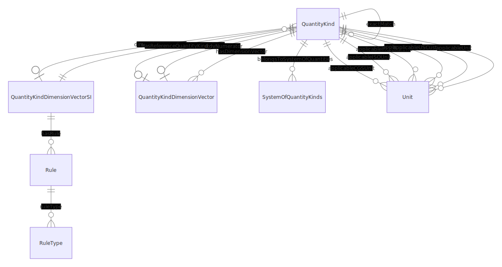
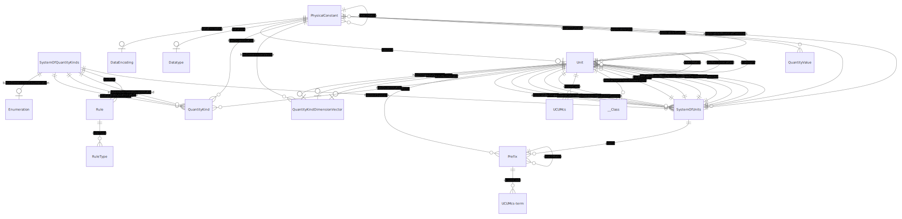

# QUDT


**metamodel version:** 1.7.0

**version:** None


qudt


## Class Diagram


## ERD Diagram


## Base Classes


These classes have no direct relationships but serve as base classes for other classes:

| Class | Description |
| --- | --- |
| [Aspect](#aspect) |  |
| [Resource](#resource) |  |
| [Thing](#thing) | The root class for all QUDT concepts |
| [Verifiable](#verifiable) |  |

## Standalone Classes


These classes are completely isolated with no relationships and are not used as base classes:

| Class | Description |
| --- | --- |
| [AspectClass](#aspectclass) |  |
| [CatalogEntry](#catalogentry) |  |
| [Comment](#comment) |  |
| [DateTimeStringEncodingType](#datetimestringencodingtype) |  |
| [LatexString](#latexstring) |  |
| [List](#list) |  |
| [NISTSP811Comment](#nistsp811comment) |  |
| [Ontology](#ontology) |  |
| [SignednessType](#signednesstype) |  |
| [Statement](#statement) |  |
| [StringEncodingType](#stringencodingtype) |  |
| [SymmetricRelation](#symmetricrelation) |  |
| [GDay](#gday) |  |
| [GMonth](#gmonth) |  |
| [GMonthDay](#gmonthday) |  |
| [GYear](#gyear) |  |
| [GYearMonth](#gyearmonth) |  |
| [ValueUnion](#valueunion) |  |

## Classes


### AbstractQuantityKind


#### YAML Definition

<details>
<summary>Click to expand</summary>

```yaml
AbstractQuantityKind:
  is_a: Concept
  slots:
  - guidance
  - Concept_id
  - Concept_hasRule
  - Concept_isReplacedBy
  - Concept_description
  - Concept_abbreviation
  - Concept_deprecated
  - Concept_plainTextDescription
  - AbstractQuantityKind_broader
  - AbstractQuantityKind_altSymbol
  - AbstractQuantityKind_latexSymbol
  - AbstractQuantityKind_symbol
  slot_usage:
    broader:
      range: QuantityKind
    altSymbol:
      required: false
    latexSymbol:
      required: false
    symbol:
      multivalued: false

```
</details>


#### Attributes

| Name | Cardinality: | Type | Description |
| --- | --- | --- | --- |
| **[Id](#id)** | <sub>0..1</sub> | None |  |
| **[Description](#description)** | <sub>0..1</sub> | None |  |
| **[Abbreviation](#abbreviation)** | <sub>0..1</sub> | None |  |
| **[Deprecated](#deprecated)** | <sub>0..1</sub> | None |  |
| **[Guidance](#guidance)** | <sub>0..\*</sub> | string |  |
| **[HasRule](#hasrule)** | <sub>0..\*</sub> | [Rule](#rule) |  |
| **[IsReplacedBy](#isreplacedby)** | <sub>0..1</sub> | None |  |
| **[PlainTextDescription](#plaintextdescription)** | <sub>0..1</sub> | None |  |
| **[AltSymbol](#altsymbol)** | <sub>0..\*</sub> | None |  |
| **[LatexSymbol](#latexsymbol)** | <sub>0..\*</sub> | None |  |
| **[Symbol](#symbol)** | <sub>0..1</sub> | None |  |

#### Parents

 * [Concept](#concept)

#### Children

 * [UserQuantityKind](#userquantitykind)

#### Used as mixin by

 * [QuantityKind](#quantitykind)


### AngleUnit


#### YAML Definition

<details>
<summary>Click to expand</summary>

```yaml
AngleUnit:
  is_a: DimensionlessUnit
  slots:
  - Verifiable_wikidataMatch
  - Verifiable_dbpediaMatch
  - Verifiable_isoNormativeReference
  - Verifiable_normativeReference
  - hasReciprocalUnit
  - isUnitOfSystem
  - omUnit
  - unitFor
  - Unit_applicableSystem
  - Unit_definedUnitOfSystem
  - Unit_derivedCoherentUnitOfSystem
  - Unit_derivedUnitOfSystem
  - Unit_exactMatch
  - Unit_hasDimensionVector
  - Unit_hasFactorUnit
  - Unit_hasQuantityKind
  - Unit_iec61360Code
  - Unit_prefix
  - Unit_qkdvDenominator
  - Unit_qkdvNumerator
  - Unit_scalingOf
  - Unit_ucumCode
  - Unit_udunitsCode
  - Unit_uneceCommonCode
  - Unit_altSymbol
  - Unit_latexDefinition
  - Unit_latexSymbol
  - Unit_siUnitsExpression
  - Unit_symbol
  - Unit_conversionMultiplier
  - Unit_conversionMultiplierSN
  - Unit_conversionOffset
  - Unit_conversionOffsetSN
  - Unit_factorUnitScalar
  - Unit_mathMLdefinition
  - guidance
  - Concept_id
  - Concept_hasRule
  - Concept_isReplacedBy
  - Concept_description
  - Concept_abbreviation
  - Concept_deprecated
  - Concept_plainTextDescription

```
</details>


#### Attributes

| Name | Cardinality: | Type | Description |
| --- | --- | --- | --- |
| **[AltSymbol](#altsymbol)** | <sub>0..\*</sub> | None |  |
| **[ApplicableSystem](#applicablesystem)** | <sub>0..\*</sub> | [SystemOfUnits](#systemofunits) |  |
| **[ConversionMultiplier](#conversionmultiplier)** | <sub>0..1</sub> | None |  |
| **[ConversionMultiplierSN](#conversionmultipliersn)** | <sub>0..1</sub> | None |  |
| **[ConversionOffset](#conversionoffset)** | <sub>0..1</sub> | None |  |
| **[ConversionOffsetSN](#conversionoffsetsn)** | <sub>0..1</sub> | None |  |
| **[DbpediaMatch](#dbpediamatch)** | <sub>0..\*</sub> | uri |  |
| **[DefinedUnitOfSystem](#definedunitofsystem)** | <sub>0..\*</sub> | [SystemOfUnits](#systemofunits) |  |
| **[DerivedCoherentUnitOfSystem](#derivedcoherentunitofsystem)** | <sub>0..\*</sub> | [SystemOfUnits](#systemofunits) |  |
| **[DerivedUnitOfSystem](#derivedunitofsystem)** | <sub>0..\*</sub> | [SystemOfUnits](#systemofunits) |  |
| **[ExactMatch](#exactmatch)** | <sub>0..\*</sub> | [Unit](#unit) |  |
| **[FactorUnitScalar](#factorunitscalar)** | <sub>0..1</sub> | None |  |
| **[HasDimensionVector](#hasdimensionvector)** | <sub>0..1</sub> | [QuantityKindDimensionVector](#quantitykinddimensionvector) |  |
| **[HasFactorUnit](#hasfactorunit)** | <sub>0..\*</sub> | [Class](#class) |  |
| **[HasQuantityKind](#hasquantitykind)** | <sub>0..\*</sub> | [QuantityKind](#quantitykind) |  |
| **[HasReciprocalUnit](#hasreciprocalunit)** | <sub>0..\*</sub> | [Unit](#unit) |  |
| **[Iec61360Code](#iec61360code)** | <sub>0..\*</sub> | string |  |
| **[IsUnitOfSystem](#isunitofsystem)** | <sub>0..\*</sub> | [SystemOfUnits](#systemofunits) |  |
| **[IsoNormativeReference](#isonormativereference)** | <sub>0..\*</sub> | None |  |
| **[LatexDefinition](#latexdefinition)** | <sub>0..\*</sub> | None |  |
| **[LatexSymbol](#latexsymbol)** | <sub>0..\*</sub> | None |  |
| **[MathMLdefinition](#mathmldefinition)** | <sub>0..1</sub> | None |  |
| **[NormativeReference](#normativereference)** | <sub>0..\*</sub> | None |  |
| **[OmUnit](#omunit)** | <sub>0..\*</sub> | None |  |
| **[Prefix](#prefix)** | <sub>0..\*</sub> | [Prefix](#prefix) |  |
| **[QkdvDenominator](#qkdvdenominator)** | <sub>0..1</sub> | [QuantityKindDimensionVector](#quantitykinddimensionvector) |  |
| **[QkdvNumerator](#qkdvnumerator)** | <sub>0..1</sub> | [QuantityKindDimensionVector](#quantitykinddimensionvector) |  |
| **[ScalingOf](#scalingof)** | <sub>0..\*</sub> | [Unit](#unit) |  |
| **[SiUnitsExpression](#siunitsexpression)** | <sub>0..\*</sub> | None |  |
| **[Symbol](#symbol)** | <sub>0..\*</sub> | None |  |
| **[UcumCode](#ucumcode)** | <sub>0..\*</sub> | [UCUMcs](#ucumcs) |  |
| **[UdunitsCode](#udunitscode)** | <sub>0..\*</sub> | string |  |
| **[UneceCommonCode](#unececommoncode)** | <sub>0..\*</sub> | string |  |
| **[UnitFor](#unitfor)** | <sub>0..\*</sub> | None |  |
| **[WikidataMatch](#wikidatamatch)** | <sub>0..\*</sub> | uri |  |
| **[Id](#id)** | <sub>0..1</sub> | None |  |
| **[Guidance](#guidance)** | <sub>0..\*</sub> | string |  |

#### Parents

 * [DimensionlessUnit](#dimensionlessunit)

#### Children

 * [PlaneAngleUnit](#planeangleunit)
 * [SolidAngleUnit](#solidangleunit)


### Aspect


An aspect is an abstract type class that defines properties that can be reused.


#### YAML Definition

<details>
<summary>Click to expand</summary>

```yaml
Aspect:
  is_a: Thing

```
</details>


#### Local class diagram



This class has no attributes


#### Parents

 * [Thing](#thing) - The root class for all QUDT concepts

#### Children

 * [DataEncoding](#dataencoding)
 * [Quantifiable](#quantifiable)
 * [Verifiable](#verifiable)


### AspectClass


#### YAML Definition

<details>
<summary>Click to expand</summary>

```yaml
AspectClass:
  is_a: Class

```
</details>


#### Local class diagram


This class has no attributes


#### Parents

 * [Class](#class)


### BaseDimensionMagnitude


<p class=\"lm-para\">A <em>Dimension</em> expresses a magnitude for a base quantiy kind such as mass, length and time.</p>
<p class=\"lm-para\">DEPRECATED - each exponent is expressed as a property. Keep until a validaiton of this has been done.</p>


#### YAML Definition

<details>
<summary>Click to expand</summary>

```yaml
BaseDimensionMagnitude:
  is_a: Concept
  slots:
  - guidance
  - Concept_id
  - Concept_hasRule
  - Concept_isReplacedBy
  - Concept_description
  - Concept_abbreviation
  - Concept_deprecated
  - Concept_plainTextDescription
  - BaseDimensionMagnitude_hasBaseQuantityKind
  - BaseDimensionMagnitude_vectorMagnitude
  slot_usage:
    hasBaseQuantityKind:
      range: QuantityKind
      required: true
      multivalued: false
    vectorMagnitude:
      range: float
      required: true
      multivalued: false

```
</details>


#### Attributes

| Name | Cardinality: | Type | Description |
| --- | --- | --- | --- |
| **[Id](#id)** | <sub>0..1</sub> | None |  |
| **[Description](#description)** | <sub>0..1</sub> | None |  |
| **[Abbreviation](#abbreviation)** | <sub>0..1</sub> | None |  |
| **[Deprecated](#deprecated)** | <sub>0..1</sub> | None |  |
| **[Guidance](#guidance)** | <sub>0..\*</sub> | string |  |
| **[HasRule](#hasrule)** | <sub>0..\*</sub> | [Rule](#rule) |  |
| **[IsReplacedBy](#isreplacedby)** | <sub>0..1</sub> | None |  |
| **[PlainTextDescription](#plaintextdescription)** | <sub>0..1</sub> | None |  |
| **[HasBaseQuantityKind](#hasbasequantitykind)** | <sub>1..1</sub> | [QuantityKind](#quantitykind) |  |
| **[VectorMagnitude](#vectormagnitude)** | <sub>1..1</sub> | float |  |

#### Parents

 * [Concept](#concept)


### BinaryPrefix


A <em>Binary Prefix</em> is a prefix for multiples of units in data processing, data transmission, and digital information, notably the bit and the byte, to indicate multiplication by a power of 2.


#### YAML Definition

<details>
<summary>Click to expand</summary>

```yaml
BinaryPrefix:
  is_a: Prefix
  slots:
  - Verifiable_wikidataMatch
  - Verifiable_dbpediaMatch
  - Verifiable_isoNormativeReference
  - Verifiable_normativeReference
  - Prefix_exactMatch
  - Prefix_ucumCode
  - Prefix_altSymbol
  - Prefix_latexSymbol
  - Prefix_symbol
  - Prefix_prefixMultiplier
  - guidance
  - Concept_id
  - Concept_hasRule
  - Concept_isReplacedBy
  - Concept_description
  - Concept_abbreviation
  - Concept_deprecated
  - Concept_plainTextDescription

```
</details>


#### Attributes

| Name | Cardinality: | Type | Description |
| --- | --- | --- | --- |
| **[AltSymbol](#altsymbol)** | <sub>0..\*</sub> | None |  |
| **[DbpediaMatch](#dbpediamatch)** | <sub>0..\*</sub> | uri |  |
| **[ExactMatch](#exactmatch)** | <sub>0..\*</sub> | [Prefix](#prefix) |  |
| **[IsoNormativeReference](#isonormativereference)** | <sub>0..\*</sub> | None |  |
| **[LatexSymbol](#latexsymbol)** | <sub>0..\*</sub> | None |  |
| **[NormativeReference](#normativereference)** | <sub>0..\*</sub> | None |  |
| **[PrefixMultiplier](#prefixmultiplier)** | <sub>0..1</sub> | None |  |
| **[Symbol](#symbol)** | <sub>0..\*</sub> | None |  |
| **[UcumCode](#ucumcode)** | <sub>0..\*</sub> | [UCUMcs-term](#ucumcs-term) |  |
| **[WikidataMatch](#wikidatamatch)** | <sub>0..\*</sub> | uri |  |
| **[Id](#id)** | <sub>0..1</sub> | None |  |
| **[Guidance](#guidance)** | <sub>0..\*</sub> | string |  |

#### Parents

 * [Prefix](#prefix)


### BitEncodingType


#### YAML Definition

<details>
<summary>Click to expand</summary>

```yaml
BitEncodingType:
  is_a: Encoding
  slots:
  - guidance
  - Concept_id
  - Concept_hasRule
  - Concept_isReplacedBy
  - Concept_description
  - Concept_abbreviation
  - Concept_deprecated
  - Concept_plainTextDescription
  - Encoding_bits
  - Encoding_bytes

```
</details>


#### Attributes

| Name | Cardinality: | Type | Description |
| --- | --- | --- | --- |
| **[Id](#id)** | <sub>0..1</sub> | None |  |
| **[Description](#description)** | <sub>0..1</sub> | None |  |
| **[Abbreviation](#abbreviation)** | <sub>0..1</sub> | None |  |
| **[Bits](#bits)** | <sub>0..1</sub> | None |  |
| **[Bytes](#bytes)** | <sub>0..1</sub> | None |  |
| **[Deprecated](#deprecated)** | <sub>0..1</sub> | None |  |
| **[Guidance](#guidance)** | <sub>0..\*</sub> | string |  |
| **[HasRule](#hasrule)** | <sub>0..\*</sub> | [Rule](#rule) |  |
| **[IsReplacedBy](#isreplacedby)** | <sub>0..1</sub> | None |  |
| **[PlainTextDescription](#plaintextdescription)** | <sub>0..1</sub> | None |  |

#### Parents

 * [Encoding](#encoding)


### BooleanEncodingType


#### YAML Definition

<details>
<summary>Click to expand</summary>

```yaml
BooleanEncodingType:
  is_a: Encoding
  slots:
  - guidance
  - Concept_id
  - Concept_hasRule
  - Concept_isReplacedBy
  - Concept_description
  - Concept_abbreviation
  - Concept_deprecated
  - Concept_plainTextDescription
  - Encoding_bits
  - Encoding_bytes

```
</details>


#### Attributes

| Name | Cardinality: | Type | Description |
| --- | --- | --- | --- |
| **[Id](#id)** | <sub>0..1</sub> | None |  |
| **[Description](#description)** | <sub>0..1</sub> | None |  |
| **[Abbreviation](#abbreviation)** | <sub>0..1</sub> | None |  |
| **[Bits](#bits)** | <sub>0..1</sub> | None |  |
| **[Bytes](#bytes)** | <sub>0..1</sub> | None |  |
| **[Deprecated](#deprecated)** | <sub>0..1</sub> | None |  |
| **[Guidance](#guidance)** | <sub>0..\*</sub> | string |  |
| **[HasRule](#hasrule)** | <sub>0..\*</sub> | [Rule](#rule) |  |
| **[IsReplacedBy](#isreplacedby)** | <sub>0..1</sub> | None |  |
| **[PlainTextDescription](#plaintextdescription)** | <sub>0..1</sub> | None |  |

#### Parents

 * [Encoding](#encoding)


### ByteEncodingType


#### YAML Definition

<details>
<summary>Click to expand</summary>

```yaml
ByteEncodingType:
  is_a: Encoding
  slots:
  - guidance
  - Concept_id
  - Concept_hasRule
  - Concept_isReplacedBy
  - Concept_description
  - Concept_abbreviation
  - Concept_deprecated
  - Concept_plainTextDescription
  - Encoding_bits
  - Encoding_bytes

```
</details>


#### Attributes

| Name | Cardinality: | Type | Description |
| --- | --- | --- | --- |
| **[Id](#id)** | <sub>0..1</sub> | None |  |
| **[Description](#description)** | <sub>0..1</sub> | None |  |
| **[Abbreviation](#abbreviation)** | <sub>0..1</sub> | None |  |
| **[Bits](#bits)** | <sub>0..1</sub> | None |  |
| **[Bytes](#bytes)** | <sub>0..1</sub> | None |  |
| **[Deprecated](#deprecated)** | <sub>0..1</sub> | None |  |
| **[Guidance](#guidance)** | <sub>0..\*</sub> | string |  |
| **[HasRule](#hasrule)** | <sub>0..\*</sub> | [Rule](#rule) |  |
| **[IsReplacedBy](#isreplacedby)** | <sub>0..1</sub> | None |  |
| **[PlainTextDescription](#plaintextdescription)** | <sub>0..1</sub> | None |  |

#### Parents

 * [Encoding](#encoding)


### CardinalityType


#### YAML Definition

<details>
<summary>Click to expand</summary>

```yaml
CardinalityType:
  is_a: EnumeratedValue
  slots:
  - Verifiable_wikidataMatch
  - Verifiable_dbpediaMatch
  - Verifiable_isoNormativeReference
  - Verifiable_normativeReference
  - EnumeratedValue_altSymbol
  - EnumeratedValue_description
  - EnumeratedValue_abbreviation
  - EnumeratedValue_symbol
  - guidance
  - Concept_id
  - Concept_hasRule
  - Concept_isReplacedBy
  - Concept_deprecated
  - Concept_plainTextDescription
  - CardinalityType_literal
  slot_usage:
    literal:
      multivalued: false

```
</details>


#### Attributes

| Name | Cardinality: | Type | Description |
| --- | --- | --- | --- |
| **[Description](#description)** | <sub>0..1</sub> | None |  |
| **[Abbreviation](#abbreviation)** | <sub>0..1</sub> | None |  |
| **[AltSymbol](#altsymbol)** | <sub>0..\*</sub> | None |  |
| **[DbpediaMatch](#dbpediamatch)** | <sub>0..\*</sub> | uri |  |
| **[IsoNormativeReference](#isonormativereference)** | <sub>0..\*</sub> | None |  |
| **[NormativeReference](#normativereference)** | <sub>0..\*</sub> | None |  |
| **[Symbol](#symbol)** | <sub>0..1</sub> | None |  |
| **[WikidataMatch](#wikidatamatch)** | <sub>0..\*</sub> | uri |  |
| **[Literal](#literal)** | <sub>0..1</sub> | None |  |
| **[Id](#id)** | <sub>0..1</sub> | None |  |
| **[Guidance](#guidance)** | <sub>0..\*</sub> | string |  |

#### Parents

 * [EnumeratedValue](#enumeratedvalue)

#### Referenced by:

 *  **[Datatype](#datatype)** : cardinality  <sub>0..\*</sub> 


### CatalogEntry


#### YAML Definition

<details>
<summary>Click to expand</summary>

```yaml
CatalogEntry: {}

```
</details>


This class has no attributes


### CharEncodingType


#### YAML Definition

<details>
<summary>Click to expand</summary>

```yaml
CharEncodingType:
  is_a: Encoding
  slots:
  - guidance
  - Concept_id
  - Concept_hasRule
  - Concept_isReplacedBy
  - Concept_description
  - Concept_abbreviation
  - Concept_deprecated
  - Concept_plainTextDescription
  - Encoding_bits
  - Encoding_bytes

```
</details>


#### Attributes

| Name | Cardinality: | Type | Description |
| --- | --- | --- | --- |
| **[Id](#id)** | <sub>0..1</sub> | None |  |
| **[Description](#description)** | <sub>0..1</sub> | None |  |
| **[Abbreviation](#abbreviation)** | <sub>0..1</sub> | None |  |
| **[Bits](#bits)** | <sub>0..1</sub> | None |  |
| **[Bytes](#bytes)** | <sub>0..1</sub> | None |  |
| **[Deprecated](#deprecated)** | <sub>0..1</sub> | None |  |
| **[Guidance](#guidance)** | <sub>0..\*</sub> | string |  |
| **[HasRule](#hasrule)** | <sub>0..\*</sub> | [Rule](#rule) |  |
| **[IsReplacedBy](#isreplacedby)** | <sub>0..1</sub> | None |  |
| **[PlainTextDescription](#plaintextdescription)** | <sub>0..1</sub> | None |  |

#### Parents

 * [Encoding](#encoding)


### Citation


Provides a simple way of making citations.


#### YAML Definition

<details>
<summary>Click to expand</summary>

```yaml
Citation:
  is_a: Concept
  slots:
  - guidance
  - Concept_id
  - Concept_hasRule
  - Concept_isReplacedBy
  - Concept_abbreviation
  - Concept_deprecated
  - Concept_plainTextDescription
  - Citation_description
  - Citation_url
  slot_usage:
    description:
      required: true
      multivalued: false
    url:
      multivalued: false

```
</details>


#### Attributes

| Name | Cardinality: | Type | Description |
| --- | --- | --- | --- |
| **[Id](#id)** | <sub>0..1</sub> | None |  |
| **[Abbreviation](#abbreviation)** | <sub>0..1</sub> | None |  |
| **[Deprecated](#deprecated)** | <sub>0..1</sub> | None |  |
| **[Guidance](#guidance)** | <sub>0..\*</sub> | string |  |
| **[HasRule](#hasrule)** | <sub>0..\*</sub> | [Rule](#rule) |  |
| **[IsReplacedBy](#isreplacedby)** | <sub>0..1</sub> | None |  |
| **[PlainTextDescription](#plaintextdescription)** | <sub>0..1</sub> | None |  |
| **[Description](#description)** | <sub>1..1</sub> | None |  |
| **[Url](#url)** | <sub>0..1</sub> | None |  |

#### Parents

 * [Concept](#concept)


### Class


#### YAML Definition

<details>
<summary>Click to expand</summary>

```yaml
Class: {}

```
</details>


This class has no attributes


#### Children

 * [AspectClass](#aspectclass)

#### Referenced by:

 *  **[Unit](#unit)** : hasFactorUnit  <sub>0..\*</sub> 


### Comment


#### YAML Definition

<details>
<summary>Click to expand</summary>

```yaml
Comment:
  is_a: Verifiable
  slots:
  - Verifiable_wikidataMatch
  - Verifiable_dbpediaMatch
  - Verifiable_isoNormativeReference
  - Verifiable_normativeReference
  - Comment_rationale
  - Comment_description
  slot_usage:
    rationale:
      required: false
    description:
      multivalued: false

```
</details>


#### Local class diagram


#### Attributes

| Name | Cardinality: | Type | Description |
| --- | --- | --- | --- |
| **[DbpediaMatch](#dbpediamatch)** | <sub>0..\*</sub> | uri |  |
| **[IsoNormativeReference](#isonormativereference)** | <sub>0..\*</sub> | None |  |
| **[NormativeReference](#normativereference)** | <sub>0..\*</sub> | None |  |
| **[WikidataMatch](#wikidatamatch)** | <sub>0..\*</sub> | uri |  |
| **[Description](#description)** | <sub>0..1</sub> | None |  |
| **[Rationale](#rationale)** | <sub>0..\*</sub> | string |  |

#### Parents

 * [Verifiable](#verifiable)

#### Children

 * [NISTSP811Comment](#nistsp811comment)


### Concept


The root class for all QUDT concepts.


#### YAML Definition

<details>
<summary>Click to expand</summary>

```yaml
Concept:
  is_a: Thing
  slots:
  - guidance
  - Concept_id
  - Concept_hasRule
  - Concept_isReplacedBy
  - Concept_description
  - Concept_abbreviation
  - Concept_deprecated
  - Concept_plainTextDescription
  slot_usage:
    hasRule:
      range: Rule
    isReplacedBy:
      multivalued: false
    description:
      multivalued: false
    abbreviation:
      multivalued: false
    deprecated:
      multivalued: false
    id:
      multivalued: false
    plainTextDescription:
      multivalued: false

```
</details>


#### Attributes

| Name | Cardinality: | Type | Description |
| --- | --- | --- | --- |
| **[Id](#id)** | <sub>0..1</sub> | None |  |
| **[Description](#description)** | <sub>0..1</sub> | None |  |
| **[Abbreviation](#abbreviation)** | <sub>0..1</sub> | None |  |
| **[Deprecated](#deprecated)** | <sub>0..1</sub> | None |  |
| **[Guidance](#guidance)** | <sub>0..\*</sub> | string |  |
| **[HasRule](#hasrule)** | <sub>0..\*</sub> | [Rule](#rule) |  |
| **[IsReplacedBy](#isreplacedby)** | <sub>0..1</sub> | None |  |
| **[PlainTextDescription](#plaintextdescription)** | <sub>0..1</sub> | None |  |

#### Parents

 * [Thing](#thing) - The root class for all QUDT concepts

#### Children

 * [AbstractQuantityKind](#abstractquantitykind)
 * [BaseDimensionMagnitude](#basedimensionmagnitude)
 * [Citation](#citation)
 * [DataItem](#dataitem)
 * [Datatype](#datatype)
 * [Discipline](#discipline)
 * [Encoding](#encoding)
 * [EnumeratedQuantity](#enumeratedquantity)
 * [Enumeration](#enumeration)
 * [Figure](#figure)
 * [MathsFunctionType](#mathsfunctiontype)
 * [Organization](#organization)
 * [QuantityKindDimensionVector](#quantitykinddimensionvector)
 * [Scale](#scale)
 * [Symbol](#symbol)
 * [SystemOfQuantityKinds](#systemofquantitykinds)

#### Used as mixin by

 * [EnumeratedValue](#enumeratedvalue)
 * [NumericUnion](#numericunion)
 * [Prefix](#prefix)
 * [Quantity](#quantity)
 * [QuantityValue](#quantityvalue)
 * [Rule](#rule)
 * [SystemOfUnits](#systemofunits)
 * [Unit](#unit)

#### Referenced by:


### ConstantValue


Used to specify the values of a constant.


#### YAML Definition

<details>
<summary>Click to expand</summary>

```yaml
ConstantValue:
  is_a: QuantityValue
  slots:
  - Quantifiable_dataEncoding
  - Quantifiable_datatype
  - Quantifiable_relativeStandardUncertainty
  - Quantifiable_standardUncertainty
  - Quantifiable_standardUncertaintySN
  - Quantifiable_value
  - Quantifiable_valueSN
  - QuantityValue_hasUnit
  - guidance
  - Concept_id
  - Concept_hasRule
  - Concept_isReplacedBy
  - Concept_description
  - Concept_abbreviation
  - Concept_deprecated
  - Concept_plainTextDescription
  - ConstantValue_exactConstant
  slot_usage:
    exactConstant:
      required: false

```
</details>


#### Attributes

| Name | Cardinality: | Type | Description |
| --- | --- | --- | --- |
| **[DataEncoding](#dataencoding)** | <sub>0..1</sub> | [DataEncoding](#dataencoding) |  |
| **[Datatype](#datatype)** | <sub>0..1</sub> | [Datatype](#datatype) |  |
| **[HasUnit](#hasunit)** | <sub>0..1</sub> | [Unit](#unit) |  |
| **[RelativeStandardUncertainty](#relativestandarduncertainty)** | <sub>0..1</sub> | double |  |
| **[StandardUncertainty](#standarduncertainty)** | <sub>0..1</sub> | decimal |  |
| **[StandardUncertaintySN](#standarduncertaintysn)** | <sub>0..\*</sub> | double |  |
| **[Value](#value)** | <sub>0..1</sub> | None |  |
| **[ValueSN](#valuesn)** | <sub>0..1</sub> | None |  |
| **[ExactConstant](#exactconstant)** | <sub>0..\*</sub> | None |  |
| **[Id](#id)** | <sub>0..1</sub> | None |  |
| **[Guidance](#guidance)** | <sub>0..\*</sub> | string |  |

#### Parents

 * [QuantityValue](#quantityvalue)


### ContextualUnit


#### YAML Definition

<details>
<summary>Click to expand</summary>

```yaml
ContextualUnit:
  is_a: Unit
  slots:
  - Verifiable_wikidataMatch
  - Verifiable_dbpediaMatch
  - Verifiable_isoNormativeReference
  - Verifiable_normativeReference
  - hasReciprocalUnit
  - isUnitOfSystem
  - omUnit
  - unitFor
  - Unit_applicableSystem
  - Unit_definedUnitOfSystem
  - Unit_derivedCoherentUnitOfSystem
  - Unit_derivedUnitOfSystem
  - Unit_exactMatch
  - Unit_hasDimensionVector
  - Unit_hasFactorUnit
  - Unit_hasQuantityKind
  - Unit_iec61360Code
  - Unit_prefix
  - Unit_qkdvDenominator
  - Unit_qkdvNumerator
  - Unit_scalingOf
  - Unit_ucumCode
  - Unit_udunitsCode
  - Unit_uneceCommonCode
  - Unit_altSymbol
  - Unit_latexDefinition
  - Unit_latexSymbol
  - Unit_siUnitsExpression
  - Unit_symbol
  - Unit_conversionMultiplier
  - Unit_conversionMultiplierSN
  - Unit_conversionOffset
  - Unit_conversionOffsetSN
  - Unit_factorUnitScalar
  - Unit_mathMLdefinition
  - guidance
  - Concept_id
  - Concept_hasRule
  - Concept_isReplacedBy
  - Concept_description
  - Concept_abbreviation
  - Concept_deprecated
  - Concept_plainTextDescription
  - ContextualUnit_broader
  slot_usage:
    broader:
      range: Unit

```
</details>


#### Attributes

| Name | Cardinality: | Type | Description |
| --- | --- | --- | --- |
| **[AltSymbol](#altsymbol)** | <sub>0..\*</sub> | None |  |
| **[ApplicableSystem](#applicablesystem)** | <sub>0..\*</sub> | [SystemOfUnits](#systemofunits) |  |
| **[ConversionMultiplier](#conversionmultiplier)** | <sub>0..1</sub> | None |  |
| **[ConversionMultiplierSN](#conversionmultipliersn)** | <sub>0..1</sub> | None |  |
| **[ConversionOffset](#conversionoffset)** | <sub>0..1</sub> | None |  |
| **[ConversionOffsetSN](#conversionoffsetsn)** | <sub>0..1</sub> | None |  |
| **[DbpediaMatch](#dbpediamatch)** | <sub>0..\*</sub> | uri |  |
| **[DefinedUnitOfSystem](#definedunitofsystem)** | <sub>0..\*</sub> | [SystemOfUnits](#systemofunits) |  |
| **[DerivedCoherentUnitOfSystem](#derivedcoherentunitofsystem)** | <sub>0..\*</sub> | [SystemOfUnits](#systemofunits) |  |
| **[DerivedUnitOfSystem](#derivedunitofsystem)** | <sub>0..\*</sub> | [SystemOfUnits](#systemofunits) |  |
| **[ExactMatch](#exactmatch)** | <sub>0..\*</sub> | [Unit](#unit) |  |
| **[FactorUnitScalar](#factorunitscalar)** | <sub>0..1</sub> | None |  |
| **[HasDimensionVector](#hasdimensionvector)** | <sub>0..1</sub> | [QuantityKindDimensionVector](#quantitykinddimensionvector) |  |
| **[HasFactorUnit](#hasfactorunit)** | <sub>0..\*</sub> | [Class](#class) |  |
| **[HasQuantityKind](#hasquantitykind)** | <sub>0..\*</sub> | [QuantityKind](#quantitykind) |  |
| **[HasReciprocalUnit](#hasreciprocalunit)** | <sub>0..\*</sub> | [Unit](#unit) |  |
| **[Iec61360Code](#iec61360code)** | <sub>0..\*</sub> | string |  |
| **[IsUnitOfSystem](#isunitofsystem)** | <sub>0..\*</sub> | [SystemOfUnits](#systemofunits) |  |
| **[IsoNormativeReference](#isonormativereference)** | <sub>0..\*</sub> | None |  |
| **[LatexDefinition](#latexdefinition)** | <sub>0..\*</sub> | None |  |
| **[LatexSymbol](#latexsymbol)** | <sub>0..\*</sub> | None |  |
| **[MathMLdefinition](#mathmldefinition)** | <sub>0..1</sub> | None |  |
| **[NormativeReference](#normativereference)** | <sub>0..\*</sub> | None |  |
| **[OmUnit](#omunit)** | <sub>0..\*</sub> | None |  |
| **[Prefix](#prefix)** | <sub>0..\*</sub> | [Prefix](#prefix) |  |
| **[QkdvDenominator](#qkdvdenominator)** | <sub>0..1</sub> | [QuantityKindDimensionVector](#quantitykinddimensionvector) |  |
| **[QkdvNumerator](#qkdvnumerator)** | <sub>0..1</sub> | [QuantityKindDimensionVector](#quantitykinddimensionvector) |  |
| **[ScalingOf](#scalingof)** | <sub>0..\*</sub> | [Unit](#unit) |  |
| **[SiUnitsExpression](#siunitsexpression)** | <sub>0..\*</sub> | None |  |
| **[Symbol](#symbol)** | <sub>0..\*</sub> | None |  |
| **[UcumCode](#ucumcode)** | <sub>0..\*</sub> | [UCUMcs](#ucumcs) |  |
| **[UdunitsCode](#udunitscode)** | <sub>0..\*</sub> | string |  |
| **[UneceCommonCode](#unececommoncode)** | <sub>0..\*</sub> | string |  |
| **[UnitFor](#unitfor)** | <sub>0..\*</sub> | None |  |
| **[WikidataMatch](#wikidatamatch)** | <sub>0..\*</sub> | uri |  |
| **[Id](#id)** | <sub>0..1</sub> | None |  |
| **[Guidance](#guidance)** | <sub>0..\*</sub> | string |  |

#### Parents

 * [Unit](#unit)


### CountingUnit


Used for all units that express counts. Examples are Atomic Number, Number, Number per Year, Percent and Sample per Second.


#### YAML Definition

<details>
<summary>Click to expand</summary>

```yaml
CountingUnit:
  is_a: DimensionlessUnit
  slots:
  - Verifiable_wikidataMatch
  - Verifiable_dbpediaMatch
  - Verifiable_isoNormativeReference
  - Verifiable_normativeReference
  - hasReciprocalUnit
  - isUnitOfSystem
  - omUnit
  - unitFor
  - Unit_applicableSystem
  - Unit_definedUnitOfSystem
  - Unit_derivedCoherentUnitOfSystem
  - Unit_derivedUnitOfSystem
  - Unit_exactMatch
  - Unit_hasDimensionVector
  - Unit_hasFactorUnit
  - Unit_hasQuantityKind
  - Unit_iec61360Code
  - Unit_prefix
  - Unit_qkdvDenominator
  - Unit_qkdvNumerator
  - Unit_scalingOf
  - Unit_ucumCode
  - Unit_udunitsCode
  - Unit_uneceCommonCode
  - Unit_altSymbol
  - Unit_latexDefinition
  - Unit_latexSymbol
  - Unit_siUnitsExpression
  - Unit_symbol
  - Unit_conversionMultiplier
  - Unit_conversionMultiplierSN
  - Unit_conversionOffset
  - Unit_conversionOffsetSN
  - Unit_factorUnitScalar
  - Unit_mathMLdefinition
  - guidance
  - Concept_id
  - Concept_hasRule
  - Concept_isReplacedBy
  - Concept_description
  - Concept_abbreviation
  - Concept_deprecated
  - Concept_plainTextDescription

```
</details>


#### Attributes

| Name | Cardinality: | Type | Description |
| --- | --- | --- | --- |
| **[AltSymbol](#altsymbol)** | <sub>0..\*</sub> | None |  |
| **[ApplicableSystem](#applicablesystem)** | <sub>0..\*</sub> | [SystemOfUnits](#systemofunits) |  |
| **[ConversionMultiplier](#conversionmultiplier)** | <sub>0..1</sub> | None |  |
| **[ConversionMultiplierSN](#conversionmultipliersn)** | <sub>0..1</sub> | None |  |
| **[ConversionOffset](#conversionoffset)** | <sub>0..1</sub> | None |  |
| **[ConversionOffsetSN](#conversionoffsetsn)** | <sub>0..1</sub> | None |  |
| **[DbpediaMatch](#dbpediamatch)** | <sub>0..\*</sub> | uri |  |
| **[DefinedUnitOfSystem](#definedunitofsystem)** | <sub>0..\*</sub> | [SystemOfUnits](#systemofunits) |  |
| **[DerivedCoherentUnitOfSystem](#derivedcoherentunitofsystem)** | <sub>0..\*</sub> | [SystemOfUnits](#systemofunits) |  |
| **[DerivedUnitOfSystem](#derivedunitofsystem)** | <sub>0..\*</sub> | [SystemOfUnits](#systemofunits) |  |
| **[ExactMatch](#exactmatch)** | <sub>0..\*</sub> | [Unit](#unit) |  |
| **[FactorUnitScalar](#factorunitscalar)** | <sub>0..1</sub> | None |  |
| **[HasDimensionVector](#hasdimensionvector)** | <sub>0..1</sub> | [QuantityKindDimensionVector](#quantitykinddimensionvector) |  |
| **[HasFactorUnit](#hasfactorunit)** | <sub>0..\*</sub> | [Class](#class) |  |
| **[HasQuantityKind](#hasquantitykind)** | <sub>0..\*</sub> | [QuantityKind](#quantitykind) |  |
| **[HasReciprocalUnit](#hasreciprocalunit)** | <sub>0..\*</sub> | [Unit](#unit) |  |
| **[Iec61360Code](#iec61360code)** | <sub>0..\*</sub> | string |  |
| **[IsUnitOfSystem](#isunitofsystem)** | <sub>0..\*</sub> | [SystemOfUnits](#systemofunits) |  |
| **[IsoNormativeReference](#isonormativereference)** | <sub>0..\*</sub> | None |  |
| **[LatexDefinition](#latexdefinition)** | <sub>0..\*</sub> | None |  |
| **[LatexSymbol](#latexsymbol)** | <sub>0..\*</sub> | None |  |
| **[MathMLdefinition](#mathmldefinition)** | <sub>0..1</sub> | None |  |
| **[NormativeReference](#normativereference)** | <sub>0..\*</sub> | None |  |
| **[OmUnit](#omunit)** | <sub>0..\*</sub> | None |  |
| **[Prefix](#prefix)** | <sub>0..\*</sub> | [Prefix](#prefix) |  |
| **[QkdvDenominator](#qkdvdenominator)** | <sub>0..1</sub> | [QuantityKindDimensionVector](#quantitykinddimensionvector) |  |
| **[QkdvNumerator](#qkdvnumerator)** | <sub>0..1</sub> | [QuantityKindDimensionVector](#quantitykinddimensionvector) |  |
| **[ScalingOf](#scalingof)** | <sub>0..\*</sub> | [Unit](#unit) |  |
| **[SiUnitsExpression](#siunitsexpression)** | <sub>0..\*</sub> | None |  |
| **[Symbol](#symbol)** | <sub>0..\*</sub> | None |  |
| **[UcumCode](#ucumcode)** | <sub>0..\*</sub> | [UCUMcs](#ucumcs) |  |
| **[UdunitsCode](#udunitscode)** | <sub>0..\*</sub> | string |  |
| **[UneceCommonCode](#unececommoncode)** | <sub>0..\*</sub> | string |  |
| **[UnitFor](#unitfor)** | <sub>0..\*</sub> | None |  |
| **[WikidataMatch](#wikidatamatch)** | <sub>0..\*</sub> | uri |  |
| **[Id](#id)** | <sub>0..1</sub> | None |  |
| **[Guidance](#guidance)** | <sub>0..\*</sub> | string |  |

#### Parents

 * [DimensionlessUnit](#dimensionlessunit)


### CurrencyUnit


Currency Units have their own subclass of unit because: (a) they have additonal properites such as 'country' and (b) their URIs do not conform to the same rules as other units.

Used for all units that express currency.


#### YAML Definition

<details>
<summary>Click to expand</summary>

```yaml
CurrencyUnit:
  is_a: DimensionlessUnit
  slots:
  - Verifiable_wikidataMatch
  - Verifiable_dbpediaMatch
  - Verifiable_isoNormativeReference
  - Verifiable_normativeReference
  - hasReciprocalUnit
  - isUnitOfSystem
  - omUnit
  - unitFor
  - Unit_applicableSystem
  - Unit_definedUnitOfSystem
  - Unit_derivedCoherentUnitOfSystem
  - Unit_derivedUnitOfSystem
  - Unit_exactMatch
  - Unit_hasDimensionVector
  - Unit_hasFactorUnit
  - Unit_hasQuantityKind
  - Unit_iec61360Code
  - Unit_prefix
  - Unit_qkdvDenominator
  - Unit_qkdvNumerator
  - Unit_scalingOf
  - Unit_ucumCode
  - Unit_udunitsCode
  - Unit_uneceCommonCode
  - Unit_altSymbol
  - Unit_latexDefinition
  - Unit_latexSymbol
  - Unit_siUnitsExpression
  - Unit_symbol
  - Unit_conversionMultiplier
  - Unit_conversionMultiplierSN
  - Unit_conversionOffset
  - Unit_conversionOffsetSN
  - Unit_factorUnitScalar
  - Unit_mathMLdefinition
  - guidance
  - Concept_id
  - Concept_hasRule
  - Concept_isReplacedBy
  - Concept_description
  - Concept_abbreviation
  - Concept_deprecated
  - Concept_plainTextDescription
  - CurrencyUnit_currencyCode
  - CurrencyUnit_currencyExponent
  slot_usage:
    currencyCode:
      multivalued: false
    currencyExponent:
      multivalued: false

```
</details>


#### Attributes

| Name | Cardinality: | Type | Description |
| --- | --- | --- | --- |
| **[AltSymbol](#altsymbol)** | <sub>0..\*</sub> | None |  |
| **[ApplicableSystem](#applicablesystem)** | <sub>0..\*</sub> | [SystemOfUnits](#systemofunits) |  |
| **[ConversionMultiplier](#conversionmultiplier)** | <sub>0..1</sub> | None |  |
| **[ConversionMultiplierSN](#conversionmultipliersn)** | <sub>0..1</sub> | None |  |
| **[ConversionOffset](#conversionoffset)** | <sub>0..1</sub> | None |  |
| **[ConversionOffsetSN](#conversionoffsetsn)** | <sub>0..1</sub> | None |  |
| **[DbpediaMatch](#dbpediamatch)** | <sub>0..\*</sub> | uri |  |
| **[DefinedUnitOfSystem](#definedunitofsystem)** | <sub>0..\*</sub> | [SystemOfUnits](#systemofunits) |  |
| **[DerivedCoherentUnitOfSystem](#derivedcoherentunitofsystem)** | <sub>0..\*</sub> | [SystemOfUnits](#systemofunits) |  |
| **[DerivedUnitOfSystem](#derivedunitofsystem)** | <sub>0..\*</sub> | [SystemOfUnits](#systemofunits) |  |
| **[ExactMatch](#exactmatch)** | <sub>0..\*</sub> | [Unit](#unit) |  |
| **[FactorUnitScalar](#factorunitscalar)** | <sub>0..1</sub> | None |  |
| **[HasDimensionVector](#hasdimensionvector)** | <sub>0..1</sub> | [QuantityKindDimensionVector](#quantitykinddimensionvector) |  |
| **[HasFactorUnit](#hasfactorunit)** | <sub>0..\*</sub> | [Class](#class) |  |
| **[HasQuantityKind](#hasquantitykind)** | <sub>0..\*</sub> | [QuantityKind](#quantitykind) |  |
| **[HasReciprocalUnit](#hasreciprocalunit)** | <sub>0..\*</sub> | [Unit](#unit) |  |
| **[Iec61360Code](#iec61360code)** | <sub>0..\*</sub> | string |  |
| **[IsUnitOfSystem](#isunitofsystem)** | <sub>0..\*</sub> | [SystemOfUnits](#systemofunits) |  |
| **[IsoNormativeReference](#isonormativereference)** | <sub>0..\*</sub> | None |  |
| **[LatexDefinition](#latexdefinition)** | <sub>0..\*</sub> | None |  |
| **[LatexSymbol](#latexsymbol)** | <sub>0..\*</sub> | None |  |
| **[MathMLdefinition](#mathmldefinition)** | <sub>0..1</sub> | None |  |
| **[NormativeReference](#normativereference)** | <sub>0..\*</sub> | None |  |
| **[OmUnit](#omunit)** | <sub>0..\*</sub> | None |  |
| **[Prefix](#prefix)** | <sub>0..\*</sub> | [Prefix](#prefix) |  |
| **[QkdvDenominator](#qkdvdenominator)** | <sub>0..1</sub> | [QuantityKindDimensionVector](#quantitykinddimensionvector) |  |
| **[QkdvNumerator](#qkdvnumerator)** | <sub>0..1</sub> | [QuantityKindDimensionVector](#quantitykinddimensionvector) |  |
| **[ScalingOf](#scalingof)** | <sub>0..\*</sub> | [Unit](#unit) |  |
| **[SiUnitsExpression](#siunitsexpression)** | <sub>0..\*</sub> | None |  |
| **[Symbol](#symbol)** | <sub>0..\*</sub> | None |  |
| **[UcumCode](#ucumcode)** | <sub>0..\*</sub> | [UCUMcs](#ucumcs) |  |
| **[UdunitsCode](#udunitscode)** | <sub>0..\*</sub> | string |  |
| **[UneceCommonCode](#unececommoncode)** | <sub>0..\*</sub> | string |  |
| **[UnitFor](#unitfor)** | <sub>0..\*</sub> | None |  |
| **[WikidataMatch](#wikidatamatch)** | <sub>0..\*</sub> | uri |  |
| **[CurrencyCode](#currencycode)** | <sub>0..1</sub> | None |  |
| **[CurrencyExponent](#currencyexponent)** | <sub>0..1</sub> | None |  |
| **[Id](#id)** | <sub>0..1</sub> | None |  |
| **[Guidance](#guidance)** | <sub>0..\*</sub> | string |  |

#### Parents

 * [DimensionlessUnit](#dimensionlessunit)


### DataEncoding


<p><em>Data Encoding</em> expresses the properties that specify how data is represented at the bit and byte level. These properties are applicable to describing raw data.</p>


#### YAML Definition

<details>
<summary>Click to expand</summary>

```yaml
DataEncoding:
  is_a: Aspect
  slots:
  - DataEncoding_bitOrder
  - DataEncoding_encoding
  - DataEncoding_byteOrder
  slot_usage:
    bitOrder:
      range: EndianType
      multivalued: false
    encoding:
      range: Encoding
      multivalued: false
    byteOrder:
      multivalued: false

```
</details>


#### Attributes

| Name | Cardinality: | Type | Description |
| --- | --- | --- | --- |
| **[BitOrder](#bitorder)** | <sub>0..1</sub> | [EndianType](#endiantype) |  |
| **[ByteOrder](#byteorder)** | <sub>0..1</sub> | [EndianType](#endiantype) |  |
| **[Encoding](#encoding)** | <sub>0..1</sub> | [Encoding](#encoding) |  |

#### Parents

 * [Aspect](#aspect)

#### Referenced by:

 *  **[Quantifiable](#quantifiable)** : dataEncoding  <sub>0..\*</sub> 


### DataItem


#### YAML Definition

<details>
<summary>Click to expand</summary>

```yaml
DataItem:
  is_a: Concept
  slots:
  - guidance
  - Concept_id
  - Concept_hasRule
  - Concept_isReplacedBy
  - Concept_description
  - Concept_abbreviation
  - Concept_deprecated
  - Concept_plainTextDescription
  - DataItem_value
  slot_usage:
    value:
      range: string
      multivalued: false

```
</details>


#### Attributes

| Name | Cardinality: | Type | Description |
| --- | --- | --- | --- |
| **[Id](#id)** | <sub>0..1</sub> | None |  |
| **[Description](#description)** | <sub>0..1</sub> | None |  |
| **[Abbreviation](#abbreviation)** | <sub>0..1</sub> | None |  |
| **[Deprecated](#deprecated)** | <sub>0..1</sub> | None |  |
| **[Guidance](#guidance)** | <sub>0..\*</sub> | string |  |
| **[HasRule](#hasrule)** | <sub>0..\*</sub> | [Rule](#rule) |  |
| **[IsReplacedBy](#isreplacedby)** | <sub>0..1</sub> | None |  |
| **[PlainTextDescription](#plaintextdescription)** | <sub>0..1</sub> | None |  |
| **[Value](#value)** | <sub>0..1</sub> | string |  |

#### Parents

 * [Concept](#concept)


### Datatype


#### YAML Definition

<details>
<summary>Click to expand</summary>

```yaml
Datatype:
  is_a: Concept
  slots:
  - guidance
  - Concept_hasRule
  - Concept_isReplacedBy
  - Concept_description
  - Concept_abbreviation
  - Concept_deprecated
  - Concept_plainTextDescription
  - Datatype_basis
  - Datatype_cardinality
  - Datatype_orderedType
  - Datatype_ansiSQLName
  - Datatype_cName
  - Datatype_oracleSQLName
  - Datatype_protocolBuffersName
  - Datatype_pythonName
  - Datatype_vbName
  - Datatype_bounded
  - Datatype_id
  - Datatype_javaName
  - Datatype_jsName
  - Datatype_matlabName
  - Datatype_microsoftSQLServerName
  - Datatype_mySQLName
  - Datatype_odbcName
  - Datatype_oleDBName
  slot_usage:
    basis:
      range: Datatype
      multivalued: false
    cardinality:
      range: CardinalityType
      multivalued: false
    orderedType:
      range: OrderedType
      multivalued: false
    ansiSQLName:
      multivalued: false
    cName:
      multivalued: false
    oracleSQLName:
      multivalued: false
    protocolBuffersName:
      multivalued: false
    pythonName:
      multivalued: false
    vbName:
      multivalued: false
    bounded:
      multivalued: false
    id:
      multivalued: false
    javaName:
      multivalued: false
    jsName:
      multivalued: false
    matlabName:
      multivalued: false
    microsoftSQLServerName:
      multivalued: false
    mySQLName:
      multivalued: false
    odbcName:
      multivalued: false
    oleDBName:
      multivalued: false

```
</details>


#### Attributes

| Name | Cardinality: | Type | Description |
| --- | --- | --- | --- |
| **[Description](#description)** | <sub>0..1</sub> | None |  |
| **[Abbreviation](#abbreviation)** | <sub>0..1</sub> | None |  |
| **[Deprecated](#deprecated)** | <sub>0..1</sub> | None |  |
| **[Guidance](#guidance)** | <sub>0..\*</sub> | string |  |
| **[HasRule](#hasrule)** | <sub>0..\*</sub> | [Rule](#rule) |  |
| **[IsReplacedBy](#isreplacedby)** | <sub>0..1</sub> | None |  |
| **[PlainTextDescription](#plaintextdescription)** | <sub>0..1</sub> | None |  |
| **[Id](#id)** | <sub>0..1</sub> | None |  |
| **[AnsiSQLName](#ansisqlname)** | <sub>0..1</sub> | string |  |
| **[Basis](#basis)** | <sub>0..1</sub> | [Datatype](#datatype) |  |
| **[Bounded](#bounded)** | <sub>0..1</sub> | None |  |
| **[CName](#cname)** | <sub>0..1</sub> | string |  |
| **[Cardinality](#cardinality)** | <sub>0..1</sub> | [CardinalityType](#cardinalitytype) |  |
| **[JavaName](#javaname)** | <sub>0..1</sub> | None |  |
| **[JsName](#jsname)** | <sub>0..1</sub> | None |  |
| **[MatlabName](#matlabname)** | <sub>0..1</sub> | None |  |
| **[MicrosoftSQLServerName](#microsoftsqlservername)** | <sub>0..1</sub> | None |  |
| **[MySQLName](#mysqlname)** | <sub>0..1</sub> | None |  |
| **[OdbcName](#odbcname)** | <sub>0..1</sub> | None |  |
| **[OleDBName](#oledbname)** | <sub>0..1</sub> | None |  |
| **[OracleSQLName](#oraclesqlname)** | <sub>0..1</sub> | string |  |
| **[OrderedType](#orderedtype)** | <sub>0..1</sub> | [OrderedType](#orderedtype) |  |
| **[ProtocolBuffersName](#protocolbuffersname)** | <sub>0..1</sub> | string |  |
| **[PythonName](#pythonname)** | <sub>0..1</sub> | string |  |
| **[VbName](#vbname)** | <sub>0..1</sub> | string |  |

#### Parents

 * [Concept](#concept)

#### Children

 * [ScalarDatatype](#scalardatatype)

#### Referenced by:

 *  **[Datatype](#datatype)** : basis  <sub>0..\*</sub> 
 *  **[Quantifiable](#quantifiable)** : datatype  <sub>0..\*</sub> 
 *  **[ScalarDatatype](#scalardatatype)** : rdfsDatatype  <sub>0..\*</sub> 


### DateTimeStringEncodingType


#### YAML Definition

<details>
<summary>Click to expand</summary>

```yaml
DateTimeStringEncodingType:
  is_a: StringEncodingType
  slots:
  - DateTimeStringEncodingType_allowedPattern
  slot_usage:
    allowedPattern:
      required: true

```
</details>


#### Local class diagram


#### Attributes

| Name | Cardinality: | Type | Description |
| --- | --- | --- | --- |
| **[AllowedPattern](#allowedpattern)** | <sub>1..\*</sub> | None |  |

#### Parents

 * [StringEncodingType](#stringencodingtype)


### DecimalPrefix


A <em>Decimal Prefix</em> is a prefix for multiples of units that are powers of 10.


#### YAML Definition

<details>
<summary>Click to expand</summary>

```yaml
DecimalPrefix:
  is_a: Prefix
  slots:
  - Verifiable_wikidataMatch
  - Verifiable_dbpediaMatch
  - Verifiable_isoNormativeReference
  - Verifiable_normativeReference
  - Prefix_exactMatch
  - Prefix_ucumCode
  - Prefix_altSymbol
  - Prefix_latexSymbol
  - Prefix_symbol
  - Prefix_prefixMultiplier
  - guidance
  - Concept_id
  - Concept_hasRule
  - Concept_isReplacedBy
  - Concept_description
  - Concept_abbreviation
  - Concept_deprecated
  - Concept_plainTextDescription

```
</details>


#### Attributes

| Name | Cardinality: | Type | Description |
| --- | --- | --- | --- |
| **[AltSymbol](#altsymbol)** | <sub>0..\*</sub> | None |  |
| **[DbpediaMatch](#dbpediamatch)** | <sub>0..\*</sub> | uri |  |
| **[ExactMatch](#exactmatch)** | <sub>0..\*</sub> | [Prefix](#prefix) |  |
| **[IsoNormativeReference](#isonormativereference)** | <sub>0..\*</sub> | None |  |
| **[LatexSymbol](#latexsymbol)** | <sub>0..\*</sub> | None |  |
| **[NormativeReference](#normativereference)** | <sub>0..\*</sub> | None |  |
| **[PrefixMultiplier](#prefixmultiplier)** | <sub>0..1</sub> | None |  |
| **[Symbol](#symbol)** | <sub>0..\*</sub> | None |  |
| **[UcumCode](#ucumcode)** | <sub>0..\*</sub> | [UCUMcs-term](#ucumcs-term) |  |
| **[WikidataMatch](#wikidatamatch)** | <sub>0..\*</sub> | uri |  |
| **[Id](#id)** | <sub>0..1</sub> | None |  |
| **[Guidance](#guidance)** | <sub>0..\*</sub> | string |  |

#### Parents

 * [Prefix](#prefix)


### DerivedUnit


A DerivedUnit is a type specification for units that are derived from other units.


#### YAML Definition

<details>
<summary>Click to expand</summary>

```yaml
DerivedUnit:
  is_a: Unit
  slots:
  - Verifiable_wikidataMatch
  - Verifiable_dbpediaMatch
  - Verifiable_isoNormativeReference
  - Verifiable_normativeReference
  - hasReciprocalUnit
  - isUnitOfSystem
  - omUnit
  - unitFor
  - Unit_applicableSystem
  - Unit_definedUnitOfSystem
  - Unit_derivedCoherentUnitOfSystem
  - Unit_derivedUnitOfSystem
  - Unit_exactMatch
  - Unit_hasDimensionVector
  - Unit_hasFactorUnit
  - Unit_hasQuantityKind
  - Unit_iec61360Code
  - Unit_prefix
  - Unit_qkdvDenominator
  - Unit_qkdvNumerator
  - Unit_scalingOf
  - Unit_ucumCode
  - Unit_udunitsCode
  - Unit_uneceCommonCode
  - Unit_altSymbol
  - Unit_latexDefinition
  - Unit_latexSymbol
  - Unit_siUnitsExpression
  - Unit_symbol
  - Unit_conversionMultiplier
  - Unit_conversionMultiplierSN
  - Unit_conversionOffset
  - Unit_conversionOffsetSN
  - Unit_factorUnitScalar
  - Unit_mathMLdefinition
  - guidance
  - Concept_id
  - Concept_hasRule
  - Concept_isReplacedBy
  - Concept_description
  - Concept_abbreviation
  - Concept_deprecated
  - Concept_plainTextDescription

```
</details>


#### Attributes

| Name | Cardinality: | Type | Description |
| --- | --- | --- | --- |
| **[AltSymbol](#altsymbol)** | <sub>0..\*</sub> | None |  |
| **[ApplicableSystem](#applicablesystem)** | <sub>0..\*</sub> | [SystemOfUnits](#systemofunits) |  |
| **[ConversionMultiplier](#conversionmultiplier)** | <sub>0..1</sub> | None |  |
| **[ConversionMultiplierSN](#conversionmultipliersn)** | <sub>0..1</sub> | None |  |
| **[ConversionOffset](#conversionoffset)** | <sub>0..1</sub> | None |  |
| **[ConversionOffsetSN](#conversionoffsetsn)** | <sub>0..1</sub> | None |  |
| **[DbpediaMatch](#dbpediamatch)** | <sub>0..\*</sub> | uri |  |
| **[DefinedUnitOfSystem](#definedunitofsystem)** | <sub>0..\*</sub> | [SystemOfUnits](#systemofunits) |  |
| **[DerivedCoherentUnitOfSystem](#derivedcoherentunitofsystem)** | <sub>0..\*</sub> | [SystemOfUnits](#systemofunits) |  |
| **[DerivedUnitOfSystem](#derivedunitofsystem)** | <sub>0..\*</sub> | [SystemOfUnits](#systemofunits) |  |
| **[ExactMatch](#exactmatch)** | <sub>0..\*</sub> | [Unit](#unit) |  |
| **[FactorUnitScalar](#factorunitscalar)** | <sub>0..1</sub> | None |  |
| **[HasDimensionVector](#hasdimensionvector)** | <sub>0..1</sub> | [QuantityKindDimensionVector](#quantitykinddimensionvector) |  |
| **[HasFactorUnit](#hasfactorunit)** | <sub>0..\*</sub> | [Class](#class) |  |
| **[HasQuantityKind](#hasquantitykind)** | <sub>0..\*</sub> | [QuantityKind](#quantitykind) |  |
| **[HasReciprocalUnit](#hasreciprocalunit)** | <sub>0..\*</sub> | [Unit](#unit) |  |
| **[Iec61360Code](#iec61360code)** | <sub>0..\*</sub> | string |  |
| **[IsUnitOfSystem](#isunitofsystem)** | <sub>0..\*</sub> | [SystemOfUnits](#systemofunits) |  |
| **[IsoNormativeReference](#isonormativereference)** | <sub>0..\*</sub> | None |  |
| **[LatexDefinition](#latexdefinition)** | <sub>0..\*</sub> | None |  |
| **[LatexSymbol](#latexsymbol)** | <sub>0..\*</sub> | None |  |
| **[MathMLdefinition](#mathmldefinition)** | <sub>0..1</sub> | None |  |
| **[NormativeReference](#normativereference)** | <sub>0..\*</sub> | None |  |
| **[OmUnit](#omunit)** | <sub>0..\*</sub> | None |  |
| **[Prefix](#prefix)** | <sub>0..\*</sub> | [Prefix](#prefix) |  |
| **[QkdvDenominator](#qkdvdenominator)** | <sub>0..1</sub> | [QuantityKindDimensionVector](#quantitykinddimensionvector) |  |
| **[QkdvNumerator](#qkdvnumerator)** | <sub>0..1</sub> | [QuantityKindDimensionVector](#quantitykinddimensionvector) |  |
| **[ScalingOf](#scalingof)** | <sub>0..\*</sub> | [Unit](#unit) |  |
| **[SiUnitsExpression](#siunitsexpression)** | <sub>0..\*</sub> | None |  |
| **[Symbol](#symbol)** | <sub>0..\*</sub> | None |  |
| **[UcumCode](#ucumcode)** | <sub>0..\*</sub> | [UCUMcs](#ucumcs) |  |
| **[UdunitsCode](#udunitscode)** | <sub>0..\*</sub> | string |  |
| **[UneceCommonCode](#unececommoncode)** | <sub>0..\*</sub> | string |  |
| **[UnitFor](#unitfor)** | <sub>0..\*</sub> | None |  |
| **[WikidataMatch](#wikidatamatch)** | <sub>0..\*</sub> | uri |  |
| **[Id](#id)** | <sub>0..1</sub> | None |  |
| **[Guidance](#guidance)** | <sub>0..\*</sub> | string |  |

#### Parents

 * [Unit](#unit)


### DimensionlessUnit


A Dimensionless Unit is a quantity for which all the exponents of the factors corresponding to the base quantities in its quantity dimension are zero.


#### YAML Definition

<details>
<summary>Click to expand</summary>

```yaml
DimensionlessUnit:
  is_a: Unit
  slots:
  - Verifiable_wikidataMatch
  - Verifiable_dbpediaMatch
  - Verifiable_isoNormativeReference
  - Verifiable_normativeReference
  - hasReciprocalUnit
  - isUnitOfSystem
  - omUnit
  - unitFor
  - Unit_applicableSystem
  - Unit_definedUnitOfSystem
  - Unit_derivedCoherentUnitOfSystem
  - Unit_derivedUnitOfSystem
  - Unit_exactMatch
  - Unit_hasDimensionVector
  - Unit_hasFactorUnit
  - Unit_hasQuantityKind
  - Unit_iec61360Code
  - Unit_prefix
  - Unit_qkdvDenominator
  - Unit_qkdvNumerator
  - Unit_scalingOf
  - Unit_ucumCode
  - Unit_udunitsCode
  - Unit_uneceCommonCode
  - Unit_altSymbol
  - Unit_latexDefinition
  - Unit_latexSymbol
  - Unit_siUnitsExpression
  - Unit_symbol
  - Unit_conversionMultiplier
  - Unit_conversionMultiplierSN
  - Unit_conversionOffset
  - Unit_conversionOffsetSN
  - Unit_factorUnitScalar
  - Unit_mathMLdefinition
  - guidance
  - Concept_id
  - Concept_hasRule
  - Concept_isReplacedBy
  - Concept_description
  - Concept_abbreviation
  - Concept_deprecated
  - Concept_plainTextDescription

```
</details>


#### Attributes

| Name | Cardinality: | Type | Description |
| --- | --- | --- | --- |
| **[AltSymbol](#altsymbol)** | <sub>0..\*</sub> | None |  |
| **[ApplicableSystem](#applicablesystem)** | <sub>0..\*</sub> | [SystemOfUnits](#systemofunits) |  |
| **[ConversionMultiplier](#conversionmultiplier)** | <sub>0..1</sub> | None |  |
| **[ConversionMultiplierSN](#conversionmultipliersn)** | <sub>0..1</sub> | None |  |
| **[ConversionOffset](#conversionoffset)** | <sub>0..1</sub> | None |  |
| **[ConversionOffsetSN](#conversionoffsetsn)** | <sub>0..1</sub> | None |  |
| **[DbpediaMatch](#dbpediamatch)** | <sub>0..\*</sub> | uri |  |
| **[DefinedUnitOfSystem](#definedunitofsystem)** | <sub>0..\*</sub> | [SystemOfUnits](#systemofunits) |  |
| **[DerivedCoherentUnitOfSystem](#derivedcoherentunitofsystem)** | <sub>0..\*</sub> | [SystemOfUnits](#systemofunits) |  |
| **[DerivedUnitOfSystem](#derivedunitofsystem)** | <sub>0..\*</sub> | [SystemOfUnits](#systemofunits) |  |
| **[ExactMatch](#exactmatch)** | <sub>0..\*</sub> | [Unit](#unit) |  |
| **[FactorUnitScalar](#factorunitscalar)** | <sub>0..1</sub> | None |  |
| **[HasDimensionVector](#hasdimensionvector)** | <sub>0..1</sub> | [QuantityKindDimensionVector](#quantitykinddimensionvector) |  |
| **[HasFactorUnit](#hasfactorunit)** | <sub>0..\*</sub> | [Class](#class) |  |
| **[HasQuantityKind](#hasquantitykind)** | <sub>0..\*</sub> | [QuantityKind](#quantitykind) |  |
| **[HasReciprocalUnit](#hasreciprocalunit)** | <sub>0..\*</sub> | [Unit](#unit) |  |
| **[Iec61360Code](#iec61360code)** | <sub>0..\*</sub> | string |  |
| **[IsUnitOfSystem](#isunitofsystem)** | <sub>0..\*</sub> | [SystemOfUnits](#systemofunits) |  |
| **[IsoNormativeReference](#isonormativereference)** | <sub>0..\*</sub> | None |  |
| **[LatexDefinition](#latexdefinition)** | <sub>0..\*</sub> | None |  |
| **[LatexSymbol](#latexsymbol)** | <sub>0..\*</sub> | None |  |
| **[MathMLdefinition](#mathmldefinition)** | <sub>0..1</sub> | None |  |
| **[NormativeReference](#normativereference)** | <sub>0..\*</sub> | None |  |
| **[OmUnit](#omunit)** | <sub>0..\*</sub> | None |  |
| **[Prefix](#prefix)** | <sub>0..\*</sub> | [Prefix](#prefix) |  |
| **[QkdvDenominator](#qkdvdenominator)** | <sub>0..1</sub> | [QuantityKindDimensionVector](#quantitykinddimensionvector) |  |
| **[QkdvNumerator](#qkdvnumerator)** | <sub>0..1</sub> | [QuantityKindDimensionVector](#quantitykinddimensionvector) |  |
| **[ScalingOf](#scalingof)** | <sub>0..\*</sub> | [Unit](#unit) |  |
| **[SiUnitsExpression](#siunitsexpression)** | <sub>0..\*</sub> | None |  |
| **[Symbol](#symbol)** | <sub>0..\*</sub> | None |  |
| **[UcumCode](#ucumcode)** | <sub>0..\*</sub> | [UCUMcs](#ucumcs) |  |
| **[UdunitsCode](#udunitscode)** | <sub>0..\*</sub> | string |  |
| **[UneceCommonCode](#unececommoncode)** | <sub>0..\*</sub> | string |  |
| **[UnitFor](#unitfor)** | <sub>0..\*</sub> | None |  |
| **[WikidataMatch](#wikidatamatch)** | <sub>0..\*</sub> | uri |  |
| **[Id](#id)** | <sub>0..1</sub> | None |  |
| **[Guidance](#guidance)** | <sub>0..\*</sub> | string |  |

#### Parents

 * [Unit](#unit)

#### Children

 * [AngleUnit](#angleunit)
 * [CountingUnit](#countingunit)
 * [CurrencyUnit](#currencyunit)
 * [LogarithmicUnit](#logarithmicunit)


### Discipline


#### YAML Definition

<details>
<summary>Click to expand</summary>

```yaml
Discipline:
  is_a: Concept
  slots:
  - guidance
  - Concept_id
  - Concept_hasRule
  - Concept_isReplacedBy
  - Concept_description
  - Concept_abbreviation
  - Concept_deprecated
  - Concept_plainTextDescription

```
</details>


#### Attributes

| Name | Cardinality: | Type | Description |
| --- | --- | --- | --- |
| **[Id](#id)** | <sub>0..1</sub> | None |  |
| **[Description](#description)** | <sub>0..1</sub> | None |  |
| **[Abbreviation](#abbreviation)** | <sub>0..1</sub> | None |  |
| **[Deprecated](#deprecated)** | <sub>0..1</sub> | None |  |
| **[Guidance](#guidance)** | <sub>0..\*</sub> | string |  |
| **[HasRule](#hasrule)** | <sub>0..\*</sub> | [Rule](#rule) |  |
| **[IsReplacedBy](#isreplacedby)** | <sub>0..1</sub> | None |  |
| **[PlainTextDescription](#plaintextdescription)** | <sub>0..1</sub> | None |  |

#### Parents

 * [Concept](#concept)


### Encoding


#### YAML Definition

<details>
<summary>Click to expand</summary>

```yaml
Encoding:
  is_a: Concept
  slots:
  - guidance
  - Concept_id
  - Concept_hasRule
  - Concept_isReplacedBy
  - Concept_description
  - Concept_abbreviation
  - Concept_deprecated
  - Concept_plainTextDescription
  - Encoding_bits
  - Encoding_bytes
  slot_usage:
    bits:
      multivalued: false
    bytes:
      multivalued: false

```
</details>


#### Attributes

| Name | Cardinality: | Type | Description |
| --- | --- | --- | --- |
| **[Id](#id)** | <sub>0..1</sub> | None |  |
| **[Description](#description)** | <sub>0..1</sub> | None |  |
| **[Abbreviation](#abbreviation)** | <sub>0..1</sub> | None |  |
| **[Deprecated](#deprecated)** | <sub>0..1</sub> | None |  |
| **[Guidance](#guidance)** | <sub>0..\*</sub> | string |  |
| **[HasRule](#hasrule)** | <sub>0..\*</sub> | [Rule](#rule) |  |
| **[IsReplacedBy](#isreplacedby)** | <sub>0..1</sub> | None |  |
| **[PlainTextDescription](#plaintextdescription)** | <sub>0..1</sub> | None |  |
| **[Bits](#bits)** | <sub>0..1</sub> | None |  |
| **[Bytes](#bytes)** | <sub>0..1</sub> | None |  |

#### Parents

 * [Concept](#concept)

#### Children

 * [BitEncodingType](#bitencodingtype)
 * [BooleanEncodingType](#booleanencodingtype)
 * [ByteEncodingType](#byteencodingtype)
 * [CharEncodingType](#charencodingtype)
 * [FloatingPointEncodingType](#floatingpointencodingtype)
 * [IntegerEncodingType](#integerencodingtype)

#### Referenced by:

 *  **[DataEncoding](#dataencoding)** : encoding  <sub>0..\*</sub> 


### EndianType


#### YAML Definition

<details>
<summary>Click to expand</summary>

```yaml
EndianType:
  is_a: EnumeratedValue
  slots:
  - Verifiable_wikidataMatch
  - Verifiable_dbpediaMatch
  - Verifiable_isoNormativeReference
  - Verifiable_normativeReference
  - EnumeratedValue_altSymbol
  - EnumeratedValue_description
  - EnumeratedValue_abbreviation
  - EnumeratedValue_symbol
  - guidance
  - Concept_id
  - Concept_hasRule
  - Concept_isReplacedBy
  - Concept_deprecated
  - Concept_plainTextDescription

```
</details>


#### Attributes

| Name | Cardinality: | Type | Description |
| --- | --- | --- | --- |
| **[Description](#description)** | <sub>0..1</sub> | None |  |
| **[Abbreviation](#abbreviation)** | <sub>0..1</sub> | None |  |
| **[AltSymbol](#altsymbol)** | <sub>0..\*</sub> | None |  |
| **[DbpediaMatch](#dbpediamatch)** | <sub>0..\*</sub> | uri |  |
| **[IsoNormativeReference](#isonormativereference)** | <sub>0..\*</sub> | None |  |
| **[NormativeReference](#normativereference)** | <sub>0..\*</sub> | None |  |
| **[Symbol](#symbol)** | <sub>0..1</sub> | None |  |
| **[WikidataMatch](#wikidatamatch)** | <sub>0..\*</sub> | uri |  |
| **[Id](#id)** | <sub>0..1</sub> | None |  |
| **[Guidance](#guidance)** | <sub>0..\*</sub> | string |  |

#### Parents

 * [EnumeratedValue](#enumeratedvalue)

#### Referenced by:

 *  **[DataEncoding](#dataencoding)** : bitOrder  <sub>0..\*</sub> 
 *  **[DataEncoding](#dataencoding)** : byteOrder  <sub>0..\*</sub> 


### EnumeratedQuantity


#### YAML Definition

<details>
<summary>Click to expand</summary>

```yaml
EnumeratedQuantity:
  is_a: Concept
  slots:
  - guidance
  - Concept_id
  - Concept_hasRule
  - Concept_isReplacedBy
  - Concept_description
  - Concept_abbreviation
  - Concept_deprecated
  - Concept_plainTextDescription
  - EnumeratedQuantity_enumeratedValue
  - EnumeratedQuantity_enumeration
  slot_usage:
    enumeratedValue:
      range: EnumeratedValue
    enumeration:
      range: Enumeration

```
</details>


#### Attributes

| Name | Cardinality: | Type | Description |
| --- | --- | --- | --- |
| **[Id](#id)** | <sub>0..1</sub> | None |  |
| **[Description](#description)** | <sub>0..1</sub> | None |  |
| **[Abbreviation](#abbreviation)** | <sub>0..1</sub> | None |  |
| **[Deprecated](#deprecated)** | <sub>0..1</sub> | None |  |
| **[Guidance](#guidance)** | <sub>0..\*</sub> | string |  |
| **[HasRule](#hasrule)** | <sub>0..\*</sub> | [Rule](#rule) |  |
| **[IsReplacedBy](#isreplacedby)** | <sub>0..1</sub> | None |  |
| **[PlainTextDescription](#plaintextdescription)** | <sub>0..1</sub> | None |  |
| **[EnumeratedValue](#enumeratedvalue)** | <sub>0..\*</sub> | [EnumeratedValue](#enumeratedvalue) |  |
| **[Enumeration](#enumeration)** | <sub>0..\*</sub> | [Enumeration](#enumeration) |  |

#### Parents

 * [Concept](#concept)


### EnumeratedValue


#### YAML Definition

<details>
<summary>Click to expand</summary>

```yaml
EnumeratedValue:
  is_a: Verifiable
  mixins:
  - Concept
  slots:
  - Verifiable_wikidataMatch
  - Verifiable_dbpediaMatch
  - Verifiable_isoNormativeReference
  - Verifiable_normativeReference
  - EnumeratedValue_altSymbol
  - EnumeratedValue_description
  - EnumeratedValue_abbreviation
  - EnumeratedValue_symbol
  - guidance
  - Concept_id
  - Concept_hasRule
  - Concept_isReplacedBy
  - Concept_deprecated
  - Concept_plainTextDescription
  slot_usage:
    altSymbol:
      required: false
    description:
      multivalued: false
    abbreviation:
      multivalued: false
    symbol:
      multivalued: false

```
</details>


#### Attributes

| Name | Cardinality: | Type | Description |
| --- | --- | --- | --- |
| **[DbpediaMatch](#dbpediamatch)** | <sub>0..\*</sub> | uri |  |
| **[IsoNormativeReference](#isonormativereference)** | <sub>0..\*</sub> | None |  |
| **[NormativeReference](#normativereference)** | <sub>0..\*</sub> | None |  |
| **[WikidataMatch](#wikidatamatch)** | <sub>0..\*</sub> | uri |  |
| **[Id](#id)** | <sub>0..1</sub> | None |  |
| **[Guidance](#guidance)** | <sub>0..\*</sub> | string |  |
| **[Description](#description)** | <sub>0..1</sub> | None |  |
| **[Abbreviation](#abbreviation)** | <sub>0..1</sub> | None |  |
| **[AltSymbol](#altsymbol)** | <sub>0..\*</sub> | None |  |
| **[Symbol](#symbol)** | <sub>0..1</sub> | None |  |

#### Parents

 * [Verifiable](#verifiable)

#### Children

 * [CardinalityType](#cardinalitytype)
 * [EndianType](#endiantype)
 * [OrderedType](#orderedtype)
 * [QuantityType](#quantitytype)
 * [RuleType](#ruletype)
 * [ScaleType](#scaletype)
 * [TransformType](#transformtype)

#### Uses

 *  mixin: [Concept](#concept)

#### Referenced by:

 *  **[EnumeratedQuantity](#enumeratedquantity)** : enumeratedValue  <sub>0..\*</sub> 
 *  **[Enumeration](#enumeration)** : default  <sub>0..\*</sub> 
 *  **[Enumeration](#enumeration)** : element  <sub>1..\*</sub> 


### Enumeration


<p>An enumeration is a set of literals from which a single value is selected. Each literal can have a tag as an integer within a standard encoding appropriate to the range of integer values. Consistency of enumeration types will allow them, and the enumerated values, to be referred to unambiguously either through symbolic name or encoding. Enumerated values are also controlled vocabularies and as such need to be standardized. Without this consistency enumeration literals can be stated differently and result in  data conflicts and misinterpretations.</p>

<p>The tags are a set of positive whole numbers, not necessarily contiguous and having no numerical significance, each corresponding to the associated literal identifier. An order attribute can also be given on the enumeration elements. An enumeration can itself be a member of an enumeration. This allows enumerations to be enumerated in a selection. Enumerations are also subclasses of <em>Scalar Datatype</em>. This allows them to be used as the reference of a datatype specification.</p>


#### YAML Definition

<details>
<summary>Click to expand</summary>

```yaml
Enumeration:
  is_a: Concept
  slots:
  - guidance
  - Concept_id
  - Concept_hasRule
  - Concept_isReplacedBy
  - Concept_description
  - Concept_deprecated
  - Concept_plainTextDescription
  - Enumeration_default
  - Enumeration_element
  - Enumeration_abbreviation
  slot_usage:
    default:
      range: EnumeratedValue
      multivalued: false
    element:
      range: EnumeratedValue
      required: true
    abbreviation:
      multivalued: false

```
</details>


#### Attributes

| Name | Cardinality: | Type | Description |
| --- | --- | --- | --- |
| **[Id](#id)** | <sub>0..1</sub> | None |  |
| **[Description](#description)** | <sub>0..1</sub> | None |  |
| **[Deprecated](#deprecated)** | <sub>0..1</sub> | None |  |
| **[Guidance](#guidance)** | <sub>0..\*</sub> | string |  |
| **[HasRule](#hasrule)** | <sub>0..\*</sub> | [Rule](#rule) |  |
| **[IsReplacedBy](#isreplacedby)** | <sub>0..1</sub> | None |  |
| **[PlainTextDescription](#plaintextdescription)** | <sub>0..1</sub> | None |  |
| **[Abbreviation](#abbreviation)** | <sub>0..1</sub> | None |  |
| **[Default](#default)** | <sub>0..1</sub> | [EnumeratedValue](#enumeratedvalue) |  |
| **[Element](#element)** | <sub>1..\*</sub> | [EnumeratedValue](#enumeratedvalue) |  |

#### Parents

 * [Concept](#concept)

#### Used as mixin by

 * [EnumerationScale](#enumerationscale)

#### Referenced by:

 *  **[EnumeratedQuantity](#enumeratedquantity)** : enumeration  <sub>0..\*</sub> 
 *  **[SystemOfQuantityKinds](#systemofquantitykinds)** : baseDimensionEnumeration  <sub>0..\*</sub> 


### EnumerationScale


#### YAML Definition

<details>
<summary>Click to expand</summary>

```yaml
EnumerationScale:
  is_a: Scale
  mixins:
  - Enumeration
  slots:
  - guidance
  - Concept_id
  - Concept_hasRule
  - Concept_isReplacedBy
  - Concept_description
  - Concept_abbreviation
  - Concept_deprecated
  - Concept_plainTextDescription
  - Scale_permissibleMaths
  - Scale_permissibleTransformation
  - Scale_scaleType
  - Scale_dataStructure
  - Enumeration_default
  - Enumeration_element

```
</details>


#### Attributes

| Name | Cardinality: | Type | Description |
| --- | --- | --- | --- |
| **[Id](#id)** | <sub>0..1</sub> | None |  |
| **[Description](#description)** | <sub>0..1</sub> | None |  |
| **[DataStructure](#datastructure)** | <sub>0..1</sub> | None |  |
| **[Deprecated](#deprecated)** | <sub>0..1</sub> | None |  |
| **[Guidance](#guidance)** | <sub>0..\*</sub> | string |  |
| **[HasRule](#hasrule)** | <sub>0..\*</sub> | [Rule](#rule) |  |
| **[IsReplacedBy](#isreplacedby)** | <sub>0..1</sub> | None |  |
| **[PermissibleMaths](#permissiblemaths)** | <sub>0..\*</sub> | [MathsFunctionType](#mathsfunctiontype) |  |
| **[PermissibleTransformation](#permissibletransformation)** | <sub>0..\*</sub> | [TransformType](#transformtype) |  |
| **[PlainTextDescription](#plaintextdescription)** | <sub>0..1</sub> | None |  |
| **[ScaleType](#scaletype)** | <sub>0..1</sub> | [ScaleType](#scaletype) |  |
| **[Abbreviation](#abbreviation)** | <sub>0..1</sub> | None |  |

#### Parents

 * [Scale](#scale)

#### Uses

 *  mixin: [Enumeration](#enumeration)


### Figure


#### YAML Definition

<details>
<summary>Click to expand</summary>

```yaml
Figure:
  is_a: Concept
  slots:
  - guidance
  - Concept_id
  - Concept_hasRule
  - Concept_isReplacedBy
  - Concept_description
  - Concept_abbreviation
  - Concept_deprecated
  - Concept_plainTextDescription
  - Figure_imageLocation
  - Figure_figureCaption
  - Figure_figureLabel
  - Figure_height
  - Figure_image
  - Figure_landscape
  - Figure_width
  slot_usage:
    imageLocation:
      required: true
      multivalued: false
    figureCaption:
      multivalued: false
    figureLabel:
      multivalued: false
    height:
      multivalued: false
    image:
      multivalued: false
    landscape:
      multivalued: false
    width:
      multivalued: false

```
</details>


#### Attributes

| Name | Cardinality: | Type | Description |
| --- | --- | --- | --- |
| **[Id](#id)** | <sub>0..1</sub> | None |  |
| **[Description](#description)** | <sub>0..1</sub> | None |  |
| **[Abbreviation](#abbreviation)** | <sub>0..1</sub> | None |  |
| **[Deprecated](#deprecated)** | <sub>0..1</sub> | None |  |
| **[Guidance](#guidance)** | <sub>0..\*</sub> | string |  |
| **[HasRule](#hasrule)** | <sub>0..\*</sub> | [Rule](#rule) |  |
| **[IsReplacedBy](#isreplacedby)** | <sub>0..1</sub> | None |  |
| **[PlainTextDescription](#plaintextdescription)** | <sub>0..1</sub> | None |  |
| **[FigureCaption](#figurecaption)** | <sub>0..1</sub> | None |  |
| **[FigureLabel](#figurelabel)** | <sub>0..1</sub> | None |  |
| **[Height](#height)** | <sub>0..1</sub> | None |  |
| **[Image](#image)** | <sub>0..1</sub> | None |  |
| **[ImageLocation](#imagelocation)** | <sub>1..1</sub> | None |  |
| **[Landscape](#landscape)** | <sub>0..1</sub> | None |  |
| **[Width](#width)** | <sub>0..1</sub> | None |  |

#### Parents

 * [Concept](#concept)

#### Referenced by:


### FloatingPointEncodingType


#### YAML Definition

<details>
<summary>Click to expand</summary>

```yaml
FloatingPointEncodingType:
  is_a: Encoding
  slots:
  - guidance
  - Concept_id
  - Concept_hasRule
  - Concept_isReplacedBy
  - Concept_description
  - Concept_abbreviation
  - Concept_deprecated
  - Concept_plainTextDescription
  - Encoding_bits
  - Encoding_bytes

```
</details>


#### Attributes

| Name | Cardinality: | Type | Description |
| --- | --- | --- | --- |
| **[Id](#id)** | <sub>0..1</sub> | None |  |
| **[Description](#description)** | <sub>0..1</sub> | None |  |
| **[Abbreviation](#abbreviation)** | <sub>0..1</sub> | None |  |
| **[Bits](#bits)** | <sub>0..1</sub> | None |  |
| **[Bytes](#bytes)** | <sub>0..1</sub> | None |  |
| **[Deprecated](#deprecated)** | <sub>0..1</sub> | None |  |
| **[Guidance](#guidance)** | <sub>0..\*</sub> | string |  |
| **[HasRule](#hasrule)** | <sub>0..\*</sub> | [Rule](#rule) |  |
| **[IsReplacedBy](#isreplacedby)** | <sub>0..1</sub> | None |  |
| **[PlainTextDescription](#plaintextdescription)** | <sub>0..1</sub> | None |  |

#### Parents

 * [Encoding](#encoding)


### IntegerEncodingType


#### YAML Definition

<details>
<summary>Click to expand</summary>

```yaml
IntegerEncodingType:
  is_a: Encoding
  slots:
  - guidance
  - Concept_id
  - Concept_hasRule
  - Concept_isReplacedBy
  - Concept_description
  - Concept_abbreviation
  - Concept_deprecated
  - Concept_plainTextDescription
  - Encoding_bits
  - Encoding_bytes

```
</details>


#### Attributes

| Name | Cardinality: | Type | Description |
| --- | --- | --- | --- |
| **[Id](#id)** | <sub>0..1</sub> | None |  |
| **[Description](#description)** | <sub>0..1</sub> | None |  |
| **[Abbreviation](#abbreviation)** | <sub>0..1</sub> | None |  |
| **[Bits](#bits)** | <sub>0..1</sub> | None |  |
| **[Bytes](#bytes)** | <sub>0..1</sub> | None |  |
| **[Deprecated](#deprecated)** | <sub>0..1</sub> | None |  |
| **[Guidance](#guidance)** | <sub>0..\*</sub> | string |  |
| **[HasRule](#hasrule)** | <sub>0..\*</sub> | [Rule](#rule) |  |
| **[IsReplacedBy](#isreplacedby)** | <sub>0..1</sub> | None |  |
| **[PlainTextDescription](#plaintextdescription)** | <sub>0..1</sub> | None |  |

#### Parents

 * [Encoding](#encoding)


### IntervalScale


<p>The interval type allows for the degree of difference between items, but not the ratio between them. Examples include temperature with the Celsius scale, which has two defined points (the freezing and boiling point of water at specific conditions) and then separated into 100 intervals, date when measured from an arbitrary epoch (such as AD), percentage such as a percentage return on a stock,[16] location in Cartesian coordinates, and direction measured in degrees from true or magnetic north. Ratios are not meaningful since 20 C cannot be said to be \"twice as hot\" as 10 C, nor can multiplication/division be carried out between any two dates directly. However, ratios of differences can be expressed; for example, one difference can be twice another. Interval type variables are sometimes also called \"scaled variables\", but the formal mathematical term is an affine space (in this case an affine line).</p>
<p>Characteristics: median, percentile &amp; Monotonic increasing (order (&lt;) &amp; totally ordered set</p>

median, percentile & Monotonic increasing (order (<)) & totally ordered set


#### YAML Definition

<details>
<summary>Click to expand</summary>

```yaml
IntervalScale:
  is_a: Scale
  slots:
  - guidance
  - Concept_id
  - Concept_hasRule
  - Concept_isReplacedBy
  - Concept_description
  - Concept_abbreviation
  - Concept_deprecated
  - Concept_plainTextDescription
  - Scale_permissibleMaths
  - Scale_permissibleTransformation
  - Scale_scaleType
  - Scale_dataStructure

```
</details>


#### Attributes

| Name | Cardinality: | Type | Description |
| --- | --- | --- | --- |
| **[Id](#id)** | <sub>0..1</sub> | None |  |
| **[Description](#description)** | <sub>0..1</sub> | None |  |
| **[Abbreviation](#abbreviation)** | <sub>0..1</sub> | None |  |
| **[DataStructure](#datastructure)** | <sub>0..1</sub> | None |  |
| **[Deprecated](#deprecated)** | <sub>0..1</sub> | None |  |
| **[Guidance](#guidance)** | <sub>0..\*</sub> | string |  |
| **[HasRule](#hasrule)** | <sub>0..\*</sub> | [Rule](#rule) |  |
| **[IsReplacedBy](#isreplacedby)** | <sub>0..1</sub> | None |  |
| **[PermissibleMaths](#permissiblemaths)** | <sub>0..\*</sub> | [MathsFunctionType](#mathsfunctiontype) |  |
| **[PermissibleTransformation](#permissibletransformation)** | <sub>0..\*</sub> | [TransformType](#transformtype) |  |
| **[PlainTextDescription](#plaintextdescription)** | <sub>0..1</sub> | None |  |
| **[ScaleType](#scaletype)** | <sub>0..1</sub> | [ScaleType](#scaletype) |  |

#### Parents

 * [Scale](#scale)


### LatexString


A type of string in which some characters may be wrapped with '$' and '$ characters for LaTeX rendering.


#### YAML Definition

<details>
<summary>Click to expand</summary>

```yaml
LatexString: {}

```
</details>


This class has no attributes


### List


#### YAML Definition

<details>
<summary>Click to expand</summary>

```yaml
List: {}

```
</details>


This class has no attributes


### LogarithmicUnit


Logarithmic units are abstract mathematical units that can be used to express any quantities (physical or mathematical) that are defined on a logarithmic scale, that is, as being proportional to the value of a logarithm function. Examples of logarithmic units include common units of information and entropy, such as the bit, and the byte, as well as units of relative signal strength magnitude such as the decibel.


#### YAML Definition

<details>
<summary>Click to expand</summary>

```yaml
LogarithmicUnit:
  is_a: DimensionlessUnit
  slots:
  - Verifiable_wikidataMatch
  - Verifiable_dbpediaMatch
  - Verifiable_isoNormativeReference
  - Verifiable_normativeReference
  - hasReciprocalUnit
  - isUnitOfSystem
  - omUnit
  - unitFor
  - Unit_applicableSystem
  - Unit_definedUnitOfSystem
  - Unit_derivedCoherentUnitOfSystem
  - Unit_derivedUnitOfSystem
  - Unit_exactMatch
  - Unit_hasDimensionVector
  - Unit_hasFactorUnit
  - Unit_hasQuantityKind
  - Unit_iec61360Code
  - Unit_prefix
  - Unit_qkdvDenominator
  - Unit_qkdvNumerator
  - Unit_scalingOf
  - Unit_ucumCode
  - Unit_udunitsCode
  - Unit_uneceCommonCode
  - Unit_altSymbol
  - Unit_latexDefinition
  - Unit_latexSymbol
  - Unit_siUnitsExpression
  - Unit_symbol
  - Unit_conversionMultiplier
  - Unit_conversionMultiplierSN
  - Unit_conversionOffset
  - Unit_conversionOffsetSN
  - Unit_factorUnitScalar
  - Unit_mathMLdefinition
  - guidance
  - Concept_id
  - Concept_hasRule
  - Concept_isReplacedBy
  - Concept_description
  - Concept_abbreviation
  - Concept_deprecated
  - Concept_plainTextDescription

```
</details>


#### Attributes

| Name | Cardinality: | Type | Description |
| --- | --- | --- | --- |
| **[AltSymbol](#altsymbol)** | <sub>0..\*</sub> | None |  |
| **[ApplicableSystem](#applicablesystem)** | <sub>0..\*</sub> | [SystemOfUnits](#systemofunits) |  |
| **[ConversionMultiplier](#conversionmultiplier)** | <sub>0..1</sub> | None |  |
| **[ConversionMultiplierSN](#conversionmultipliersn)** | <sub>0..1</sub> | None |  |
| **[ConversionOffset](#conversionoffset)** | <sub>0..1</sub> | None |  |
| **[ConversionOffsetSN](#conversionoffsetsn)** | <sub>0..1</sub> | None |  |
| **[DbpediaMatch](#dbpediamatch)** | <sub>0..\*</sub> | uri |  |
| **[DefinedUnitOfSystem](#definedunitofsystem)** | <sub>0..\*</sub> | [SystemOfUnits](#systemofunits) |  |
| **[DerivedCoherentUnitOfSystem](#derivedcoherentunitofsystem)** | <sub>0..\*</sub> | [SystemOfUnits](#systemofunits) |  |
| **[DerivedUnitOfSystem](#derivedunitofsystem)** | <sub>0..\*</sub> | [SystemOfUnits](#systemofunits) |  |
| **[ExactMatch](#exactmatch)** | <sub>0..\*</sub> | [Unit](#unit) |  |
| **[FactorUnitScalar](#factorunitscalar)** | <sub>0..1</sub> | None |  |
| **[HasDimensionVector](#hasdimensionvector)** | <sub>0..1</sub> | [QuantityKindDimensionVector](#quantitykinddimensionvector) |  |
| **[HasFactorUnit](#hasfactorunit)** | <sub>0..\*</sub> | [Class](#class) |  |
| **[HasQuantityKind](#hasquantitykind)** | <sub>0..\*</sub> | [QuantityKind](#quantitykind) |  |
| **[HasReciprocalUnit](#hasreciprocalunit)** | <sub>0..\*</sub> | [Unit](#unit) |  |
| **[Iec61360Code](#iec61360code)** | <sub>0..\*</sub> | string |  |
| **[IsUnitOfSystem](#isunitofsystem)** | <sub>0..\*</sub> | [SystemOfUnits](#systemofunits) |  |
| **[IsoNormativeReference](#isonormativereference)** | <sub>0..\*</sub> | None |  |
| **[LatexDefinition](#latexdefinition)** | <sub>0..\*</sub> | None |  |
| **[LatexSymbol](#latexsymbol)** | <sub>0..\*</sub> | None |  |
| **[MathMLdefinition](#mathmldefinition)** | <sub>0..1</sub> | None |  |
| **[NormativeReference](#normativereference)** | <sub>0..\*</sub> | None |  |
| **[OmUnit](#omunit)** | <sub>0..\*</sub> | None |  |
| **[Prefix](#prefix)** | <sub>0..\*</sub> | [Prefix](#prefix) |  |
| **[QkdvDenominator](#qkdvdenominator)** | <sub>0..1</sub> | [QuantityKindDimensionVector](#quantitykinddimensionvector) |  |
| **[QkdvNumerator](#qkdvnumerator)** | <sub>0..1</sub> | [QuantityKindDimensionVector](#quantitykinddimensionvector) |  |
| **[ScalingOf](#scalingof)** | <sub>0..\*</sub> | [Unit](#unit) |  |
| **[SiUnitsExpression](#siunitsexpression)** | <sub>0..\*</sub> | None |  |
| **[Symbol](#symbol)** | <sub>0..\*</sub> | None |  |
| **[UcumCode](#ucumcode)** | <sub>0..\*</sub> | [UCUMcs](#ucumcs) |  |
| **[UdunitsCode](#udunitscode)** | <sub>0..\*</sub> | string |  |
| **[UneceCommonCode](#unececommoncode)** | <sub>0..\*</sub> | string |  |
| **[UnitFor](#unitfor)** | <sub>0..\*</sub> | None |  |
| **[WikidataMatch](#wikidatamatch)** | <sub>0..\*</sub> | uri |  |
| **[Id](#id)** | <sub>0..1</sub> | None |  |
| **[Guidance](#guidance)** | <sub>0..\*</sub> | string |  |

#### Parents

 * [DimensionlessUnit](#dimensionlessunit)


### MathsFunctionType


#### YAML Definition

<details>
<summary>Click to expand</summary>

```yaml
MathsFunctionType:
  is_a: Concept
  slots:
  - guidance
  - Concept_id
  - Concept_hasRule
  - Concept_isReplacedBy
  - Concept_description
  - Concept_abbreviation
  - Concept_deprecated
  - Concept_plainTextDescription

```
</details>


#### Attributes

| Name | Cardinality: | Type | Description |
| --- | --- | --- | --- |
| **[Id](#id)** | <sub>0..1</sub> | None |  |
| **[Description](#description)** | <sub>0..1</sub> | None |  |
| **[Abbreviation](#abbreviation)** | <sub>0..1</sub> | None |  |
| **[Deprecated](#deprecated)** | <sub>0..1</sub> | None |  |
| **[Guidance](#guidance)** | <sub>0..\*</sub> | string |  |
| **[HasRule](#hasrule)** | <sub>0..\*</sub> | [Rule](#rule) |  |
| **[IsReplacedBy](#isreplacedby)** | <sub>0..1</sub> | None |  |
| **[PlainTextDescription](#plaintextdescription)** | <sub>0..1</sub> | None |  |

#### Parents

 * [Concept](#concept)

#### Referenced by:

 *  **[ScaleType](#scaletype)** : permissibleMaths  <sub>0..\*</sub> 
 *  **[Scale](#scale)** : permissibleMaths  <sub>0..\*</sub> 


### NISTSP811Comment


#### YAML Definition

<details>
<summary>Click to expand</summary>

```yaml
NIST_SP811_Comment:
  is_a: Comment
  slots:
  - Verifiable_wikidataMatch
  - Verifiable_dbpediaMatch
  - Verifiable_isoNormativeReference
  - Verifiable_normativeReference
  - Comment_rationale
  - Comment_description

```
</details>


#### Local class diagram


#### Attributes

| Name | Cardinality: | Type | Description |
| --- | --- | --- | --- |
| **[Description](#description)** | <sub>0..1</sub> | None |  |
| **[DbpediaMatch](#dbpediamatch)** | <sub>0..\*</sub> | uri |  |
| **[IsoNormativeReference](#isonormativereference)** | <sub>0..\*</sub> | None |  |
| **[NormativeReference](#normativereference)** | <sub>0..\*</sub> | None |  |
| **[Rationale](#rationale)** | <sub>0..\*</sub> | string |  |
| **[WikidataMatch](#wikidatamatch)** | <sub>0..\*</sub> | uri |  |

#### Parents

 * [Comment](#comment)


### NominalScale


A nominal scale differentiates between items or subjects based only on their names or (meta-)categories and other qualitative classifications they belong to; thus dichotomous data involves the construction of classifications as well as the classification of items. Discovery of an exception to a classification can be viewed as progress. Numbers may be used to represent the variables but the numbers do not have numerical value or relationship: For example, a Globally unique identifier. Examples of these classifications include gender, nationality, ethnicity, language, genre, style, biological species, and form. In a university one could also use hall of affiliation as an example.


#### YAML Definition

<details>
<summary>Click to expand</summary>

```yaml
NominalScale:
  is_a: Scale
  slots:
  - guidance
  - Concept_id
  - Concept_hasRule
  - Concept_isReplacedBy
  - Concept_description
  - Concept_abbreviation
  - Concept_deprecated
  - Concept_plainTextDescription
  - Scale_permissibleMaths
  - Scale_permissibleTransformation
  - Scale_scaleType
  - Scale_dataStructure

```
</details>


#### Attributes

| Name | Cardinality: | Type | Description |
| --- | --- | --- | --- |
| **[Id](#id)** | <sub>0..1</sub> | None |  |
| **[Description](#description)** | <sub>0..1</sub> | None |  |
| **[Abbreviation](#abbreviation)** | <sub>0..1</sub> | None |  |
| **[DataStructure](#datastructure)** | <sub>0..1</sub> | None |  |
| **[Deprecated](#deprecated)** | <sub>0..1</sub> | None |  |
| **[Guidance](#guidance)** | <sub>0..\*</sub> | string |  |
| **[HasRule](#hasrule)** | <sub>0..\*</sub> | [Rule](#rule) |  |
| **[IsReplacedBy](#isreplacedby)** | <sub>0..1</sub> | None |  |
| **[PermissibleMaths](#permissiblemaths)** | <sub>0..\*</sub> | [MathsFunctionType](#mathsfunctiontype) |  |
| **[PermissibleTransformation](#permissibletransformation)** | <sub>0..\*</sub> | [TransformType](#transformtype) |  |
| **[PlainTextDescription](#plaintextdescription)** | <sub>0..1</sub> | None |  |
| **[ScaleType](#scaletype)** | <sub>0..1</sub> | [ScaleType](#scaletype) |  |

#### Parents

 * [Scale](#scale)


### NumericUnion


#### YAML Definition

<details>
<summary>Click to expand</summary>

```yaml
NumericUnion:
  mixins:
  - Concept
  slots:
  - guidance
  - Concept_id
  - Concept_hasRule
  - Concept_isReplacedBy
  - Concept_description
  - Concept_abbreviation
  - Concept_deprecated
  - Concept_plainTextDescription

```
</details>


#### Attributes

| Name | Cardinality: | Type | Description |
| --- | --- | --- | --- |
| **[Id](#id)** | <sub>0..1</sub> | None |  |
| **[Guidance](#guidance)** | <sub>0..\*</sub> | string |  |

#### Uses

 *  mixin: [Concept](#concept)

#### Referenced by:


### Ontology


#### YAML Definition

<details>
<summary>Click to expand</summary>

```yaml
Ontology: {}

```
</details>


This class has no attributes


#### Referenced by:


### OrderedType


#### YAML Definition

<details>
<summary>Click to expand</summary>

```yaml
OrderedType:
  is_a: EnumeratedValue
  slots:
  - Verifiable_wikidataMatch
  - Verifiable_dbpediaMatch
  - Verifiable_isoNormativeReference
  - Verifiable_normativeReference
  - EnumeratedValue_altSymbol
  - EnumeratedValue_description
  - EnumeratedValue_abbreviation
  - EnumeratedValue_symbol
  - guidance
  - Concept_id
  - Concept_hasRule
  - Concept_isReplacedBy
  - Concept_deprecated
  - Concept_plainTextDescription
  - OrderedType_literal
  slot_usage:
    literal:
      multivalued: false

```
</details>


#### Attributes

| Name | Cardinality: | Type | Description |
| --- | --- | --- | --- |
| **[Description](#description)** | <sub>0..1</sub> | None |  |
| **[Abbreviation](#abbreviation)** | <sub>0..1</sub> | None |  |
| **[AltSymbol](#altsymbol)** | <sub>0..\*</sub> | None |  |
| **[DbpediaMatch](#dbpediamatch)** | <sub>0..\*</sub> | uri |  |
| **[IsoNormativeReference](#isonormativereference)** | <sub>0..\*</sub> | None |  |
| **[NormativeReference](#normativereference)** | <sub>0..\*</sub> | None |  |
| **[Symbol](#symbol)** | <sub>0..1</sub> | None |  |
| **[WikidataMatch](#wikidatamatch)** | <sub>0..\*</sub> | uri |  |
| **[Literal](#literal)** | <sub>0..1</sub> | None |  |
| **[Id](#id)** | <sub>0..1</sub> | None |  |
| **[Guidance](#guidance)** | <sub>0..\*</sub> | string |  |

#### Parents

 * [EnumeratedValue](#enumeratedvalue)

#### Referenced by:

 *  **[Datatype](#datatype)** : orderedType  <sub>0..\*</sub> 


### OrdinalScale


The ordinal type allows for rank order (1st, 2nd, 3rd, etc.) by which data can be sorted, but still does not allow for relative degree of difference between them. Examples include, on one hand, dichotomous data with dichotomous (or dichotomized) values such as 'sick' vs. 'healthy' when measuring health, 'guilty' vs. 'innocent' when making judgments in courts, 'wrong/false' vs. 'right/true' when measuring truth value, and, on the other hand, non-dichotomous data consisting of a spectrum of values, such as 'completely agree', 'mostly agree', 'mostly disagree', 'completely disagree' when measuring opinion.


#### YAML Definition

<details>
<summary>Click to expand</summary>

```yaml
OrdinalScale:
  is_a: Scale
  slots:
  - guidance
  - Concept_id
  - Concept_hasRule
  - Concept_isReplacedBy
  - Concept_description
  - Concept_abbreviation
  - Concept_deprecated
  - Concept_plainTextDescription
  - Scale_permissibleMaths
  - Scale_permissibleTransformation
  - Scale_scaleType
  - Scale_dataStructure
  - OrdinalScale_order
  slot_usage:
    order:
      required: true
      multivalued: false

```
</details>


#### Attributes

| Name | Cardinality: | Type | Description |
| --- | --- | --- | --- |
| **[Id](#id)** | <sub>0..1</sub> | None |  |
| **[Description](#description)** | <sub>0..1</sub> | None |  |
| **[Abbreviation](#abbreviation)** | <sub>0..1</sub> | None |  |
| **[DataStructure](#datastructure)** | <sub>0..1</sub> | None |  |
| **[Deprecated](#deprecated)** | <sub>0..1</sub> | None |  |
| **[Guidance](#guidance)** | <sub>0..\*</sub> | string |  |
| **[HasRule](#hasrule)** | <sub>0..\*</sub> | [Rule](#rule) |  |
| **[IsReplacedBy](#isreplacedby)** | <sub>0..1</sub> | None |  |
| **[PermissibleMaths](#permissiblemaths)** | <sub>0..\*</sub> | [MathsFunctionType](#mathsfunctiontype) |  |
| **[PermissibleTransformation](#permissibletransformation)** | <sub>0..\*</sub> | [TransformType](#transformtype) |  |
| **[PlainTextDescription](#plaintextdescription)** | <sub>0..1</sub> | None |  |
| **[ScaleType](#scaletype)** | <sub>0..1</sub> | [ScaleType](#scaletype) |  |
| **[Order](#order)** | <sub>1..1</sub> | None |  |

#### Parents

 * [Scale](#scale)


### Organization


#### YAML Definition

<details>
<summary>Click to expand</summary>

```yaml
Organization:
  is_a: Concept
  slots:
  - guidance
  - Concept_id
  - Concept_hasRule
  - Concept_isReplacedBy
  - Concept_description
  - Concept_abbreviation
  - Concept_deprecated
  - Concept_plainTextDescription
  - Organization_url
  slot_usage:
    url:
      required: false

```
</details>


#### Attributes

| Name | Cardinality: | Type | Description |
| --- | --- | --- | --- |
| **[Id](#id)** | <sub>0..1</sub> | None |  |
| **[Description](#description)** | <sub>0..1</sub> | None |  |
| **[Abbreviation](#abbreviation)** | <sub>0..1</sub> | None |  |
| **[Deprecated](#deprecated)** | <sub>0..1</sub> | None |  |
| **[Guidance](#guidance)** | <sub>0..\*</sub> | string |  |
| **[HasRule](#hasrule)** | <sub>0..\*</sub> | [Rule](#rule) |  |
| **[IsReplacedBy](#isreplacedby)** | <sub>0..1</sub> | None |  |
| **[PlainTextDescription](#plaintextdescription)** | <sub>0..1</sub> | None |  |
| **[Url](#url)** | <sub>0..\*</sub> | None |  |

#### Parents

 * [Concept](#concept)


### PhysicalConstant


A physical constant is a physical quantity that is generally believed to be both universal in nature and constant in time. It can be contrasted with a mathematical constant, which is a fixed numerical value but does not directly involve any physical measurement. There are many physical constants in science, some of the most widely recognized being the speed of light in vacuum c, Newton's gravitational constant G, Planck's constant h, the electric permittivity of free space 0, and the elementary charge e. Physical constants can take many dimensional forms, or may be dimensionless depending on the system of quantities and units used.


#### YAML Definition

<details>
<summary>Click to expand</summary>

```yaml
PhysicalConstant:
  is_a: Quantity
  slots:
  - Quantifiable_dataEncoding
  - Quantifiable_datatype
  - Quantifiable_hasUnit
  - Quantifiable_relativeStandardUncertainty
  - Quantifiable_standardUncertainty
  - Quantifiable_standardUncertaintySN
  - Quantifiable_value
  - Quantifiable_valueSN
  - Quantity_hasQuantityKind
  - Quantity_quantityValue
  - Quantity_isDeltaQuantity
  - guidance
  - Concept_id
  - Concept_hasRule
  - Concept_isReplacedBy
  - Concept_description
  - Concept_abbreviation
  - Concept_deprecated
  - Concept_plainTextDescription
  - PhysicalConstant_applicableSystem
  - PhysicalConstant_applicableUnit
  - PhysicalConstant_dbpediaMatch
  - PhysicalConstant_exactMatch
  - PhysicalConstant_hasDimensionVector
  - PhysicalConstant_ucumCode
  - PhysicalConstant_exactConstant
  - PhysicalConstant_altSymbol
  - PhysicalConstant_isoNormativeReference
  - PhysicalConstant_latexSymbol
  - PhysicalConstant_normativeReference
  - PhysicalConstant_symbol
  - PhysicalConstant_latexDefinition
  - PhysicalConstant_mathMLdefinition
  slot_usage:
    applicableSystem:
      range: SystemOfUnits
    applicableUnit:
      range: Unit
    dbpediaMatch:
      range: uri
    exactMatch:
      range: PhysicalConstant
    hasDimensionVector:
      range: QuantityKindDimensionVector
    ucumCode:
      required: false
    exactConstant:
      range: boolean
    altSymbol:
      required: false
    isoNormativeReference:
      required: false
    latexSymbol:
      required: false
    normativeReference:
      required: false
    symbol:
      required: false
    latexDefinition:
      multivalued: false
    mathMLdefinition:
      multivalued: false

```
</details>


#### Attributes

| Name | Cardinality: | Type | Description |
| --- | --- | --- | --- |
| **[DataEncoding](#dataencoding)** | <sub>0..1</sub> | [DataEncoding](#dataencoding) |  |
| **[Datatype](#datatype)** | <sub>0..1</sub> | [Datatype](#datatype) |  |
| **[HasQuantityKind](#hasquantitykind)** | <sub>0..\*</sub> | [QuantityKind](#quantitykind) |  |
| **[HasUnit](#hasunit)** | <sub>0..1</sub> | [Unit](#unit) |  |
| **[IsDeltaQuantity](#isdeltaquantity)** | <sub>0..\*</sub> | boolean |  |
| **[QuantityValue](#quantityvalue)** | <sub>0..\*</sub> | [QuantityValue](#quantityvalue) |  |
| **[RelativeStandardUncertainty](#relativestandarduncertainty)** | <sub>0..1</sub> | double |  |
| **[StandardUncertainty](#standarduncertainty)** | <sub>0..1</sub> | decimal |  |
| **[StandardUncertaintySN](#standarduncertaintysn)** | <sub>0..\*</sub> | double |  |
| **[Value](#value)** | <sub>0..1</sub> | None |  |
| **[ValueSN](#valuesn)** | <sub>0..1</sub> | None |  |
| **[AltSymbol](#altsymbol)** | <sub>0..\*</sub> | None |  |
| **[ApplicableSystem](#applicablesystem)** | <sub>0..\*</sub> | [SystemOfUnits](#systemofunits) |  |
| **[ApplicableUnit](#applicableunit)** | <sub>0..\*</sub> | [Unit](#unit) |  |
| **[DbpediaMatch](#dbpediamatch)** | <sub>0..\*</sub> | uri |  |
| **[ExactConstant](#exactconstant)** | <sub>0..\*</sub> | boolean |  |
| **[ExactMatch](#exactmatch)** | <sub>0..\*</sub> | [PhysicalConstant](#physicalconstant) |  |
| **[HasDimensionVector](#hasdimensionvector)** | <sub>0..\*</sub> | [QuantityKindDimensionVector](#quantitykinddimensionvector) |  |
| **[IsoNormativeReference](#isonormativereference)** | <sub>0..\*</sub> | None |  |
| **[LatexDefinition](#latexdefinition)** | <sub>0..1</sub> | None |  |
| **[LatexSymbol](#latexsymbol)** | <sub>0..\*</sub> | None |  |
| **[MathMLdefinition](#mathmldefinition)** | <sub>0..1</sub> | None |  |
| **[NormativeReference](#normativereference)** | <sub>0..\*</sub> | None |  |
| **[Symbol](#symbol)** | <sub>0..\*</sub> | None |  |
| **[UcumCode](#ucumcode)** | <sub>0..\*</sub> | None |  |
| **[Id](#id)** | <sub>0..1</sub> | None |  |
| **[Guidance](#guidance)** | <sub>0..\*</sub> | string |  |

#### Parents

 * [Quantity](#quantity)

#### Referenced by:

 *  **[PhysicalConstant](#physicalconstant)** : exactMatch  <sub>0..\*</sub> 
 *  **[SystemOfUnits](#systemofunits)** : applicablePhysicalConstant  <sub>0..\*</sub> 


### PlaneAngleUnit


#### YAML Definition

<details>
<summary>Click to expand</summary>

```yaml
PlaneAngleUnit:
  is_a: AngleUnit
  slots:
  - Verifiable_wikidataMatch
  - Verifiable_dbpediaMatch
  - Verifiable_isoNormativeReference
  - Verifiable_normativeReference
  - hasReciprocalUnit
  - isUnitOfSystem
  - omUnit
  - unitFor
  - Unit_applicableSystem
  - Unit_definedUnitOfSystem
  - Unit_derivedCoherentUnitOfSystem
  - Unit_derivedUnitOfSystem
  - Unit_exactMatch
  - Unit_hasDimensionVector
  - Unit_hasFactorUnit
  - Unit_hasQuantityKind
  - Unit_iec61360Code
  - Unit_prefix
  - Unit_qkdvDenominator
  - Unit_qkdvNumerator
  - Unit_scalingOf
  - Unit_ucumCode
  - Unit_udunitsCode
  - Unit_uneceCommonCode
  - Unit_altSymbol
  - Unit_latexDefinition
  - Unit_latexSymbol
  - Unit_siUnitsExpression
  - Unit_symbol
  - Unit_conversionMultiplier
  - Unit_conversionMultiplierSN
  - Unit_conversionOffset
  - Unit_conversionOffsetSN
  - Unit_factorUnitScalar
  - Unit_mathMLdefinition
  - guidance
  - Concept_id
  - Concept_hasRule
  - Concept_isReplacedBy
  - Concept_description
  - Concept_abbreviation
  - Concept_deprecated
  - Concept_plainTextDescription

```
</details>


#### Attributes

| Name | Cardinality: | Type | Description |
| --- | --- | --- | --- |
| **[AltSymbol](#altsymbol)** | <sub>0..\*</sub> | None |  |
| **[ApplicableSystem](#applicablesystem)** | <sub>0..\*</sub> | [SystemOfUnits](#systemofunits) |  |
| **[ConversionMultiplier](#conversionmultiplier)** | <sub>0..1</sub> | None |  |
| **[ConversionMultiplierSN](#conversionmultipliersn)** | <sub>0..1</sub> | None |  |
| **[ConversionOffset](#conversionoffset)** | <sub>0..1</sub> | None |  |
| **[ConversionOffsetSN](#conversionoffsetsn)** | <sub>0..1</sub> | None |  |
| **[DbpediaMatch](#dbpediamatch)** | <sub>0..\*</sub> | uri |  |
| **[DefinedUnitOfSystem](#definedunitofsystem)** | <sub>0..\*</sub> | [SystemOfUnits](#systemofunits) |  |
| **[DerivedCoherentUnitOfSystem](#derivedcoherentunitofsystem)** | <sub>0..\*</sub> | [SystemOfUnits](#systemofunits) |  |
| **[DerivedUnitOfSystem](#derivedunitofsystem)** | <sub>0..\*</sub> | [SystemOfUnits](#systemofunits) |  |
| **[ExactMatch](#exactmatch)** | <sub>0..\*</sub> | [Unit](#unit) |  |
| **[FactorUnitScalar](#factorunitscalar)** | <sub>0..1</sub> | None |  |
| **[HasDimensionVector](#hasdimensionvector)** | <sub>0..1</sub> | [QuantityKindDimensionVector](#quantitykinddimensionvector) |  |
| **[HasFactorUnit](#hasfactorunit)** | <sub>0..\*</sub> | [Class](#class) |  |
| **[HasQuantityKind](#hasquantitykind)** | <sub>0..\*</sub> | [QuantityKind](#quantitykind) |  |
| **[HasReciprocalUnit](#hasreciprocalunit)** | <sub>0..\*</sub> | [Unit](#unit) |  |
| **[Iec61360Code](#iec61360code)** | <sub>0..\*</sub> | string |  |
| **[IsUnitOfSystem](#isunitofsystem)** | <sub>0..\*</sub> | [SystemOfUnits](#systemofunits) |  |
| **[IsoNormativeReference](#isonormativereference)** | <sub>0..\*</sub> | None |  |
| **[LatexDefinition](#latexdefinition)** | <sub>0..\*</sub> | None |  |
| **[LatexSymbol](#latexsymbol)** | <sub>0..\*</sub> | None |  |
| **[MathMLdefinition](#mathmldefinition)** | <sub>0..1</sub> | None |  |
| **[NormativeReference](#normativereference)** | <sub>0..\*</sub> | None |  |
| **[OmUnit](#omunit)** | <sub>0..\*</sub> | None |  |
| **[Prefix](#prefix)** | <sub>0..\*</sub> | [Prefix](#prefix) |  |
| **[QkdvDenominator](#qkdvdenominator)** | <sub>0..1</sub> | [QuantityKindDimensionVector](#quantitykinddimensionvector) |  |
| **[QkdvNumerator](#qkdvnumerator)** | <sub>0..1</sub> | [QuantityKindDimensionVector](#quantitykinddimensionvector) |  |
| **[ScalingOf](#scalingof)** | <sub>0..\*</sub> | [Unit](#unit) |  |
| **[SiUnitsExpression](#siunitsexpression)** | <sub>0..\*</sub> | None |  |
| **[Symbol](#symbol)** | <sub>0..\*</sub> | None |  |
| **[UcumCode](#ucumcode)** | <sub>0..\*</sub> | [UCUMcs](#ucumcs) |  |
| **[UdunitsCode](#udunitscode)** | <sub>0..\*</sub> | string |  |
| **[UneceCommonCode](#unececommoncode)** | <sub>0..\*</sub> | string |  |
| **[UnitFor](#unitfor)** | <sub>0..\*</sub> | None |  |
| **[WikidataMatch](#wikidatamatch)** | <sub>0..\*</sub> | uri |  |
| **[Id](#id)** | <sub>0..1</sub> | None |  |
| **[Guidance](#guidance)** | <sub>0..\*</sub> | string |  |

#### Parents

 * [AngleUnit](#angleunit)


### Prefix


#### YAML Definition

<details>
<summary>Click to expand</summary>

```yaml
Prefix:
  is_a: Verifiable
  mixins:
  - Concept
  slots:
  - Verifiable_wikidataMatch
  - Verifiable_dbpediaMatch
  - Verifiable_isoNormativeReference
  - Verifiable_normativeReference
  - Prefix_exactMatch
  - Prefix_ucumCode
  - Prefix_altSymbol
  - Prefix_latexSymbol
  - Prefix_symbol
  - Prefix_prefixMultiplier
  - guidance
  - Concept_id
  - Concept_hasRule
  - Concept_isReplacedBy
  - Concept_description
  - Concept_abbreviation
  - Concept_deprecated
  - Concept_plainTextDescription
  slot_usage:
    exactMatch:
      range: Prefix
    ucumCode:
      range: UCUMcs-term
    altSymbol:
      required: false
    latexSymbol:
      required: false
    symbol:
      required: false
    prefixMultiplier:
      multivalued: false

```
</details>


#### Attributes

| Name | Cardinality: | Type | Description |
| --- | --- | --- | --- |
| **[DbpediaMatch](#dbpediamatch)** | <sub>0..\*</sub> | uri |  |
| **[IsoNormativeReference](#isonormativereference)** | <sub>0..\*</sub> | None |  |
| **[NormativeReference](#normativereference)** | <sub>0..\*</sub> | None |  |
| **[WikidataMatch](#wikidatamatch)** | <sub>0..\*</sub> | uri |  |
| **[Id](#id)** | <sub>0..1</sub> | None |  |
| **[Guidance](#guidance)** | <sub>0..\*</sub> | string |  |
| **[AltSymbol](#altsymbol)** | <sub>0..\*</sub> | None |  |
| **[ExactMatch](#exactmatch)** | <sub>0..\*</sub> | [Prefix](#prefix) |  |
| **[LatexSymbol](#latexsymbol)** | <sub>0..\*</sub> | None |  |
| **[PrefixMultiplier](#prefixmultiplier)** | <sub>0..1</sub> | None |  |
| **[Symbol](#symbol)** | <sub>0..\*</sub> | None |  |
| **[UcumCode](#ucumcode)** | <sub>0..\*</sub> | [UCUMcs-term](#ucumcs-term) |  |

#### Parents

 * [Verifiable](#verifiable)

#### Children

 * [BinaryPrefix](#binaryprefix)
 * [DecimalPrefix](#decimalprefix)

#### Uses

 *  mixin: [Concept](#concept)

#### Referenced by:

 *  **[Prefix](#prefix)** : exactMatch  <sub>0..\*</sub> 
 *  **[SystemOfUnits](#systemofunits)** : prefix  <sub>0..\*</sub> 
 *  **[Unit](#unit)** : prefix  <sub>0..\*</sub> 


### Quantifiable


<p><em>Quantifiable</em> ascribes to some thing the capability of being measured, observed, or counted.</p>


#### YAML Definition

<details>
<summary>Click to expand</summary>

```yaml
Quantifiable:
  is_a: Aspect
  slots:
  - Quantifiable_dataEncoding
  - Quantifiable_datatype
  - Quantifiable_hasUnit
  - Quantifiable_relativeStandardUncertainty
  - Quantifiable_standardUncertainty
  - Quantifiable_standardUncertaintySN
  - Quantifiable_value
  - Quantifiable_valueSN
  slot_usage:
    dataEncoding:
      range: DataEncoding
      multivalued: false
    datatype:
      range: Datatype
      multivalued: false
    hasUnit:
      range: Unit
      multivalued: false
    relativeStandardUncertainty:
      range: double
      multivalued: false
    standardUncertainty:
      range: decimal
      multivalued: false
    standardUncertaintySN:
      range: double
    value:
      multivalued: false
    valueSN:
      multivalued: false

```
</details>


#### Attributes

| Name | Cardinality: | Type | Description |
| --- | --- | --- | --- |
| **[DataEncoding](#dataencoding)** | <sub>0..1</sub> | [DataEncoding](#dataencoding) |  |
| **[Datatype](#datatype)** | <sub>0..1</sub> | [Datatype](#datatype) |  |
| **[HasUnit](#hasunit)** | <sub>0..1</sub> | [Unit](#unit) |  |
| **[RelativeStandardUncertainty](#relativestandarduncertainty)** | <sub>0..1</sub> | double |  |
| **[StandardUncertainty](#standarduncertainty)** | <sub>0..1</sub> | decimal |  |
| **[StandardUncertaintySN](#standarduncertaintysn)** | <sub>0..\*</sub> | double |  |
| **[Value](#value)** | <sub>0..1</sub> | None |  |
| **[ValueSN](#valuesn)** | <sub>0..1</sub> | None |  |

#### Parents

 * [Aspect](#aspect)

#### Children

 * [Quantity](#quantity)
 * [QuantityValue](#quantityvalue)


### Quantity


<p class=\"lm-para\">A <b>quantity</b> is the measurement of an observable property of a particular object, event, or physical system. 
  A quantity is always associated with the context of measurement (i.e. the thing measured, the measured value, the accuracy of measurement, etc.) whereas the 
  underlying <b>quantity kind</b> is independent of any particular measurement. Thus, length is a quantity kind while the height of a rocket is a specific 
  quantity of length; its magnitude that may be expressed in meters, feet, inches, etc. Examples of physical quantities include physical constants, such as 
  the speed of light in a vacuum, Planck's constant, the electric permittivity of free space, and the fine structure constant. </p>
<p class=\"lm-para\">In other words, quantities are quantifiable aspects of the world, such as the duration of a movie, the distance between two points, 
velocity of a car, the pressure of the atmosphere, and a person's weight; and units are used to describe their numerical measure.</p> 
<p class=\"lm-para\">Many <b>quantity kinds</b> are related to each other by various physical laws, and as a result, the associated units of some quantity 
kinds can be expressed as products (or ratios) of powers of other quantity kinds (e.g., momentum is mass times velocity and velocity is defined as distance 
divided by time). In this way, some quantities can be calculated from other measured quantities using their associations to the quantity kinds in these 
expressions. These quantity kind relationships are also discussed in dimensional analysis. Those that cannot be so expressed can be regarded 
as \"fundamental\" in this sense.</p>
<p class=\"lm-para\">A quantity is distinguished from a \"quantity kind\" in that the former carries a value and the latter is a type specifier.</p>


#### YAML Definition

<details>
<summary>Click to expand</summary>

```yaml
Quantity:
  is_a: Quantifiable
  mixins:
  - Concept
  slots:
  - Quantifiable_dataEncoding
  - Quantifiable_datatype
  - Quantifiable_hasUnit
  - Quantifiable_relativeStandardUncertainty
  - Quantifiable_standardUncertainty
  - Quantifiable_standardUncertaintySN
  - Quantifiable_value
  - Quantifiable_valueSN
  - Quantity_hasQuantityKind
  - Quantity_quantityValue
  - Quantity_isDeltaQuantity
  - guidance
  - Concept_id
  - Concept_hasRule
  - Concept_isReplacedBy
  - Concept_description
  - Concept_abbreviation
  - Concept_deprecated
  - Concept_plainTextDescription
  slot_usage:
    hasQuantityKind:
      range: QuantityKind
      required: false
    quantityValue:
      range: QuantityValue
    isDeltaQuantity:
      range: boolean

```
</details>


#### Attributes

| Name | Cardinality: | Type | Description |
| --- | --- | --- | --- |
| **[DataEncoding](#dataencoding)** | <sub>0..1</sub> | [DataEncoding](#dataencoding) |  |
| **[Datatype](#datatype)** | <sub>0..1</sub> | [Datatype](#datatype) |  |
| **[HasUnit](#hasunit)** | <sub>0..1</sub> | [Unit](#unit) |  |
| **[RelativeStandardUncertainty](#relativestandarduncertainty)** | <sub>0..1</sub> | double |  |
| **[StandardUncertainty](#standarduncertainty)** | <sub>0..1</sub> | decimal |  |
| **[StandardUncertaintySN](#standarduncertaintysn)** | <sub>0..\*</sub> | double |  |
| **[Value](#value)** | <sub>0..1</sub> | None |  |
| **[ValueSN](#valuesn)** | <sub>0..1</sub> | None |  |
| **[Id](#id)** | <sub>0..1</sub> | None |  |
| **[Guidance](#guidance)** | <sub>0..\*</sub> | string |  |
| **[HasQuantityKind](#hasquantitykind)** | <sub>0..\*</sub> | [QuantityKind](#quantitykind) |  |
| **[IsDeltaQuantity](#isdeltaquantity)** | <sub>0..\*</sub> | boolean |  |
| **[QuantityValue](#quantityvalue)** | <sub>0..\*</sub> | [QuantityValue](#quantityvalue) |  |

#### Parents

 * [Quantifiable](#quantifiable)

#### Children

 * [PhysicalConstant](#physicalconstant)

#### Uses

 *  mixin: [Concept](#concept)

#### Referenced by:


### QuantityKind


A <b>Quantity Kind</b> is any observable property that can be  measured and quantified numerically. Familiar examples include physical properties such as length, mass, time, force, energy, power, electric charge, etc. Less familiar examples include currency, interest rate, price to earning ratio, and information capacity.


#### YAML Definition

<details>
<summary>Click to expand</summary>

```yaml
QuantityKind:
  is_a: Verifiable
  mixins:
  - AbstractQuantityKind
  slots:
  - Verifiable_wikidataMatch
  - Verifiable_dbpediaMatch
  - Verifiable_isoNormativeReference
  - Verifiable_normativeReference
  - belongsToSystemOfQuantities
  - QuantityKind_dimensionVectorForSI
  - QuantityKind_exactMatch
  - QuantityKind_hasDimensionVector
  - QuantityKind_iec61360Code
  - QuantityKind_applicableCGSUnit
  - QuantityKind_applicableISOUnit
  - QuantityKind_applicableImperialUnit
  - QuantityKind_applicableSIUnit
  - QuantityKind_applicableUSCustomaryUnit
  - QuantityKind_applicableUnit
  - QuantityKind_qkdvDenominator
  - QuantityKind_qkdvNumerator
  - QuantityKind_latexDefinition
  - QuantityKind_mathMLdefinition
  - guidance
  - Concept_id
  - Concept_hasRule
  - Concept_isReplacedBy
  - Concept_description
  - Concept_abbreviation
  - Concept_deprecated
  - Concept_plainTextDescription
  - AbstractQuantityKind_broader
  - AbstractQuantityKind_altSymbol
  - AbstractQuantityKind_latexSymbol
  - AbstractQuantityKind_symbol
  slot_usage:
    dimensionVectorForSI:
      range: QuantityKindDimensionVector_SI
      multivalued: false
    exactMatch:
      range: QuantityKind
    hasDimensionVector:
      range: QuantityKindDimensionVector
    iec61360Code:
      range: string
    applicableCGSUnit:
      required: false
    applicableISOUnit:
      required: false
    applicableImperialUnit:
      required: false
    applicableSIUnit:
      required: false
    applicableUSCustomaryUnit:
      required: false
    applicableUnit:
      required: false
    qkdvDenominator:
      multivalued: false
    qkdvNumerator:
      multivalued: false
    latexDefinition:
      multivalued: false
    mathMLdefinition:
      multivalued: false

```
</details>


#### Attributes

| Name | Cardinality: | Type | Description |
| --- | --- | --- | --- |
| **[DbpediaMatch](#dbpediamatch)** | <sub>0..\*</sub> | uri |  |
| **[IsoNormativeReference](#isonormativereference)** | <sub>0..\*</sub> | None |  |
| **[NormativeReference](#normativereference)** | <sub>0..\*</sub> | None |  |
| **[WikidataMatch](#wikidatamatch)** | <sub>0..\*</sub> | uri |  |
| **[ApplicableCGSUnit](#applicablecgsunit)** | <sub>0..\*</sub> | [Unit](#unit) |  |
| **[ApplicableISOUnit](#applicableisounit)** | <sub>0..\*</sub> | [Unit](#unit) |  |
| **[ApplicableImperialUnit](#applicableimperialunit)** | <sub>0..\*</sub> | [Unit](#unit) |  |
| **[ApplicableSIUnit](#applicablesiunit)** | <sub>0..\*</sub> | [Unit](#unit) |  |
| **[ApplicableUSCustomaryUnit](#applicableuscustomaryunit)** | <sub>0..\*</sub> | [Unit](#unit) |  |
| **[ApplicableUnit](#applicableunit)** | <sub>0..\*</sub> | [Unit](#unit) |  |
| **[BelongsToSystemOfQuantities](#belongstosystemofquantities)** | <sub>0..\*</sub> | [SystemOfQuantityKinds](#systemofquantitykinds) |  |
| **[DimensionVectorForSI](#dimensionvectorforsi)** | <sub>0..1</sub> | [QuantityKindDimensionVectorSI](#quantitykinddimensionvectorsi) |  |
| **[ExactMatch](#exactmatch)** | <sub>0..\*</sub> | [QuantityKind](#quantitykind) |  |
| **[HasDimensionVector](#hasdimensionvector)** | <sub>0..\*</sub> | [QuantityKindDimensionVector](#quantitykinddimensionvector) |  |
| **[Iec61360Code](#iec61360code)** | <sub>0..\*</sub> | string |  |
| **[LatexDefinition](#latexdefinition)** | <sub>0..1</sub> | None |  |
| **[MathMLdefinition](#mathmldefinition)** | <sub>0..1</sub> | None |  |
| **[QkdvDenominator](#qkdvdenominator)** | <sub>0..1</sub> | [QuantityKindDimensionVector](#quantitykinddimensionvector) |  |
| **[QkdvNumerator](#qkdvnumerator)** | <sub>0..1</sub> | [QuantityKindDimensionVector](#quantitykinddimensionvector) |  |
| **[Id](#id)** | <sub>0..1</sub> | None |  |
| **[Guidance](#guidance)** | <sub>0..\*</sub> | string |  |

#### Parents

 * [Verifiable](#verifiable)

#### Uses

 *  mixin: [AbstractQuantityKind](#abstractquantitykind)

#### Referenced by:

 *  **[AbstractQuantityKind](#abstractquantitykind)** : broader  <sub>0..1</sub> 
 *  **[BaseDimensionMagnitude](#basedimensionmagnitude)** : hasBaseQuantityKind  <sub>1..\*</sub> 
 *  **[QuantityKindDimensionVector](#quantitykinddimensionvector)** : hasReferenceQuantityKind  <sub>0..\*</sub> 
 *  **[QuantityKind](#quantitykind)** : exactMatch  <sub>0..\*</sub> 
 *  **[QuantityType](#quantitytype)** : value  <sub>0..\*</sub> 
 *  **[Quantity](#quantity)** : hasQuantityKind  <sub>0..\*</sub> 
 *  **[SystemOfQuantityKinds](#systemofquantitykinds)** : hasBaseQuantityKind  <sub>0..\*</sub> 
 *  **[SystemOfQuantityKinds](#systemofquantitykinds)** : hasQuantityKind  <sub>0..\*</sub> 
 *  **[SystemOfQuantityKinds](#systemofquantitykinds)** : systemDerivedQuantityKind  <sub>0..\*</sub> 
 *  **[Unit](#unit)** : hasQuantityKind  <sub>0..\*</sub> 
 *  **[UserQuantityKind](#userquantitykind)** : hasQuantityKind  <sub>1..\*</sub> 


### QuantityKindDimensionVector


<p class=\"lm-para\">A  <em>Quantity Kind Dimension Vector</em> describes the dimensionality of a quantity kind in the context of a system of units. In the SI system of units, the dimensions of a quantity kind are expressed as a product of the basic physical dimensions mass ($M$), length ($L$), time ($T$) current ($I$), amount of substance ($N$), luminous intensity ($J$) and absolute temperature ($\\theta$) as $dim \\, Q = L^{\\alpha} \\, M^{\\beta} \\, T^{\\gamma} \\, I ^{\\delta} \\, \\theta ^{\\epsilon} \\, N^{\\eta} \\, J ^{\\nu}$.</p>

<p class=\"lm-para\">The rational powers of the dimensional exponents, $\\alpha, \\, \\beta, \\, \\gamma, \\, \\delta, \\, \\epsilon, \\, \\eta, \\, \\nu$, are positive, negative, or zero.</p>

<p class=\"lm-para\">For example, the dimension of the physical quantity kind $\\it{speed}$ is $\\boxed{length/time}$, $L/T$ or $LT^{-1}$, and the dimension of the physical quantity kind force is $\\boxed{mass \\times acceleration}$ or $\\boxed{mass \\times (length/time)/time}$, $ML/T^2$ or $MLT^{-2}$ respectively.</p>


#### YAML Definition

<details>
<summary>Click to expand</summary>

```yaml
QuantityKindDimensionVector:
  is_a: Concept
  slots:
  - guidance
  - Concept_id
  - Concept_hasRule
  - Concept_isReplacedBy
  - Concept_description
  - Concept_abbreviation
  - Concept_deprecated
  - Concept_plainTextDescription
  - QuantityKindDimensionVector_hasReferenceQuantityKind
  - QuantityKindDimensionVector_latexSymbol
  - QuantityKindDimensionVector_dimensionExponentForAmountOfSubstance
  - QuantityKindDimensionVector_dimensionExponentForElectricCurrent
  - QuantityKindDimensionVector_dimensionExponentForLength
  - QuantityKindDimensionVector_dimensionExponentForLuminousIntensity
  - QuantityKindDimensionVector_dimensionExponentForMass
  - QuantityKindDimensionVector_dimensionExponentForThermodynamicTemperature
  - QuantityKindDimensionVector_dimensionExponentForTime
  - QuantityKindDimensionVector_dimensionlessExponent
  - QuantityKindDimensionVector_latexDefinition
  slot_usage:
    hasReferenceQuantityKind:
      range: QuantityKind
    latexSymbol:
      required: false
    dimensionExponentForAmountOfSubstance:
      required: true
      multivalued: false
    dimensionExponentForElectricCurrent:
      required: true
      multivalued: false
    dimensionExponentForLength:
      required: true
      multivalued: false
    dimensionExponentForLuminousIntensity:
      required: true
      multivalued: false
    dimensionExponentForMass:
      required: true
      multivalued: false
    dimensionExponentForThermodynamicTemperature:
      required: true
      multivalued: false
    dimensionExponentForTime:
      required: true
      multivalued: false
    dimensionlessExponent:
      required: true
      multivalued: false
    latexDefinition:
      multivalued: false

```
</details>


#### Attributes

| Name | Cardinality: | Type | Description |
| --- | --- | --- | --- |
| **[Id](#id)** | <sub>0..1</sub> | None |  |
| **[Description](#description)** | <sub>0..1</sub> | None |  |
| **[Abbreviation](#abbreviation)** | <sub>0..1</sub> | None |  |
| **[Deprecated](#deprecated)** | <sub>0..1</sub> | None |  |
| **[Guidance](#guidance)** | <sub>0..\*</sub> | string |  |
| **[HasRule](#hasrule)** | <sub>0..\*</sub> | [Rule](#rule) |  |
| **[IsReplacedBy](#isreplacedby)** | <sub>0..1</sub> | None |  |
| **[PlainTextDescription](#plaintextdescription)** | <sub>0..1</sub> | None |  |
| **[DimensionExponentForAmountOfSubstance](#dimensionexponentforamountofsubstance)** | <sub>1..1</sub> | None |  |
| **[DimensionExponentForElectricCurrent](#dimensionexponentforelectriccurrent)** | <sub>1..1</sub> | None |  |
| **[DimensionExponentForLength](#dimensionexponentforlength)** | <sub>1..1</sub> | None |  |
| **[DimensionExponentForLuminousIntensity](#dimensionexponentforluminousintensity)** | <sub>1..1</sub> | None |  |
| **[DimensionExponentForMass](#dimensionexponentformass)** | <sub>1..1</sub> | None |  |
| **[DimensionExponentForThermodynamicTemperature](#dimensionexponentforthermodynamictemperature)** | <sub>1..1</sub> | None |  |
| **[DimensionExponentForTime](#dimensionexponentfortime)** | <sub>1..1</sub> | None |  |
| **[DimensionlessExponent](#dimensionlessexponent)** | <sub>1..1</sub> | None |  |
| **[HasReferenceQuantityKind](#hasreferencequantitykind)** | <sub>0..\*</sub> | [QuantityKind](#quantitykind) |  |
| **[LatexDefinition](#latexdefinition)** | <sub>0..1</sub> | None |  |
| **[LatexSymbol](#latexsymbol)** | <sub>0..\*</sub> | None |  |

#### Parents

 * [Concept](#concept)

#### Children

 * [QuantityKindDimensionVectorCGS](#quantitykinddimensionvectorcgs)
 * [QuantityKindDimensionVectorISO](#quantitykinddimensionvectoriso)
 * [QuantityKindDimensionVectorImperial](#quantitykinddimensionvectorimperial)
 * [QuantityKindDimensionVectorSI](#quantitykinddimensionvectorsi)

#### Referenced by:

 *  **[PhysicalConstant](#physicalconstant)** : hasDimensionVector  <sub>0..\*</sub> 
 *  **[QuantityKind](#quantitykind)** : hasDimensionVector  <sub>0..\*</sub> 
 *  **[QuantityKind](#quantitykind)** : qkdvDenominator  <sub>0..\*</sub> 
 *  **[QuantityKind](#quantitykind)** : qkdvNumerator  <sub>0..\*</sub> 
 *  **[Unit](#unit)** : hasDimensionVector  <sub>0..\*</sub> 
 *  **[Unit](#unit)** : qkdvDenominator  <sub>0..\*</sub> 
 *  **[Unit](#unit)** : qkdvNumerator  <sub>0..\*</sub> 


### QuantityKindDimensionVectorCGS


A <em>CGS Dimension Vector</em> is used to specify the dimensions for a C.G.S. quantity kind.


#### YAML Definition

<details>
<summary>Click to expand</summary>

```yaml
QuantityKindDimensionVector_CGS:
  is_a: QuantityKindDimensionVector
  slots:
  - guidance
  - Concept_id
  - Concept_hasRule
  - Concept_isReplacedBy
  - Concept_description
  - Concept_abbreviation
  - Concept_deprecated
  - Concept_plainTextDescription
  - QuantityKindDimensionVector_hasReferenceQuantityKind
  - QuantityKindDimensionVector_latexSymbol
  - QuantityKindDimensionVector_dimensionExponentForAmountOfSubstance
  - QuantityKindDimensionVector_dimensionExponentForElectricCurrent
  - QuantityKindDimensionVector_dimensionExponentForLength
  - QuantityKindDimensionVector_dimensionExponentForLuminousIntensity
  - QuantityKindDimensionVector_dimensionExponentForMass
  - QuantityKindDimensionVector_dimensionExponentForThermodynamicTemperature
  - QuantityKindDimensionVector_dimensionExponentForTime
  - QuantityKindDimensionVector_dimensionlessExponent
  - QuantityKindDimensionVector_latexDefinition

```
</details>


#### Attributes

| Name | Cardinality: | Type | Description |
| --- | --- | --- | --- |
| **[Id](#id)** | <sub>0..1</sub> | None |  |
| **[Description](#description)** | <sub>0..1</sub> | None |  |
| **[Abbreviation](#abbreviation)** | <sub>0..1</sub> | None |  |
| **[Deprecated](#deprecated)** | <sub>0..1</sub> | None |  |
| **[DimensionExponentForAmountOfSubstance](#dimensionexponentforamountofsubstance)** | <sub>1..1</sub> | None |  |
| **[DimensionExponentForElectricCurrent](#dimensionexponentforelectriccurrent)** | <sub>1..1</sub> | None |  |
| **[DimensionExponentForLength](#dimensionexponentforlength)** | <sub>1..1</sub> | None |  |
| **[DimensionExponentForLuminousIntensity](#dimensionexponentforluminousintensity)** | <sub>1..1</sub> | None |  |
| **[DimensionExponentForMass](#dimensionexponentformass)** | <sub>1..1</sub> | None |  |
| **[DimensionExponentForThermodynamicTemperature](#dimensionexponentforthermodynamictemperature)** | <sub>1..1</sub> | None |  |
| **[DimensionExponentForTime](#dimensionexponentfortime)** | <sub>1..1</sub> | None |  |
| **[DimensionlessExponent](#dimensionlessexponent)** | <sub>1..1</sub> | None |  |
| **[Guidance](#guidance)** | <sub>0..\*</sub> | string |  |
| **[HasReferenceQuantityKind](#hasreferencequantitykind)** | <sub>0..\*</sub> | [QuantityKind](#quantitykind) |  |
| **[HasRule](#hasrule)** | <sub>0..\*</sub> | [Rule](#rule) |  |
| **[IsReplacedBy](#isreplacedby)** | <sub>0..1</sub> | None |  |
| **[LatexDefinition](#latexdefinition)** | <sub>0..1</sub> | None |  |
| **[LatexSymbol](#latexsymbol)** | <sub>0..\*</sub> | None |  |
| **[PlainTextDescription](#plaintextdescription)** | <sub>0..1</sub> | None |  |

#### Parents

 * [QuantityKindDimensionVector](#quantitykinddimensionvector)

#### Children

 * [QuantityKindDimensionVectorCGS-EMU](#quantitykinddimensionvectorcgs-emu)
 * [QuantityKindDimensionVectorCGS-ESU](#quantitykinddimensionvectorcgs-esu)
 * [QuantityKindDimensionVectorCGS-GAUSS](#quantitykinddimensionvectorcgs-gauss)
 * [QuantityKindDimensionVectorCGS-LH](#quantitykinddimensionvectorcgs-lh)


### QuantityKindDimensionVectorCGS-EMU


A <em>CGS EMU Dimension Vector</em> is used to specify the dimensions for EMU C.G.S. quantity kind.


#### YAML Definition

<details>
<summary>Click to expand</summary>

```yaml
QuantityKindDimensionVector_CGS-EMU:
  is_a: QuantityKindDimensionVector_CGS
  slots:
  - guidance
  - Concept_id
  - Concept_hasRule
  - Concept_isReplacedBy
  - Concept_description
  - Concept_abbreviation
  - Concept_deprecated
  - Concept_plainTextDescription
  - QuantityKindDimensionVector_hasReferenceQuantityKind
  - QuantityKindDimensionVector_latexSymbol
  - QuantityKindDimensionVector_dimensionExponentForAmountOfSubstance
  - QuantityKindDimensionVector_dimensionExponentForElectricCurrent
  - QuantityKindDimensionVector_dimensionExponentForLength
  - QuantityKindDimensionVector_dimensionExponentForLuminousIntensity
  - QuantityKindDimensionVector_dimensionExponentForMass
  - QuantityKindDimensionVector_dimensionExponentForThermodynamicTemperature
  - QuantityKindDimensionVector_dimensionExponentForTime
  - QuantityKindDimensionVector_dimensionlessExponent
  - QuantityKindDimensionVector_latexDefinition

```
</details>


#### Attributes

| Name | Cardinality: | Type | Description |
| --- | --- | --- | --- |
| **[Id](#id)** | <sub>0..1</sub> | None |  |
| **[Description](#description)** | <sub>0..1</sub> | None |  |
| **[Abbreviation](#abbreviation)** | <sub>0..1</sub> | None |  |
| **[Deprecated](#deprecated)** | <sub>0..1</sub> | None |  |
| **[DimensionExponentForAmountOfSubstance](#dimensionexponentforamountofsubstance)** | <sub>1..1</sub> | None |  |
| **[DimensionExponentForElectricCurrent](#dimensionexponentforelectriccurrent)** | <sub>1..1</sub> | None |  |
| **[DimensionExponentForLength](#dimensionexponentforlength)** | <sub>1..1</sub> | None |  |
| **[DimensionExponentForLuminousIntensity](#dimensionexponentforluminousintensity)** | <sub>1..1</sub> | None |  |
| **[DimensionExponentForMass](#dimensionexponentformass)** | <sub>1..1</sub> | None |  |
| **[DimensionExponentForThermodynamicTemperature](#dimensionexponentforthermodynamictemperature)** | <sub>1..1</sub> | None |  |
| **[DimensionExponentForTime](#dimensionexponentfortime)** | <sub>1..1</sub> | None |  |
| **[DimensionlessExponent](#dimensionlessexponent)** | <sub>1..1</sub> | None |  |
| **[Guidance](#guidance)** | <sub>0..\*</sub> | string |  |
| **[HasReferenceQuantityKind](#hasreferencequantitykind)** | <sub>0..\*</sub> | [QuantityKind](#quantitykind) |  |
| **[HasRule](#hasrule)** | <sub>0..\*</sub> | [Rule](#rule) |  |
| **[IsReplacedBy](#isreplacedby)** | <sub>0..1</sub> | None |  |
| **[LatexDefinition](#latexdefinition)** | <sub>0..1</sub> | None |  |
| **[LatexSymbol](#latexsymbol)** | <sub>0..\*</sub> | None |  |
| **[PlainTextDescription](#plaintextdescription)** | <sub>0..1</sub> | None |  |

#### Parents

 * [QuantityKindDimensionVectorCGS](#quantitykinddimensionvectorcgs)


### QuantityKindDimensionVectorCGS-ESU


A <em>CGS ESU Dimension Vector</em> is used to specify the dimensions for ESU C.G.S. quantity kind.


#### YAML Definition

<details>
<summary>Click to expand</summary>

```yaml
QuantityKindDimensionVector_CGS-ESU:
  is_a: QuantityKindDimensionVector_CGS
  slots:
  - guidance
  - Concept_id
  - Concept_hasRule
  - Concept_isReplacedBy
  - Concept_description
  - Concept_abbreviation
  - Concept_deprecated
  - Concept_plainTextDescription
  - QuantityKindDimensionVector_hasReferenceQuantityKind
  - QuantityKindDimensionVector_latexSymbol
  - QuantityKindDimensionVector_dimensionExponentForAmountOfSubstance
  - QuantityKindDimensionVector_dimensionExponentForElectricCurrent
  - QuantityKindDimensionVector_dimensionExponentForLength
  - QuantityKindDimensionVector_dimensionExponentForLuminousIntensity
  - QuantityKindDimensionVector_dimensionExponentForMass
  - QuantityKindDimensionVector_dimensionExponentForThermodynamicTemperature
  - QuantityKindDimensionVector_dimensionExponentForTime
  - QuantityKindDimensionVector_dimensionlessExponent
  - QuantityKindDimensionVector_latexDefinition

```
</details>


#### Attributes

| Name | Cardinality: | Type | Description |
| --- | --- | --- | --- |
| **[Id](#id)** | <sub>0..1</sub> | None |  |
| **[Description](#description)** | <sub>0..1</sub> | None |  |
| **[Abbreviation](#abbreviation)** | <sub>0..1</sub> | None |  |
| **[Deprecated](#deprecated)** | <sub>0..1</sub> | None |  |
| **[DimensionExponentForAmountOfSubstance](#dimensionexponentforamountofsubstance)** | <sub>1..1</sub> | None |  |
| **[DimensionExponentForElectricCurrent](#dimensionexponentforelectriccurrent)** | <sub>1..1</sub> | None |  |
| **[DimensionExponentForLength](#dimensionexponentforlength)** | <sub>1..1</sub> | None |  |
| **[DimensionExponentForLuminousIntensity](#dimensionexponentforluminousintensity)** | <sub>1..1</sub> | None |  |
| **[DimensionExponentForMass](#dimensionexponentformass)** | <sub>1..1</sub> | None |  |
| **[DimensionExponentForThermodynamicTemperature](#dimensionexponentforthermodynamictemperature)** | <sub>1..1</sub> | None |  |
| **[DimensionExponentForTime](#dimensionexponentfortime)** | <sub>1..1</sub> | None |  |
| **[DimensionlessExponent](#dimensionlessexponent)** | <sub>1..1</sub> | None |  |
| **[Guidance](#guidance)** | <sub>0..\*</sub> | string |  |
| **[HasReferenceQuantityKind](#hasreferencequantitykind)** | <sub>0..\*</sub> | [QuantityKind](#quantitykind) |  |
| **[HasRule](#hasrule)** | <sub>0..\*</sub> | [Rule](#rule) |  |
| **[IsReplacedBy](#isreplacedby)** | <sub>0..1</sub> | None |  |
| **[LatexDefinition](#latexdefinition)** | <sub>0..1</sub> | None |  |
| **[LatexSymbol](#latexsymbol)** | <sub>0..\*</sub> | None |  |
| **[PlainTextDescription](#plaintextdescription)** | <sub>0..1</sub> | None |  |

#### Parents

 * [QuantityKindDimensionVectorCGS](#quantitykinddimensionvectorcgs)


### QuantityKindDimensionVectorCGS-GAUSS


A <em>CGS GAUSS Dimension Vector</em> is used to specify the dimensions for Gaussioan C.G.S. quantity kind.


#### YAML Definition

<details>
<summary>Click to expand</summary>

```yaml
QuantityKindDimensionVector_CGS-GAUSS:
  is_a: QuantityKindDimensionVector_CGS
  slots:
  - guidance
  - Concept_id
  - Concept_hasRule
  - Concept_isReplacedBy
  - Concept_description
  - Concept_abbreviation
  - Concept_deprecated
  - Concept_plainTextDescription
  - QuantityKindDimensionVector_hasReferenceQuantityKind
  - QuantityKindDimensionVector_latexSymbol
  - QuantityKindDimensionVector_dimensionExponentForAmountOfSubstance
  - QuantityKindDimensionVector_dimensionExponentForElectricCurrent
  - QuantityKindDimensionVector_dimensionExponentForLength
  - QuantityKindDimensionVector_dimensionExponentForLuminousIntensity
  - QuantityKindDimensionVector_dimensionExponentForMass
  - QuantityKindDimensionVector_dimensionExponentForThermodynamicTemperature
  - QuantityKindDimensionVector_dimensionExponentForTime
  - QuantityKindDimensionVector_dimensionlessExponent
  - QuantityKindDimensionVector_latexDefinition

```
</details>


#### Attributes

| Name | Cardinality: | Type | Description |
| --- | --- | --- | --- |
| **[Id](#id)** | <sub>0..1</sub> | None |  |
| **[Description](#description)** | <sub>0..1</sub> | None |  |
| **[Abbreviation](#abbreviation)** | <sub>0..1</sub> | None |  |
| **[Deprecated](#deprecated)** | <sub>0..1</sub> | None |  |
| **[DimensionExponentForAmountOfSubstance](#dimensionexponentforamountofsubstance)** | <sub>1..1</sub> | None |  |
| **[DimensionExponentForElectricCurrent](#dimensionexponentforelectriccurrent)** | <sub>1..1</sub> | None |  |
| **[DimensionExponentForLength](#dimensionexponentforlength)** | <sub>1..1</sub> | None |  |
| **[DimensionExponentForLuminousIntensity](#dimensionexponentforluminousintensity)** | <sub>1..1</sub> | None |  |
| **[DimensionExponentForMass](#dimensionexponentformass)** | <sub>1..1</sub> | None |  |
| **[DimensionExponentForThermodynamicTemperature](#dimensionexponentforthermodynamictemperature)** | <sub>1..1</sub> | None |  |
| **[DimensionExponentForTime](#dimensionexponentfortime)** | <sub>1..1</sub> | None |  |
| **[DimensionlessExponent](#dimensionlessexponent)** | <sub>1..1</sub> | None |  |
| **[Guidance](#guidance)** | <sub>0..\*</sub> | string |  |
| **[HasReferenceQuantityKind](#hasreferencequantitykind)** | <sub>0..\*</sub> | [QuantityKind](#quantitykind) |  |
| **[HasRule](#hasrule)** | <sub>0..\*</sub> | [Rule](#rule) |  |
| **[IsReplacedBy](#isreplacedby)** | <sub>0..1</sub> | None |  |
| **[LatexDefinition](#latexdefinition)** | <sub>0..1</sub> | None |  |
| **[LatexSymbol](#latexsymbol)** | <sub>0..\*</sub> | None |  |
| **[PlainTextDescription](#plaintextdescription)** | <sub>0..1</sub> | None |  |

#### Parents

 * [QuantityKindDimensionVectorCGS](#quantitykinddimensionvectorcgs)


### QuantityKindDimensionVectorCGS-LH


A <em>CGS LH Dimension Vector</em> is used to specify the dimensions for Lorentz-Heaviside C.G.S. quantity kind.


#### YAML Definition

<details>
<summary>Click to expand</summary>

```yaml
QuantityKindDimensionVector_CGS-LH:
  is_a: QuantityKindDimensionVector_CGS
  slots:
  - guidance
  - Concept_id
  - Concept_hasRule
  - Concept_isReplacedBy
  - Concept_description
  - Concept_abbreviation
  - Concept_deprecated
  - Concept_plainTextDescription
  - QuantityKindDimensionVector_hasReferenceQuantityKind
  - QuantityKindDimensionVector_latexSymbol
  - QuantityKindDimensionVector_dimensionExponentForAmountOfSubstance
  - QuantityKindDimensionVector_dimensionExponentForElectricCurrent
  - QuantityKindDimensionVector_dimensionExponentForLength
  - QuantityKindDimensionVector_dimensionExponentForLuminousIntensity
  - QuantityKindDimensionVector_dimensionExponentForMass
  - QuantityKindDimensionVector_dimensionExponentForThermodynamicTemperature
  - QuantityKindDimensionVector_dimensionExponentForTime
  - QuantityKindDimensionVector_dimensionlessExponent
  - QuantityKindDimensionVector_latexDefinition

```
</details>


#### Attributes

| Name | Cardinality: | Type | Description |
| --- | --- | --- | --- |
| **[Id](#id)** | <sub>0..1</sub> | None |  |
| **[Description](#description)** | <sub>0..1</sub> | None |  |
| **[Abbreviation](#abbreviation)** | <sub>0..1</sub> | None |  |
| **[Deprecated](#deprecated)** | <sub>0..1</sub> | None |  |
| **[DimensionExponentForAmountOfSubstance](#dimensionexponentforamountofsubstance)** | <sub>1..1</sub> | None |  |
| **[DimensionExponentForElectricCurrent](#dimensionexponentforelectriccurrent)** | <sub>1..1</sub> | None |  |
| **[DimensionExponentForLength](#dimensionexponentforlength)** | <sub>1..1</sub> | None |  |
| **[DimensionExponentForLuminousIntensity](#dimensionexponentforluminousintensity)** | <sub>1..1</sub> | None |  |
| **[DimensionExponentForMass](#dimensionexponentformass)** | <sub>1..1</sub> | None |  |
| **[DimensionExponentForThermodynamicTemperature](#dimensionexponentforthermodynamictemperature)** | <sub>1..1</sub> | None |  |
| **[DimensionExponentForTime](#dimensionexponentfortime)** | <sub>1..1</sub> | None |  |
| **[DimensionlessExponent](#dimensionlessexponent)** | <sub>1..1</sub> | None |  |
| **[Guidance](#guidance)** | <sub>0..\*</sub> | string |  |
| **[HasReferenceQuantityKind](#hasreferencequantitykind)** | <sub>0..\*</sub> | [QuantityKind](#quantitykind) |  |
| **[HasRule](#hasrule)** | <sub>0..\*</sub> | [Rule](#rule) |  |
| **[IsReplacedBy](#isreplacedby)** | <sub>0..1</sub> | None |  |
| **[LatexDefinition](#latexdefinition)** | <sub>0..1</sub> | None |  |
| **[LatexSymbol](#latexsymbol)** | <sub>0..\*</sub> | None |  |
| **[PlainTextDescription](#plaintextdescription)** | <sub>0..1</sub> | None |  |

#### Parents

 * [QuantityKindDimensionVectorCGS](#quantitykinddimensionvectorcgs)


### QuantityKindDimensionVectorISO


#### YAML Definition

<details>
<summary>Click to expand</summary>

```yaml
QuantityKindDimensionVector_ISO:
  is_a: QuantityKindDimensionVector
  slots:
  - guidance
  - Concept_id
  - Concept_hasRule
  - Concept_isReplacedBy
  - Concept_description
  - Concept_abbreviation
  - Concept_deprecated
  - Concept_plainTextDescription
  - QuantityKindDimensionVector_hasReferenceQuantityKind
  - QuantityKindDimensionVector_latexSymbol
  - QuantityKindDimensionVector_dimensionExponentForAmountOfSubstance
  - QuantityKindDimensionVector_dimensionExponentForElectricCurrent
  - QuantityKindDimensionVector_dimensionExponentForLength
  - QuantityKindDimensionVector_dimensionExponentForLuminousIntensity
  - QuantityKindDimensionVector_dimensionExponentForMass
  - QuantityKindDimensionVector_dimensionExponentForThermodynamicTemperature
  - QuantityKindDimensionVector_dimensionExponentForTime
  - QuantityKindDimensionVector_dimensionlessExponent
  - QuantityKindDimensionVector_latexDefinition

```
</details>


#### Attributes

| Name | Cardinality: | Type | Description |
| --- | --- | --- | --- |
| **[Id](#id)** | <sub>0..1</sub> | None |  |
| **[Description](#description)** | <sub>0..1</sub> | None |  |
| **[Abbreviation](#abbreviation)** | <sub>0..1</sub> | None |  |
| **[Deprecated](#deprecated)** | <sub>0..1</sub> | None |  |
| **[DimensionExponentForAmountOfSubstance](#dimensionexponentforamountofsubstance)** | <sub>1..1</sub> | None |  |
| **[DimensionExponentForElectricCurrent](#dimensionexponentforelectriccurrent)** | <sub>1..1</sub> | None |  |
| **[DimensionExponentForLength](#dimensionexponentforlength)** | <sub>1..1</sub> | None |  |
| **[DimensionExponentForLuminousIntensity](#dimensionexponentforluminousintensity)** | <sub>1..1</sub> | None |  |
| **[DimensionExponentForMass](#dimensionexponentformass)** | <sub>1..1</sub> | None |  |
| **[DimensionExponentForThermodynamicTemperature](#dimensionexponentforthermodynamictemperature)** | <sub>1..1</sub> | None |  |
| **[DimensionExponentForTime](#dimensionexponentfortime)** | <sub>1..1</sub> | None |  |
| **[DimensionlessExponent](#dimensionlessexponent)** | <sub>1..1</sub> | None |  |
| **[Guidance](#guidance)** | <sub>0..\*</sub> | string |  |
| **[HasReferenceQuantityKind](#hasreferencequantitykind)** | <sub>0..\*</sub> | [QuantityKind](#quantitykind) |  |
| **[HasRule](#hasrule)** | <sub>0..\*</sub> | [Rule](#rule) |  |
| **[IsReplacedBy](#isreplacedby)** | <sub>0..1</sub> | None |  |
| **[LatexDefinition](#latexdefinition)** | <sub>0..1</sub> | None |  |
| **[LatexSymbol](#latexsymbol)** | <sub>0..\*</sub> | None |  |
| **[PlainTextDescription](#plaintextdescription)** | <sub>0..1</sub> | None |  |

#### Parents

 * [QuantityKindDimensionVector](#quantitykinddimensionvector)


### QuantityKindDimensionVectorImperial


#### YAML Definition

<details>
<summary>Click to expand</summary>

```yaml
QuantityKindDimensionVector_Imperial:
  is_a: QuantityKindDimensionVector
  slots:
  - guidance
  - Concept_id
  - Concept_hasRule
  - Concept_isReplacedBy
  - Concept_description
  - Concept_abbreviation
  - Concept_deprecated
  - Concept_plainTextDescription
  - QuantityKindDimensionVector_hasReferenceQuantityKind
  - QuantityKindDimensionVector_latexSymbol
  - QuantityKindDimensionVector_dimensionExponentForAmountOfSubstance
  - QuantityKindDimensionVector_dimensionExponentForElectricCurrent
  - QuantityKindDimensionVector_dimensionExponentForLength
  - QuantityKindDimensionVector_dimensionExponentForLuminousIntensity
  - QuantityKindDimensionVector_dimensionExponentForMass
  - QuantityKindDimensionVector_dimensionExponentForThermodynamicTemperature
  - QuantityKindDimensionVector_dimensionExponentForTime
  - QuantityKindDimensionVector_dimensionlessExponent
  - QuantityKindDimensionVector_latexDefinition

```
</details>


#### Attributes

| Name | Cardinality: | Type | Description |
| --- | --- | --- | --- |
| **[Id](#id)** | <sub>0..1</sub> | None |  |
| **[Description](#description)** | <sub>0..1</sub> | None |  |
| **[Abbreviation](#abbreviation)** | <sub>0..1</sub> | None |  |
| **[Deprecated](#deprecated)** | <sub>0..1</sub> | None |  |
| **[DimensionExponentForAmountOfSubstance](#dimensionexponentforamountofsubstance)** | <sub>1..1</sub> | None |  |
| **[DimensionExponentForElectricCurrent](#dimensionexponentforelectriccurrent)** | <sub>1..1</sub> | None |  |
| **[DimensionExponentForLength](#dimensionexponentforlength)** | <sub>1..1</sub> | None |  |
| **[DimensionExponentForLuminousIntensity](#dimensionexponentforluminousintensity)** | <sub>1..1</sub> | None |  |
| **[DimensionExponentForMass](#dimensionexponentformass)** | <sub>1..1</sub> | None |  |
| **[DimensionExponentForThermodynamicTemperature](#dimensionexponentforthermodynamictemperature)** | <sub>1..1</sub> | None |  |
| **[DimensionExponentForTime](#dimensionexponentfortime)** | <sub>1..1</sub> | None |  |
| **[DimensionlessExponent](#dimensionlessexponent)** | <sub>1..1</sub> | None |  |
| **[Guidance](#guidance)** | <sub>0..\*</sub> | string |  |
| **[HasReferenceQuantityKind](#hasreferencequantitykind)** | <sub>0..\*</sub> | [QuantityKind](#quantitykind) |  |
| **[HasRule](#hasrule)** | <sub>0..\*</sub> | [Rule](#rule) |  |
| **[IsReplacedBy](#isreplacedby)** | <sub>0..1</sub> | None |  |
| **[LatexDefinition](#latexdefinition)** | <sub>0..1</sub> | None |  |
| **[LatexSymbol](#latexsymbol)** | <sub>0..\*</sub> | None |  |
| **[PlainTextDescription](#plaintextdescription)** | <sub>0..1</sub> | None |  |

#### Parents

 * [QuantityKindDimensionVector](#quantitykinddimensionvector)


### QuantityKindDimensionVectorSI


#### YAML Definition

<details>
<summary>Click to expand</summary>

```yaml
QuantityKindDimensionVector_SI:
  is_a: QuantityKindDimensionVector
  slots:
  - guidance
  - Concept_id
  - Concept_hasRule
  - Concept_isReplacedBy
  - Concept_description
  - Concept_abbreviation
  - Concept_deprecated
  - Concept_plainTextDescription
  - QuantityKindDimensionVector_hasReferenceQuantityKind
  - QuantityKindDimensionVector_latexSymbol
  - QuantityKindDimensionVector_dimensionExponentForAmountOfSubstance
  - QuantityKindDimensionVector_dimensionExponentForElectricCurrent
  - QuantityKindDimensionVector_dimensionExponentForLength
  - QuantityKindDimensionVector_dimensionExponentForLuminousIntensity
  - QuantityKindDimensionVector_dimensionExponentForMass
  - QuantityKindDimensionVector_dimensionExponentForThermodynamicTemperature
  - QuantityKindDimensionVector_dimensionExponentForTime
  - QuantityKindDimensionVector_dimensionlessExponent
  - QuantityKindDimensionVector_latexDefinition

```
</details>



#### Attributes

| Name | Cardinality: | Type | Description |
| --- | --- | --- | --- |
| **[Id](#id)** | <sub>0..1</sub> | None |  |
| **[Description](#description)** | <sub>0..1</sub> | None |  |
| **[Abbreviation](#abbreviation)** | <sub>0..1</sub> | None |  |
| **[Deprecated](#deprecated)** | <sub>0..1</sub> | None |  |
| **[DimensionExponentForAmountOfSubstance](#dimensionexponentforamountofsubstance)** | <sub>1..1</sub> | None |  |
| **[DimensionExponentForElectricCurrent](#dimensionexponentforelectriccurrent)** | <sub>1..1</sub> | None |  |
| **[DimensionExponentForLength](#dimensionexponentforlength)** | <sub>1..1</sub> | None |  |
| **[DimensionExponentForLuminousIntensity](#dimensionexponentforluminousintensity)** | <sub>1..1</sub> | None |  |
| **[DimensionExponentForMass](#dimensionexponentformass)** | <sub>1..1</sub> | None |  |
| **[DimensionExponentForThermodynamicTemperature](#dimensionexponentforthermodynamictemperature)** | <sub>1..1</sub> | None |  |
| **[DimensionExponentForTime](#dimensionexponentfortime)** | <sub>1..1</sub> | None |  |
| **[DimensionlessExponent](#dimensionlessexponent)** | <sub>1..1</sub> | None |  |
| **[Guidance](#guidance)** | <sub>0..\*</sub> | string |  |
| **[HasReferenceQuantityKind](#hasreferencequantitykind)** | <sub>0..\*</sub> | [QuantityKind](#quantitykind) |  |
| **[HasRule](#hasrule)** | <sub>0..\*</sub> | [Rule](#rule) |  |
| **[IsReplacedBy](#isreplacedby)** | <sub>0..1</sub> | None |  |
| **[LatexDefinition](#latexdefinition)** | <sub>0..1</sub> | None |  |
| **[LatexSymbol](#latexsymbol)** | <sub>0..\*</sub> | None |  |
| **[PlainTextDescription](#plaintextdescription)** | <sub>0..1</sub> | None |  |

#### Parents

 * [QuantityKindDimensionVector](#quantitykinddimensionvector)

#### Referenced by:

 *  **[QuantityKind](#quantitykind)** : dimensionVectorForSI  <sub>0..\*</sub> 


### QuantityType


#### YAML Definition

<details>
<summary>Click to expand</summary>

```yaml
QuantityType:
  is_a: EnumeratedValue
  slots:
  - Verifiable_wikidataMatch
  - Verifiable_dbpediaMatch
  - Verifiable_isoNormativeReference
  - Verifiable_normativeReference
  - EnumeratedValue_altSymbol
  - EnumeratedValue_description
  - EnumeratedValue_abbreviation
  - EnumeratedValue_symbol
  - guidance
  - Concept_id
  - Concept_hasRule
  - Concept_isReplacedBy
  - Concept_deprecated
  - Concept_plainTextDescription
  - QuantityType_value
  slot_usage:
    value:
      range: QuantityKind

```
</details>


#### Attributes

| Name | Cardinality: | Type | Description |
| --- | --- | --- | --- |
| **[Description](#description)** | <sub>0..1</sub> | None |  |
| **[Abbreviation](#abbreviation)** | <sub>0..1</sub> | None |  |
| **[AltSymbol](#altsymbol)** | <sub>0..\*</sub> | None |  |
| **[DbpediaMatch](#dbpediamatch)** | <sub>0..\*</sub> | uri |  |
| **[IsoNormativeReference](#isonormativereference)** | <sub>0..\*</sub> | None |  |
| **[NormativeReference](#normativereference)** | <sub>0..\*</sub> | None |  |
| **[Symbol](#symbol)** | <sub>0..1</sub> | None |  |
| **[WikidataMatch](#wikidatamatch)** | <sub>0..\*</sub> | uri |  |
| **[Value](#value)** | <sub>0..\*</sub> | [QuantityKind](#quantitykind) |  |
| **[Id](#id)** | <sub>0..1</sub> | None |  |
| **[Guidance](#guidance)** | <sub>0..\*</sub> | string |  |

#### Parents

 * [EnumeratedValue](#enumeratedvalue)


### QuantityValue


A <i>Quantity Value</i> expresses the magnitude and kind of a quantity and is given by the product of a numerical value <code>n</code> and a unit of measure <code>U</code>. The number multiplying the unit is referred to as the numerical value of the quantity expressed in that unit. Refer to <a href=\"http://physics.nist.gov/Pubs/SP811/sec07.html\">NIST SP 811 section 7</a> for more on quantity values.


#### YAML Definition

<details>
<summary>Click to expand</summary>

```yaml
QuantityValue:
  is_a: Quantifiable
  mixins:
  - Concept
  slots:
  - Quantifiable_dataEncoding
  - Quantifiable_datatype
  - Quantifiable_relativeStandardUncertainty
  - Quantifiable_standardUncertainty
  - Quantifiable_standardUncertaintySN
  - Quantifiable_value
  - Quantifiable_valueSN
  - QuantityValue_hasUnit
  - guidance
  - Concept_id
  - Concept_hasRule
  - Concept_isReplacedBy
  - Concept_description
  - Concept_abbreviation
  - Concept_deprecated
  - Concept_plainTextDescription
  slot_usage:
    hasUnit:
      multivalued: false

```
</details>


#### Attributes

| Name | Cardinality: | Type | Description |
| --- | --- | --- | --- |
| **[DataEncoding](#dataencoding)** | <sub>0..1</sub> | [DataEncoding](#dataencoding) |  |
| **[Datatype](#datatype)** | <sub>0..1</sub> | [Datatype](#datatype) |  |
| **[RelativeStandardUncertainty](#relativestandarduncertainty)** | <sub>0..1</sub> | double |  |
| **[StandardUncertainty](#standarduncertainty)** | <sub>0..1</sub> | decimal |  |
| **[StandardUncertaintySN](#standarduncertaintysn)** | <sub>0..\*</sub> | double |  |
| **[Value](#value)** | <sub>0..1</sub> | None |  |
| **[ValueSN](#valuesn)** | <sub>0..1</sub> | None |  |
| **[Id](#id)** | <sub>0..1</sub> | None |  |
| **[Guidance](#guidance)** | <sub>0..\*</sub> | string |  |
| **[HasUnit](#hasunit)** | <sub>0..1</sub> | [Unit](#unit) |  |

#### Parents

 * [Quantifiable](#quantifiable)

#### Children

 * [ConstantValue](#constantvalue)

#### Uses

 *  mixin: [Concept](#concept)

#### Referenced by:

 *  **[Quantity](#quantity)** : quantityValue  <sub>0..\*</sub> 


### RatioScale


The ratio type takes its name from the fact that measurement is the estimation of the ratio between a magnitude of a continuous quantity and a unit magnitude of the same kind (Michell, 1997, 1999). A ratio scale possesses a meaningful (unique and non-arbitrary) zero value. Most measurement in the physical sciences and engineering is done on ratio scales. Examples include mass, length, duration, plane angle, energy and electric charge. In contrast to interval scales, ratios are now meaningful because having a non-arbitrary zero point makes it meaningful to say, for example, that one object has \"twice the length\" of another (= is \"twice as long\"). Very informally, many ratio scales can be described as specifying \"how much\" of something (i.e. an amount or magnitude) or \"how many\" (a count). The Kelvin temperature scale is a ratio scale because it has a unique, non-arbitrary zero point called absolute zero.


#### YAML Definition

<details>
<summary>Click to expand</summary>

```yaml
RatioScale:
  is_a: Scale
  slots:
  - guidance
  - Concept_id
  - Concept_hasRule
  - Concept_isReplacedBy
  - Concept_description
  - Concept_abbreviation
  - Concept_deprecated
  - Concept_plainTextDescription
  - Scale_permissibleMaths
  - Scale_permissibleTransformation
  - Scale_scaleType
  - Scale_dataStructure

```
</details>


#### Attributes

| Name | Cardinality: | Type | Description |
| --- | --- | --- | --- |
| **[Id](#id)** | <sub>0..1</sub> | None |  |
| **[Description](#description)** | <sub>0..1</sub> | None |  |
| **[Abbreviation](#abbreviation)** | <sub>0..1</sub> | None |  |
| **[DataStructure](#datastructure)** | <sub>0..1</sub> | None |  |
| **[Deprecated](#deprecated)** | <sub>0..1</sub> | None |  |
| **[Guidance](#guidance)** | <sub>0..\*</sub> | string |  |
| **[HasRule](#hasrule)** | <sub>0..\*</sub> | [Rule](#rule) |  |
| **[IsReplacedBy](#isreplacedby)** | <sub>0..1</sub> | None |  |
| **[PermissibleMaths](#permissiblemaths)** | <sub>0..\*</sub> | [MathsFunctionType](#mathsfunctiontype) |  |
| **[PermissibleTransformation](#permissibletransformation)** | <sub>0..\*</sub> | [TransformType](#transformtype) |  |
| **[PlainTextDescription](#plaintextdescription)** | <sub>0..1</sub> | None |  |
| **[ScaleType](#scaletype)** | <sub>0..1</sub> | [ScaleType](#scaletype) |  |

#### Parents

 * [Scale](#scale)


### Resource


#### YAML Definition

<details>
<summary>Click to expand</summary>

```yaml
Resource: {}

```
</details>


#### Local class diagram


This class has no attributes


#### Children

 * [UCUMcs](#ucumcs)
 * [UCUMcs-term](#ucumcs-term)
 * [ValueUnion](#valueunion)


### Rule


#### YAML Definition

<details>
<summary>Click to expand</summary>

```yaml
Rule:
  is_a: Verifiable
  mixins:
  - Concept
  slots:
  - Verifiable_wikidataMatch
  - Verifiable_dbpediaMatch
  - Verifiable_isoNormativeReference
  - Verifiable_normativeReference
  - Rule_ruleType
  - Rule_rationale
  - guidance
  - Concept_id
  - Concept_hasRule
  - Concept_isReplacedBy
  - Concept_description
  - Concept_abbreviation
  - Concept_deprecated
  - Concept_plainTextDescription
  slot_usage:
    ruleType:
      range: RuleType
    rationale:
      required: false

```
</details>


#### Attributes

| Name | Cardinality: | Type | Description |
| --- | --- | --- | --- |
| **[DbpediaMatch](#dbpediamatch)** | <sub>0..\*</sub> | uri |  |
| **[IsoNormativeReference](#isonormativereference)** | <sub>0..\*</sub> | None |  |
| **[NormativeReference](#normativereference)** | <sub>0..\*</sub> | None |  |
| **[WikidataMatch](#wikidatamatch)** | <sub>0..\*</sub> | uri |  |
| **[Id](#id)** | <sub>0..1</sub> | None |  |
| **[Guidance](#guidance)** | <sub>0..\*</sub> | string |  |
| **[Rationale](#rationale)** | <sub>0..\*</sub> | string |  |
| **[RuleType](#ruletype)** | <sub>0..\*</sub> | [RuleType](#ruletype) |  |

#### Parents

 * [Verifiable](#verifiable)

#### Uses

 *  mixin: [Concept](#concept)

#### Referenced by:

 *  **[Concept](#concept)** : hasRule  <sub>0..\*</sub> 


### RuleType


#### YAML Definition

<details>
<summary>Click to expand</summary>

```yaml
RuleType:
  is_a: EnumeratedValue
  slots:
  - Verifiable_wikidataMatch
  - Verifiable_dbpediaMatch
  - Verifiable_isoNormativeReference
  - Verifiable_normativeReference
  - EnumeratedValue_altSymbol
  - EnumeratedValue_description
  - EnumeratedValue_abbreviation
  - EnumeratedValue_symbol
  - guidance
  - Concept_id
  - Concept_hasRule
  - Concept_isReplacedBy
  - Concept_deprecated
  - Concept_plainTextDescription

```
</details>


#### Attributes

| Name | Cardinality: | Type | Description |
| --- | --- | --- | --- |
| **[Description](#description)** | <sub>0..1</sub> | None |  |
| **[Abbreviation](#abbreviation)** | <sub>0..1</sub> | None |  |
| **[AltSymbol](#altsymbol)** | <sub>0..\*</sub> | None |  |
| **[DbpediaMatch](#dbpediamatch)** | <sub>0..\*</sub> | uri |  |
| **[IsoNormativeReference](#isonormativereference)** | <sub>0..\*</sub> | None |  |
| **[NormativeReference](#normativereference)** | <sub>0..\*</sub> | None |  |
| **[Symbol](#symbol)** | <sub>0..1</sub> | None |  |
| **[WikidataMatch](#wikidatamatch)** | <sub>0..\*</sub> | uri |  |
| **[Id](#id)** | <sub>0..1</sub> | None |  |
| **[Guidance](#guidance)** | <sub>0..\*</sub> | string |  |

#### Parents

 * [EnumeratedValue](#enumeratedvalue)

#### Referenced by:

 *  **[Rule](#rule)** : ruleType  <sub>0..\*</sub> 


### ScalarDatatype


#### YAML Definition

<details>
<summary>Click to expand</summary>

```yaml
ScalarDatatype:
  is_a: Datatype
  slots:
  - guidance
  - Concept_hasRule
  - Concept_isReplacedBy
  - Concept_description
  - Concept_abbreviation
  - Concept_deprecated
  - Concept_plainTextDescription
  - Datatype_basis
  - Datatype_cardinality
  - Datatype_orderedType
  - Datatype_ansiSQLName
  - Datatype_cName
  - Datatype_oracleSQLName
  - Datatype_protocolBuffersName
  - Datatype_pythonName
  - Datatype_vbName
  - Datatype_bounded
  - Datatype_id
  - Datatype_javaName
  - Datatype_jsName
  - Datatype_matlabName
  - Datatype_microsoftSQLServerName
  - Datatype_mySQLName
  - Datatype_odbcName
  - Datatype_oleDBName
  - ScalarDatatype_rdfsDatatype
  - ScalarDatatype_bits
  - ScalarDatatype_bytes
  - ScalarDatatype_length
  - ScalarDatatype_maxExclusive
  - ScalarDatatype_maxInclusive
  - ScalarDatatype_minExclusive
  - ScalarDatatype_minInclusive
  slot_usage:
    rdfsDatatype:
      range: Datatype
      multivalued: false
    bits:
      multivalued: false
    bytes:
      multivalued: false
    length:
      multivalued: false
    maxExclusive:
      multivalued: false
    maxInclusive:
      multivalued: false
    minExclusive:
      multivalued: false
    minInclusive:
      multivalued: false

```
</details>


#### Attributes

| Name | Cardinality: | Type | Description |
| --- | --- | --- | --- |
| **[Id](#id)** | <sub>0..1</sub> | None |  |
| **[Description](#description)** | <sub>0..1</sub> | None |  |
| **[Abbreviation](#abbreviation)** | <sub>0..1</sub> | None |  |
| **[AnsiSQLName](#ansisqlname)** | <sub>0..1</sub> | string |  |
| **[Basis](#basis)** | <sub>0..1</sub> | [Datatype](#datatype) |  |
| **[Bounded](#bounded)** | <sub>0..1</sub> | None |  |
| **[CName](#cname)** | <sub>0..1</sub> | string |  |
| **[Cardinality](#cardinality)** | <sub>0..1</sub> | [CardinalityType](#cardinalitytype) |  |
| **[Deprecated](#deprecated)** | <sub>0..1</sub> | None |  |
| **[Guidance](#guidance)** | <sub>0..\*</sub> | string |  |
| **[HasRule](#hasrule)** | <sub>0..\*</sub> | [Rule](#rule) |  |
| **[IsReplacedBy](#isreplacedby)** | <sub>0..1</sub> | None |  |
| **[JavaName](#javaname)** | <sub>0..1</sub> | None |  |
| **[JsName](#jsname)** | <sub>0..1</sub> | None |  |
| **[MatlabName](#matlabname)** | <sub>0..1</sub> | None |  |
| **[MicrosoftSQLServerName](#microsoftsqlservername)** | <sub>0..1</sub> | None |  |
| **[MySQLName](#mysqlname)** | <sub>0..1</sub> | None |  |
| **[OdbcName](#odbcname)** | <sub>0..1</sub> | None |  |
| **[OleDBName](#oledbname)** | <sub>0..1</sub> | None |  |
| **[OracleSQLName](#oraclesqlname)** | <sub>0..1</sub> | string |  |
| **[OrderedType](#orderedtype)** | <sub>0..1</sub> | [OrderedType](#orderedtype) |  |
| **[PlainTextDescription](#plaintextdescription)** | <sub>0..1</sub> | None |  |
| **[ProtocolBuffersName](#protocolbuffersname)** | <sub>0..1</sub> | string |  |
| **[PythonName](#pythonname)** | <sub>0..1</sub> | string |  |
| **[VbName](#vbname)** | <sub>0..1</sub> | string |  |
| **[Bits](#bits)** | <sub>0..1</sub> | None |  |
| **[Bytes](#bytes)** | <sub>0..1</sub> | None |  |
| **[Length](#length)** | <sub>0..1</sub> | None |  |
| **[MaxExclusive](#maxexclusive)** | <sub>0..1</sub> | None |  |
| **[MaxInclusive](#maxinclusive)** | <sub>0..1</sub> | None |  |
| **[MinExclusive](#minexclusive)** | <sub>0..1</sub> | None |  |
| **[MinInclusive](#mininclusive)** | <sub>0..1</sub> | None |  |
| **[RdfsDatatype](#rdfsdatatype)** | <sub>0..1</sub> | [Datatype](#datatype) |  |

#### Parents

 * [Datatype](#datatype)


### Scale


Scales (also called \"scales of measurement\" or \"levels of measurement\")  are expressions that typically refer to the theory of scale types.


#### YAML Definition

<details>
<summary>Click to expand</summary>

```yaml
Scale:
  is_a: Concept
  slots:
  - guidance
  - Concept_id
  - Concept_hasRule
  - Concept_isReplacedBy
  - Concept_description
  - Concept_abbreviation
  - Concept_deprecated
  - Concept_plainTextDescription
  - Scale_permissibleMaths
  - Scale_permissibleTransformation
  - Scale_scaleType
  - Scale_dataStructure
  slot_usage:
    permissibleMaths:
      range: MathsFunctionType
    permissibleTransformation:
      range: TransformType
    scaleType:
      range: ScaleType
      multivalued: false
    dataStructure:
      multivalued: false

```
</details>


#### Attributes

| Name | Cardinality: | Type | Description |
| --- | --- | --- | --- |
| **[Id](#id)** | <sub>0..1</sub> | None |  |
| **[Description](#description)** | <sub>0..1</sub> | None |  |
| **[Abbreviation](#abbreviation)** | <sub>0..1</sub> | None |  |
| **[Deprecated](#deprecated)** | <sub>0..1</sub> | None |  |
| **[Guidance](#guidance)** | <sub>0..\*</sub> | string |  |
| **[HasRule](#hasrule)** | <sub>0..\*</sub> | [Rule](#rule) |  |
| **[IsReplacedBy](#isreplacedby)** | <sub>0..1</sub> | None |  |
| **[PlainTextDescription](#plaintextdescription)** | <sub>0..1</sub> | None |  |
| **[DataStructure](#datastructure)** | <sub>0..1</sub> | None |  |
| **[PermissibleMaths](#permissiblemaths)** | <sub>0..\*</sub> | [MathsFunctionType](#mathsfunctiontype) |  |
| **[PermissibleTransformation](#permissibletransformation)** | <sub>0..\*</sub> | [TransformType](#transformtype) |  |
| **[ScaleType](#scaletype)** | <sub>0..1</sub> | [ScaleType](#scaletype) |  |

#### Parents

 * [Concept](#concept)

#### Children

 * [EnumerationScale](#enumerationscale)
 * [IntervalScale](#intervalscale)
 * [NominalScale](#nominalscale)
 * [OrdinalScale](#ordinalscale)
 * [RatioScale](#ratioscale)


### ScaleType


#### YAML Definition

<details>
<summary>Click to expand</summary>

```yaml
ScaleType:
  is_a: EnumeratedValue
  slots:
  - Verifiable_wikidataMatch
  - Verifiable_dbpediaMatch
  - Verifiable_isoNormativeReference
  - Verifiable_normativeReference
  - EnumeratedValue_altSymbol
  - EnumeratedValue_description
  - EnumeratedValue_abbreviation
  - EnumeratedValue_symbol
  - guidance
  - Concept_id
  - Concept_hasRule
  - Concept_isReplacedBy
  - Concept_deprecated
  - Concept_plainTextDescription
  - ScaleType_permissibleMaths
  - ScaleType_permissibleTransformation
  - ScaleType_dataStructure
  slot_usage:
    permissibleMaths:
      range: MathsFunctionType
    permissibleTransformation:
      range: TransformType
    dataStructure:
      multivalued: false

```
</details>


#### Attributes

| Name | Cardinality: | Type | Description |
| --- | --- | --- | --- |
| **[Description](#description)** | <sub>0..1</sub> | None |  |
| **[Abbreviation](#abbreviation)** | <sub>0..1</sub> | None |  |
| **[AltSymbol](#altsymbol)** | <sub>0..\*</sub> | None |  |
| **[DbpediaMatch](#dbpediamatch)** | <sub>0..\*</sub> | uri |  |
| **[IsoNormativeReference](#isonormativereference)** | <sub>0..\*</sub> | None |  |
| **[NormativeReference](#normativereference)** | <sub>0..\*</sub> | None |  |
| **[Symbol](#symbol)** | <sub>0..1</sub> | None |  |
| **[WikidataMatch](#wikidatamatch)** | <sub>0..\*</sub> | uri |  |
| **[DataStructure](#datastructure)** | <sub>0..1</sub> | None |  |
| **[PermissibleMaths](#permissiblemaths)** | <sub>0..\*</sub> | [MathsFunctionType](#mathsfunctiontype) |  |
| **[PermissibleTransformation](#permissibletransformation)** | <sub>0..\*</sub> | [TransformType](#transformtype) |  |
| **[Id](#id)** | <sub>0..1</sub> | None |  |
| **[Guidance](#guidance)** | <sub>0..\*</sub> | string |  |

#### Parents

 * [EnumeratedValue](#enumeratedvalue)

#### Referenced by:

 *  **[Scale](#scale)** : scaleType  <sub>0..\*</sub> 


### SignednessType


#### YAML Definition

<details>
<summary>Click to expand</summary>

```yaml
SignednessType: {}

```
</details>


This class has no attributes


### SolidAngleUnit


#### YAML Definition

<details>
<summary>Click to expand</summary>

```yaml
SolidAngleUnit:
  is_a: AngleUnit
  slots:
  - Verifiable_wikidataMatch
  - Verifiable_dbpediaMatch
  - Verifiable_isoNormativeReference
  - Verifiable_normativeReference
  - hasReciprocalUnit
  - isUnitOfSystem
  - omUnit
  - unitFor
  - Unit_applicableSystem
  - Unit_definedUnitOfSystem
  - Unit_derivedCoherentUnitOfSystem
  - Unit_derivedUnitOfSystem
  - Unit_exactMatch
  - Unit_hasDimensionVector
  - Unit_hasFactorUnit
  - Unit_hasQuantityKind
  - Unit_iec61360Code
  - Unit_prefix
  - Unit_qkdvDenominator
  - Unit_qkdvNumerator
  - Unit_scalingOf
  - Unit_ucumCode
  - Unit_udunitsCode
  - Unit_uneceCommonCode
  - Unit_altSymbol
  - Unit_latexDefinition
  - Unit_latexSymbol
  - Unit_siUnitsExpression
  - Unit_symbol
  - Unit_conversionMultiplier
  - Unit_conversionMultiplierSN
  - Unit_conversionOffset
  - Unit_conversionOffsetSN
  - Unit_factorUnitScalar
  - Unit_mathMLdefinition
  - guidance
  - Concept_id
  - Concept_hasRule
  - Concept_isReplacedBy
  - Concept_description
  - Concept_abbreviation
  - Concept_deprecated
  - Concept_plainTextDescription

```
</details>


#### Attributes

| Name | Cardinality: | Type | Description |
| --- | --- | --- | --- |
| **[AltSymbol](#altsymbol)** | <sub>0..\*</sub> | None |  |
| **[ApplicableSystem](#applicablesystem)** | <sub>0..\*</sub> | [SystemOfUnits](#systemofunits) |  |
| **[ConversionMultiplier](#conversionmultiplier)** | <sub>0..1</sub> | None |  |
| **[ConversionMultiplierSN](#conversionmultipliersn)** | <sub>0..1</sub> | None |  |
| **[ConversionOffset](#conversionoffset)** | <sub>0..1</sub> | None |  |
| **[ConversionOffsetSN](#conversionoffsetsn)** | <sub>0..1</sub> | None |  |
| **[DbpediaMatch](#dbpediamatch)** | <sub>0..\*</sub> | uri |  |
| **[DefinedUnitOfSystem](#definedunitofsystem)** | <sub>0..\*</sub> | [SystemOfUnits](#systemofunits) |  |
| **[DerivedCoherentUnitOfSystem](#derivedcoherentunitofsystem)** | <sub>0..\*</sub> | [SystemOfUnits](#systemofunits) |  |
| **[DerivedUnitOfSystem](#derivedunitofsystem)** | <sub>0..\*</sub> | [SystemOfUnits](#systemofunits) |  |
| **[ExactMatch](#exactmatch)** | <sub>0..\*</sub> | [Unit](#unit) |  |
| **[FactorUnitScalar](#factorunitscalar)** | <sub>0..1</sub> | None |  |
| **[HasDimensionVector](#hasdimensionvector)** | <sub>0..1</sub> | [QuantityKindDimensionVector](#quantitykinddimensionvector) |  |
| **[HasFactorUnit](#hasfactorunit)** | <sub>0..\*</sub> | [Class](#class) |  |
| **[HasQuantityKind](#hasquantitykind)** | <sub>0..\*</sub> | [QuantityKind](#quantitykind) |  |
| **[HasReciprocalUnit](#hasreciprocalunit)** | <sub>0..\*</sub> | [Unit](#unit) |  |
| **[Iec61360Code](#iec61360code)** | <sub>0..\*</sub> | string |  |
| **[IsUnitOfSystem](#isunitofsystem)** | <sub>0..\*</sub> | [SystemOfUnits](#systemofunits) |  |
| **[IsoNormativeReference](#isonormativereference)** | <sub>0..\*</sub> | None |  |
| **[LatexDefinition](#latexdefinition)** | <sub>0..\*</sub> | None |  |
| **[LatexSymbol](#latexsymbol)** | <sub>0..\*</sub> | None |  |
| **[MathMLdefinition](#mathmldefinition)** | <sub>0..1</sub> | None |  |
| **[NormativeReference](#normativereference)** | <sub>0..\*</sub> | None |  |
| **[OmUnit](#omunit)** | <sub>0..\*</sub> | None |  |
| **[Prefix](#prefix)** | <sub>0..\*</sub> | [Prefix](#prefix) |  |
| **[QkdvDenominator](#qkdvdenominator)** | <sub>0..1</sub> | [QuantityKindDimensionVector](#quantitykinddimensionvector) |  |
| **[QkdvNumerator](#qkdvnumerator)** | <sub>0..1</sub> | [QuantityKindDimensionVector](#quantitykinddimensionvector) |  |
| **[ScalingOf](#scalingof)** | <sub>0..\*</sub> | [Unit](#unit) |  |
| **[SiUnitsExpression](#siunitsexpression)** | <sub>0..\*</sub> | None |  |
| **[Symbol](#symbol)** | <sub>0..\*</sub> | None |  |
| **[UcumCode](#ucumcode)** | <sub>0..\*</sub> | [UCUMcs](#ucumcs) |  |
| **[UdunitsCode](#udunitscode)** | <sub>0..\*</sub> | string |  |
| **[UneceCommonCode](#unececommoncode)** | <sub>0..\*</sub> | string |  |
| **[UnitFor](#unitfor)** | <sub>0..\*</sub> | None |  |
| **[WikidataMatch](#wikidatamatch)** | <sub>0..\*</sub> | uri |  |
| **[Id](#id)** | <sub>0..1</sub> | None |  |
| **[Guidance](#guidance)** | <sub>0..\*</sub> | string |  |

#### Parents

 * [AngleUnit](#angleunit)


### Statement


#### YAML Definition

<details>
<summary>Click to expand</summary>

```yaml
Statement: {}

```
</details>


This class has no attributes


### StringEncodingType


#### YAML Definition

<details>
<summary>Click to expand</summary>

```yaml
StringEncodingType: {}

```
</details>


#### Local class diagram


This class has no attributes


#### Children

 * [DateTimeStringEncodingType](#datetimestringencodingtype)


### Symbol


#### YAML Definition

<details>
<summary>Click to expand</summary>

```yaml
Symbol:
  is_a: Concept
  slots:
  - guidance
  - Concept_id
  - Concept_hasRule
  - Concept_isReplacedBy
  - Concept_description
  - Concept_abbreviation
  - Concept_deprecated
  - Concept_plainTextDescription

```
</details>


#### Attributes

| Name | Cardinality: | Type | Description |
| --- | --- | --- | --- |
| **[Id](#id)** | <sub>0..1</sub> | None |  |
| **[Description](#description)** | <sub>0..1</sub> | None |  |
| **[Abbreviation](#abbreviation)** | <sub>0..1</sub> | None |  |
| **[Deprecated](#deprecated)** | <sub>0..1</sub> | None |  |
| **[Guidance](#guidance)** | <sub>0..\*</sub> | string |  |
| **[HasRule](#hasrule)** | <sub>0..\*</sub> | [Rule](#rule) |  |
| **[IsReplacedBy](#isreplacedby)** | <sub>0..1</sub> | None |  |
| **[PlainTextDescription](#plaintextdescription)** | <sub>0..1</sub> | None |  |

#### Parents

 * [Concept](#concept)


### SymmetricRelation


#### YAML Definition

<details>
<summary>Click to expand</summary>

```yaml
SymmetricRelation: {}

```
</details>


This class has no attributes


### SystemOfQuantityKinds


A system of quantity kinds is a set of one or more quantity kinds together with a set of zero or more algebraic equations that define relationships between quantity kinds in the set. In the physical sciences, the equations relating quantity kinds are typically physical laws and definitional relations, and constants of proportionality. Examples include Newtons First Law of Motion, Coulombs Law, and the definition of velocity as the instantaneous change in position.  In almost all cases, the system identifies a subset of base quantity kinds. The base set is chosen so that all other quantity kinds of interest can be derived from the base quantity kinds and the algebraic equations. If the unit system is explicitly associated with a quantity kind system, then the unit system must define at least one unit for each quantity kind.  From a scientific point of view, the division of quantities into base quantities and derived quantities is a matter of convention.


#### YAML Definition

<details>
<summary>Click to expand</summary>

```yaml
SystemOfQuantityKinds:
  is_a: Concept
  slots:
  - guidance
  - Concept_id
  - Concept_hasRule
  - Concept_isReplacedBy
  - Concept_description
  - Concept_abbreviation
  - Concept_deprecated
  - Concept_plainTextDescription
  - SystemOfQuantityKinds_baseDimensionEnumeration
  - SystemOfQuantityKinds_hasBaseQuantityKind
  - SystemOfQuantityKinds_hasQuantityKind
  - SystemOfQuantityKinds_hasUnitSystem
  - SystemOfQuantityKinds_systemDerivedQuantityKind
  slot_usage:
    baseDimensionEnumeration:
      range: Enumeration
      multivalued: false
    hasBaseQuantityKind:
      range: QuantityKind
    hasQuantityKind:
      range: QuantityKind
      required: false
    hasUnitSystem:
      range: SystemOfUnits
    systemDerivedQuantityKind:
      range: QuantityKind

```
</details>


#### Attributes

| Name | Cardinality: | Type | Description |
| --- | --- | --- | --- |
| **[Id](#id)** | <sub>0..1</sub> | None |  |
| **[Description](#description)** | <sub>0..1</sub> | None |  |
| **[Abbreviation](#abbreviation)** | <sub>0..1</sub> | None |  |
| **[Deprecated](#deprecated)** | <sub>0..1</sub> | None |  |
| **[Guidance](#guidance)** | <sub>0..\*</sub> | string |  |
| **[HasRule](#hasrule)** | <sub>0..\*</sub> | [Rule](#rule) |  |
| **[IsReplacedBy](#isreplacedby)** | <sub>0..1</sub> | None |  |
| **[PlainTextDescription](#plaintextdescription)** | <sub>0..1</sub> | None |  |
| **[BaseDimensionEnumeration](#basedimensionenumeration)** | <sub>0..1</sub> | [Enumeration](#enumeration) |  |
| **[HasBaseQuantityKind](#hasbasequantitykind)** | <sub>0..\*</sub> | [QuantityKind](#quantitykind) |  |
| **[HasQuantityKind](#hasquantitykind)** | <sub>0..\*</sub> | [QuantityKind](#quantitykind) |  |
| **[HasUnitSystem](#hasunitsystem)** | <sub>0..\*</sub> | [SystemOfUnits](#systemofunits) |  |
| **[SystemDerivedQuantityKind](#systemderivedquantitykind)** | <sub>0..\*</sub> | [QuantityKind](#quantitykind) |  |

#### Parents

 * [Concept](#concept)

#### Referenced by:

 *  **[QuantityKind](#quantitykind)** : belongsToSystemOfQuantities  <sub>0..\*</sub> 


### SystemOfUnits


A system of units is a set of units which are chosen as the reference scales for some set of quantity kinds together with the definitions of each unit. Units may be defined by experimental observation or by proportion to another unit not included in the system. If the unit system is explicitly associated with a quantity kind system, then the unit system must define at least one unit for each quantity kind.


#### YAML Definition

<details>
<summary>Click to expand</summary>

```yaml
SystemOfUnits:
  is_a: Verifiable
  mixins:
  - Concept
  slots:
  - Verifiable_wikidataMatch
  - Verifiable_dbpediaMatch
  - Verifiable_isoNormativeReference
  - Verifiable_normativeReference
  - SystemOfUnits_applicablePhysicalConstant
  - SystemOfUnits_hasAllowedUnit
  - SystemOfUnits_hasBaseUnit
  - SystemOfUnits_hasCoherentUnit
  - SystemOfUnits_hasDefinedUnit
  - SystemOfUnits_hasDerivedCoherentUnit
  - SystemOfUnits_hasDerivedUnit
  - SystemOfUnits_hasUnit
  - SystemOfUnits_prefix
  - guidance
  - Concept_id
  - Concept_hasRule
  - Concept_isReplacedBy
  - Concept_description
  - Concept_abbreviation
  - Concept_deprecated
  - Concept_plainTextDescription
  slot_usage:
    applicablePhysicalConstant:
      range: PhysicalConstant
    hasAllowedUnit:
      range: Unit
    hasBaseUnit:
      range: Unit
    hasCoherentUnit:
      range: Unit
    hasDefinedUnit:
      range: Unit
    hasDerivedCoherentUnit:
      range: Unit
    hasDerivedUnit:
      range: Unit
    hasUnit:
      range: Unit
    prefix:
      range: Prefix

```
</details>



#### Attributes

| Name | Cardinality: | Type | Description |
| --- | --- | --- | --- |
| **[DbpediaMatch](#dbpediamatch)** | <sub>0..\*</sub> | uri |  |
| **[IsoNormativeReference](#isonormativereference)** | <sub>0..\*</sub> | None |  |
| **[NormativeReference](#normativereference)** | <sub>0..\*</sub> | None |  |
| **[WikidataMatch](#wikidatamatch)** | <sub>0..\*</sub> | uri |  |
| **[Id](#id)** | <sub>0..1</sub> | None |  |
| **[Guidance](#guidance)** | <sub>0..\*</sub> | string |  |
| **[ApplicablePhysicalConstant](#applicablephysicalconstant)** | <sub>0..\*</sub> | [PhysicalConstant](#physicalconstant) |  |
| **[HasAllowedUnit](#hasallowedunit)** | <sub>0..\*</sub> | [Unit](#unit) |  |
| **[HasBaseUnit](#hasbaseunit)** | <sub>0..\*</sub> | [Unit](#unit) |  |
| **[HasCoherentUnit](#hascoherentunit)** | <sub>0..\*</sub> | [Unit](#unit) |  |
| **[HasDefinedUnit](#hasdefinedunit)** | <sub>0..\*</sub> | [Unit](#unit) |  |
| **[HasDerivedCoherentUnit](#hasderivedcoherentunit)** | <sub>0..\*</sub> | [Unit](#unit) |  |
| **[HasDerivedUnit](#hasderivedunit)** | <sub>0..\*</sub> | [Unit](#unit) |  |
| **[HasUnit](#hasunit)** | <sub>0..\*</sub> | [Unit](#unit) |  |
| **[Prefix](#prefix)** | <sub>0..\*</sub> | [Prefix](#prefix) |  |

#### Parents

 * [Verifiable](#verifiable)

#### Uses

 *  mixin: [Concept](#concept)

#### Referenced by:

 *  **[PhysicalConstant](#physicalconstant)** : applicableSystem  <sub>0..\*</sub> 
 *  **[SystemOfQuantityKinds](#systemofquantitykinds)** : hasUnitSystem  <sub>0..\*</sub> 
 *  **[Unit](#unit)** : applicableSystem  <sub>0..\*</sub> 
 *  **[Unit](#unit)** : definedUnitOfSystem  <sub>0..\*</sub> 
 *  **[Unit](#unit)** : derivedCoherentUnitOfSystem  <sub>0..\*</sub> 
 *  **[Unit](#unit)** : derivedUnitOfSystem  <sub>0..\*</sub> 
 *  **[Unit](#unit)** : isUnitOfSystem  <sub>0..\*</sub> 


### Thing

The root class for all QUDT concepts


#### YAML Definition

<details>
<summary>Click to expand</summary>

```yaml
Thing:
  description: !!python/object/new:linkml_runtime.utils.yamlutils.extended_str
    args:
    - The root class for all QUDT concepts
    state:
      _s: !!python/object/apply:yaml._yaml.__pyx_unpickle_Mark
        args:
        - !!python/name:yaml._yaml.Mark ''
        - 41581148
        - null
        state: !!python/tuple
        - null
        - 17
        - 620
        - 21
        - linkml_qudt.yaml
        - null
      _len: 36

```
</details>


#### Local class diagram


This class has no attributes


#### Children

 * [Aspect](#aspect)
 * [Concept](#concept)


### TransformType


#### YAML Definition

<details>
<summary>Click to expand</summary>

```yaml
TransformType:
  is_a: EnumeratedValue
  slots:
  - Verifiable_wikidataMatch
  - Verifiable_dbpediaMatch
  - Verifiable_isoNormativeReference
  - Verifiable_normativeReference
  - EnumeratedValue_altSymbol
  - EnumeratedValue_description
  - EnumeratedValue_abbreviation
  - EnumeratedValue_symbol
  - guidance
  - Concept_id
  - Concept_hasRule
  - Concept_isReplacedBy
  - Concept_deprecated
  - Concept_plainTextDescription

```
</details>


#### Attributes

| Name | Cardinality: | Type | Description |
| --- | --- | --- | --- |
| **[Description](#description)** | <sub>0..1</sub> | None |  |
| **[Abbreviation](#abbreviation)** | <sub>0..1</sub> | None |  |
| **[AltSymbol](#altsymbol)** | <sub>0..\*</sub> | None |  |
| **[DbpediaMatch](#dbpediamatch)** | <sub>0..\*</sub> | uri |  |
| **[IsoNormativeReference](#isonormativereference)** | <sub>0..\*</sub> | None |  |
| **[NormativeReference](#normativereference)** | <sub>0..\*</sub> | None |  |
| **[Symbol](#symbol)** | <sub>0..1</sub> | None |  |
| **[WikidataMatch](#wikidatamatch)** | <sub>0..\*</sub> | uri |  |
| **[Id](#id)** | <sub>0..1</sub> | None |  |
| **[Guidance](#guidance)** | <sub>0..\*</sub> | string |  |

#### Parents

 * [EnumeratedValue](#enumeratedvalue)

#### Referenced by:

 *  **[ScaleType](#scaletype)** : permissibleTransformation  <sub>0..\*</sub> 
 *  **[Scale](#scale)** : permissibleTransformation  <sub>0..\*</sub> 


### UCUMcs


Lexical pattern for the case-sensitive version of UCUM code


#### YAML Definition

<details>
<summary>Click to expand</summary>

```yaml
UCUMcs:
  is_a: Resource

```
</details>


This class has no attributes


#### Parents

 * [Resource](#resource)

#### Referenced by:

 *  **[Unit](#unit)** : ucumCode  <sub>0..\*</sub> 


### UCUMcs-term


Lexical pattern for the terminal symbols in the case-sensitive version of UCUM code


#### YAML Definition

<details>
<summary>Click to expand</summary>

```yaml
UCUMcs-term:
  is_a: Resource

```
</details>


This class has no attributes


#### Parents

 * [Resource](#resource)

#### Referenced by:

 *  **[Prefix](#prefix)** : ucumCode  <sub>0..\*</sub> 


### Unit


#### YAML Definition

<details>
<summary>Click to expand</summary>

```yaml
Unit:
  is_a: Verifiable
  mixins:
  - Concept
  slots:
  - Verifiable_wikidataMatch
  - Verifiable_dbpediaMatch
  - Verifiable_isoNormativeReference
  - Verifiable_normativeReference
  - hasReciprocalUnit
  - isUnitOfSystem
  - omUnit
  - unitFor
  - Unit_applicableSystem
  - Unit_definedUnitOfSystem
  - Unit_derivedCoherentUnitOfSystem
  - Unit_derivedUnitOfSystem
  - Unit_exactMatch
  - Unit_hasDimensionVector
  - Unit_hasFactorUnit
  - Unit_hasQuantityKind
  - Unit_iec61360Code
  - Unit_prefix
  - Unit_qkdvDenominator
  - Unit_qkdvNumerator
  - Unit_scalingOf
  - Unit_ucumCode
  - Unit_udunitsCode
  - Unit_uneceCommonCode
  - Unit_altSymbol
  - Unit_latexDefinition
  - Unit_latexSymbol
  - Unit_siUnitsExpression
  - Unit_symbol
  - Unit_conversionMultiplier
  - Unit_conversionMultiplierSN
  - Unit_conversionOffset
  - Unit_conversionOffsetSN
  - Unit_factorUnitScalar
  - Unit_mathMLdefinition
  - guidance
  - Concept_id
  - Concept_hasRule
  - Concept_isReplacedBy
  - Concept_description
  - Concept_abbreviation
  - Concept_deprecated
  - Concept_plainTextDescription
  slot_usage:
    applicableSystem:
      range: SystemOfUnits
    definedUnitOfSystem:
      range: SystemOfUnits
    derivedCoherentUnitOfSystem:
      range: SystemOfUnits
    derivedUnitOfSystem:
      range: SystemOfUnits
    exactMatch:
      range: Unit
    hasDimensionVector:
      range: QuantityKindDimensionVector
      multivalued: false
    hasFactorUnit:
      range: Class
    hasQuantityKind:
      range: QuantityKind
    iec61360Code:
      range: string
    prefix:
      range: Prefix
    qkdvDenominator:
      range: QuantityKindDimensionVector
      multivalued: false
    qkdvNumerator:
      range: QuantityKindDimensionVector
      multivalued: false
    scalingOf:
      range: Unit
    ucumCode:
      range: UCUMcs
    udunitsCode:
      range: string
    uneceCommonCode:
      range: string
    altSymbol:
      required: false
    latexDefinition:
      required: false
    latexSymbol:
      required: false
    siUnitsExpression:
      required: false
    symbol:
      required: false
    conversionMultiplier:
      multivalued: false
    conversionMultiplierSN:
      multivalued: false
    conversionOffset:
      multivalued: false
    conversionOffsetSN:
      multivalued: false
    factorUnitScalar:
      multivalued: false
    mathMLdefinition:
      multivalued: false

```
</details>


#### Attributes

| Name | Cardinality: | Type | Description |
| --- | --- | --- | --- |
| **[DbpediaMatch](#dbpediamatch)** | <sub>0..\*</sub> | uri |  |
| **[IsoNormativeReference](#isonormativereference)** | <sub>0..\*</sub> | None |  |
| **[NormativeReference](#normativereference)** | <sub>0..\*</sub> | None |  |
| **[WikidataMatch](#wikidatamatch)** | <sub>0..\*</sub> | uri |  |
| **[Id](#id)** | <sub>0..1</sub> | None |  |
| **[Guidance](#guidance)** | <sub>0..\*</sub> | string |  |
| **[AltSymbol](#altsymbol)** | <sub>0..\*</sub> | None |  |
| **[ApplicableSystem](#applicablesystem)** | <sub>0..\*</sub> | [SystemOfUnits](#systemofunits) |  |
| **[ConversionMultiplier](#conversionmultiplier)** | <sub>0..1</sub> | None |  |
| **[ConversionMultiplierSN](#conversionmultipliersn)** | <sub>0..1</sub> | None |  |
| **[ConversionOffset](#conversionoffset)** | <sub>0..1</sub> | None |  |
| **[ConversionOffsetSN](#conversionoffsetsn)** | <sub>0..1</sub> | None |  |
| **[DefinedUnitOfSystem](#definedunitofsystem)** | <sub>0..\*</sub> | [SystemOfUnits](#systemofunits) |  |
| **[DerivedCoherentUnitOfSystem](#derivedcoherentunitofsystem)** | <sub>0..\*</sub> | [SystemOfUnits](#systemofunits) |  |
| **[DerivedUnitOfSystem](#derivedunitofsystem)** | <sub>0..\*</sub> | [SystemOfUnits](#systemofunits) |  |
| **[ExactMatch](#exactmatch)** | <sub>0..\*</sub> | [Unit](#unit) |  |
| **[FactorUnitScalar](#factorunitscalar)** | <sub>0..1</sub> | None |  |
| **[HasDimensionVector](#hasdimensionvector)** | <sub>0..1</sub> | [QuantityKindDimensionVector](#quantitykinddimensionvector) |  |
| **[HasFactorUnit](#hasfactorunit)** | <sub>0..\*</sub> | [Class](#class) |  |
| **[HasQuantityKind](#hasquantitykind)** | <sub>0..\*</sub> | [QuantityKind](#quantitykind) |  |
| **[HasReciprocalUnit](#hasreciprocalunit)** | <sub>0..\*</sub> | [Unit](#unit) |  |
| **[Iec61360Code](#iec61360code)** | <sub>0..\*</sub> | string |  |
| **[IsUnitOfSystem](#isunitofsystem)** | <sub>0..\*</sub> | [SystemOfUnits](#systemofunits) |  |
| **[LatexDefinition](#latexdefinition)** | <sub>0..\*</sub> | None |  |
| **[LatexSymbol](#latexsymbol)** | <sub>0..\*</sub> | None |  |
| **[MathMLdefinition](#mathmldefinition)** | <sub>0..1</sub> | None |  |
| **[OmUnit](#omunit)** | <sub>0..\*</sub> | None |  |
| **[Prefix](#prefix)** | <sub>0..\*</sub> | [Prefix](#prefix) |  |
| **[QkdvDenominator](#qkdvdenominator)** | <sub>0..1</sub> | [QuantityKindDimensionVector](#quantitykinddimensionvector) |  |
| **[QkdvNumerator](#qkdvnumerator)** | <sub>0..1</sub> | [QuantityKindDimensionVector](#quantitykinddimensionvector) |  |
| **[ScalingOf](#scalingof)** | <sub>0..\*</sub> | [Unit](#unit) |  |
| **[SiUnitsExpression](#siunitsexpression)** | <sub>0..\*</sub> | None |  |
| **[Symbol](#symbol)** | <sub>0..\*</sub> | None |  |
| **[UcumCode](#ucumcode)** | <sub>0..\*</sub> | [UCUMcs](#ucumcs) |  |
| **[UdunitsCode](#udunitscode)** | <sub>0..\*</sub> | string |  |
| **[UneceCommonCode](#unececommoncode)** | <sub>0..\*</sub> | string |  |
| **[UnitFor](#unitfor)** | <sub>0..\*</sub> | None |  |

#### Parents

 * [Verifiable](#verifiable)

#### Children

 * [ContextualUnit](#contextualunit)
 * [DerivedUnit](#derivedunit)
 * [DimensionlessUnit](#dimensionlessunit)

#### Uses

 *  mixin: [Concept](#concept)

#### Referenced by:

 *  **[ContextualUnit](#contextualunit)** : broader  <sub>0..1</sub> 
 *  **[PhysicalConstant](#physicalconstant)** : applicableUnit  <sub>0..\*</sub> 
 *  **[Quantifiable](#quantifiable)** : hasUnit  <sub>0..\*</sub> 
 *  **[QuantityKind](#quantitykind)** : applicableCGSUnit  <sub>0..\*</sub> 
 *  **[QuantityKind](#quantitykind)** : applicableISOUnit  <sub>0..\*</sub> 
 *  **[QuantityKind](#quantitykind)** : applicableImperialUnit  <sub>0..\*</sub> 
 *  **[QuantityKind](#quantitykind)** : applicableSIUnit  <sub>0..\*</sub> 
 *  **[QuantityKind](#quantitykind)** : applicableUSCustomaryUnit  <sub>0..\*</sub> 
 *  **[QuantityKind](#quantitykind)** : applicableUnit  <sub>0..\*</sub> 
 *  **[QuantityValue](#quantityvalue)** : hasUnit  <sub>0..\*</sub> 
 *  **[SystemOfUnits](#systemofunits)** : hasAllowedUnit  <sub>0..\*</sub> 
 *  **[SystemOfUnits](#systemofunits)** : hasBaseUnit  <sub>0..\*</sub> 
 *  **[SystemOfUnits](#systemofunits)** : hasCoherentUnit  <sub>0..\*</sub> 
 *  **[SystemOfUnits](#systemofunits)** : hasDefinedUnit  <sub>0..\*</sub> 
 *  **[SystemOfUnits](#systemofunits)** : hasDerivedCoherentUnit  <sub>0..\*</sub> 
 *  **[SystemOfUnits](#systemofunits)** : hasDerivedUnit  <sub>0..\*</sub> 
 *  **[SystemOfUnits](#systemofunits)** : hasUnit  <sub>0..\*</sub> 
 *  **[Unit](#unit)** : exactMatch  <sub>0..\*</sub> 
 *  **[Unit](#unit)** : scalingOf  <sub>0..\*</sub> 
 *  **[Unit](#unit)** : hasReciprocalUnit  <sub>0..\*</sub> 


### UserQuantityKind


#### YAML Definition

<details>
<summary>Click to expand</summary>

```yaml
UserQuantityKind:
  is_a: AbstractQuantityKind
  slots:
  - guidance
  - Concept_id
  - Concept_hasRule
  - Concept_isReplacedBy
  - Concept_description
  - Concept_abbreviation
  - Concept_deprecated
  - Concept_plainTextDescription
  - AbstractQuantityKind_broader
  - AbstractQuantityKind_altSymbol
  - AbstractQuantityKind_latexSymbol
  - AbstractQuantityKind_symbol
  - UserQuantityKind_hasQuantityKind
  slot_usage:
    hasQuantityKind:
      range: QuantityKind
      required: true
      multivalued: false

```
</details>


#### Attributes

| Name | Cardinality: | Type | Description |
| --- | --- | --- | --- |
| **[Id](#id)** | <sub>0..1</sub> | None |  |
| **[Description](#description)** | <sub>0..1</sub> | None |  |
| **[Abbreviation](#abbreviation)** | <sub>0..1</sub> | None |  |
| **[AltSymbol](#altsymbol)** | <sub>0..\*</sub> | None |  |
| **[Deprecated](#deprecated)** | <sub>0..1</sub> | None |  |
| **[Guidance](#guidance)** | <sub>0..\*</sub> | string |  |
| **[HasRule](#hasrule)** | <sub>0..\*</sub> | [Rule](#rule) |  |
| **[IsReplacedBy](#isreplacedby)** | <sub>0..1</sub> | None |  |
| **[LatexSymbol](#latexsymbol)** | <sub>0..\*</sub> | None |  |
| **[PlainTextDescription](#plaintextdescription)** | <sub>0..1</sub> | None |  |
| **[Symbol](#symbol)** | <sub>0..1</sub> | None |  |
| **[HasQuantityKind](#hasquantitykind)** | <sub>1..1</sub> | [QuantityKind](#quantitykind) |  |

#### Parents

 * [AbstractQuantityKind](#abstractquantitykind)


### Verifiable


An aspect class that holds properties that provide external knowledge and specifications of a given resource.


#### YAML Definition

<details>
<summary>Click to expand</summary>

```yaml
Verifiable:
  is_a: Aspect
  slots:
  - Verifiable_wikidataMatch
  - Verifiable_dbpediaMatch
  - Verifiable_isoNormativeReference
  - Verifiable_normativeReference
  slot_usage:
    wikidataMatch:
      required: false
    dbpediaMatch:
      required: false
    isoNormativeReference:
      required: false
    normativeReference:
      required: false

```
</details>


#### Local class diagram



#### Attributes

| Name | Cardinality: | Type | Description |
| --- | --- | --- | --- |
| **[DbpediaMatch](#dbpediamatch)** | <sub>0..\*</sub> | uri |  |
| **[IsoNormativeReference](#isonormativereference)** | <sub>0..\*</sub> | None |  |
| **[NormativeReference](#normativereference)** | <sub>0..\*</sub> | None |  |
| **[WikidataMatch](#wikidatamatch)** | <sub>0..\*</sub> | uri |  |

#### Parents

 * [Aspect](#aspect)

#### Children

 * [Comment](#comment)
 * [EnumeratedValue](#enumeratedvalue)
 * [Prefix](#prefix)
 * [QuantityKind](#quantitykind)
 * [Rule](#rule)
 * [SystemOfUnits](#systemofunits)
 * [Unit](#unit)


### GDay


#### YAML Definition

<details>
<summary>Click to expand</summary>

```yaml
gDay: {}

```
</details>


This class has no attributes


### GMonth


#### YAML Definition

<details>
<summary>Click to expand</summary>

```yaml
gMonth: {}

```
</details>


This class has no attributes


### GMonthDay


#### YAML Definition

<details>
<summary>Click to expand</summary>

```yaml
gMonthDay: {}

```
</details>


This class has no attributes


### GYear


#### YAML Definition

<details>
<summary>Click to expand</summary>

```yaml
gYear: {}

```
</details>


This class has no attributes


### GYearMonth


#### YAML Definition

<details>
<summary>Click to expand</summary>

```yaml
gYearMonth: {}

```
</details>


This class has no attributes


### ValueUnion


#### YAML Definition

<details>
<summary>Click to expand</summary>

```yaml
valueUnion:
  is_a: Resource

```
</details>


#### Local class diagram


This class has no attributes


#### Parents

 * [Resource](#resource)


## Slots

| Name | Range | Cardinality | Description | Used By |
| --- | --- | --- | --- | --- |
| <a id="abstractquantitykind_altsymbol"></a>**AbstractQuantityKindAltSymbol** | string | <sub>0..\*</sub> |  |  |
| <a id="abstractquantitykind_broader"></a>**AbstractQuantityKindBroader** | [QuantityKind](#quantitykind) | <sub>0..1</sub> |  |  |
| <a id="abstractquantitykind_latexsymbol"></a>**AbstractQuantityKindLatexSymbol** | string | <sub>0..\*</sub> |  |  |
| <a id="abstractquantitykind_symbol"></a>**AbstractQuantityKindSymbol** | string | <sub>0..\*</sub> |  |  |
| <a id="basedimensionmagnitude_hasbasequantitykind"></a>**BaseDimensionMagnitudeHasBaseQuantityKind** | [QuantityKind](#quantitykind) | <sub>1..\*</sub> |  |  |
| <a id="basedimensionmagnitude_vectormagnitude"></a>**BaseDimensionMagnitudeVectorMagnitude** | float | <sub>1..\*</sub> |  |  |
| <a id="cardinalitytype_literal"></a>**CardinalityTypeLiteral** | string | <sub>0..\*</sub> |  |  |
| <a id="citation_description"></a>**CitationDescription** | string | <sub>1..\*</sub> |  |  |
| <a id="citation_url"></a>**CitationUrl** | string | <sub>0..\*</sub> |  |  |
| <a id="comment_description"></a>**CommentDescription** | string | <sub>0..\*</sub> |  |  |
| <a id="comment_rationale"></a>**CommentRationale** | string | <sub>0..\*</sub> |  |  |
| <a id="concept_abbreviation"></a>**ConceptAbbreviation** | string | <sub>0..\*</sub> |  |  |
| <a id="concept_deprecated"></a>**ConceptDeprecated** | string | <sub>0..\*</sub> |  |  |
| <a id="concept_description"></a>**ConceptDescription** | string | <sub>0..\*</sub> |  |  |
| <a id="concept_hasrule"></a>**ConceptHasRule** | [Rule](#rule) | <sub>0..\*</sub> |  |  |
| <a id="concept_id"></a>**ConceptId** | string | <sub>0..\*</sub> |  |  |
| <a id="concept_isreplacedby"></a>**ConceptIsReplacedBy** | string | <sub>0..\*</sub> |  |  |
| <a id="concept_plaintextdescription"></a>**ConceptPlainTextDescription** | string | <sub>0..\*</sub> |  |  |
| <a id="constantvalue_exactconstant"></a>**ConstantValueExactConstant** | string | <sub>0..\*</sub> |  |  |
| <a id="contextualunit_broader"></a>**ContextualUnitBroader** | [Unit](#unit) | <sub>0..1</sub> |  |  |
| <a id="currencyunit_currencycode"></a>**CurrencyUnitCurrencyCode** | string | <sub>0..\*</sub> |  |  |
| <a id="currencyunit_currencyexponent"></a>**CurrencyUnitCurrencyExponent** | string | <sub>0..\*</sub> |  |  |
| <a id="dataencoding_bitorder"></a>**DataEncodingBitOrder** | [EndianType](#endiantype) | <sub>0..\*</sub> |  |  |
| <a id="dataencoding_byteorder"></a>**DataEncodingByteOrder** | [EndianType](#endiantype) | <sub>0..\*</sub> |  |  |
| <a id="dataencoding_encoding"></a>**DataEncodingEncoding** | [Encoding](#encoding) | <sub>0..\*</sub> |  |  |
| <a id="dataitem_value"></a>**DataItemValue** | string | <sub>0..\*</sub> |  |  |
| <a id="datatype_ansisqlname"></a>**DatatypeAnsiSQLName** | string | <sub>0..\*</sub> |  |  |
| <a id="datatype_basis"></a>**DatatypeBasis** | [Datatype](#datatype) | <sub>0..\*</sub> |  |  |
| <a id="datatype_bounded"></a>**DatatypeBounded** | string | <sub>0..\*</sub> |  |  |
| <a id="datatype_cname"></a>**DatatypeCName** | string | <sub>0..\*</sub> |  |  |
| <a id="datatype_cardinality"></a>**DatatypeCardinality** | [CardinalityType](#cardinalitytype) | <sub>0..\*</sub> |  |  |
| <a id="datatype_id"></a>**DatatypeId** | string | <sub>0..\*</sub> |  |  |
| <a id="datatype_javaname"></a>**DatatypeJavaName** | string | <sub>0..\*</sub> |  |  |
| <a id="datatype_jsname"></a>**DatatypeJsName** | string | <sub>0..\*</sub> |  |  |
| <a id="datatype_matlabname"></a>**DatatypeMatlabName** | string | <sub>0..\*</sub> |  |  |
| <a id="datatype_microsoftsqlservername"></a>**DatatypeMicrosoftSQLServerName** | string | <sub>0..\*</sub> |  |  |
| <a id="datatype_mysqlname"></a>**DatatypeMySQLName** | string | <sub>0..\*</sub> |  |  |
| <a id="datatype_odbcname"></a>**DatatypeOdbcName** | string | <sub>0..\*</sub> |  |  |
| <a id="datatype_oledbname"></a>**DatatypeOleDBName** | string | <sub>0..\*</sub> |  |  |
| <a id="datatype_oraclesqlname"></a>**DatatypeOracleSQLName** | string | <sub>0..\*</sub> |  |  |
| <a id="datatype_orderedtype"></a>**DatatypeOrderedType** | [OrderedType](#orderedtype) | <sub>0..\*</sub> |  |  |
| <a id="datatype_protocolbuffersname"></a>**DatatypeProtocolBuffersName** | string | <sub>0..\*</sub> |  |  |
| <a id="datatype_pythonname"></a>**DatatypePythonName** | string | <sub>0..\*</sub> |  |  |
| <a id="datatype_vbname"></a>**DatatypeVbName** | string | <sub>0..\*</sub> |  |  |
| <a id="datetimestringencodingtype_allowedpattern"></a>**DateTimeStringEncodingTypeAllowedPattern** | string | <sub>1..\*</sub> |  |  |
| <a id="encoding_bits"></a>**EncodingBits** | string | <sub>0..\*</sub> |  |  |
| <a id="encoding_bytes"></a>**EncodingBytes** | string | <sub>0..\*</sub> |  |  |
| <a id="enumeratedquantity_enumeratedvalue"></a>**EnumeratedQuantityEnumeratedValue** | [EnumeratedValue](#enumeratedvalue) | <sub>0..\*</sub> |  |  |
| <a id="enumeratedquantity_enumeration"></a>**EnumeratedQuantityEnumeration** | [Enumeration](#enumeration) | <sub>0..\*</sub> |  |  |
| <a id="enumeratedvalue_abbreviation"></a>**EnumeratedValueAbbreviation** | string | <sub>0..\*</sub> |  |  |
| <a id="enumeratedvalue_altsymbol"></a>**EnumeratedValueAltSymbol** | string | <sub>0..\*</sub> |  |  |
| <a id="enumeratedvalue_description"></a>**EnumeratedValueDescription** | string | <sub>0..\*</sub> |  |  |
| <a id="enumeratedvalue_symbol"></a>**EnumeratedValueSymbol** | string | <sub>0..\*</sub> |  |  |
| <a id="enumeration_abbreviation"></a>**EnumerationAbbreviation** | string | <sub>0..\*</sub> |  |  |
| <a id="enumeration_default"></a>**EnumerationDefault** | [EnumeratedValue](#enumeratedvalue) | <sub>0..\*</sub> |  |  |
| <a id="enumeration_element"></a>**EnumerationElement** | [EnumeratedValue](#enumeratedvalue) | <sub>1..\*</sub> |  |  |
| <a id="figure_figurecaption"></a>**FigureFigureCaption** | string | <sub>0..\*</sub> |  |  |
| <a id="figure_figurelabel"></a>**FigureFigureLabel** | string | <sub>0..\*</sub> |  |  |
| <a id="figure_height"></a>**FigureHeight** | string | <sub>0..\*</sub> |  |  |
| <a id="figure_image"></a>**FigureImage** | string | <sub>0..\*</sub> |  |  |
| <a id="figure_imagelocation"></a>**FigureImageLocation** | string | <sub>1..\*</sub> |  |  |
| <a id="figure_landscape"></a>**FigureLandscape** | string | <sub>0..\*</sub> |  |  |
| <a id="figure_width"></a>**FigureWidth** | string | <sub>0..\*</sub> |  |  |
| <a id="orderedtype_literal"></a>**OrderedTypeLiteral** | string | <sub>0..\*</sub> |  |  |
| <a id="ordinalscale_order"></a>**OrdinalScaleOrder** | string | <sub>1..\*</sub> |  |  |
| <a id="organization_url"></a>**OrganizationUrl** | string | <sub>0..\*</sub> |  |  |
| <a id="physicalconstant_altsymbol"></a>**PhysicalConstantAltSymbol** | string | <sub>0..\*</sub> |  |  |
| <a id="physicalconstant_applicablesystem"></a>**PhysicalConstantApplicableSystem** | [SystemOfUnits](#systemofunits) | <sub>0..\*</sub> |  |  |
| <a id="physicalconstant_applicableunit"></a>**PhysicalConstantApplicableUnit** | [Unit](#unit) | <sub>0..\*</sub> |  |  |
| <a id="physicalconstant_dbpediamatch"></a>**PhysicalConstantDbpediaMatch** | uri | <sub>0..\*</sub> |  |  |
| <a id="physicalconstant_exactconstant"></a>**PhysicalConstantExactConstant** | boolean | <sub>0..\*</sub> |  |  |
| <a id="physicalconstant_exactmatch"></a>**PhysicalConstantExactMatch** | [PhysicalConstant](#physicalconstant) | <sub>0..\*</sub> |  |  |
| <a id="physicalconstant_hasdimensionvector"></a>**PhysicalConstantHasDimensionVector** | [QuantityKindDimensionVector](#quantitykinddimensionvector) | <sub>0..\*</sub> |  |  |
| <a id="physicalconstant_isonormativereference"></a>**PhysicalConstantIsoNormativeReference** | string | <sub>0..\*</sub> |  |  |
| <a id="physicalconstant_latexdefinition"></a>**PhysicalConstantLatexDefinition** | string | <sub>0..\*</sub> |  |  |
| <a id="physicalconstant_latexsymbol"></a>**PhysicalConstantLatexSymbol** | string | <sub>0..\*</sub> |  |  |
| <a id="physicalconstant_mathmldefinition"></a>**PhysicalConstantMathMLdefinition** | string | <sub>0..\*</sub> |  |  |
| <a id="physicalconstant_normativereference"></a>**PhysicalConstantNormativeReference** | string | <sub>0..\*</sub> |  |  |
| <a id="physicalconstant_symbol"></a>**PhysicalConstantSymbol** | string | <sub>0..\*</sub> |  |  |
| <a id="physicalconstant_ucumcode"></a>**PhysicalConstantUcumCode** | string | <sub>0..\*</sub> |  |  |
| <a id="prefix_altsymbol"></a>**PrefixAltSymbol** | string | <sub>0..\*</sub> |  |  |
| <a id="prefix_exactmatch"></a>**PrefixExactMatch** | [Prefix](#prefix) | <sub>0..\*</sub> |  |  |
| <a id="prefix_latexsymbol"></a>**PrefixLatexSymbol** | string | <sub>0..\*</sub> |  |  |
| <a id="prefix_prefixmultiplier"></a>**PrefixPrefixMultiplier** | string | <sub>0..\*</sub> |  |  |
| <a id="prefix_symbol"></a>**PrefixSymbol** | string | <sub>0..\*</sub> |  |  |
| <a id="prefix_ucumcode"></a>**PrefixUcumCode** | [UCUMcs-term](#ucumcs-term) | <sub>0..\*</sub> |  |  |
| <a id="quantifiable_dataencoding"></a>**QuantifiableDataEncoding** | [DataEncoding](#dataencoding) | <sub>0..\*</sub> |  |  |
| <a id="quantifiable_datatype"></a>**QuantifiableDatatype** | [Datatype](#datatype) | <sub>0..\*</sub> |  |  |
| <a id="quantifiable_hasunit"></a>**QuantifiableHasUnit** | [Unit](#unit) | <sub>0..\*</sub> |  |  |
| <a id="quantifiable_relativestandarduncertainty"></a>**QuantifiableRelativeStandardUncertainty** | double | <sub>0..\*</sub> |  |  |
| <a id="quantifiable_standarduncertainty"></a>**QuantifiableStandardUncertainty** | decimal | <sub>0..\*</sub> |  |  |
| <a id="quantifiable_standarduncertaintysn"></a>**QuantifiableStandardUncertaintySN** | double | <sub>0..\*</sub> |  |  |
| <a id="quantifiable_value"></a>**QuantifiableValue** | string | <sub>0..\*</sub> |  |  |
| <a id="quantifiable_valuesn"></a>**QuantifiableValueSN** | string | <sub>0..\*</sub> |  |  |
| <a id="quantitykinddimensionvector_dimensionexponentforamountofsubstance"></a>**QuantityKindDimensionVectorDimensionExponentForAmountOfSubstance** | string | <sub>1..\*</sub> |  |  |
| <a id="quantitykinddimensionvector_dimensionexponentforelectriccurrent"></a>**QuantityKindDimensionVectorDimensionExponentForElectricCurrent** | string | <sub>1..\*</sub> |  |  |
| <a id="quantitykinddimensionvector_dimensionexponentforlength"></a>**QuantityKindDimensionVectorDimensionExponentForLength** | string | <sub>1..\*</sub> |  |  |
| <a id="quantitykinddimensionvector_dimensionexponentforluminousintensity"></a>**QuantityKindDimensionVectorDimensionExponentForLuminousIntensity** | string | <sub>1..\*</sub> |  |  |
| <a id="quantitykinddimensionvector_dimensionexponentformass"></a>**QuantityKindDimensionVectorDimensionExponentForMass** | string | <sub>1..\*</sub> |  |  |
| <a id="quantitykinddimensionvector_dimensionexponentforthermodynamictemperature"></a>**QuantityKindDimensionVectorDimensionExponentForThermodynamicTemperature** | string | <sub>1..\*</sub> |  |  |
| <a id="quantitykinddimensionvector_dimensionexponentfortime"></a>**QuantityKindDimensionVectorDimensionExponentForTime** | string | <sub>1..\*</sub> |  |  |
| <a id="quantitykinddimensionvector_dimensionlessexponent"></a>**QuantityKindDimensionVectorDimensionlessExponent** | string | <sub>1..\*</sub> |  |  |
| <a id="quantitykinddimensionvector_hasreferencequantitykind"></a>**QuantityKindDimensionVectorHasReferenceQuantityKind** | [QuantityKind](#quantitykind) | <sub>0..\*</sub> |  |  |
| <a id="quantitykinddimensionvector_latexdefinition"></a>**QuantityKindDimensionVectorLatexDefinition** | string | <sub>0..\*</sub> |  |  |
| <a id="quantitykinddimensionvector_latexsymbol"></a>**QuantityKindDimensionVectorLatexSymbol** | string | <sub>0..\*</sub> |  |  |
| <a id="quantitykind_applicablecgsunit"></a>**QuantityKindApplicableCGSUnit** | [Unit](#unit) | <sub>0..\*</sub> |  |  |
| <a id="quantitykind_applicableisounit"></a>**QuantityKindApplicableISOUnit** | [Unit](#unit) | <sub>0..\*</sub> |  |  |
| <a id="quantitykind_applicableimperialunit"></a>**QuantityKindApplicableImperialUnit** | [Unit](#unit) | <sub>0..\*</sub> |  |  |
| <a id="quantitykind_applicablesiunit"></a>**QuantityKindApplicableSIUnit** | [Unit](#unit) | <sub>0..\*</sub> |  |  |
| <a id="quantitykind_applicableuscustomaryunit"></a>**QuantityKindApplicableUSCustomaryUnit** | [Unit](#unit) | <sub>0..\*</sub> |  |  |
| <a id="quantitykind_applicableunit"></a>**QuantityKindApplicableUnit** | [Unit](#unit) | <sub>0..\*</sub> |  |  |
| <a id="quantitykind_dimensionvectorforsi"></a>**QuantityKindDimensionVectorForSI** | [QuantityKindDimensionVectorSI](#quantitykinddimensionvectorsi) | <sub>0..\*</sub> |  |  |
| <a id="quantitykind_exactmatch"></a>**QuantityKindExactMatch** | [QuantityKind](#quantitykind) | <sub>0..\*</sub> |  |  |
| <a id="quantitykind_hasdimensionvector"></a>**QuantityKindHasDimensionVector** | [QuantityKindDimensionVector](#quantitykinddimensionvector) | <sub>0..\*</sub> |  |  |
| <a id="quantitykind_iec61360code"></a>**QuantityKindIec61360Code** | string | <sub>0..\*</sub> |  |  |
| <a id="quantitykind_latexdefinition"></a>**QuantityKindLatexDefinition** | string | <sub>0..\*</sub> |  |  |
| <a id="quantitykind_mathmldefinition"></a>**QuantityKindMathMLdefinition** | string | <sub>0..\*</sub> |  |  |
| <a id="quantitykind_qkdvdenominator"></a>**QuantityKindQkdvDenominator** | [QuantityKindDimensionVector](#quantitykinddimensionvector) | <sub>0..\*</sub> |  |  |
| <a id="quantitykind_qkdvnumerator"></a>**QuantityKindQkdvNumerator** | [QuantityKindDimensionVector](#quantitykinddimensionvector) | <sub>0..\*</sub> |  |  |
| <a id="quantitytype_value"></a>**QuantityTypeValue** | [QuantityKind](#quantitykind) | <sub>0..\*</sub> |  |  |
| <a id="quantityvalue_hasunit"></a>**QuantityValueHasUnit** | [Unit](#unit) | <sub>0..\*</sub> |  |  |
| <a id="quantity_hasquantitykind"></a>**QuantityHasQuantityKind** | [QuantityKind](#quantitykind) | <sub>0..\*</sub> |  |  |
| <a id="quantity_isdeltaquantity"></a>**QuantityIsDeltaQuantity** | boolean | <sub>0..\*</sub> |  |  |
| <a id="quantity_quantityvalue"></a>**QuantityQuantityValue** | [QuantityValue](#quantityvalue) | <sub>0..\*</sub> |  |  |
| <a id="rule_rationale"></a>**RuleRationale** | string | <sub>0..\*</sub> |  |  |
| <a id="rule_ruletype"></a>**RuleRuleType** | [RuleType](#ruletype) | <sub>0..\*</sub> |  |  |
| <a id="scalardatatype_bits"></a>**ScalarDatatypeBits** | string | <sub>0..\*</sub> |  |  |
| <a id="scalardatatype_bytes"></a>**ScalarDatatypeBytes** | string | <sub>0..\*</sub> |  |  |
| <a id="scalardatatype_length"></a>**ScalarDatatypeLength** | string | <sub>0..\*</sub> |  |  |
| <a id="scalardatatype_maxexclusive"></a>**ScalarDatatypeMaxExclusive** | string | <sub>0..\*</sub> |  |  |
| <a id="scalardatatype_maxinclusive"></a>**ScalarDatatypeMaxInclusive** | string | <sub>0..\*</sub> |  |  |
| <a id="scalardatatype_minexclusive"></a>**ScalarDatatypeMinExclusive** | string | <sub>0..\*</sub> |  |  |
| <a id="scalardatatype_mininclusive"></a>**ScalarDatatypeMinInclusive** | string | <sub>0..\*</sub> |  |  |
| <a id="scalardatatype_rdfsdatatype"></a>**ScalarDatatypeRdfsDatatype** | [Datatype](#datatype) | <sub>0..\*</sub> |  |  |
| <a id="scaletype_datastructure"></a>**ScaleTypeDataStructure** | string | <sub>0..\*</sub> |  |  |
| <a id="scaletype_permissiblemaths"></a>**ScaleTypePermissibleMaths** | [MathsFunctionType](#mathsfunctiontype) | <sub>0..\*</sub> |  |  |
| <a id="scaletype_permissibletransformation"></a>**ScaleTypePermissibleTransformation** | [TransformType](#transformtype) | <sub>0..\*</sub> |  |  |
| <a id="scale_datastructure"></a>**ScaleDataStructure** | string | <sub>0..\*</sub> |  |  |
| <a id="scale_permissiblemaths"></a>**ScalePermissibleMaths** | [MathsFunctionType](#mathsfunctiontype) | <sub>0..\*</sub> |  |  |
| <a id="scale_permissibletransformation"></a>**ScalePermissibleTransformation** | [TransformType](#transformtype) | <sub>0..\*</sub> |  |  |
| <a id="scale_scaletype"></a>**ScaleScaleType** | [ScaleType](#scaletype) | <sub>0..\*</sub> |  |  |
| <a id="systemofquantitykinds_basedimensionenumeration"></a>**SystemOfQuantityKindsBaseDimensionEnumeration** | [Enumeration](#enumeration) | <sub>0..\*</sub> |  |  |
| <a id="systemofquantitykinds_hasbasequantitykind"></a>**SystemOfQuantityKindsHasBaseQuantityKind** | [QuantityKind](#quantitykind) | <sub>0..\*</sub> |  |  |
| <a id="systemofquantitykinds_hasquantitykind"></a>**SystemOfQuantityKindsHasQuantityKind** | [QuantityKind](#quantitykind) | <sub>0..\*</sub> |  |  |
| <a id="systemofquantitykinds_hasunitsystem"></a>**SystemOfQuantityKindsHasUnitSystem** | [SystemOfUnits](#systemofunits) | <sub>0..\*</sub> |  |  |
| <a id="systemofquantitykinds_systemderivedquantitykind"></a>**SystemOfQuantityKindsSystemDerivedQuantityKind** | [QuantityKind](#quantitykind) | <sub>0..\*</sub> |  |  |
| <a id="systemofunits_applicablephysicalconstant"></a>**SystemOfUnitsApplicablePhysicalConstant** | [PhysicalConstant](#physicalconstant) | <sub>0..\*</sub> |  |  |
| <a id="systemofunits_hasallowedunit"></a>**SystemOfUnitsHasAllowedUnit** | [Unit](#unit) | <sub>0..\*</sub> |  |  |
| <a id="systemofunits_hasbaseunit"></a>**SystemOfUnitsHasBaseUnit** | [Unit](#unit) | <sub>0..\*</sub> |  |  |
| <a id="systemofunits_hascoherentunit"></a>**SystemOfUnitsHasCoherentUnit** | [Unit](#unit) | <sub>0..\*</sub> |  |  |
| <a id="systemofunits_hasdefinedunit"></a>**SystemOfUnitsHasDefinedUnit** | [Unit](#unit) | <sub>0..\*</sub> |  |  |
| <a id="systemofunits_hasderivedcoherentunit"></a>**SystemOfUnitsHasDerivedCoherentUnit** | [Unit](#unit) | <sub>0..\*</sub> |  |  |
| <a id="systemofunits_hasderivedunit"></a>**SystemOfUnitsHasDerivedUnit** | [Unit](#unit) | <sub>0..\*</sub> |  |  |
| <a id="systemofunits_hasunit"></a>**SystemOfUnitsHasUnit** | [Unit](#unit) | <sub>0..\*</sub> |  |  |
| <a id="systemofunits_prefix"></a>**SystemOfUnitsPrefix** | [Prefix](#prefix) | <sub>0..\*</sub> |  |  |
| <a id="unit_altsymbol"></a>**UnitAltSymbol** | string | <sub>0..\*</sub> |  |  |
| <a id="unit_applicablesystem"></a>**UnitApplicableSystem** | [SystemOfUnits](#systemofunits) | <sub>0..\*</sub> |  |  |
| <a id="unit_conversionmultiplier"></a>**UnitConversionMultiplier** | string | <sub>0..\*</sub> |  |  |
| <a id="unit_conversionmultipliersn"></a>**UnitConversionMultiplierSN** | string | <sub>0..\*</sub> |  |  |
| <a id="unit_conversionoffset"></a>**UnitConversionOffset** | string | <sub>0..\*</sub> |  |  |
| <a id="unit_conversionoffsetsn"></a>**UnitConversionOffsetSN** | string | <sub>0..\*</sub> |  |  |
| <a id="unit_definedunitofsystem"></a>**UnitDefinedUnitOfSystem** | [SystemOfUnits](#systemofunits) | <sub>0..\*</sub> |  |  |
| <a id="unit_derivedcoherentunitofsystem"></a>**UnitDerivedCoherentUnitOfSystem** | [SystemOfUnits](#systemofunits) | <sub>0..\*</sub> |  |  |
| <a id="unit_derivedunitofsystem"></a>**UnitDerivedUnitOfSystem** | [SystemOfUnits](#systemofunits) | <sub>0..\*</sub> |  |  |
| <a id="unit_exactmatch"></a>**UnitExactMatch** | [Unit](#unit) | <sub>0..\*</sub> |  |  |
| <a id="unit_factorunitscalar"></a>**UnitFactorUnitScalar** | string | <sub>0..\*</sub> |  |  |
| <a id="unit_hasdimensionvector"></a>**UnitHasDimensionVector** | [QuantityKindDimensionVector](#quantitykinddimensionvector) | <sub>0..\*</sub> |  |  |
| <a id="unit_hasfactorunit"></a>**UnitHasFactorUnit** | [Class](#class) | <sub>0..\*</sub> |  |  |
| <a id="unit_hasquantitykind"></a>**UnitHasQuantityKind** | [QuantityKind](#quantitykind) | <sub>0..\*</sub> |  |  |
| <a id="unit_iec61360code"></a>**UnitIec61360Code** | string | <sub>0..\*</sub> |  |  |
| <a id="unit_latexdefinition"></a>**UnitLatexDefinition** | string | <sub>0..\*</sub> |  |  |
| <a id="unit_latexsymbol"></a>**UnitLatexSymbol** | string | <sub>0..\*</sub> |  |  |
| <a id="unit_mathmldefinition"></a>**UnitMathMLdefinition** | string | <sub>0..\*</sub> |  |  |
| <a id="unit_prefix"></a>**UnitPrefix** | [Prefix](#prefix) | <sub>0..\*</sub> |  |  |
| <a id="unit_qkdvdenominator"></a>**UnitQkdvDenominator** | [QuantityKindDimensionVector](#quantitykinddimensionvector) | <sub>0..\*</sub> |  |  |
| <a id="unit_qkdvnumerator"></a>**UnitQkdvNumerator** | [QuantityKindDimensionVector](#quantitykinddimensionvector) | <sub>0..\*</sub> |  |  |
| <a id="unit_scalingof"></a>**UnitScalingOf** | [Unit](#unit) | <sub>0..\*</sub> |  |  |
| <a id="unit_siunitsexpression"></a>**UnitSiUnitsExpression** | string | <sub>0..\*</sub> |  |  |
| <a id="unit_symbol"></a>**UnitSymbol** | string | <sub>0..\*</sub> |  |  |
| <a id="unit_ucumcode"></a>**UnitUcumCode** | [UCUMcs](#ucumcs) | <sub>0..\*</sub> |  |  |
| <a id="unit_udunitscode"></a>**UnitUdunitsCode** | string | <sub>0..\*</sub> |  |  |
| <a id="unit_unececommoncode"></a>**UnitUneceCommonCode** | string | <sub>0..\*</sub> |  |  |
| <a id="userquantitykind_hasquantitykind"></a>**UserQuantityKindHasQuantityKind** | [QuantityKind](#quantitykind) | <sub>1..\*</sub> |  |  |
| <a id="verifiable_dbpediamatch"></a>**VerifiableDbpediaMatch** | uri | <sub>0..\*</sub> |  |  |
| <a id="verifiable_isonormativereference"></a>**VerifiableIsoNormativeReference** | string | <sub>0..\*</sub> |  |  |
| <a id="verifiable_normativereference"></a>**VerifiableNormativeReference** | string | <sub>0..\*</sub> |  |  |
| <a id="verifiable_wikidatamatch"></a>**VerifiableWikidataMatch** | uri | <sub>0..\*</sub> |  |  |
| <a id="abbreviation"></a>**Abbreviation** | string | <sub>0..\*</sub> |  | [AbstractQuantityKind](#abstractquantitykind), [BaseDimensionMagnitude](#basedimensionmagnitude), [BitEncodingType](#bitencodingtype), [BooleanEncodingType](#booleanencodingtype), [ByteEncodingType](#byteencodingtype), [CardinalityType](#cardinalitytype), [CharEncodingType](#charencodingtype), [Citation](#citation), [Concept](#concept), [DataItem](#dataitem), [Datatype](#datatype), [Discipline](#discipline), [Encoding](#encoding), [EndianType](#endiantype), [EnumeratedQuantity](#enumeratedquantity), [EnumeratedValue](#enumeratedvalue), [Enumeration](#enumeration), [EnumerationScale](#enumerationscale), [Figure](#figure), [FloatingPointEncodingType](#floatingpointencodingtype), [IntegerEncodingType](#integerencodingtype), [IntervalScale](#intervalscale), [MathsFunctionType](#mathsfunctiontype), [NominalScale](#nominalscale), [OrderedType](#orderedtype), [OrdinalScale](#ordinalscale), [Organization](#organization), [QuantityKindDimensionVector](#quantitykinddimensionvector), [QuantityKindDimensionVectorCGS](#quantitykinddimensionvectorcgs), [QuantityKindDimensionVectorCGS-EMU](#quantitykinddimensionvectorcgs-emu), [QuantityKindDimensionVectorCGS-ESU](#quantitykinddimensionvectorcgs-esu), [QuantityKindDimensionVectorCGS-GAUSS](#quantitykinddimensionvectorcgs-gauss), [QuantityKindDimensionVectorCGS-LH](#quantitykinddimensionvectorcgs-lh), [QuantityKindDimensionVectorISO](#quantitykinddimensionvectoriso), [QuantityKindDimensionVectorImperial](#quantitykinddimensionvectorimperial), [QuantityKindDimensionVectorSI](#quantitykinddimensionvectorsi), [QuantityType](#quantitytype), [RatioScale](#ratioscale), [RuleType](#ruletype), [ScalarDatatype](#scalardatatype), [Scale](#scale), [ScaleType](#scaletype), [Symbol](#symbol), [SystemOfQuantityKinds](#systemofquantitykinds), [TransformType](#transformtype), [UserQuantityKind](#userquantitykind) |
| <a id="abstract"></a>**Abstract** | string | <sub>0..\*</sub> |  |  |
| <a id="acronym"></a>**Acronym** | string | <sub>0..\*</sub> |  |  |
| <a id="allowedpattern"></a>**AllowedPattern** | string | <sub>0..\*</sub> |  | [DateTimeStringEncodingType](#datetimestringencodingtype) |
| <a id="altsymbol"></a>**AltSymbol** | string | <sub>0..\*</sub> |  | [AbstractQuantityKind](#abstractquantitykind), [AngleUnit](#angleunit), [BinaryPrefix](#binaryprefix), [CardinalityType](#cardinalitytype), [ContextualUnit](#contextualunit), [CountingUnit](#countingunit), [CurrencyUnit](#currencyunit), [DecimalPrefix](#decimalprefix), [DerivedUnit](#derivedunit), [DimensionlessUnit](#dimensionlessunit), [EndianType](#endiantype), [EnumeratedValue](#enumeratedvalue), [LogarithmicUnit](#logarithmicunit), [OrderedType](#orderedtype), [PhysicalConstant](#physicalconstant), [PlaneAngleUnit](#planeangleunit), [Prefix](#prefix), [QuantityType](#quantitytype), [RuleType](#ruletype), [ScaleType](#scaletype), [SolidAngleUnit](#solidangleunit), [TransformType](#transformtype), [Unit](#unit), [UserQuantityKind](#userquantitykind) |
| <a id="ansisqlname"></a>**AnsiSQLName** | string | <sub>0..\*</sub> |  | [Datatype](#datatype), [ScalarDatatype](#scalardatatype) |
| <a id="applicablecgsunit"></a>**ApplicableCGSUnit** | [Unit](#unit) | <sub>0..\*</sub> |  | [QuantityKind](#quantitykind) |
| <a id="applicableisounit"></a>**ApplicableISOUnit** | [Unit](#unit) | <sub>0..\*</sub> |  | [QuantityKind](#quantitykind) |
| <a id="applicableimperialunit"></a>**ApplicableImperialUnit** | [Unit](#unit) | <sub>0..\*</sub> |  | [QuantityKind](#quantitykind) |
| <a id="applicablephysicalconstant"></a>**ApplicablePhysicalConstant** | string | <sub>0..\*</sub> |  | [SystemOfUnits](#systemofunits) |
| <a id="applicableplanckunit"></a>**ApplicablePlanckUnit** | [Unit](#unit) | <sub>0..\*</sub> |  |  |
| <a id="applicablesiunit"></a>**ApplicableSIUnit** | [Unit](#unit) | <sub>0..\*</sub> |  | [QuantityKind](#quantitykind) |
| <a id="applicablesystem"></a>**ApplicableSystem** | string | <sub>0..\*</sub> |  | [AngleUnit](#angleunit), [ContextualUnit](#contextualunit), [CountingUnit](#countingunit), [CurrencyUnit](#currencyunit), [DerivedUnit](#derivedunit), [DimensionlessUnit](#dimensionlessunit), [LogarithmicUnit](#logarithmicunit), [PhysicalConstant](#physicalconstant), [PlaneAngleUnit](#planeangleunit), [SolidAngleUnit](#solidangleunit), [Unit](#unit) |
| <a id="applicableuscustomaryunit"></a>**ApplicableUSCustomaryUnit** | [Unit](#unit) | <sub>0..\*</sub> |  | [QuantityKind](#quantitykind) |
| <a id="applicableunit"></a>**ApplicableUnit** | [Unit](#unit) | <sub>0..\*</sub> |  | [PhysicalConstant](#physicalconstant), [QuantityKind](#quantitykind) |
| <a id="basedimensionenumeration"></a>**BaseDimensionEnumeration** | [Enumeration](#enumeration) | <sub>0..\*</sub> |  | [SystemOfQuantityKinds](#systemofquantitykinds) |
| <a id="baseunitofsystem"></a>**BaseUnitOfSystem** | [SystemOfUnits](#systemofunits) | <sub>0..\*</sub> |  |  |
| <a id="basis"></a>**Basis** | string | <sub>0..\*</sub> |  | [Datatype](#datatype), [ScalarDatatype](#scalardatatype) |
| <a id="belongstosystemofquantities"></a>**BelongsToSystemOfQuantities** | [SystemOfQuantityKinds](#systemofquantitykinds) | <sub>0..\*</sub> |  | [QuantityKind](#quantitykind) |
| <a id="bitorder"></a>**BitOrder** | [EndianType](#endiantype) | <sub>0..\*</sub> |  | [DataEncoding](#dataencoding) |
| <a id="bits"></a>**Bits** | string | <sub>0..\*</sub> |  | [BitEncodingType](#bitencodingtype), [BooleanEncodingType](#booleanencodingtype), [ByteEncodingType](#byteencodingtype), [CharEncodingType](#charencodingtype), [Encoding](#encoding), [FloatingPointEncodingType](#floatingpointencodingtype), [IntegerEncodingType](#integerencodingtype), [ScalarDatatype](#scalardatatype) |
| <a id="bounded"></a>**Bounded** | string | <sub>0..\*</sub> |  | [Datatype](#datatype), [ScalarDatatype](#scalardatatype) |
| <a id="broader"></a>**Broader** | [QuantityKind](#quantitykind) | <sub>0..1</sub> |  |  |
| <a id="byteorder"></a>**ByteOrder** | [EndianType](#endiantype) | <sub>0..\*</sub> |  | [DataEncoding](#dataencoding) |
| <a id="bytes"></a>**Bytes** | string | <sub>0..\*</sub> |  | [BitEncodingType](#bitencodingtype), [BooleanEncodingType](#booleanencodingtype), [ByteEncodingType](#byteencodingtype), [CharEncodingType](#charencodingtype), [Encoding](#encoding), [FloatingPointEncodingType](#floatingpointencodingtype), [IntegerEncodingType](#integerencodingtype), [ScalarDatatype](#scalardatatype) |
| <a id="cname"></a>**CName** | string | <sub>0..\*</sub> |  | [Datatype](#datatype), [ScalarDatatype](#scalardatatype) |
| <a id="cardinality"></a>**Cardinality** | string | <sub>0..\*</sub> |  | [Datatype](#datatype), [ScalarDatatype](#scalardatatype) |
| <a id="categorizedas"></a>**CategorizedAs** | string | <sub>0..\*</sub> |  |  |
| <a id="coherentunitsystem"></a>**CoherentUnitSystem** | string | <sub>0..\*</sub> |  |  |
| <a id="conversionmultiplier"></a>**ConversionMultiplier** | string | <sub>0..\*</sub> |  | [AngleUnit](#angleunit), [ContextualUnit](#contextualunit), [CountingUnit](#countingunit), [CurrencyUnit](#currencyunit), [DerivedUnit](#derivedunit), [DimensionlessUnit](#dimensionlessunit), [LogarithmicUnit](#logarithmicunit), [PlaneAngleUnit](#planeangleunit), [SolidAngleUnit](#solidangleunit), [Unit](#unit) |
| <a id="conversionmultipliersn"></a>**ConversionMultiplierSN** | string | <sub>0..\*</sub> |  | [AngleUnit](#angleunit), [ContextualUnit](#contextualunit), [CountingUnit](#countingunit), [CurrencyUnit](#currencyunit), [DerivedUnit](#derivedunit), [DimensionlessUnit](#dimensionlessunit), [LogarithmicUnit](#logarithmicunit), [PlaneAngleUnit](#planeangleunit), [SolidAngleUnit](#solidangleunit), [Unit](#unit) |
| <a id="conversionoffset"></a>**ConversionOffset** | string | <sub>0..\*</sub> |  | [AngleUnit](#angleunit), [ContextualUnit](#contextualunit), [CountingUnit](#countingunit), [CurrencyUnit](#currencyunit), [DerivedUnit](#derivedunit), [DimensionlessUnit](#dimensionlessunit), [LogarithmicUnit](#logarithmicunit), [PlaneAngleUnit](#planeangleunit), [SolidAngleUnit](#solidangleunit), [Unit](#unit) |
| <a id="conversionoffsetsn"></a>**ConversionOffsetSN** | string | <sub>0..\*</sub> |  | [AngleUnit](#angleunit), [ContextualUnit](#contextualunit), [CountingUnit](#countingunit), [CurrencyUnit](#currencyunit), [DerivedUnit](#derivedunit), [DimensionlessUnit](#dimensionlessunit), [LogarithmicUnit](#logarithmicunit), [PlaneAngleUnit](#planeangleunit), [SolidAngleUnit](#solidangleunit), [Unit](#unit) |
| <a id="created"></a>**Created** | date | <sub>0..\*</sub> |  |  |
| <a id="creator"></a>**Creator** | string | <sub>0..\*</sub> |  |  |
| <a id="currencycode"></a>**CurrencyCode** | string | <sub>0..\*</sub> |  | [CurrencyUnit](#currencyunit) |
| <a id="currencyexponent"></a>**CurrencyExponent** | string | <sub>0..\*</sub> |  | [CurrencyUnit](#currencyunit) |
| <a id="currencynumber"></a>**CurrencyNumber** | string | <sub>0..\*</sub> |  |  |
| <a id="dataencoding"></a>**DataEncoding** | [DataEncoding](#dataencoding) | <sub>0..\*</sub> |  | [ConstantValue](#constantvalue), [PhysicalConstant](#physicalconstant), [Quantifiable](#quantifiable), [Quantity](#quantity), [QuantityValue](#quantityvalue) |
| <a id="datastructure"></a>**DataStructure** | string | <sub>0..\*</sub> |  | [EnumerationScale](#enumerationscale), [IntervalScale](#intervalscale), [NominalScale](#nominalscale), [OrdinalScale](#ordinalscale), [RatioScale](#ratioscale), [Scale](#scale), [ScaleType](#scaletype) |
| <a id="datatype"></a>**Datatype** | string | <sub>0..\*</sub> |  | [ConstantValue](#constantvalue), [PhysicalConstant](#physicalconstant), [Quantifiable](#quantifiable), [Quantity](#quantity), [QuantityValue](#quantityvalue) |
| <a id="dbpediamatch"></a>**DbpediaMatch** | uri | <sub>0..\*</sub> |  | [AngleUnit](#angleunit), [BinaryPrefix](#binaryprefix), [CardinalityType](#cardinalitytype), [Comment](#comment), [ContextualUnit](#contextualunit), [CountingUnit](#countingunit), [CurrencyUnit](#currencyunit), [DecimalPrefix](#decimalprefix), [DerivedUnit](#derivedunit), [DimensionlessUnit](#dimensionlessunit), [EndianType](#endiantype), [EnumeratedValue](#enumeratedvalue), [LogarithmicUnit](#logarithmicunit), [NISTSP811Comment](#nistsp811comment), [OrderedType](#orderedtype), [PhysicalConstant](#physicalconstant), [PlaneAngleUnit](#planeangleunit), [Prefix](#prefix), [QuantityKind](#quantitykind), [QuantityType](#quantitytype), [Rule](#rule), [RuleType](#ruletype), [ScaleType](#scaletype), [SolidAngleUnit](#solidangleunit), [SystemOfUnits](#systemofunits), [TransformType](#transformtype), [Unit](#unit), [Verifiable](#verifiable) |
| <a id="default"></a>**Default** | string | <sub>0..\*</sub> |  | [Enumeration](#enumeration) |
| <a id="definedunitofsystem"></a>**DefinedUnitOfSystem** | [SystemOfUnits](#systemofunits) | <sub>0..\*</sub> |  | [AngleUnit](#angleunit), [ContextualUnit](#contextualunit), [CountingUnit](#countingunit), [CurrencyUnit](#currencyunit), [DerivedUnit](#derivedunit), [DimensionlessUnit](#dimensionlessunit), [LogarithmicUnit](#logarithmicunit), [PlaneAngleUnit](#planeangleunit), [SolidAngleUnit](#solidangleunit), [Unit](#unit) |
| <a id="denominatordimensionvector"></a>**DenominatorDimensionVector** | [QuantityKindDimensionVector](#quantitykinddimensionvector) | <sub>0..\*</sub> |  |  |
| <a id="deprecated"></a>**Deprecated** | string | <sub>0..\*</sub> |  | [AbstractQuantityKind](#abstractquantitykind), [BaseDimensionMagnitude](#basedimensionmagnitude), [BitEncodingType](#bitencodingtype), [BooleanEncodingType](#booleanencodingtype), [ByteEncodingType](#byteencodingtype), [CharEncodingType](#charencodingtype), [Citation](#citation), [Concept](#concept), [DataItem](#dataitem), [Datatype](#datatype), [Discipline](#discipline), [Encoding](#encoding), [EnumeratedQuantity](#enumeratedquantity), [Enumeration](#enumeration), [EnumerationScale](#enumerationscale), [Figure](#figure), [FloatingPointEncodingType](#floatingpointencodingtype), [IntegerEncodingType](#integerencodingtype), [IntervalScale](#intervalscale), [MathsFunctionType](#mathsfunctiontype), [NominalScale](#nominalscale), [OrdinalScale](#ordinalscale), [Organization](#organization), [QuantityKindDimensionVector](#quantitykinddimensionvector), [QuantityKindDimensionVectorCGS](#quantitykinddimensionvectorcgs), [QuantityKindDimensionVectorCGS-EMU](#quantitykinddimensionvectorcgs-emu), [QuantityKindDimensionVectorCGS-ESU](#quantitykinddimensionvectorcgs-esu), [QuantityKindDimensionVectorCGS-GAUSS](#quantitykinddimensionvectorcgs-gauss), [QuantityKindDimensionVectorCGS-LH](#quantitykinddimensionvectorcgs-lh), [QuantityKindDimensionVectorISO](#quantitykinddimensionvectoriso), [QuantityKindDimensionVectorImperial](#quantitykinddimensionvectorimperial), [QuantityKindDimensionVectorSI](#quantitykinddimensionvectorsi), [RatioScale](#ratioscale), [ScalarDatatype](#scalardatatype), [Scale](#scale), [Symbol](#symbol), [SystemOfQuantityKinds](#systemofquantitykinds), [UserQuantityKind](#userquantitykind) |
| <a id="derivedcoherentunitofsystem"></a>**DerivedCoherentUnitOfSystem** | [SystemOfUnits](#systemofunits) | <sub>0..\*</sub> |  | [AngleUnit](#angleunit), [ContextualUnit](#contextualunit), [CountingUnit](#countingunit), [CurrencyUnit](#currencyunit), [DerivedUnit](#derivedunit), [DimensionlessUnit](#dimensionlessunit), [LogarithmicUnit](#logarithmicunit), [PlaneAngleUnit](#planeangleunit), [SolidAngleUnit](#solidangleunit), [Unit](#unit) |
| <a id="derivednoncoherentunitofsystem"></a>**DerivedNonCoherentUnitOfSystem** | [SystemOfUnits](#systemofunits) | <sub>0..\*</sub> |  |  |
| <a id="derivedunitofsystem"></a>**DerivedUnitOfSystem** | [SystemOfUnits](#systemofunits) | <sub>0..\*</sub> |  | [AngleUnit](#angleunit), [ContextualUnit](#contextualunit), [CountingUnit](#countingunit), [CurrencyUnit](#currencyunit), [DerivedUnit](#derivedunit), [DimensionlessUnit](#dimensionlessunit), [LogarithmicUnit](#logarithmicunit), [PlaneAngleUnit](#planeangleunit), [SolidAngleUnit](#solidangleunit), [Unit](#unit) |
| <a id="description"></a>**Description** | string | <sub>0..\*</sub> |  | [AbstractQuantityKind](#abstractquantitykind), [BaseDimensionMagnitude](#basedimensionmagnitude), [BitEncodingType](#bitencodingtype), [BooleanEncodingType](#booleanencodingtype), [ByteEncodingType](#byteencodingtype), [CardinalityType](#cardinalitytype), [CharEncodingType](#charencodingtype), [Citation](#citation), [Comment](#comment), [Concept](#concept), [DataItem](#dataitem), [Datatype](#datatype), [Discipline](#discipline), [Encoding](#encoding), [EndianType](#endiantype), [EnumeratedQuantity](#enumeratedquantity), [EnumeratedValue](#enumeratedvalue), [Enumeration](#enumeration), [EnumerationScale](#enumerationscale), [Figure](#figure), [FloatingPointEncodingType](#floatingpointencodingtype), [IntegerEncodingType](#integerencodingtype), [IntervalScale](#intervalscale), [MathsFunctionType](#mathsfunctiontype), [NISTSP811Comment](#nistsp811comment), [NominalScale](#nominalscale), [OrderedType](#orderedtype), [OrdinalScale](#ordinalscale), [Organization](#organization), [QuantityKindDimensionVector](#quantitykinddimensionvector), [QuantityKindDimensionVectorCGS](#quantitykinddimensionvectorcgs), [QuantityKindDimensionVectorCGS-EMU](#quantitykinddimensionvectorcgs-emu), [QuantityKindDimensionVectorCGS-ESU](#quantitykinddimensionvectorcgs-esu), [QuantityKindDimensionVectorCGS-GAUSS](#quantitykinddimensionvectorcgs-gauss), [QuantityKindDimensionVectorCGS-LH](#quantitykinddimensionvectorcgs-lh), [QuantityKindDimensionVectorISO](#quantitykinddimensionvectoriso), [QuantityKindDimensionVectorImperial](#quantitykinddimensionvectorimperial), [QuantityKindDimensionVectorSI](#quantitykinddimensionvectorsi), [QuantityType](#quantitytype), [RatioScale](#ratioscale), [RuleType](#ruletype), [ScalarDatatype](#scalardatatype), [Scale](#scale), [ScaleType](#scaletype), [Symbol](#symbol), [SystemOfQuantityKinds](#systemofquantitykinds), [TransformType](#transformtype), [UserQuantityKind](#userquantitykind) |
| <a id="dimensionexponent"></a>**DimensionExponent** | string | <sub>0..\*</sub> |  |  |
| <a id="dimensionexponentforamountofsubstance"></a>**DimensionExponentForAmountOfSubstance** | string | <sub>0..\*</sub> |  | [QuantityKindDimensionVector](#quantitykinddimensionvector), [QuantityKindDimensionVectorCGS](#quantitykinddimensionvectorcgs), [QuantityKindDimensionVectorCGS-EMU](#quantitykinddimensionvectorcgs-emu), [QuantityKindDimensionVectorCGS-ESU](#quantitykinddimensionvectorcgs-esu), [QuantityKindDimensionVectorCGS-GAUSS](#quantitykinddimensionvectorcgs-gauss), [QuantityKindDimensionVectorCGS-LH](#quantitykinddimensionvectorcgs-lh), [QuantityKindDimensionVectorISO](#quantitykinddimensionvectoriso), [QuantityKindDimensionVectorImperial](#quantitykinddimensionvectorimperial), [QuantityKindDimensionVectorSI](#quantitykinddimensionvectorsi) |
| <a id="dimensionexponentforelectriccurrent"></a>**DimensionExponentForElectricCurrent** | string | <sub>0..\*</sub> |  | [QuantityKindDimensionVector](#quantitykinddimensionvector), [QuantityKindDimensionVectorCGS](#quantitykinddimensionvectorcgs), [QuantityKindDimensionVectorCGS-EMU](#quantitykinddimensionvectorcgs-emu), [QuantityKindDimensionVectorCGS-ESU](#quantitykinddimensionvectorcgs-esu), [QuantityKindDimensionVectorCGS-GAUSS](#quantitykinddimensionvectorcgs-gauss), [QuantityKindDimensionVectorCGS-LH](#quantitykinddimensionvectorcgs-lh), [QuantityKindDimensionVectorISO](#quantitykinddimensionvectoriso), [QuantityKindDimensionVectorImperial](#quantitykinddimensionvectorimperial), [QuantityKindDimensionVectorSI](#quantitykinddimensionvectorsi) |
| <a id="dimensionexponentforlength"></a>**DimensionExponentForLength** | string | <sub>0..\*</sub> |  | [QuantityKindDimensionVector](#quantitykinddimensionvector), [QuantityKindDimensionVectorCGS](#quantitykinddimensionvectorcgs), [QuantityKindDimensionVectorCGS-EMU](#quantitykinddimensionvectorcgs-emu), [QuantityKindDimensionVectorCGS-ESU](#quantitykinddimensionvectorcgs-esu), [QuantityKindDimensionVectorCGS-GAUSS](#quantitykinddimensionvectorcgs-gauss), [QuantityKindDimensionVectorCGS-LH](#quantitykinddimensionvectorcgs-lh), [QuantityKindDimensionVectorISO](#quantitykinddimensionvectoriso), [QuantityKindDimensionVectorImperial](#quantitykinddimensionvectorimperial), [QuantityKindDimensionVectorSI](#quantitykinddimensionvectorsi) |
| <a id="dimensionexponentforluminousintensity"></a>**DimensionExponentForLuminousIntensity** | string | <sub>0..\*</sub> |  | [QuantityKindDimensionVector](#quantitykinddimensionvector), [QuantityKindDimensionVectorCGS](#quantitykinddimensionvectorcgs), [QuantityKindDimensionVectorCGS-EMU](#quantitykinddimensionvectorcgs-emu), [QuantityKindDimensionVectorCGS-ESU](#quantitykinddimensionvectorcgs-esu), [QuantityKindDimensionVectorCGS-GAUSS](#quantitykinddimensionvectorcgs-gauss), [QuantityKindDimensionVectorCGS-LH](#quantitykinddimensionvectorcgs-lh), [QuantityKindDimensionVectorISO](#quantitykinddimensionvectoriso), [QuantityKindDimensionVectorImperial](#quantitykinddimensionvectorimperial), [QuantityKindDimensionVectorSI](#quantitykinddimensionvectorsi) |
| <a id="dimensionexponentformass"></a>**DimensionExponentForMass** | string | <sub>0..\*</sub> |  | [QuantityKindDimensionVector](#quantitykinddimensionvector), [QuantityKindDimensionVectorCGS](#quantitykinddimensionvectorcgs), [QuantityKindDimensionVectorCGS-EMU](#quantitykinddimensionvectorcgs-emu), [QuantityKindDimensionVectorCGS-ESU](#quantitykinddimensionvectorcgs-esu), [QuantityKindDimensionVectorCGS-GAUSS](#quantitykinddimensionvectorcgs-gauss), [QuantityKindDimensionVectorCGS-LH](#quantitykinddimensionvectorcgs-lh), [QuantityKindDimensionVectorISO](#quantitykinddimensionvectoriso), [QuantityKindDimensionVectorImperial](#quantitykinddimensionvectorimperial), [QuantityKindDimensionVectorSI](#quantitykinddimensionvectorsi) |
| <a id="dimensionexponentforthermodynamictemperature"></a>**DimensionExponentForThermodynamicTemperature** | string | <sub>0..\*</sub> |  | [QuantityKindDimensionVector](#quantitykinddimensionvector), [QuantityKindDimensionVectorCGS](#quantitykinddimensionvectorcgs), [QuantityKindDimensionVectorCGS-EMU](#quantitykinddimensionvectorcgs-emu), [QuantityKindDimensionVectorCGS-ESU](#quantitykinddimensionvectorcgs-esu), [QuantityKindDimensionVectorCGS-GAUSS](#quantitykinddimensionvectorcgs-gauss), [QuantityKindDimensionVectorCGS-LH](#quantitykinddimensionvectorcgs-lh), [QuantityKindDimensionVectorISO](#quantitykinddimensionvectoriso), [QuantityKindDimensionVectorImperial](#quantitykinddimensionvectorimperial), [QuantityKindDimensionVectorSI](#quantitykinddimensionvectorsi) |
| <a id="dimensionexponentfortime"></a>**DimensionExponentForTime** | string | <sub>0..\*</sub> |  | [QuantityKindDimensionVector](#quantitykinddimensionvector), [QuantityKindDimensionVectorCGS](#quantitykinddimensionvectorcgs), [QuantityKindDimensionVectorCGS-EMU](#quantitykinddimensionvectorcgs-emu), [QuantityKindDimensionVectorCGS-ESU](#quantitykinddimensionvectorcgs-esu), [QuantityKindDimensionVectorCGS-GAUSS](#quantitykinddimensionvectorcgs-gauss), [QuantityKindDimensionVectorCGS-LH](#quantitykinddimensionvectorcgs-lh), [QuantityKindDimensionVectorISO](#quantitykinddimensionvectoriso), [QuantityKindDimensionVectorImperial](#quantitykinddimensionvectorimperial), [QuantityKindDimensionVectorSI](#quantitykinddimensionvectorsi) |
| <a id="dimensioninverse"></a>**DimensionInverse** | string | <sub>0..\*</sub> |  |  |
| <a id="dimensionvectorforsi"></a>**DimensionVectorForSI** | [QuantityKindDimensionVectorSI](#quantitykinddimensionvectorsi) | <sub>0..\*</sub> |  | [QuantityKind](#quantitykind) |
| <a id="dimensionlessexponent"></a>**DimensionlessExponent** | string | <sub>0..\*</sub> |  | [QuantityKindDimensionVector](#quantitykinddimensionvector), [QuantityKindDimensionVectorCGS](#quantitykinddimensionvectorcgs), [QuantityKindDimensionVectorCGS-EMU](#quantitykinddimensionvectorcgs-emu), [QuantityKindDimensionVectorCGS-ESU](#quantitykinddimensionvectorcgs-esu), [QuantityKindDimensionVectorCGS-GAUSS](#quantitykinddimensionvectorcgs-gauss), [QuantityKindDimensionVectorCGS-LH](#quantitykinddimensionvectorcgs-lh), [QuantityKindDimensionVectorISO](#quantitykinddimensionvectoriso), [QuantityKindDimensionVectorImperial](#quantitykinddimensionvectorimperial), [QuantityKindDimensionVectorSI](#quantitykinddimensionvectorsi) |
| <a id="element"></a>**Element** | string | <sub>0..\*</sub> |  | [Enumeration](#enumeration) |
| <a id="elementkind"></a>**ElementKind** | string | <sub>0..\*</sub> |  |  |
| <a id="encoding"></a>**Encoding** | string | <sub>0..\*</sub> |  | [DataEncoding](#dataencoding) |
| <a id="enumeratedvalue"></a>**EnumeratedValue** | [EnumeratedValue](#enumeratedvalue) | <sub>0..\*</sub> |  | [EnumeratedQuantity](#enumeratedquantity) |
| <a id="enumeration"></a>**Enumeration** | [Enumeration](#enumeration) | <sub>0..\*</sub> |  | [EnumeratedQuantity](#enumeratedquantity) |
| <a id="exactconstant"></a>**ExactConstant** | string | <sub>0..\*</sub> |  | [ConstantValue](#constantvalue), [PhysicalConstant](#physicalconstant) |
| <a id="exactmatch"></a>**ExactMatch** | string | <sub>0..\*</sub> |  | [AngleUnit](#angleunit), [BinaryPrefix](#binaryprefix), [ContextualUnit](#contextualunit), [CountingUnit](#countingunit), [CurrencyUnit](#currencyunit), [DecimalPrefix](#decimalprefix), [DerivedUnit](#derivedunit), [DimensionlessUnit](#dimensionlessunit), [LogarithmicUnit](#logarithmicunit), [PhysicalConstant](#physicalconstant), [PlaneAngleUnit](#planeangleunit), [Prefix](#prefix), [QuantityKind](#quantitykind), [SolidAngleUnit](#solidangleunit), [Unit](#unit) |
| <a id="example"></a>**Example** | string | <sub>0..\*</sub> |  |  |
| <a id="exponent"></a>**Exponent** | string | <sub>0..\*</sub> |  |  |
| <a id="expression"></a>**Expression** | string | <sub>0..\*</sub> |  |  |
| <a id="factorunitscalar"></a>**FactorUnitScalar** | string | <sub>0..\*</sub> |  | [AngleUnit](#angleunit), [ContextualUnit](#contextualunit), [CountingUnit](#countingunit), [CurrencyUnit](#currencyunit), [DerivedUnit](#derivedunit), [DimensionlessUnit](#dimensionlessunit), [LogarithmicUnit](#logarithmicunit), [PlaneAngleUnit](#planeangleunit), [SolidAngleUnit](#solidangleunit), [Unit](#unit) |
| <a id="fieldcode"></a>**FieldCode** | string | <sub>0..\*</sub> |  |  |
| <a id="figure"></a>**Figure** | [Figure](#figure) | <sub>0..\*</sub> |  |  |
| <a id="figurecaption"></a>**FigureCaption** | string | <sub>0..\*</sub> |  | [Figure](#figure) |
| <a id="figurelabel"></a>**FigureLabel** | string | <sub>0..\*</sub> |  | [Figure](#figure) |
| <a id="graphname"></a>**GraphName** | string | <sub>0..\*</sub> |  |  |
| <a id="graphtitle"></a>**GraphTitle** | string | <sub>0..\*</sub> |  |  |
| <a id="guidance"></a>**Guidance** | string | <sub>0..\*</sub> |  | [AbstractQuantityKind](#abstractquantitykind), [AngleUnit](#angleunit), [BaseDimensionMagnitude](#basedimensionmagnitude), [BinaryPrefix](#binaryprefix), [BitEncodingType](#bitencodingtype), [BooleanEncodingType](#booleanencodingtype), [ByteEncodingType](#byteencodingtype), [CardinalityType](#cardinalitytype), [CharEncodingType](#charencodingtype), [Citation](#citation), [Concept](#concept), [ConstantValue](#constantvalue), [ContextualUnit](#contextualunit), [CountingUnit](#countingunit), [CurrencyUnit](#currencyunit), [DataItem](#dataitem), [Datatype](#datatype), [DecimalPrefix](#decimalprefix), [DerivedUnit](#derivedunit), [DimensionlessUnit](#dimensionlessunit), [Discipline](#discipline), [Encoding](#encoding), [EndianType](#endiantype), [EnumeratedQuantity](#enumeratedquantity), [EnumeratedValue](#enumeratedvalue), [Enumeration](#enumeration), [EnumerationScale](#enumerationscale), [Figure](#figure), [FloatingPointEncodingType](#floatingpointencodingtype), [IntegerEncodingType](#integerencodingtype), [IntervalScale](#intervalscale), [LogarithmicUnit](#logarithmicunit), [MathsFunctionType](#mathsfunctiontype), [NominalScale](#nominalscale), [NumericUnion](#numericunion), [OrderedType](#orderedtype), [OrdinalScale](#ordinalscale), [Organization](#organization), [PhysicalConstant](#physicalconstant), [PlaneAngleUnit](#planeangleunit), [Prefix](#prefix), [Quantity](#quantity), [QuantityKind](#quantitykind), [QuantityKindDimensionVector](#quantitykinddimensionvector), [QuantityKindDimensionVectorCGS](#quantitykinddimensionvectorcgs), [QuantityKindDimensionVectorCGS-EMU](#quantitykinddimensionvectorcgs-emu), [QuantityKindDimensionVectorCGS-ESU](#quantitykinddimensionvectorcgs-esu), [QuantityKindDimensionVectorCGS-GAUSS](#quantitykinddimensionvectorcgs-gauss), [QuantityKindDimensionVectorCGS-LH](#quantitykinddimensionvectorcgs-lh), [QuantityKindDimensionVectorISO](#quantitykinddimensionvectoriso), [QuantityKindDimensionVectorImperial](#quantitykinddimensionvectorimperial), [QuantityKindDimensionVectorSI](#quantitykinddimensionvectorsi), [QuantityType](#quantitytype), [QuantityValue](#quantityvalue), [RatioScale](#ratioscale), [Rule](#rule), [RuleType](#ruletype), [ScalarDatatype](#scalardatatype), [Scale](#scale), [ScaleType](#scaletype), [SolidAngleUnit](#solidangleunit), [Symbol](#symbol), [SystemOfQuantityKinds](#systemofquantitykinds), [SystemOfUnits](#systemofunits), [TransformType](#transformtype), [Unit](#unit), [UserQuantityKind](#userquantitykind) |
| <a id="hasallowedunit"></a>**HasAllowedUnit** | [Unit](#unit) | <sub>0..\*</sub> |  | [SystemOfUnits](#systemofunits) |
| <a id="hasbasequantitykind"></a>**HasBaseQuantityKind** | [QuantityKind](#quantitykind) | <sub>0..\*</sub> |  | [BaseDimensionMagnitude](#basedimensionmagnitude), [SystemOfQuantityKinds](#systemofquantitykinds) |
| <a id="hasbaseunit"></a>**HasBaseUnit** | [Unit](#unit) | <sub>0..\*</sub> |  | [SystemOfUnits](#systemofunits) |
| <a id="hascitation"></a>**HasCitation** | string | <sub>0..\*</sub> |  |  |
| <a id="hascoherentunit"></a>**HasCoherentUnit** | [Unit](#unit) | <sub>0..\*</sub> |  | [SystemOfUnits](#systemofunits) |
| <a id="hasdefinedunit"></a>**HasDefinedUnit** | [Unit](#unit) | <sub>0..\*</sub> |  | [SystemOfUnits](#systemofunits) |
| <a id="hasdenominatorpart"></a>**HasDenominatorPart** | string | <sub>0..\*</sub> |  |  |
| <a id="hasderivedcoherentunit"></a>**HasDerivedCoherentUnit** | [Unit](#unit) | <sub>0..\*</sub> |  | [SystemOfUnits](#systemofunits) |
| <a id="hasderivednoncoherentunit"></a>**HasDerivedNonCoherentUnit** | string | <sub>0..\*</sub> |  |  |
| <a id="hasderivedunit"></a>**HasDerivedUnit** | string | <sub>0..\*</sub> |  | [SystemOfUnits](#systemofunits) |
| <a id="hasdimension"></a>**HasDimension** | string | <sub>0..\*</sub> |  |  |
| <a id="hasdimensionexpression"></a>**HasDimensionExpression** | string | <sub>0..\*</sub> |  |  |
| <a id="hasdimensionvector"></a>**HasDimensionVector** | [QuantityKindDimensionVector](#quantitykinddimensionvector) | <sub>0..\*</sub> |  | [AngleUnit](#angleunit), [ContextualUnit](#contextualunit), [CountingUnit](#countingunit), [CurrencyUnit](#currencyunit), [DerivedUnit](#derivedunit), [DimensionlessUnit](#dimensionlessunit), [LogarithmicUnit](#logarithmicunit), [PhysicalConstant](#physicalconstant), [PlaneAngleUnit](#planeangleunit), [QuantityKind](#quantitykind), [SolidAngleUnit](#solidangleunit), [Unit](#unit) |
| <a id="hasfactorunit"></a>**HasFactorUnit** | string | <sub>0..\*</sub> |  | [AngleUnit](#angleunit), [ContextualUnit](#contextualunit), [CountingUnit](#countingunit), [CurrencyUnit](#currencyunit), [DerivedUnit](#derivedunit), [DimensionlessUnit](#dimensionlessunit), [LogarithmicUnit](#logarithmicunit), [PlaneAngleUnit](#planeangleunit), [SolidAngleUnit](#solidangleunit), [Unit](#unit) |
| <a id="hasnumeratorpart"></a>**HasNumeratorPart** | string | <sub>0..\*</sub> |  |  |
| <a id="hasprefixunit"></a>**HasPrefixUnit** | [Unit](#unit) | <sub>0..\*</sub> |  |  |
| <a id="hasquantity"></a>**HasQuantity** | [Quantity](#quantity) | <sub>0..\*</sub> |  |  |
| <a id="hasquantitykind"></a>**HasQuantityKind** | [QuantityKind](#quantitykind) | <sub>0..\*</sub> |  | [AngleUnit](#angleunit), [ContextualUnit](#contextualunit), [CountingUnit](#countingunit), [CurrencyUnit](#currencyunit), [DerivedUnit](#derivedunit), [DimensionlessUnit](#dimensionlessunit), [LogarithmicUnit](#logarithmicunit), [PhysicalConstant](#physicalconstant), [PlaneAngleUnit](#planeangleunit), [Quantity](#quantity), [SolidAngleUnit](#solidangleunit), [SystemOfQuantityKinds](#systemofquantitykinds), [Unit](#unit), [UserQuantityKind](#userquantitykind) |
| <a id="hasreciprocalunit"></a>**HasReciprocalUnit** | [Unit](#unit) | <sub>0..\*</sub> |  | [AngleUnit](#angleunit), [ContextualUnit](#contextualunit), [CountingUnit](#countingunit), [CurrencyUnit](#currencyunit), [DerivedUnit](#derivedunit), [DimensionlessUnit](#dimensionlessunit), [LogarithmicUnit](#logarithmicunit), [PlaneAngleUnit](#planeangleunit), [SolidAngleUnit](#solidangleunit), [Unit](#unit) |
| <a id="hasreferencequantitykind"></a>**HasReferenceQuantityKind** | string | <sub>0..\*</sub> |  | [QuantityKindDimensionVector](#quantitykinddimensionvector), [QuantityKindDimensionVectorCGS](#quantitykinddimensionvectorcgs), [QuantityKindDimensionVectorCGS-EMU](#quantitykinddimensionvectorcgs-emu), [QuantityKindDimensionVectorCGS-ESU](#quantitykinddimensionvectorcgs-esu), [QuantityKindDimensionVectorCGS-GAUSS](#quantitykinddimensionvectorcgs-gauss), [QuantityKindDimensionVectorCGS-LH](#quantitykinddimensionvectorcgs-lh), [QuantityKindDimensionVectorISO](#quantitykinddimensionvectoriso), [QuantityKindDimensionVectorImperial](#quantitykinddimensionvectorimperial), [QuantityKindDimensionVectorSI](#quantitykinddimensionvectorsi) |
| <a id="hasrule"></a>**HasRule** | string | <sub>0..\*</sub> |  | [AbstractQuantityKind](#abstractquantitykind), [BaseDimensionMagnitude](#basedimensionmagnitude), [BitEncodingType](#bitencodingtype), [BooleanEncodingType](#booleanencodingtype), [ByteEncodingType](#byteencodingtype), [CharEncodingType](#charencodingtype), [Citation](#citation), [Concept](#concept), [DataItem](#dataitem), [Datatype](#datatype), [Discipline](#discipline), [Encoding](#encoding), [EnumeratedQuantity](#enumeratedquantity), [Enumeration](#enumeration), [EnumerationScale](#enumerationscale), [Figure](#figure), [FloatingPointEncodingType](#floatingpointencodingtype), [IntegerEncodingType](#integerencodingtype), [IntervalScale](#intervalscale), [MathsFunctionType](#mathsfunctiontype), [NominalScale](#nominalscale), [OrdinalScale](#ordinalscale), [Organization](#organization), [QuantityKindDimensionVector](#quantitykinddimensionvector), [QuantityKindDimensionVectorCGS](#quantitykinddimensionvectorcgs), [QuantityKindDimensionVectorCGS-EMU](#quantitykinddimensionvectorcgs-emu), [QuantityKindDimensionVectorCGS-ESU](#quantitykinddimensionvectorcgs-esu), [QuantityKindDimensionVectorCGS-GAUSS](#quantitykinddimensionvectorcgs-gauss), [QuantityKindDimensionVectorCGS-LH](#quantitykinddimensionvectorcgs-lh), [QuantityKindDimensionVectorISO](#quantitykinddimensionvectoriso), [QuantityKindDimensionVectorImperial](#quantitykinddimensionvectorimperial), [QuantityKindDimensionVectorSI](#quantitykinddimensionvectorsi), [RatioScale](#ratioscale), [ScalarDatatype](#scalardatatype), [Scale](#scale), [Symbol](#symbol), [SystemOfQuantityKinds](#systemofquantitykinds), [UserQuantityKind](#userquantitykind) |
| <a id="hasunit"></a>**HasUnit** | [Unit](#unit) | <sub>0..\*</sub> |  | [ConstantValue](#constantvalue), [PhysicalConstant](#physicalconstant), [Quantifiable](#quantifiable), [Quantity](#quantity), [QuantityValue](#quantityvalue), [SystemOfUnits](#systemofunits) |
| <a id="hasunitsystem"></a>**HasUnitSystem** | string | <sub>0..\*</sub> |  | [SystemOfQuantityKinds](#systemofquantitykinds) |
| <a id="hasvocabulary"></a>**HasVocabulary** | [Ontology](#ontology) | <sub>0..\*</sub> |  |  |
| <a id="height"></a>**Height** | string | <sub>0..\*</sub> |  | [Figure](#figure) |
| <a id="id"></a>**Id** | string | <sub>0..\*</sub> |  | [AbstractQuantityKind](#abstractquantitykind), [AngleUnit](#angleunit), [BaseDimensionMagnitude](#basedimensionmagnitude), [BinaryPrefix](#binaryprefix), [BitEncodingType](#bitencodingtype), [BooleanEncodingType](#booleanencodingtype), [ByteEncodingType](#byteencodingtype), [CardinalityType](#cardinalitytype), [CharEncodingType](#charencodingtype), [Citation](#citation), [Concept](#concept), [ConstantValue](#constantvalue), [ContextualUnit](#contextualunit), [CountingUnit](#countingunit), [CurrencyUnit](#currencyunit), [DataItem](#dataitem), [Datatype](#datatype), [DecimalPrefix](#decimalprefix), [DerivedUnit](#derivedunit), [DimensionlessUnit](#dimensionlessunit), [Discipline](#discipline), [Encoding](#encoding), [EndianType](#endiantype), [EnumeratedQuantity](#enumeratedquantity), [EnumeratedValue](#enumeratedvalue), [Enumeration](#enumeration), [EnumerationScale](#enumerationscale), [Figure](#figure), [FloatingPointEncodingType](#floatingpointencodingtype), [IntegerEncodingType](#integerencodingtype), [IntervalScale](#intervalscale), [LogarithmicUnit](#logarithmicunit), [MathsFunctionType](#mathsfunctiontype), [NominalScale](#nominalscale), [NumericUnion](#numericunion), [OrderedType](#orderedtype), [OrdinalScale](#ordinalscale), [Organization](#organization), [PhysicalConstant](#physicalconstant), [PlaneAngleUnit](#planeangleunit), [Prefix](#prefix), [Quantity](#quantity), [QuantityKind](#quantitykind), [QuantityKindDimensionVector](#quantitykinddimensionvector), [QuantityKindDimensionVectorCGS](#quantitykinddimensionvectorcgs), [QuantityKindDimensionVectorCGS-EMU](#quantitykinddimensionvectorcgs-emu), [QuantityKindDimensionVectorCGS-ESU](#quantitykinddimensionvectorcgs-esu), [QuantityKindDimensionVectorCGS-GAUSS](#quantitykinddimensionvectorcgs-gauss), [QuantityKindDimensionVectorCGS-LH](#quantitykinddimensionvectorcgs-lh), [QuantityKindDimensionVectorISO](#quantitykinddimensionvectoriso), [QuantityKindDimensionVectorImperial](#quantitykinddimensionvectorimperial), [QuantityKindDimensionVectorSI](#quantitykinddimensionvectorsi), [QuantityType](#quantitytype), [QuantityValue](#quantityvalue), [RatioScale](#ratioscale), [Rule](#rule), [RuleType](#ruletype), [ScalarDatatype](#scalardatatype), [Scale](#scale), [ScaleType](#scaletype), [SolidAngleUnit](#solidangleunit), [Symbol](#symbol), [SystemOfQuantityKinds](#systemofquantitykinds), [SystemOfUnits](#systemofunits), [TransformType](#transformtype), [Unit](#unit), [UserQuantityKind](#userquantitykind) |
| <a id="iec61360code"></a>**Iec61360Code** | string | <sub>0..\*</sub> |  | [AngleUnit](#angleunit), [ContextualUnit](#contextualunit), [CountingUnit](#countingunit), [CurrencyUnit](#currencyunit), [DerivedUnit](#derivedunit), [DimensionlessUnit](#dimensionlessunit), [LogarithmicUnit](#logarithmicunit), [PlaneAngleUnit](#planeangleunit), [QuantityKind](#quantitykind), [SolidAngleUnit](#solidangleunit), [Unit](#unit) |
| <a id="image"></a>**Image** | string | <sub>0..\*</sub> |  | [Figure](#figure) |
| <a id="imagelocation"></a>**ImageLocation** | string | <sub>0..\*</sub> |  | [Figure](#figure) |
| <a id="informativereference"></a>**InformativeReference** | uri | <sub>0..\*</sub> |  |  |
| <a id="isdeltaquantity"></a>**IsDeltaQuantity** | string | <sub>0..\*</sub> |  | [PhysicalConstant](#physicalconstant), [Quantity](#quantity) |
| <a id="isdimensioninsystem"></a>**IsDimensionInSystem** | string | <sub>0..\*</sub> |  |  |
| <a id="ismetadatafor"></a>**IsMetadataFor** | string | <sub>0..\*</sub> |  |  |
| <a id="ismetricunit"></a>**IsMetricUnit** | string | <sub>0..\*</sub> |  |  |
| <a id="isreplacedby"></a>**IsReplacedBy** | string | <sub>0..\*</sub> |  | [AbstractQuantityKind](#abstractquantitykind), [BaseDimensionMagnitude](#basedimensionmagnitude), [BitEncodingType](#bitencodingtype), [BooleanEncodingType](#booleanencodingtype), [ByteEncodingType](#byteencodingtype), [CharEncodingType](#charencodingtype), [Citation](#citation), [Concept](#concept), [DataItem](#dataitem), [Datatype](#datatype), [Discipline](#discipline), [Encoding](#encoding), [EnumeratedQuantity](#enumeratedquantity), [Enumeration](#enumeration), [EnumerationScale](#enumerationscale), [Figure](#figure), [FloatingPointEncodingType](#floatingpointencodingtype), [IntegerEncodingType](#integerencodingtype), [IntervalScale](#intervalscale), [MathsFunctionType](#mathsfunctiontype), [NominalScale](#nominalscale), [OrdinalScale](#ordinalscale), [Organization](#organization), [QuantityKindDimensionVector](#quantitykinddimensionvector), [QuantityKindDimensionVectorCGS](#quantitykinddimensionvectorcgs), [QuantityKindDimensionVectorCGS-EMU](#quantitykinddimensionvectorcgs-emu), [QuantityKindDimensionVectorCGS-ESU](#quantitykinddimensionvectorcgs-esu), [QuantityKindDimensionVectorCGS-GAUSS](#quantitykinddimensionvectorcgs-gauss), [QuantityKindDimensionVectorCGS-LH](#quantitykinddimensionvectorcgs-lh), [QuantityKindDimensionVectorISO](#quantitykinddimensionvectoriso), [QuantityKindDimensionVectorImperial](#quantitykinddimensionvectorimperial), [QuantityKindDimensionVectorSI](#quantitykinddimensionvectorsi), [RatioScale](#ratioscale), [ScalarDatatype](#scalardatatype), [Scale](#scale), [Symbol](#symbol), [SystemOfQuantityKinds](#systemofquantitykinds), [UserQuantityKind](#userquantitykind) |
| <a id="isunitofsystem"></a>**IsUnitOfSystem** | [SystemOfUnits](#systemofunits) | <sub>0..\*</sub> |  | [AngleUnit](#angleunit), [ContextualUnit](#contextualunit), [CountingUnit](#countingunit), [CurrencyUnit](#currencyunit), [DerivedUnit](#derivedunit), [DimensionlessUnit](#dimensionlessunit), [LogarithmicUnit](#logarithmicunit), [PlaneAngleUnit](#planeangleunit), [SolidAngleUnit](#solidangleunit), [Unit](#unit) |
| <a id="isonormativereference"></a>**IsoNormativeReference** | string | <sub>0..\*</sub> |  | [AngleUnit](#angleunit), [BinaryPrefix](#binaryprefix), [CardinalityType](#cardinalitytype), [Comment](#comment), [ContextualUnit](#contextualunit), [CountingUnit](#countingunit), [CurrencyUnit](#currencyunit), [DecimalPrefix](#decimalprefix), [DerivedUnit](#derivedunit), [DimensionlessUnit](#dimensionlessunit), [EndianType](#endiantype), [EnumeratedValue](#enumeratedvalue), [LogarithmicUnit](#logarithmicunit), [NISTSP811Comment](#nistsp811comment), [OrderedType](#orderedtype), [PhysicalConstant](#physicalconstant), [PlaneAngleUnit](#planeangleunit), [Prefix](#prefix), [QuantityKind](#quantitykind), [QuantityType](#quantitytype), [Rule](#rule), [RuleType](#ruletype), [ScaleType](#scaletype), [SolidAngleUnit](#solidangleunit), [SystemOfUnits](#systemofunits), [TransformType](#transformtype), [Unit](#unit), [Verifiable](#verifiable) |
| <a id="javaname"></a>**JavaName** | string | <sub>0..\*</sub> |  | [Datatype](#datatype), [ScalarDatatype](#scalardatatype) |
| <a id="jsname"></a>**JsName** | string | <sub>0..\*</sub> |  | [Datatype](#datatype), [ScalarDatatype](#scalardatatype) |
| <a id="landscape"></a>**Landscape** | string | <sub>0..\*</sub> |  | [Figure](#figure) |
| <a id="latexdefinition"></a>**LatexDefinition** | string | <sub>0..\*</sub> |  | [AngleUnit](#angleunit), [ContextualUnit](#contextualunit), [CountingUnit](#countingunit), [CurrencyUnit](#currencyunit), [DerivedUnit](#derivedunit), [DimensionlessUnit](#dimensionlessunit), [LogarithmicUnit](#logarithmicunit), [PhysicalConstant](#physicalconstant), [PlaneAngleUnit](#planeangleunit), [QuantityKind](#quantitykind), [QuantityKindDimensionVector](#quantitykinddimensionvector), [QuantityKindDimensionVectorCGS](#quantitykinddimensionvectorcgs), [QuantityKindDimensionVectorCGS-EMU](#quantitykinddimensionvectorcgs-emu), [QuantityKindDimensionVectorCGS-ESU](#quantitykinddimensionvectorcgs-esu), [QuantityKindDimensionVectorCGS-GAUSS](#quantitykinddimensionvectorcgs-gauss), [QuantityKindDimensionVectorCGS-LH](#quantitykinddimensionvectorcgs-lh), [QuantityKindDimensionVectorISO](#quantitykinddimensionvectoriso), [QuantityKindDimensionVectorImperial](#quantitykinddimensionvectorimperial), [QuantityKindDimensionVectorSI](#quantitykinddimensionvectorsi), [SolidAngleUnit](#solidangleunit), [Unit](#unit) |
| <a id="latexsymbol"></a>**LatexSymbol** | string | <sub>0..\*</sub> |  | [AbstractQuantityKind](#abstractquantitykind), [AngleUnit](#angleunit), [BinaryPrefix](#binaryprefix), [ContextualUnit](#contextualunit), [CountingUnit](#countingunit), [CurrencyUnit](#currencyunit), [DecimalPrefix](#decimalprefix), [DerivedUnit](#derivedunit), [DimensionlessUnit](#dimensionlessunit), [LogarithmicUnit](#logarithmicunit), [PhysicalConstant](#physicalconstant), [PlaneAngleUnit](#planeangleunit), [Prefix](#prefix), [QuantityKindDimensionVector](#quantitykinddimensionvector), [QuantityKindDimensionVectorCGS](#quantitykinddimensionvectorcgs), [QuantityKindDimensionVectorCGS-EMU](#quantitykinddimensionvectorcgs-emu), [QuantityKindDimensionVectorCGS-ESU](#quantitykinddimensionvectorcgs-esu), [QuantityKindDimensionVectorCGS-GAUSS](#quantitykinddimensionvectorcgs-gauss), [QuantityKindDimensionVectorCGS-LH](#quantitykinddimensionvectorcgs-lh), [QuantityKindDimensionVectorISO](#quantitykinddimensionvectoriso), [QuantityKindDimensionVectorImperial](#quantitykinddimensionvectorimperial), [QuantityKindDimensionVectorSI](#quantitykinddimensionvectorsi), [SolidAngleUnit](#solidangleunit), [Unit](#unit), [UserQuantityKind](#userquantitykind) |
| <a id="length"></a>**Length** | string | <sub>0..\*</sub> |  | [ScalarDatatype](#scalardatatype) |
| <a id="literal"></a>**Literal** | string | <sub>0..\*</sub> |  | [CardinalityType](#cardinalitytype), [OrderedType](#orderedtype) |
| <a id="lowerbound"></a>**LowerBound** | string | <sub>0..\*</sub> |  |  |
| <a id="mathdefinition"></a>**MathDefinition** | string | <sub>0..\*</sub> |  |  |
| <a id="mathmldefinition"></a>**MathMLdefinition** | string | <sub>0..\*</sub> |  | [AngleUnit](#angleunit), [ContextualUnit](#contextualunit), [CountingUnit](#countingunit), [CurrencyUnit](#currencyunit), [DerivedUnit](#derivedunit), [DimensionlessUnit](#dimensionlessunit), [LogarithmicUnit](#logarithmicunit), [PhysicalConstant](#physicalconstant), [PlaneAngleUnit](#planeangleunit), [QuantityKind](#quantitykind), [SolidAngleUnit](#solidangleunit), [Unit](#unit) |
| <a id="matlabname"></a>**MatlabName** | string | <sub>0..\*</sub> |  | [Datatype](#datatype), [ScalarDatatype](#scalardatatype) |
| <a id="maxcardinality"></a>**MaxCardinality** | string | <sub>0..\*</sub> |  |  |
| <a id="maxexclusive"></a>**MaxExclusive** | string | <sub>0..\*</sub> |  | [ScalarDatatype](#scalardatatype) |
| <a id="maxinclusive"></a>**MaxInclusive** | string | <sub>0..\*</sub> |  | [ScalarDatatype](#scalardatatype) |
| <a id="microsoftsqlservername"></a>**MicrosoftSQLServerName** | string | <sub>0..\*</sub> |  | [Datatype](#datatype), [ScalarDatatype](#scalardatatype) |
| <a id="mincardinality"></a>**MinCardinality** | string | <sub>0..\*</sub> |  |  |
| <a id="minexclusive"></a>**MinExclusive** | string | <sub>0..\*</sub> |  | [ScalarDatatype](#scalardatatype) |
| <a id="mininclusive"></a>**MinInclusive** | string | <sub>0..\*</sub> |  | [ScalarDatatype](#scalardatatype) |
| <a id="modified"></a>**Modified** | date | <sub>0..\*</sub> |  |  |
| <a id="mysqlname"></a>**MySQLName** | string | <sub>0..\*</sub> |  | [Datatype](#datatype), [ScalarDatatype](#scalardatatype) |
| <a id="negativedeltalimit"></a>**NegativeDeltaLimit** | string | <sub>0..\*</sub> |  |  |
| <a id="normativereference"></a>**NormativeReference** | string | <sub>0..\*</sub> |  | [AngleUnit](#angleunit), [BinaryPrefix](#binaryprefix), [CardinalityType](#cardinalitytype), [Comment](#comment), [ContextualUnit](#contextualunit), [CountingUnit](#countingunit), [CurrencyUnit](#currencyunit), [DecimalPrefix](#decimalprefix), [DerivedUnit](#derivedunit), [DimensionlessUnit](#dimensionlessunit), [EndianType](#endiantype), [EnumeratedValue](#enumeratedvalue), [LogarithmicUnit](#logarithmicunit), [NISTSP811Comment](#nistsp811comment), [OrderedType](#orderedtype), [PhysicalConstant](#physicalconstant), [PlaneAngleUnit](#planeangleunit), [Prefix](#prefix), [QuantityKind](#quantitykind), [QuantityType](#quantitytype), [Rule](#rule), [RuleType](#ruletype), [ScaleType](#scaletype), [SolidAngleUnit](#solidangleunit), [SystemOfUnits](#systemofunits), [TransformType](#transformtype), [Unit](#unit), [Verifiable](#verifiable) |
| <a id="numeratordimensionvector"></a>**NumeratorDimensionVector** | [QuantityKindDimensionVector](#quantitykinddimensionvector) | <sub>0..\*</sub> |  |  |
| <a id="numericvalue"></a>**NumericValue** | [NumericUnion](#numericunion) | <sub>0..\*</sub> |  |  |
| <a id="odbcname"></a>**OdbcName** | string | <sub>0..\*</sub> |  | [Datatype](#datatype), [ScalarDatatype](#scalardatatype) |
| <a id="oledbname"></a>**OleDBName** | string | <sub>0..\*</sub> |  | [Datatype](#datatype), [ScalarDatatype](#scalardatatype) |
| <a id="omunit"></a>**OmUnit** | string | <sub>0..\*</sub> |  | [AngleUnit](#angleunit), [ContextualUnit](#contextualunit), [CountingUnit](#countingunit), [CurrencyUnit](#currencyunit), [DerivedUnit](#derivedunit), [DimensionlessUnit](#dimensionlessunit), [LogarithmicUnit](#logarithmicunit), [PlaneAngleUnit](#planeangleunit), [SolidAngleUnit](#solidangleunit), [Unit](#unit) |
| <a id="onlinereference"></a>**OnlineReference** | string | <sub>0..\*</sub> |  |  |
| <a id="oraclesqlname"></a>**OracleSQLName** | string | <sub>0..\*</sub> |  | [Datatype](#datatype), [ScalarDatatype](#scalardatatype) |
| <a id="order"></a>**Order** | string | <sub>0..\*</sub> |  | [OrdinalScale](#ordinalscale) |
| <a id="orderedtype"></a>**OrderedType** | string | <sub>0..\*</sub> |  | [Datatype](#datatype), [ScalarDatatype](#scalardatatype) |
| <a id="outofscope"></a>**OutOfScope** | string | <sub>0..\*</sub> |  |  |
| <a id="pattern"></a>**Pattern** | string | <sub>0..\*</sub> |  |  |
| <a id="permissiblemaths"></a>**PermissibleMaths** | string | <sub>0..\*</sub> |  | [EnumerationScale](#enumerationscale), [IntervalScale](#intervalscale), [NominalScale](#nominalscale), [OrdinalScale](#ordinalscale), [RatioScale](#ratioscale), [Scale](#scale), [ScaleType](#scaletype) |
| <a id="permissibletransformation"></a>**PermissibleTransformation** | string | <sub>0..\*</sub> |  | [EnumerationScale](#enumerationscale), [IntervalScale](#intervalscale), [NominalScale](#nominalscale), [OrdinalScale](#ordinalscale), [RatioScale](#ratioscale), [Scale](#scale), [ScaleType](#scaletype) |
| <a id="plaintextdescription"></a>**PlainTextDescription** | string | <sub>0..\*</sub> |  | [AbstractQuantityKind](#abstractquantitykind), [BaseDimensionMagnitude](#basedimensionmagnitude), [BitEncodingType](#bitencodingtype), [BooleanEncodingType](#booleanencodingtype), [ByteEncodingType](#byteencodingtype), [CharEncodingType](#charencodingtype), [Citation](#citation), [Concept](#concept), [DataItem](#dataitem), [Datatype](#datatype), [Discipline](#discipline), [Encoding](#encoding), [EnumeratedQuantity](#enumeratedquantity), [Enumeration](#enumeration), [EnumerationScale](#enumerationscale), [Figure](#figure), [FloatingPointEncodingType](#floatingpointencodingtype), [IntegerEncodingType](#integerencodingtype), [IntervalScale](#intervalscale), [MathsFunctionType](#mathsfunctiontype), [NominalScale](#nominalscale), [OrdinalScale](#ordinalscale), [Organization](#organization), [QuantityKindDimensionVector](#quantitykinddimensionvector), [QuantityKindDimensionVectorCGS](#quantitykinddimensionvectorcgs), [QuantityKindDimensionVectorCGS-EMU](#quantitykinddimensionvectorcgs-emu), [QuantityKindDimensionVectorCGS-ESU](#quantitykinddimensionvectorcgs-esu), [QuantityKindDimensionVectorCGS-GAUSS](#quantitykinddimensionvectorcgs-gauss), [QuantityKindDimensionVectorCGS-LH](#quantitykinddimensionvectorcgs-lh), [QuantityKindDimensionVectorISO](#quantitykinddimensionvectoriso), [QuantityKindDimensionVectorImperial](#quantitykinddimensionvectorimperial), [QuantityKindDimensionVectorSI](#quantitykinddimensionvectorsi), [RatioScale](#ratioscale), [ScalarDatatype](#scalardatatype), [Scale](#scale), [Symbol](#symbol), [SystemOfQuantityKinds](#systemofquantitykinds), [UserQuantityKind](#userquantitykind) |
| <a id="positivedeltalimit"></a>**PositiveDeltaLimit** | string | <sub>0..\*</sub> |  |  |
| <a id="prefix"></a>**Prefix** | [Prefix](#prefix) | <sub>0..\*</sub> |  | [AngleUnit](#angleunit), [ContextualUnit](#contextualunit), [CountingUnit](#countingunit), [CurrencyUnit](#currencyunit), [DerivedUnit](#derivedunit), [DimensionlessUnit](#dimensionlessunit), [LogarithmicUnit](#logarithmicunit), [PlaneAngleUnit](#planeangleunit), [SolidAngleUnit](#solidangleunit), [SystemOfUnits](#systemofunits), [Unit](#unit) |
| <a id="prefixmultiplier"></a>**PrefixMultiplier** | string | <sub>0..\*</sub> |  | [BinaryPrefix](#binaryprefix), [DecimalPrefix](#decimalprefix), [Prefix](#prefix) |
| <a id="prefixmultipliersn"></a>**PrefixMultiplierSN** | string | <sub>0..\*</sub> |  |  |
| <a id="protocolbuffersname"></a>**ProtocolBuffersName** | string | <sub>0..\*</sub> |  | [Datatype](#datatype), [ScalarDatatype](#scalardatatype) |
| <a id="pythonname"></a>**PythonName** | string | <sub>0..\*</sub> |  | [Datatype](#datatype), [ScalarDatatype](#scalardatatype) |
| <a id="qkdvdenominator"></a>**QkdvDenominator** | [QuantityKindDimensionVector](#quantitykinddimensionvector) | <sub>0..\*</sub> |  | [AngleUnit](#angleunit), [ContextualUnit](#contextualunit), [CountingUnit](#countingunit), [CurrencyUnit](#currencyunit), [DerivedUnit](#derivedunit), [DimensionlessUnit](#dimensionlessunit), [LogarithmicUnit](#logarithmicunit), [PlaneAngleUnit](#planeangleunit), [QuantityKind](#quantitykind), [SolidAngleUnit](#solidangleunit), [Unit](#unit) |
| <a id="qkdvnumerator"></a>**QkdvNumerator** | [QuantityKindDimensionVector](#quantitykinddimensionvector) | <sub>0..\*</sub> |  | [AngleUnit](#angleunit), [ContextualUnit](#contextualunit), [CountingUnit](#countingunit), [CurrencyUnit](#currencyunit), [DerivedUnit](#derivedunit), [DimensionlessUnit](#dimensionlessunit), [LogarithmicUnit](#logarithmicunit), [PlaneAngleUnit](#planeangleunit), [QuantityKind](#quantitykind), [SolidAngleUnit](#solidangleunit), [Unit](#unit) |
| <a id="quantity"></a>**Quantity** | string | <sub>0..\*</sub> |  |  |
| <a id="quantityvalue"></a>**QuantityValue** | [QuantityValue](#quantityvalue) | <sub>0..\*</sub> |  | [PhysicalConstant](#physicalconstant), [Quantity](#quantity) |
| <a id="rationale"></a>**Rationale** | string | <sub>0..\*</sub> |  | [Comment](#comment), [NISTSP811Comment](#nistsp811comment), [Rule](#rule) |
| <a id="rdfsdatatype"></a>**RdfsDatatype** | string | <sub>0..\*</sub> |  | [ScalarDatatype](#scalardatatype) |
| <a id="reference"></a>**Reference** | string | <sub>0..\*</sub> |  |  |
| <a id="referenceunit"></a>**ReferenceUnit** | string | <sub>0..\*</sub> |  |  |
| <a id="relativestandarduncertainty"></a>**RelativeStandardUncertainty** | string | <sub>0..\*</sub> |  | [ConstantValue](#constantvalue), [PhysicalConstant](#physicalconstant), [Quantifiable](#quantifiable), [Quantity](#quantity), [QuantityValue](#quantityvalue) |
| <a id="relevantquantitykind"></a>**RelevantQuantityKind** | [QuantityKind](#quantitykind) | <sub>0..\*</sub> |  |  |
| <a id="relevantunit"></a>**RelevantUnit** | [Unit](#unit) | <sub>0..\*</sub> |  |  |
| <a id="rights"></a>**Rights** | string | <sub>0..\*</sub> |  |  |
| <a id="ruletype"></a>**RuleType** | string | <sub>0..\*</sub> |  | [Rule](#rule) |
| <a id="scaletype"></a>**ScaleType** | string | <sub>0..\*</sub> |  | [EnumerationScale](#enumerationscale), [IntervalScale](#intervalscale), [NominalScale](#nominalscale), [OrdinalScale](#ordinalscale), [RatioScale](#ratioscale), [Scale](#scale) |
| <a id="scalingof"></a>**ScalingOf** | string | <sub>0..\*</sub> |  | [AngleUnit](#angleunit), [ContextualUnit](#contextualunit), [CountingUnit](#countingunit), [CurrencyUnit](#currencyunit), [DerivedUnit](#derivedunit), [DimensionlessUnit](#dimensionlessunit), [LogarithmicUnit](#logarithmicunit), [PlaneAngleUnit](#planeangleunit), [SolidAngleUnit](#solidangleunit), [Unit](#unit) |
| <a id="siexactmatch"></a>**SiExactMatch** | string | <sub>0..\*</sub> |  |  |
| <a id="siunitsexpression"></a>**SiUnitsExpression** | string | <sub>0..\*</sub> |  | [AngleUnit](#angleunit), [ContextualUnit](#contextualunit), [CountingUnit](#countingunit), [CurrencyUnit](#currencyunit), [DerivedUnit](#derivedunit), [DimensionlessUnit](#dimensionlessunit), [LogarithmicUnit](#logarithmicunit), [PlaneAngleUnit](#planeangleunit), [SolidAngleUnit](#solidangleunit), [Unit](#unit) |
| <a id="source"></a>**Source** | uri | <sub>0..\*</sub> |  |  |
| <a id="standarduncertainty"></a>**StandardUncertainty** | string | <sub>0..\*</sub> |  | [ConstantValue](#constantvalue), [PhysicalConstant](#physicalconstant), [Quantifiable](#quantifiable), [Quantity](#quantity), [QuantityValue](#quantityvalue) |
| <a id="standarduncertaintysn"></a>**StandardUncertaintySN** | string | <sub>0..\*</sub> |  | [ConstantValue](#constantvalue), [PhysicalConstant](#physicalconstant), [Quantifiable](#quantifiable), [Quantity](#quantity), [QuantityValue](#quantityvalue) |
| <a id="subject"></a>**Subject** | string | <sub>0..\*</sub> |  |  |
| <a id="supersededby"></a>**SupersededBy** | string | <sub>0..\*</sub> |  |  |
| <a id="symbol"></a>**Symbol** | string | <sub>0..\*</sub> |  | [AbstractQuantityKind](#abstractquantitykind), [AngleUnit](#angleunit), [BinaryPrefix](#binaryprefix), [CardinalityType](#cardinalitytype), [ContextualUnit](#contextualunit), [CountingUnit](#countingunit), [CurrencyUnit](#currencyunit), [DecimalPrefix](#decimalprefix), [DerivedUnit](#derivedunit), [DimensionlessUnit](#dimensionlessunit), [EndianType](#endiantype), [EnumeratedValue](#enumeratedvalue), [LogarithmicUnit](#logarithmicunit), [OrderedType](#orderedtype), [PhysicalConstant](#physicalconstant), [PlaneAngleUnit](#planeangleunit), [Prefix](#prefix), [QuantityType](#quantitytype), [RuleType](#ruletype), [ScaleType](#scaletype), [SolidAngleUnit](#solidangleunit), [TransformType](#transformtype), [Unit](#unit), [UserQuantityKind](#userquantitykind) |
| <a id="systemdefinition"></a>**SystemDefinition** | string | <sub>0..\*</sub> |  |  |
| <a id="systemderivedquantitykind"></a>**SystemDerivedQuantityKind** | [QuantityKind](#quantitykind) | <sub>0..\*</sub> |  | [SystemOfQuantityKinds](#systemofquantitykinds) |
| <a id="systemdimension"></a>**SystemDimension** | string | <sub>0..\*</sub> |  |  |
| <a id="title"></a>**Title** | string | <sub>0..\*</sub> |  |  |
| <a id="ucumcode"></a>**UcumCode** | string | <sub>0..\*</sub> |  | [AngleUnit](#angleunit), [BinaryPrefix](#binaryprefix), [ContextualUnit](#contextualunit), [CountingUnit](#countingunit), [CurrencyUnit](#currencyunit), [DecimalPrefix](#decimalprefix), [DerivedUnit](#derivedunit), [DimensionlessUnit](#dimensionlessunit), [LogarithmicUnit](#logarithmicunit), [PhysicalConstant](#physicalconstant), [PlaneAngleUnit](#planeangleunit), [Prefix](#prefix), [SolidAngleUnit](#solidangleunit), [Unit](#unit) |
| <a id="udunitscode"></a>**UdunitsCode** | string | <sub>0..\*</sub> |  | [AngleUnit](#angleunit), [ContextualUnit](#contextualunit), [CountingUnit](#countingunit), [CurrencyUnit](#currencyunit), [DerivedUnit](#derivedunit), [DimensionlessUnit](#dimensionlessunit), [LogarithmicUnit](#logarithmicunit), [PlaneAngleUnit](#planeangleunit), [SolidAngleUnit](#solidangleunit), [Unit](#unit) |
| <a id="unececommoncode"></a>**UneceCommonCode** | string | <sub>0..\*</sub> |  | [AngleUnit](#angleunit), [ContextualUnit](#contextualunit), [CountingUnit](#countingunit), [CurrencyUnit](#currencyunit), [DerivedUnit](#derivedunit), [DimensionlessUnit](#dimensionlessunit), [LogarithmicUnit](#logarithmicunit), [PlaneAngleUnit](#planeangleunit), [SolidAngleUnit](#solidangleunit), [Unit](#unit) |
| <a id="unitfor"></a>**UnitFor** | string | <sub>0..\*</sub> |  | [AngleUnit](#angleunit), [ContextualUnit](#contextualunit), [CountingUnit](#countingunit), [CurrencyUnit](#currencyunit), [DerivedUnit](#derivedunit), [DimensionlessUnit](#dimensionlessunit), [LogarithmicUnit](#logarithmicunit), [PlaneAngleUnit](#planeangleunit), [SolidAngleUnit](#solidangleunit), [Unit](#unit) |
| <a id="upperbound"></a>**UpperBound** | string | <sub>0..\*</sub> |  |  |
| <a id="url"></a>**Url** | string | <sub>0..\*</sub> |  | [Citation](#citation), [Organization](#organization) |
| <a id="value"></a>**Value** | string | <sub>0..\*</sub> |  | [ConstantValue](#constantvalue), [DataItem](#dataitem), [PhysicalConstant](#physicalconstant), [Quantifiable](#quantifiable), [Quantity](#quantity), [QuantityType](#quantitytype), [QuantityValue](#quantityvalue) |
| <a id="valuequantity"></a>**ValueQuantity** | string | <sub>0..\*</sub> |  |  |
| <a id="valuesn"></a>**ValueSN** | string | <sub>0..\*</sub> |  | [ConstantValue](#constantvalue), [PhysicalConstant](#physicalconstant), [Quantifiable](#quantifiable), [Quantity](#quantity), [QuantityValue](#quantityvalue) |
| <a id="vbname"></a>**VbName** | string | <sub>0..\*</sub> |  | [Datatype](#datatype), [ScalarDatatype](#scalardatatype) |
| <a id="vectormagnitude"></a>**VectorMagnitude** | string | <sub>0..\*</sub> |  | [BaseDimensionMagnitude](#basedimensionmagnitude) |
| <a id="wasderivedfrom"></a>**WasDerivedFrom** | [Concept](#concept) | <sub>0..\*</sub> |  |  |
| <a id="website"></a>**Website** | string | <sub>0..\*</sub> |  |  |
| <a id="width"></a>**Width** | string | <sub>0..\*</sub> |  | [Figure](#figure) |
| <a id="wikidatamatch"></a>**WikidataMatch** | uri | <sub>0..\*</sub> |  | [AngleUnit](#angleunit), [BinaryPrefix](#binaryprefix), [CardinalityType](#cardinalitytype), [Comment](#comment), [ContextualUnit](#contextualunit), [CountingUnit](#countingunit), [CurrencyUnit](#currencyunit), [DecimalPrefix](#decimalprefix), [DerivedUnit](#derivedunit), [DimensionlessUnit](#dimensionlessunit), [EndianType](#endiantype), [EnumeratedValue](#enumeratedvalue), [LogarithmicUnit](#logarithmicunit), [NISTSP811Comment](#nistsp811comment), [OrderedType](#orderedtype), [PlaneAngleUnit](#planeangleunit), [Prefix](#prefix), [QuantityKind](#quantitykind), [QuantityType](#quantitytype), [Rule](#rule), [RuleType](#ruletype), [ScaleType](#scaletype), [SolidAngleUnit](#solidangleunit), [SystemOfUnits](#systemofunits), [TransformType](#transformtype), [Unit](#unit), [Verifiable](#verifiable) |

